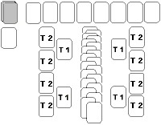
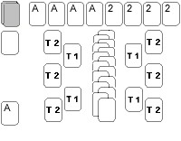

1. [Above and Below Solitaire](#above-and-below-solitaire)
1. [Accordion Solitaire](#accordion-solitaire)
1. [Aces Up Solitaire](#aces-up-solitaire)
1. [Acme Solitaire](#acme-solitaire)
1. [Adela Solitaire](#adela-solitaire)
1. [Agnes Solitaire](#agnes-solitaire)
1. [Algerian Solitaire](#algerian-solitaire)
1. [Alhambra Solitaire](#alhambra-solitaire)
1. [Ali Baba Solitaire](#ali-baba-solitaire)
1. [Alternations Solitaire](#alternations-solitaire)
1. [Alternative Solitaire](#alternative-solitaire)
1. [Amazons Solitaire](#amazons-solitaire)
1. [American Toad Solitaire](#american-toad-solitaire)
1. [Ants Solitaire](#ants-solitaire)
1. [Archway Solitaire](#archway-solitaire)
1. [Arizona Solitaire](#arizona-solitaire)
1. [Aunt Mary Solitaire](#aunt-mary-solitaire)
1. [Austerlitz Solitaire](#austerlitz-solitaire)
1. [Australian Patience Solitaire](#australian-patience-solitaire)
1. [Autumn Leaves Solitaire](#autumn-leaves-solitaire)
1. [Avenue Solitaire](#avenue-solitaire)
1. [Babette Solitaire](#babette-solitaire)
1. [Baby Spiderette Solitaire](#baby-spiderette-solitaire)
1. [Backbone Solitaire](#backbone-solitaire)
1. [Baker's Dozen Solitaire](#bakers-dozen-solitaire)
1. [Baker's Game Solitaire](#bakers-game-solitaire)
1. [Baker's Game Two Decks](#bakers-game-two-decks)
1. [Banner Solitaire](#banner-solitaire)
1. [Barricade Solitaire](#barricade-solitaire)
1. [Barrier Solitaire](#barrier-solitaire)
1. [Base Pyramid Solitaire](#base-pyramid-solitaire)
1. [Batsford Solitaire](#batsford-solitaire)
1. [Beautiful Lutecia Solitaire](#beautiful-lutecia-solitaire)
1. [Beehive Solitaire](#beehive-solitaire)
1. [Beetle Solitaire](#beetle-solitaire)
1. [Beleaguered Castle Solitaire](#beleaguered-castle-solitaire)
1. [Beleaguered Castle II Solitaire](#beleaguered-castle-ii-solitaire)
1. [Big Forty Solitaire](#big-forty-solitaire)
1. [Big FreeCell Solitaire](#big-freecell-solitaire)
1. [Big Robbery Solitaire](#big-robbery-solitaire)
1. [Binding Solitaire](#binding-solitaire)
1. [Bisley Solitaire](#bisley-solitaire)
1. [Black Hole Solitaire](#black-hole-solitaire)
1. [Black Widow Solitaire](#black-widow-solitaire)
1. [Blind Alleys Solitaire](#blind-alleys-solitaire)
1. [Blind Hookey Solitaire](#blind-hookey-solitaire)
1. [Blind Patience Solitaire](#blind-patience-solitaire)
1. [Block Eleven Solitaire](#block-eleven-solitaire)
1. [Block Ten Solitaire](#block-ten-solitaire)
1. [Blockade Solitaire](#blockade-solitaire)
1. [Blondes and Brunettes Solitaire](#blondes-and-brunettes-solitaire)
1. [Bob's Scorpion Solitaire](#bobs-scorpion-solitaire)
1. [Boomerang Solitaire](#boomerang-solitaire)
1. [Boulevard Solitaire](#boulevard-solitaire)
1. [Bouquet Solitaire](#bouquet-solitaire)
1. [Box Kite Solitaire](#box-kite-solitaire)
1. [Braid Solitaire](#braid-solitaire)
1. [Brave FreeCell Solitaire](#brave-freecell-solitaire)
1. [Brigade Solitaire](#brigade-solitaire)
1. [Bristol Solitaire](#bristol-solitaire)
1. [British Blockade Solitaire](#british-blockade-solitaire)
1. [British Constitution Solitaire](#british-constitution-solitaire)
1. [British Square Solitaire](#british-square-solitaire)
1. [Buffalo Bill Solitaire](#buffalo-bill-solitaire)
1. [Bureau Solitaire](#bureau-solitaire)
1. [Busy Aces Solitaire](#busy-aces-solitaire)
1. [Cadonette Solitaire](#cadonette-solitaire)
1. [Calculation Solitaire](#calculation-solitaire)
1. [Canfield Solitaire](#canfield-solitaire)
1. [Canister Solitaire](#canister-solitaire)
1. [Caprice Solitaire](#caprice-solitaire)
1. [Captive Queens Solitaire](#captive-queens-solitaire)
1. [Carlton Solitaire](#carlton-solitaire)
1. [Carpet Solitaire](#carpet-solitaire)
1. [Casket Solitaire](#casket-solitaire)
1. [Castle Solitaire](#castle-solitaire)
1. [Castles in Spain Solitaire](#castles-in-spain-solitaire)
1. [Cat's Cradle Solitaire](#cats-cradle-solitaire)
1. [Cat's Tail Solitaire](#cats-tail-solitaire)
1. [Chamberlin Solitaire](#chamberlin-solitaire)
1. [Chameleon Solitaire](#chameleon-solitaire)
1. [Chequers Solitaire](#chequers-solitaire)
1. [Chessboard Solitaire](#chessboard-solitaire)
1. [Cicely Solitaire](#cicely-solitaire)
1. [Citadel Solitaire](#citadel-solitaire)
1. [Classic Bisley Solitaire](#classic-bisley-solitaire)
1. [Club Solitaire](#club-solitaire)
1. [Colonel Solitaire](#colonel-solitaire)
1. [Colorado Solitaire](#colorado-solitaire)
1. [Colours Solitaire](#colours-solitaire)
1. [Complicated Solitaire](#complicated-solitaire)
1. [Concentration Solitaire](#concentration-solitaire)
1. [Cone Solitaire](#cone-solitaire)
1. [Confusion Solitaire](#confusion-solitaire)
1. [Congress Solitaire](#congress-solitaire)
1. [Constitution Solitaire](#constitution-solitaire)
1. [Cormorant Solitaire](#cormorant-solitaire)
1. [Cornfield Solitaire](#cornfield-solitaire)
1. [Corona Solitaire](#corona-solitaire)
1. [Cotillion Solitaire](#cotillion-solitaire)
1. [Courtyard Solitaire](#courtyard-solitaire)
1. [Crazy Quilt Solitaire](#crazy-quilt-solitaire)
1. [Crescent Solitaire](#crescent-solitaire)
1. [Criss-Cross Solitaire](#criss-cross-solitaire)
1. [Cromwell Solitaire](#cromwell-solitaire)
1. [Cruel Solitaire](#cruel-solitaire)
1. [Curds and Whey Solitaire](#curds-and-whey-solitaire)
1. [Czarina Solitaire](#czarina-solitaire)
1. [Dawson Solitaire](#dawson-solitaire)
1. [Dealer's Dozen Solitaire](#dealers-dozen-solitaire)
1. [Deck Solitaire](#deck-solitaire)
1. [Demon Fan Solitaire](#demon-fan-solitaire)
1. [Depot Solitaire](#depot-solitaire)
1. [Desire Solitaire](#desire-solitaire)
1. [Deuces Solitaire](#deuces-solitaire)
1. [Devil's Bridge Solitaire](#devils-bridge-solitaire)
1. [Dieppe Solitaire](#dieppe-solitaire)
1. [Difficult Sequence Solitaire](#difficult-sequence-solitaire)
1. [Diplomat Solitaire](#diplomat-solitaire)
1. [Display Solitaire](#display-solitaire)
1. [Divorce Solitaire](#divorce-solitaire)
1. [Double Canfield Solitaire](#double-canfield-solitaire)
1. [Double Dot Solitaire](#double-dot-solitaire)
1. [Double EastHaven Solitaire](#double-easthaven-solitaire)
1. [Double Fourteens Solitaire](#double-fourteens-solitaire)
1. [Double Klondike Solitaire](#double-klondike-solitaire)
1. [Double Nestor Solitaire](#double-nestor-solitaire)
1. [Double or Quits Solitaire](#double-or-quits-solitaire)
1. [Double Rail Solitaire](#double-rail-solitaire)
1. [Double Russian Solitaire](#double-russian-solitaire)
1. [Double Scorpion Solitaire](#double-scorpion-solitaire)
1. [Double Toad Solitaire](#double-toad-solitaire)
1. [Double Topsy-Turvy Queens Solitaire](#double-topsy-turvy-queens-solitaire)
1. [Double Yukon Solitaire](#double-yukon-solitaire)
1. [Doublets Solitaire](#doublets-solitaire)
1. [Doubt Solitaire](#doubt-solitaire)
1. [Downhill Solitaire](#downhill-solitaire)
1. [Dress Parade Solitaire](#dress-parade-solitaire)
1. [Dutch Windmill Solitaire](#dutch-windmill-solitaire)
1. [Duchess Solitaire](#duchess-solitaire)
1. [Duchess of Luynes Solitaire](#duchess-of-luynes-solitaire)
1. [Duke Solitaire](#duke-solitaire)
1. [Eagle Wing Solitaire](#eagle-wing-solitaire)
1. [EastHaven Solitaire](#easthaven-solitaire)
1. [Egyptian Pyramid Solitaire](#egyptian-pyramid-solitaire)
1. [Eight By Eight Solitaire](#eight-by-eight-solitaire)
1. [Eight by Thirteen Solitaire](#eight-by-thirteen-solitaire)
1. [Eight Off Solitaire](#eight-off-solitaire)
1. [Eight Sages Solitaire](#eight-sages-solitaire)
1. [Eight Sphinxes Solitaire](#eight-sphinxes-solitaire)
1. [Elma Solitaire](#elma-solitaire)
1. [Emperor Solitaire](#emperor-solitaire)
1. [Empire Solitaire](#empire-solitaire)
1. [Even and Odd Solitaire](#even-and-odd-solitaire)
1. [Exiled Kings Solitaire](#exiled-kings-solitaire)
1. [Exit Solitaire](#exit-solitaire)
1. [Faerie Queen Solitaire](#faerie-queen-solitaire)
1. [Falling Star Solitaire](#falling-star-solitaire)
1. [Famous Fifty Solitaire](#famous-fifty-solitaire)
1. [Fan Solitaire](#fan-solitaire)
1. [Favorite Solitaire](#favorite-solitaire)
1. [Fifteen in a Row Solitaire](#fifteen-in-a-row-solitaire)
1. [Fifth Avenue Solitaire](#fifth-avenue-solitaire)
1. [Fifty Fifty Solitaire](#fifty-fifty-solitaire)
1. [Five Piles Solitaire](#five-piles-solitaire)
1. [Flea Market Solitaire](#flea-market-solitaire)
1. [Floradora Solitaire](#floradora-solitaire)
1. [Florentine Solitaire](#florentine-solitaire)
1. [Flower Bed Solitaire](#flower-bed-solitaire)
1. [Flower Garden Solitaire](#flower-garden-solitaire)
1. [Fly Solitaire](#fly-solitaire)
1. [Follow the King Solitaire](#follow-the-king-solitaire)
1. [Following Solitaire](#following-solitaire)
1. [Forest Glade Solitaire](#forest-glade-solitaire)
1. [Forget-Me-Not Solitaire](#forget-me-not-solitaire)
1. [Fort Solitaire](#fort-solitaire)
1. [Fortress Solitaire](#fortress-solitaire)
1. [Fortune's Favor Solitaire](#fortunes-favor-solitaire)
1. [Forty and Eight Solitaire](#forty-and-eight-solitaire)
1. [Forty Thieves Solitaire](#forty-thieves-solitaire)
1. [Forty-Nine Solitaire](#forty-nine-solitaire)
1. [Four Intruders Solitaire](#four-intruders-solitaire)
1. [Four Kings Solitaire](#four-kings-solitaire)
1. [Four Leaf Clovers Solitaire](#four-leaf-clovers-solitaire)
1. [Four Packs Solitaire](#four-packs-solitaire)
1. [Four Seasons Solitaire](#four-seasons-solitaire)
1. [Four Ways Solitaire](#four-ways-solitaire)
1. [Fourfold Canfield Solitaire](#fourfold-canfield-solitaire)
1. [Fourfold Klondike Solitaire](#fourfold-klondike-solitaire)
1. [Fourfold Scorpion Solitaire](#fourfold-scorpion-solitaire)
1. [Fourfold Yukon Solitaire](#fourfold-yukon-solitaire)
1. [Fourteens Solitaire](#fourteens-solitaire)
1. [FreeCell Solitaire](#freecell-solitaire)
1. [French Revolution Solitaire](#french-revolution-solitaire)
1. [Friday the Thirteenth Solitaire](#friday-the-thirteenth-solitaire)
1. [Full Parade Solitaire](#full-parade-solitaire)
1. [Gallery Solitaire](#gallery-solitaire)
1. [Gaps Solitaire](#gaps-solitaire)
1. [Gate Solitaire](#gate-solitaire)
1. [General's Patience Solitaire](#generals-patience-solitaire)
1. [German Patience Solitaire](#german-patience-solitaire)
1. [Giant Solitaire](#giant-solitaire)
1. [Giant II Solitaire](#giant-ii-solitaire)
1. [Gigantic Spider Solitaire](#gigantic-spider-solitaire)
1. [Giza Solitaire](#giza-solitaire)
1. [Glacier Solitaire](#glacier-solitaire)
1. [Glencoe Solitaire](#glencoe-solitaire)
1. [Golf Solitaire](#golf-solitaire)
1. [Good Measure Solitaire](#good-measure-solitaire)
1. [Grandfather Solitaire](#grandfather-solitaire)
1. [Grandfather's Clock Solitaire](#grandfathers-clock-solitaire)
1. [Grandmother Solitaire](#grandmother-solitaire)
1. [Granny's Patience](#grannys-patience)
1. [Grounds for Divorce Solitaire](#grounds-for-divorce-solitaire)
1. [Guard of Honour Solitaire](#guard-of-honour-solitaire)
1. [Guards Collar Solitaire](#guards-collar-solitaire)
1. [Half and Half Solitaire](#half-and-half-solitaire)
1. [HardCell Solitaire](#hardcell-solitaire)
1. [Harp Solitaire](#harp-solitaire)
1. [Hayfield Solitaire](#hayfield-solitaire)
1. [Heads and Tails Solitaire](#heads-and-tails-solitaire)
1. [Heap Solitaire](#heap-solitaire)
1. [Hemispheres Solitaire](#hemispheres-solitaire)
1. [Herring-Bone Solitaire](#herring-bone-solitaire)
1. [Horizon Solitaire](#horizon-solitaire)
1. [House in the Wood Solitaire](#house-in-the-wood-solitaire)
1. [House on the Hill Solitaire](#house-on-the-hill-solitaire)
1. [Idle Aces Solitaire](#idle-aces-solitaire)
1. [Impatience Solitaire](#impatience-solitaire)
1. [Imperial Guards Solitaire](#imperial-guards-solitaire)
1. [In a Frame Solitaire](#in-a-frame-solitaire)
1. [Indian Solitaire](#indian-solitaire)
1. [Ingenuous Solitaire](#ingenuous-solitaire)
1. [Inside Out Solitaire](#inside-out-solitaire)
1. [Intelligence Solitaire](#intelligence-solitaire)
1. [Intrigue Solitaire](#intrigue-solitaire)
1. [Jamestown Solitaire](#jamestown-solitaire)
1. [Japanese Rug Solitaire](#japanese-rug-solitaire)
1. [Josephine Solitaire](#josephine-solitaire)
1. [Journey Solitaire](#journey-solitaire)
1. [Jubilee Solitaire](#jubilee-solitaire)
1. [Junction Solitaire](#junction-solitaire)
1. [Juvenile Solitaire](#juvenile-solitaire)
1. [K.C. Solitaire](#kc-solitaire)
1. [Kaiser Bill Solitaire](#kaiser-bill-solitaire)
1. [Khedive Solitaire](#khedive-solitaire)
1. [Kimberly Solitaire](#kimberly-solitaire)
1. [King Albert Solitaire](#king-albert-solitaire)
1. [King Solomon's Cave Solitaire](#king-solomons-cave-solitaire)
1. [Kingdom Solitaire](#kingdom-solitaire)
1. [Kings Solitaire](#kings-solitaire)
1. [Kings and Aces Solitaire](#kings-and-aces-solitaire)
1. [King's Plume Solitaire](#kings-plume-solitaire)
1. [King's Secrets Solitaire](#kings-secrets-solitaire)
1. [King's Way Solitaire](#kings-way-solitaire)
1. [Kingsdown Eights Solitaire](#kingsdown-eights-solitaire)
1. [Kingsley Solitaire](#kingsley-solitaire)
1. [Klondike Solitaire](#klondike-solitaire)
1. [Klondike II Solitaire](#klondike-ii-solitaire)
1. [Knaves' Dial Solitaire](#knaves-dial-solitaire)
1. [Knotty Nines Solitaire](#knotty-nines-solitaire)
1. [Kosynka Solitaire](#kosynka-solitaire)
1. [Kosynka II Solitaire](#kosynka-ii-solitaire)
1. [Labyrinth Solitaire](#labyrinth-solitaire)
1. [Lady Betty Solitaire](#lady-betty-solitaire)
1. [Lady Palk Solitaire](#lady-palk-solitaire)
1. [Laggard Lady Solitaire](#laggard-lady-solitaire)
1. [Lanes Solitaire](#lanes-solitaire)
1. [Last Chance Solitaire](#last-chance-solitaire)
1. [Light and Shade Solitaire](#light-and-shade-solitaire)
1. [Limited Solitaire](#limited-solitaire)
1. [Lions Gate Solitaire](#lions-gate-solitaire)
1. [Little Billee Solitaire](#little-billee-solitaire)
1. [Little Forty Solitaire](#little-forty-solitaire)
1. [Little Picture Gallery Solitaire](#little-picture-gallery-solitaire)
1. [Little Spider Solitaire](#little-spider-solitaire)
1. [Little Windmill Solitaire](#little-windmill-solitaire)
1. [Locked Cards Solitaire](#locked-cards-solitaire)
1. [Long Trip Solitaire](#long-trip-solitaire)
1. [Louis Solitaire](#louis-solitaire)
1. [Louisa Solitaire](#louisa-solitaire)
1. [Lucas Solitaire](#lucas-solitaire)
1. [Lucky Thirteen Solitaire](#lucky-thirteen-solitaire)
1. [Malaren Solitaire](#malaren-solitaire)
1. [Maria Solitaire](#maria-solitaire)
1. [Marius Solitaire](#marius-solitaire)
1. [Marriages Solitaire](#marriages-solitaire)
1. [Martha Solitaire](#martha-solitaire)
1. [Martha + Solitaire](#martha--solitaire)
1. [Martin Solitaire](#martin-solitaire)
1. [Mary Stuart Solitaire](#mary-stuart-solitaire)
1. [Masked Twelve Solitaire](#masked-twelve-solitaire)
1. [Masquerade Solitaire](#masquerade-solitaire)
1. [Masterpiece Solitaire](#masterpiece-solitaire)
1. [Mathematics Solitaire](#mathematics-solitaire)
1. [Maze Solitaire](#maze-solitaire)
1. [Midshipman Solitaire](#midshipman-solitaire)
1. [Milligan Harp Solitaire](#milligan-harp-solitaire)
1. [Miss Milligan Solitaire](#miss-milligan-solitaire)
1. [Miss Muffet Solitaire](#miss-muffet-solitaire)
1. [Mixtures Solitaire](#mixtures-solitaire)
1. [Monte Carlo Solitaire](#monte-carlo-solitaire)
1. [Moosehide Solitaire Solitaire](#moosehide-solitaire-solitaire)
1. [Mount Olympus Solitaire](#mount-olympus-solitaire)
1. [Mrs Mop Solitaire](#mrs-mop-solitaire)
1. [Napoleon Solitaire](#napoleon-solitaire)
1. [Napoleon Leaves Moscow Solitaire](#napoleon-leaves-moscow-solitaire)
1. [Napoleon Takes Moscow Solitaire](#napoleon-takes-moscow-solitaire)
1. [Napoleon's Square Solitaire](#napoleons-square-solitaire)
1. [Napoleon the Great Solitaire](#napoleon-the-great-solitaire)
1. [Nationale Solitaire](#nationale-solitaire)
1. [Nestor Solitaire](#nestor-solitaire)
1. [New Manner Solitaire](#new-manner-solitaire)
1. [New York Solitaire](#new-york-solitaire)
1. [Ninny Solitaire](#ninny-solitaire)
1. [Nivernaise Solitaire](#nivernaise-solitaire)
1. [Norwegian Patience Solitaire](#norwegian-patience-solitaire)
1. [Number Ten Solitaire](#number-ten-solitaire)
1. [Numidia Solitaire](#numidia-solitaire)
1. [Nunavut Solitaire](#nunavut-solitaire)
1. [Obstacle Race Solitaire](#obstacle-race-solitaire)
1. [Obstacle Race II Solitaire](#obstacle-race-ii-solitaire)
1. [Octave Solitaire](#octave-solitaire)
1. [Odessa Solitaire](#odessa-solitaire)
1. [Old Crow Solitaire](#old-crow-solitaire)
1. [Old Friend Solitaire](#old-friend-solitaire)
1. [One Pack Solitaire](#one-pack-solitaire)
1. [Open Crescent Solitaire](#open-crescent-solitaire)
1. [Open Scorpion Solitaire](#open-scorpion-solitaire)
1. [Open Spider Solitaire](#open-spider-solitaire)
1. [Open Yukon Solitaire](#open-yukon-solitaire)
1. [Oscillation Solitaire](#oscillation-solitaire)
1. [Osmosis Solitaire](#osmosis-solitaire)
1. [Overage Solitaire](#overage-solitaire)
1. [Pairs Solitaire](#pairs-solitaire)
1. [Parade Solitaire](#parade-solitaire)
1. [Parallels Solitaire](#parallels-solitaire)
1. [Parisienne Solitaire](#parisienne-solitaire)
1. [Parliament Solitaire](#parliament-solitaire)
1. [Parquet Solitaire](#parquet-solitaire)
1. [Pas Seul Solitaire](#pas-seul-solitaire)
1. [Patriarchs Solitaire](#patriarchs-solitaire)
1. [Peacock Tail Solitaire](#peacock-tail-solitaire)
1. [Peek Solitaire](#peek-solitaire)
1. [Penelope's Web Solitaire](#penelopes-web-solitaire)
1. [Penguin Solitaire](#penguin-solitaire)
1. [Peppy Solitaire](#peppy-solitaire)
1. [Perpetual Motion Solitaire](#perpetual-motion-solitaire)
1. [Perseverance Solitaire](#perseverance-solitaire)
1. [Persian Patience Solitaire](#persian-patience-solitaire)
1. [Phalanx Solitaire](#phalanx-solitaire)
1. [Pharaoh Solitaire](#pharaoh-solitaire)
1. [Picture Gallery Solitaire](#picture-gallery-solitaire)
1. [Picture Gallery II Solitaire](#picture-gallery-ii-solitaire)
1. [Picture Patience Solitaire](#picture-patience-solitaire)
1. [Pine Cone Solitaire](#pine-cone-solitaire)
1. [Plait Solitaire](#plait-solitaire)
1. [Poker Solitaire](#poker-solitaire)
1. [Polish Patience Solitaire](#polish-patience-solitaire)
1. [Potholes Solitaire](#potholes-solitaire)
1. [Precedence Solitaire](#precedence-solitaire)
1. [Princess Patience Solitaire](#princess-patience-solitaire)
1. [Prison Solitaire](#prison-solitaire)
1. [Prisoner Solitaire](#prisoner-solitaire)
1. [Push-Pin Solitaire](#push-pin-solitaire)
1. [Puss in the Corner Solitaire](#puss-in-the-corner-solitaire)
1. [Pyramid Solitaire](#pyramid-solitaire)
1. [Pyramid Golf Solitaire](#pyramid-golf-solitaire)
1. [Pythagor Solitaire](#pythagor-solitaire)
1. [Q.C. Solitaire](#qc-solitaire)
1. [Quadrangle Solitaire](#quadrangle-solitaire)
1. [Queen of Italy Solitaire](#queen-of-italy-solitaire)
1. [Queens and Jacks Solitaire](#queens-and-jacks-solitaire)
1. [Rabbit Creek Solitaire](#rabbit-creek-solitaire)
1. [Raglan Solitaire](#raglan-solitaire)
1. [Rainbow Solitaire](#rainbow-solitaire)
1. [Rectangle Solitaire](#rectangle-solitaire)
1. [Red and Black Solitaire](#red-and-black-solitaire)
1. [Relaxed FreeCell Solitaire](#relaxed-freecell-solitaire)
1. [Relaxed Pyramid Solitaire](#relaxed-pyramid-solitaire)
1. [Reverse Order Solitaire](#reverse-order-solitaire)
1. [Reversi Solitaire](#reversi-solitaire)
1. [Rittenhouse Solitaire](#rittenhouse-solitaire)
1. [Robert Solitaire](#robert-solitaire)
1. [Rouge et Noir Solitaire](#rouge-et-noir-solitaire)
1. [Rows of Four Solitaire](#rows-of-four-solitaire)
1. [Royal Aids Solitaire](#royal-aids-solitaire)
1. [Royal Cotillion Solitaire](#royal-cotillion-solitaire)
1. [Royal Family Solitaire](#royal-family-solitaire)
1. [Royal Marriage Solitaire](#royal-marriage-solitaire)
1. [Royal Rendezvous Solitaire](#royal-rendezvous-solitaire)
1. [Royal Suite Solitaire](#royal-suite-solitaire)
1. [Russian Solitaire](#russian-solitaire)
1. [S Solitaire](#s-solitaire)
1. [Salic Law Solitaire](#salic-law-solitaire)
1. [San Jose Hill Solitaire](#san-jose-hill-solitaire)
1. [Saratoga Solitaire](#saratoga-solitaire)
1. [Scarab Solitaire](#scarab-solitaire)
1. [Scarf Solitaire](#scarf-solitaire)
1. [Scarf II Solitaire](#scarf-ii-solitaire)
1. [Scorpion Solitaire](#scorpion-solitaire)
1. [Scotch Patience Solitaire](#scotch-patience-solitaire)
1. [Seahaven Towers Solitaire](#seahaven-towers-solitaire)
1. [Selective Canfield Solitaire](#selective-canfield-solitaire)
1. [Senate Solitaire](#senate-solitaire)
1. [Sesame Solitaire](#sesame-solitaire)
1. [Seven Solitaire](#seven-solitaire)
1. [Seven Devils Solitaire](#seven-devils-solitaire)
1. [Seven Hills Solitaire](#seven-hills-solitaire)
1. [Seven in a Row Solitaire](#seven-in-a-row-solitaire)
1. [Shady Lanes Solitaire](#shady-lanes-solitaire)
1. [Shamrocks Solitaire](#shamrocks-solitaire)
1. [Sheaf Solitaire](#sheaf-solitaire)
1. [Shifting Solitaire](#shifting-solitaire)
1. [Shifting Depots Solitaire](#shifting-depots-solitaire)
1. [Short Solitaire](#short-solitaire)
1. [Simple Solitaire](#simple-solitaire)
1. [Simple Addition Solitaire](#simple-addition-solitaire)
1. [Simple Pairs Solitaire](#simple-pairs-solitaire)
1. [Simple Simon Solitaire](#simple-simon-solitaire)
1. [Simpleton Solitaire](#simpleton-solitaire)
1. [Simplex Solitaire](#simplex-solitaire)
1. [Simplicity Solitaire](#simplicity-solitaire)
1. [Single Rail Solitaire](#single-rail-solitaire)
1. [Sir Tommy Solitaire](#sir-tommy-solitaire)
1. [Six By Six Solitaire](#six-by-six-solitaire)
1. [Sixes and Sevens Solitaire](#sixes-and-sevens-solitaire)
1. [Sixth Coalition Solitaire](#sixth-coalition-solitaire)
1. [Snake Solitaire](#snake-solitaire)
1. [Snowball Solitaire](#snowball-solitaire)
1. [Solid Square Solitaire](#solid-square-solitaire)
1. [Solitaire Piquet](#solitaire-piquet)
1. [Somerset Solitaire](#somerset-solitaire)
1. [Spaces and Aces Solitaire](#spaces-and-aces-solitaire)
1. [Spanish Patience Solitaire](#spanish-patience-solitaire)
1. [Spider Solitaire](#spider-solitaire)
1. [Spider Solitaire One Suit](#spider-solitaire-one-suit)
1. [Spider Solitaire Two Suits](#spider-solitaire-two-suits)
1. [Spiderette Solitaire](#spiderette-solitaire)
1. [Spiderette Solitaire One Suit](#spiderette-solitaire-one-suit)
1. [Spiderette Solitaire Two Suit](#spiderette-solitaire-two-suit)
1. [Spiderwort Solitaire](#spiderwort-solitaire)
1. [Spoilt Solitaire](#spoilt-solitaire)
1. [Squadron Solitaire](#squadron-solitaire)
1. [Square Solitaire](#square-solitaire)
1. [Squared Away Solitaire](#squared-away-solitaire)
1. [St. Helena Solitaire](#st-helena-solitaire)
1. [Stacks Solitaire](#stacks-solitaire)
1. [Stag Party Solitaire](#stag-party-solitaire)
1. [Stairs Solitaire](#stairs-solitaire)
1. [Stalactites Solitaire](#stalactites-solitaire)
1. [Star Solitaire](#star-solitaire)
1. [Stay-at-home Solitaire](#stay-at-home-solitaire)
1. [Steeplechase Solitaire](#steeplechase-solitaire)
1. [Steps Solitaire](#steps-solitaire)
1. [Stewart River Solitaire](#stewart-river-solitaire)
1. [Stonewall Solitaire](#stonewall-solitaire)
1. [Storehouse Solitaire](#storehouse-solitaire)
1. [Strategy Solitaire](#strategy-solitaire)
1. [Streets Solitaire](#streets-solitaire)
1. [Streets and Alleys Solitaire](#streets-and-alleys-solitaire)
1. [Strip Solitaire](#strip-solitaire)
1. [Striped Fan Solitaire](#striped-fan-solitaire)
1. [Striptease Solitaire](#striptease-solitaire)
1. [Sudden Death Solitaire](#sudden-death-solitaire)
1. [Sultan Solitaire](#sultan-solitaire)
1. [Super Flower Garden Solitaire](#super-flower-garden-solitaire)
1. [Superior Canfield Solitaire](#superior-canfield-solitaire)
1. [Superior Canfield II Solitaire](#superior-canfield-ii-solitaire)
1. [Swallows Solitaire](#swallows-solitaire)
1. [Swedish Patience Solitaire](#swedish-patience-solitaire)
1. [Swiss Solitaire](#swiss-solitaire)
1. [Take Fourteen Solitaire](#take-fourteen-solitaire)
1. [Tam O'Shanter Solitaire](#tam-oshanter-solitaire)
1. [Tarantula Solitaire](#tarantula-solitaire)
1. [Terrace Solitaire](#terrace-solitaire)
1. [The People's Game Solitaire](#the-peoples-game-solitaire)
1. [The Plot Solitaire](#the-plot-solitaire)
1. [The Reserves Solitaire](#the-reserves-solitaire)
1. [The Spark Solitaire](#the-spark-solitaire)
1. [The Wish Solitaire](#the-wish-solitaire)
1. [Thieves of Egypt Solitaire](#thieves-of-egypt-solitaire)
1. [Thirteens Solitaire](#thirteens-solitaire)
1. [Thirty-Nine Steps Solitaire](#thirty-nine-steps-solitaire)
1. [Thirty-six Solitaire](#thirty-six-solitaire)
1. [Three Blind Mice Solitaire](#three-blind-mice-solitaire)
1. [Three Cells Solitaire](#three-cells-solitaire)
1. [Three Fir-trees Solitaire](#three-fir-trees-solitaire)
1. [Threefold Canfield Solitaire](#threefold-canfield-solitaire)
1. [Threefold Klondike Solitaire](#threefold-klondike-solitaire)
1. [Threefold Scorpion Solitaire](#threefold-scorpion-solitaire)
1. [Threefold Yukon Solitaire](#threefold-yukon-solitaire)
1. [Thumb and Pouch Solitaire](#thumb-and-pouch-solitaire)
1. [Toad Solitaire](#toad-solitaire)
1. [Topsy-turvy Queens Solitaire](#topsy-turvy-queens-solitaire)
1. [Total Pair Solitaire](#total-pair-solitaire)
1. [Tournament Solitaire](#tournament-solitaire)
1. [Tower of Pisa Solitaire](#tower-of-pisa-solitaire)
1. [Travellers Solitaire](#travellers-solitaire)
1. [Trefoil Solitaire](#trefoil-solitaire)
1. [Triangle Solitaire](#triangle-solitaire)
1. [Tri Peaks Solitaire](#tri-peaks-solitaire)
1. [Tri-Towers Solitaire](#tri-towers-solitaire)
1. [Triple Line Solitaire](#triple-line-solitaire)
1. [Triple Union Solitaire](#triple-union-solitaire)
1. [Troika Solitaire](#troika-solitaire)
1. [Trusty Twelve Solitaire](#trusty-twelve-solitaire)
1. [Tuffet Solitaire](#tuffet-solitaire)
1. [Tunguska Solitaire](#tunguska-solitaire)
1. [Turkish Kerchief Solitaire](#turkish-kerchief-solitaire)
1. [Turncoats Solitaire](#turncoats-solitaire)
1. [Tut's Tomb Solitaire](#tuts-tomb-solitaire)
1. [Twelve Sleeping Maids Solitaire](#twelve-sleeping-maids-solitaire)
1. [Twelve Sleeping Maids II Solitaire](#twelve-sleeping-maids-ii-solitaire)
1. [Twenty Solitaire](#twenty-solitaire)
1. [Twenty Four Fans Solitaire](#twenty-four-fans-solitaire)
1. [Twilight Zone Solitaire](#twilight-zone-solitaire)
1. [Twin Queens Solitaire](#twin-queens-solitaire)
1. [Two Cells Solitaire](#two-cells-solitaire)
1. [Two Rings Solitaire](#two-rings-solitaire)
1. [Vague Solitaire](#vague-solitaire)
1. [Variegated Canfield Solitaire](#variegated-canfield-solitaire)
1. [Vassal Solitaire](#vassal-solitaire)
1. [Vertical Solitaire](#vertical-solitaire)
1. [Victoria Solitaire](#victoria-solitaire)
1. [Virginia Reel Solitaire](#virginia-reel-solitaire)
1. [Voracious Solitaire](#voracious-solitaire)
1. [Wasp Solitaire](#wasp-solitaire)
1. [Westcliff Solitaire](#westcliff-solitaire)
1. [White Scarf Solitaire](#white-scarf-solitaire)
1. [Whitehead Solitaire](#whitehead-solitaire)
1. [Will o' the Wisp Solitaire](#will-o-the-wisp-solitaire)
1. [Wickerwork Solitaire](#wickerwork-solitaire)
1. [Windmill Solitaire](#windmill-solitaire)
1. [Yeast Dough Solitaire](#yeast-dough-solitaire)
1. [Yukon Solitaire](#yukon-solitaire)
1. [Zigzag Course Solitaire](#zigzag-course-solitaire)
1. [Zodiac Solitaire](#zodiac-solitaire)
1. [Spider Solitaire - Winning Strategy](#spider-solitaire---winning-strategy)

# Above and Below Solitaire

2 decks. Average. One redeal.

**Above and Below Solitaire**  uses two decks (104 cards). Each deck is shuffled separately. You have 4 tableau piles and eight foundations. The first card dealt from the stock pile ("indicator") is used to define the starter cards of the foundations. The seven other cards of the same rank are piled on top of the first "indicator" during play as they become available.Four cards one rank lower then indicator (one of each suit) are moved to the left four foundations as soon as they appear during play.

Four cards one rank higher then indicator (one of each suit) are moved to the right four foundations as soon as they appear during play.

**The object of the game**

To build the left four foundations down in suit, and the right four boundations up in suit, wrapping from King to Ace and from Ace to King as necessary, until each foundation pile contains 12 cards. Then each foundation is finished with an indicator of the same suit.

**The rules**

Begin turning over cards from the stock pile to the waste.The top cards of tableau piles and the waste pile are available to play. You can move cards from the waste pile to the foundations and tableau piles. There are no restrictions on placing cards from the waste pile onto the tableau piles. Only the top card of each pile is available for play on the foundations.

You cannot move cards from pile to pile.

When the stock is empty, click on it to pick up the tableau piles.

You have one redeal.

The skill in this game is to decide which tableau pile to put each card on. You shouldn't block lower cards by the higher ones, unless it is absolutely necessary.

# Accordion Solitaire

1 deck. Difficult. No redeal.

**Accordion Solitaire**  uses 52 cards. All cards are dealt face up in a row, left to right, one card to a pile.

**The object of the game**

To stack the cards back up into a single pile.

**The rules**

Any pile can be moved onto the pile to its left, or the pile third to its left, provided the top cards of the piles match in either suit or rank. When you move a pile in the middle of the row, all the other piles are shifted to fill an empty space.

**Strategy tips**

You should select four cards of the same rank, clustered near each other and near the end of the layout. The strategy is to try to get all four selected cards to the end of the layout and never cover them with anything else until the very end of the game.

**Similar Games**

-   Push-Pin
-   Royal Marriage

# Aces Up Solitaire

1 deck. Easy. No redeal.

**Aces Up Solitaire**  uses one deck (52 cards). You have one foundation pile, and 4 tableau piles.

**The object of the game**

To discard all cards from tableau piles to the foundation except for the four Aces, having one Ace in each tableau.

**The rules**

Four cards are dealt from the stock to the tableau, one on each pile. The top card of each pile is available for play. If two or more cards on different tableaus have the same suit, then discard all cards of that suit but the highest-ranking to the foundation. Aces in this game are considered to be of the highest rank. Spaces may be filled by any top card from other tableau.

When you have made all the available plays on the board, click on the stock to deal next four cards on tableau piles.

There is no redeal.

Wins are rare.

**Similar Games**

-   Perpetual Motion

# Acme Solitaire

1 deck. Average. 1 redeals.

This solitaire uses 52 cards (1 deck). You have 4 tableau piles with 1 card per pile and 4 foundations.

Aces are moved to the foundations at the start of the game. You also have a reserve pile with 13 cards in it.

**The object of the game**

Build the Aces up in suit to Kings.

**The rules**

You may build tableaus down in suit. One card at a time can be moved from pile to pile. Only the top card of each tableau pile and the reserve pile is available for play on the foundations. When one of the tableaus is empty it is automatically filled with a card from the reserve pile if possible, then by any available card.

When you have made all the moves initially available, begin turning over cards from the stock to the waste pile.

You have one redeal.

Wins are rare.

**Similar Games**

-   Canfield

# Adela Solitaire

2 decks. Average. No redeal.

This solitaire uses 104 cards (2 decks). You have 9 tableau piles. 24 foundation piles are placed above the tableau piles.

**The object of the game**

To move all Kings to the first row of foundation piles.
To move all Queens to the third row of foundation piles.
To build down the second row of foundation piles from Jack to Ace following suit.

**The rules**

Jacks are moved to the foundations as they become available. You can take one King and one Queen from the tableau for each Jack that is moved to the foundation. King is placed above the Jack and Queen is placed below the Jack.

You can build tableau piles up in suit. One card or group of cards in the proper sequence can be moved from pile to pile. Spaces are filled automatically from the stock pile.

When you have made all the moves initially available, click on the stock pile to deal one card onto each tableau pile.

There is no redeal.

# Agnes Solitaire

1 deck. Difficult. No redeal.

**Agnes Solitaire**  uses one deck (52 cards). 28 cards are dealt to 7 tableau piles with the number of cards per pile increasing from one to seven from left to right.

The next, (the 29th) card is placed above. It will be a starter card of the foundation. The three other cards of the same rank are placed next to it during play as they become available.

**The object of the game**

To build the foundations up in color (black on black, red on red) to kings.

**The rules**

Top cards of tableau piles are available to play. You can build tableau piles down by the same color. One card or group of cards in the proper sequence can be moved from pile to pile. Empty tableaus may be filled with any single card or group of cards in proper sequence.

When you have made all the moves initially available, click on the stock pile to deal one card on each tableau pile. You win when all cards are moved to the foundations

There is no redeal.

**Similar Games**

-   Klondike

# Algerian Solitaire

2 decks. Difficult. No redeal.

**Algerian Solitaire**  uses 104 cards (2 decks).

You have 8 tableau piles (with one card per pile) and 6 reserves (with four cards per pile).

An Ace and King of each suit are moved to the foundation piles during play as they become available.

**The object of the game**

Build the aces up in suit to kings, and the kings down in suit to aces.

**The rules**

The top cards of tableau piles and reserve piles are available to play.

You can build tableau piles up or down in suit. One card at a time can be moved from pile to pile. When any tableaus are empty you can fill the space with any single card.

You cannot move cards from one reserve pile to another one. Empty reserve piles cannot be filled.

When you have made all the moves initially available, click on the stock pile to deal two cards on each reserve pile. When only 8 cards are left in the stock pile, these are dealt not to the reserve piles but to the tableaus.

There is no redeal.

**Similar Games**

-   Kingsdown Eights
-   Cicely
-   Tournament

# Alhambra Solitaire

2 decks. Difficult. 2 redeals.

**Alhambra Solitaire**  uses 104 cards (2 decks). You have 8 reserve piles with 4 cards per pile and 8 foundations. An Ace and a King of each suit are removed from the deck to form the foundation piles.

**The object of the game**

Build the aces up in suit to kings, and the kings down in suit to aces.

**The rules**

Only the top card of each reserve pile is available for play on foundations and on the waste pile. You can build the waste pile up or down regardless of suit, wrapping from King to Ace and from Ace to King as necessary.

You cannot move cards on the reserve piles.

Turn over cards from the stock pile to the waste pile. The top card of the waste pile is available for play on foundations. You win when all cards are moved to the foundations.

There are two redeals.

**Similar Games**

-   The Reserves

# Ali Baba Solitaire

1 deck. Easy. No redeal.

**Ali Baba Solitaire**  uses 52 cards (1 deck). You have 10 tableau piles with 4 cards per pile and 4 foundations.

Aces are moved to the foundations at the start of the game.

**The object of the game**

To build the foundations up in suit to kings.

**The rules**

The top cards of tableau piles and the waste pile are available to play. You can build tableau piles down in suit. One card or group of cards in the proper sequence can be moved from pile to pile.

When any tableaus are empty you can fill the space with any card or legal sequence of cards.

When you have made all the moves initially available, begin turning over cards from the stock pile to the waste pile. You can move cards from the waste pile to the tableaus and to the foundations according to the rules.

There is no redeal.

This game is a variation of  **Forty Thieves**.

**Similar Games**

-   Forty Thieves
-   Josephine
-   Number Ten
-   Limited
-   Lucas
-   Thieves of Egypt

# Alternations Solitaire

2 decks. Easy. No redeal.

This solitaire uses 104 cards (2 decks).

You have 7 vertical tableau piles with 7 cards in each pile. Some cards in these piles are closed.

Aces are moved to the foundations as they become available.

**The object of the game**

To build the foundations up in suit to kings.

**The rules**

All top cards of tableau piles are available to play. You can move cards from one tableau pile to another one. You can build tableau piles down regardless of suit. You can move either a single card or a set of cards.

When one of the piles is empty you can place there any available single card or set of cards. If, during play, any of closed cards becomes the top card of a pile, it turns over.

# Alternative Solitaire

1 deck. Difficult. 1 redeal.

This solitaire uses 52 cards. You have 4 foundations (Ace of Hearts, Ace of Diamonds, King of Spades, King of Clubs).

16 tableau piles (three cards in each) are placed on the board.

**The object of the game**

To build the foundation ases up in suit to kings, to build the foundation kings down in suit to aces.

**The rules**

Only the top card of each pile is available to play. The piles are built up or down in sequence in suit. Only one card at a time may be moved. If you move all the cards from a pile it cannot be resumed.

When you have made all the moves initially available, click on the empty stock pile to restack the cards. During restacking all remaining cards are first gathered together and dealt out into tableaus with 3 cards in each.

You have one redeal.

# Amazons Solitaire

1 deck. Easy. Unlimited redeals.

**Amazons Solitaire**  uses one stripped deck (24 cards). 2, 3,4,5 and 6, King and Ace of each suit is removed from the deck. You have 4 tableau piles and 4 foundations. One card is dealt to each tableau pile at the start of the game. Sevens are moved to the foundations as they become available.

**The object of the game**

To build the foundations up in suit to queens.

**The rules**

You can only move a card from a tableau pile to a foundation directly above it. You cannot move cards from one tableau pile to another. When you have made all the moves initially available, click on the stock pile to deal one card onto each tableau pile. When a foundation is finished, no cards are dealt from the stock pile to the tableau pile below this foundation.

You can redeal as many times as you wish.

# American Toad Solitaire

2 decks. Easy. 1 redeal.

**American Toad Solitaire**  uses 104 cards (2 decks). 20 cards are counted out from the deck of 104 cards. The top card is open. This is the reserve pile. The next 8 open cards are tableau piles. The next card is placed above. This will be the starter card of the foundations. The seven other cards of the same rank will be placed next to it during play as soon as they are available.

**The object of the game**

To build the foundations up in suit until each pile contains thirteen cards.

**The rules**

You can build tableaus down in suit. Only the top card of each tableau pile and the reserve pile is available for play on the foundations. One card or group of cards in the proper sequence can be moved to another tableau pile.

When one of the tableaus is empty it immediately fills up with a card from reserve pile, if possible, then by any card.

When you have made all the moves initially available, begin turning over cards from the stock pile to the waste pile. You can move cards from the stock pile to the tableau piles and to the foundations according to the rules above.

You have one redeal.

**Similar Games**

-   Canfield
-   Chameleon
-   Storehouse

# Ants Solitaire

1 deck. Average. No redeal.

Ants Solitaire uses one deck (52 cards). 4 cards are dealt to 4 foundation piles. The next 4 cards are dealt to 4 tableau piles.

**The object of the game**

To build the foundations up or down regardless of suit.

**The rules**

Only the top card of each tableau pile is available for play on the foundations.

When you have made all the moves initially available, click on the stock to deal one card on each tableau pile. You cannot move cards between tableau piles.

There is no redeal.

**Similar Games**

-   Black Hole
-   Golf
-   Strip
-   Striptease

# Archway Solitaire

2 decks. Average. No redeal.

This solitaire uses 104 cards (2 decks). An Ace and a King of each suit are removed from the deck to form 8 foundations. 48 card are dealt face-up into 4 tableau piles of 12 cards each.

The remaining cards are dealt to 13 reserve piles. Each reserve pile contains cards of the same rank from Ace to King.

**The object of the game**

Build the Aces up in suit to Kings, and the Kings down in suit to Aces.

**The rules**

The top cards of tableau and reserve piles are available for play on the foundations. Click on any card in the reserve pile to move it to the top of that reserve pile.

You can move cards to the foundations only.

You should try to remove as many cards from the tableau piles as possible. Empty tableau pile may be filled by the top card of another tableau pile.

**Comments**:

This game was invented by  David Parlett.

"You are stuck" feature is disabled in this game.

There is no redeal.

**Similar Games**

-   Peacock Tail
-   Vassal

# Arizona Solitaire

1 deck. Easy. No redeal.

**Arizona Solitaire**  uses 52 cards. You have 6 vertical tableau piles with 6 cards per pile, all face up. You also have 16 open cards to the right of the vertical piles - the reserve.

Any Aces from the top of the tableau piles and from the reserve are placed to the foundations.

**The object of the game**

To build the foundations up in suit to kings.

**The rules**

All top cards of tableau piles and all reserve cards are available to play. You can move cards from one tableau pile to another one and from the reserve pile to the tableau pile. The rule is as follows: you should place cards in order of the highest to the lowest, regardless of suit. You can move either a single card or a set of cards.

When one of the piles is empty you can place there any available single card or set of cards.

**Similar Games**

-   FreeCell

# Aunt Mary Solitaire

1 deck. Average. No redeal.

This solitaire uses one deck (52 cards). You have 6 tableau piles with 6 cards per pile. The first pile contains 6 face up cards, the second pile contains 5 face up cards and one face down card and so on. The last sixth pile contains one face-up card and 5 face down cards. You have 4 foundations.

Aces are moved to the foundations as they become available.

**The object of the game**

To build the foundations up in suit to Kings.

**The rules**

You may build tableau piles down in sequence and alternating color. Groups of cards can be moved regardless of any sequence.

Any card face up in the tableau can be moved to make a build. All the cards covering it are moved together as a unit. Empty tableaus may be filled with a King or group of cards headed by a King.

When you have made all the moves initially available, begin turning over cards from the stock pile. One card at a time is turned over from the stock. You can move cards from the stock pile to the tableau piles and to the foundations according to the rules above.

There is no redeal.

**Similar Games**

-   Klondike

# Austerlitz Solitaire

2 decks. Average. 1 redeal.

This solitaire uses 104 cards (2 decks). 19 cards are dealt in the form of a fir-tree. 8 tableau piles with 6 cards per pile are dealt to the left and to the right of the fir-tree. Some cards in these piles are closed.

Aces are moved to the foundations as they become available.

**The object of the game**

To build the foundations up in suit to Kings.

**The rules**

The top card of each tableau pile, uncovered cards of the fir-tree, top cards of the foundation piles and the waste are available for play. You can move cards from waste and the fir-tree to the tableau piles and to the foundations. You may build tableau piles down in any suit except that the suit of the built card must differ from the suit of the card it is built on. One card or group of cards in the proper sequence can be moved from pile to pile. If, during play, any closed cards becomes the top card of a stack, it is automatically turned over.

When any tableau pile is empty you can fill the space by a King or a group of cards headed by a King.

You have one redeal.

This solitaire variation was invented by Boris Sandberg.

**Similar Games**

-   Backbone
-   Napoleon Leaves Moscow
-   Napoleon Takes Moscow
-   Sixth Coalition

# Australian Patience Solitaire

1 deck. Average. No redeal.

This solitaire uses one deck (52 cards). You have 7 tableau piles with four cards per pile.

You have 4 foundations.

Aces are moved to the foundations as they become available.

**The object of the game**

To build the foundations up in suit to Kings.

**The rules**

The top cards of tableau piles and the waste pile are available to play. You may build tableau piles down in suit. Groups of cards can be moved regardless of any sequence.

Any card face up in the tableau can be moved to make a build. All the cards covering it are moved together as a unit.

Empty tableaus may be filled with a King or group of cards headed by a King.

When you have made all the moves initially available, begin turning over cards from the stock pile. 1 card at a time is turned over from the stock. You can move cards from the stock pile to the tableau piles and to the foundations according to the rules above.

There is no redeal.

**Comments:**

Australian Patience made its first appearance in Thomas Warfield's Pretty Good Solitaire. Published with permission.

**Similar Games**

-   Klondike

# Autumn Leaves Solitaire

1 deck. Average. No redeal.

This solitaire uses one deck (52 cards). 22 cards are dealt to 6 tableau piles. 4 cards are dealt to the first two and to the last two tableau piles. 3 cards are dealt to the 3rd and to the 4th pile. The top card in each pile is face up.

**The object of the game**

To build four sequences down in suit within the tableau, each running from King to Ace.

**The rules**

You may build tableau piles downward in suit, not necessarily consecutively.One card at a time can be moved from pile to pile. Groups of cards in sequence downwards in suit may be moved as a unit. If, during play, any closed cards become the top card of a pile it turns face up. Empty tableaus may be filled with any card of group of cards.

When you have made all the moves initially available, click on the stock pile to deal one card onto each tableau pile.

There is no redeal.

**Comments**: This game was invented by Toby Ord.

# Avenue Solitaire

2 decks. Average. No redeal.

**Avenue Solitaire**  uses two decks (104 cards). You have 8 tableau piles with 4 cards in each pile.

Aces are moved to the foundations as they become available.

**The object of the game**

To build the foundations up in suit to kings.

**The rules**

The top cards of tableau piles and waste pile are available to play. You can build tableau piles down regardless of suit. One card or group of cards in the proper sequence can be moved from pile to pile. Empty tableaus may be filled with a King or group of cards headed by a King.

When you have made all the moves initially available, begin turning over cards from stock. You can move cards from the stock pile to the tableau piles and to the foundations according to the rules above.

There is no redeal.

# Babette Solitaire

2 decks. Average. 1 redeal.

This solitaire uses 104 cards (2 decks). You have 8 reserve columns. One card is dealt to each reserve column at the start of the game.

Aces (one of each suit) are moved to the left four foundations during play. Kings (one of each suit) are moved to the right four foundations during play.

**The object of the game**

Build the Aces up in suit to Kings, and the Kings down in suit to Aces.

**The rules**

Reserve cards, that have their lower edge free (i.e. there is a gap below a card), are available to play on foundations. You cannot move cards from one reserve pile to another.

When you have made all the moves initially available, click on the stock pile to deal one card onto each reserve column. Gaps created in the reserve by building cards are never filled. You can move the top card from one foundation pile to another of the same suit when it continues in the correct sequence. Any or all cards may be transferred to another foundation, except for the Ace or King at the bottom.

You have one redeal.

On a redeal, all reserve columns are gathered up in reverse order.

**Similar Games**

-   British Blockade
-   Four Intruders
-   Labyrinth
-   Parallels
-   Stag Party

# Baby Spiderette Solitaire

1 deck. Average. No redeal.

This solitaire uses one deck (52 cards). You have 7 tableau piles with the number of cards per pile increasing from one to seven from left to right. The top card in each pile is face up.

**The object of the game**

To build 4 sequences down in suit within the tableau (each running from King to Ace). Each completed sequence is discarded from the tableau automatically.

**The rules**

The top cards of tableau piles are available to play. You may build tableau piles down regardless of suit, ending at the Ace. You cannot build a King on an Ace. One card at a time can be moved from pile to pile. Groups of cards in sequence regardless of suit may be moved as a unit. When a tableau becomes empty you can fill the space with any card.

When you have made all the moves initially available, click on the stock pile to deal one card onto each tableau pile. All gaps (empty spaces) in the tableau have to be filled before the deal.

There is no redeal.

This game is an easier variant of  Spiderette  that allows sequences to be moved reguardless of suit.

**Similar Games**

-   Spiderette

# Backbone Solitaire

2 decks. Average. 1 redeal.

**Backbone Solitaire**  uses 104 cards (2 decks). 22 cards ("backbone") are dealt into 2 reserve piles. The 23rd card is dealt overlapping both reserve piles at their lower end (if this card is a King it is replaced by another card). 8 tableau piles with one card per pile are dealt to the left and to the right of the "backbone".

Aces are moved to the foundations as they become available.

**The object of the game**

To build the foundations up in suit to kings.

**The rules**

The top card of each tableau pile, uncovered cards of "Backbone" and waste are available for play. You can move cards from the waste and "Backbone" to the tableau piles and to the foundations. You should build tableau piles down in suit. Only one card card at a time can be moved from pile to pile. When any tableaus are empty you can fill the space with any available card from another tableau pile, "Backbone" or the waste pile.

You have one redeal.

**Comment**

The rules state that you can move only one card at a time. But as a shortcut, BVS Solitaire will allow you to move a full or partial build if there are enough empty tableau piles, because you would have been able to get the same result by temporarily moving the extra cards into the empty tableaus.

**Similar Games**

-   Austerlitz
-   Sixth Coalition
-   Napoleon Leaves Moscow
-   Napoleon Takes Moscow

# Baker's Dozen Solitaire

1 deck. Easy. No redeal.

**Baker's Dozen Solitaire**  uses one deck (52 cards). You have 4 foundation and 13 tableau piles with 4 cards in each pile. All Kings are moved to the bottom of the piles during the deal.

Aces are moved to the foundations as they become available.

**The object of the game**

To build the foundations up in suit to kings.

**The rules**

The top cards of tableau piles are available to play. You can build tableau piles down regardless of suit. You can move only one card at a time.

Empty tableaus cannot be filled.

**Similar Games**

Castles in Spain
Martha

# Baker's Game Solitaire

1 deck. Average. No redeal.

**Baker's Game Solitaire**  uses 52 cards. All cards are dealt into 8 tableau piles. Four cells (to the left) and four foundation piles (to the right) are placed above the tableau piles.

The Aces are moved to the foundations as they become available.

**The object of the game**

To build the foundations up in suit to kings.

**The rules**

The top cards of tableau piles and cards from the cells are available to play. You can build tableau piles down in suit. Only one card at a time can be moved. The top card of any tableau pile can also be moved to any cell. Each cell may contain only one card. Cards in the cells can be moved to the foundation piles or back to the tableau piles, if possible.

There is no redeal.

**Comment**

Baker's Game Solitaire was invented by C.L. Baker

The rules state that you can move only one card at a time. But as a shortcut, BVS Solitaire will allow you to move a full or partial build if there are enough empty tableau and empty cells, because you would have been able to get the same result by temporarily moving the extra cards into the empty tableaus.

**Similar Games**

-   FreeCell
-   Eight Off
-   Seahaven Towers

# Baker's Game Two Decks

<!--  -->

2 decks. Average. No redeal.

This solitaire uses 104 cards (2 decks). All cards are dealt into 10 tableau piles. Eight cells and eight foundation piles are placed above the tableau piles.

Aces are moved to the foundations as they become available.

**The object of the game**

To build the foundations up in suit to kings.

**The rules**

The top cards of tableau piles and cards from cells are available to play. You can build tableau piles down in suit. Only one card at a time can be moved. The top card of any tableau pile can also be moved to any cell. Each cell may contain only one card. Cards in the cells can be moved to the foundation piles or back to the tableau piles, if possible.

**Comment **
The rules state that you can move only one card at a time. But as a shortcut, BVS Solitaire will allow you to move a full or partial build if there are enough empty tableau and empty cells, because you would have been able to get the same result by temporarily moving the extra cards into the empty tableaus.

**Similar Games**

-   Baker's Game

# Banner Solitaire

2 decks. Difficult. 2 redeals.

**Banner Solitaire**  uses 104 cards (2 decks). 8 cards are dealt to the reserve pile. 8 tableau piles with one card in each pile are dealt to the left and to the right of the reserve pile.

All cards in tableaus and the top card of the waste pile are available to play.

When any tableaus are empty you can fill the space by any card from stock or waste.

The foundation pile is placed over the reserve pile. A card of rank one point higher than the top card from the reserve pile is moved to the foundation as a starter card. You can build the foundation up, wrapping from King to Ace as necessary, until the foundation pile contains 13 cards. Then the top card of the reserve pile is moved to the foundation and all cards are removed from the foundation pile. The next top card of the reserve pile defines the next starter card of the foundation pile.

**The object of the game**

To build up all cards on the foundation.

There are two redeals.

**Similar Games**

-   Forget-me-not

# Barricade Solitaire

2 decks. Easy. No redeal.

**Barricade Solitaire**  uses 104 cards (2 decks). 12 tableau piles with 3 cards per pile and 8 foundations are placed on the board.

Aces are moved to the foundations as they become available.

**The object of the game**

To build the foundations up, regardless of suits, to kings.

**The rules**

The top cards of tableau piles and stock are available for play. You can build tableau piles down regardless of suit. You can move any single card to a tableau pile from another tableau pile or stock. When one tableaus is empty it immediately fills up with a card from the stock pile.

There is no redeal.

**Similar Games**

-   Blockade

# Barrier Solitaire

1 deck. Easy. No redeal.

**Barrier Solitaire**  uses 52 cards. You have 6 vertical tableau piles with 6 cards per pile, with the first, third, and fifth rows face up. You also have 16 open cards to the right of the vertical piles - the reserve.

Any Aces from the top of tableau piles and from the reserve are placed on the foundations.

**The object of the game**

To build the foundations up in suit to kings.

**The rules**

All top cards of the tableau piles and all the reserve pile cards are available to play. You can move cards from one tableau pile to another one and from the reserve to tableau pile. The rule is as follows: you should place cards in the order of the highest to the lowest, regardless of suit. You can move either a single card or a set of cards.

When one of the piles is empty you can place there any single card available to play or set of cards.

# Base Pyramid Solitaire

1 deck. Average. 2 redeals.

**Base Pyramid Solitaire**  uses one deck (52 cards). A pyramid of cards is dealt, consisting of 28 cards in 7 overlapping rows. 7 reserve piles are dealt below the pyramid.

**The object of the game**

To pair up all the cards in the deck in pairs of cards that total 13 and remove them to the single discard pile.

**The rules**

Only uncovered cards in the pyramid, cards of reserves and the top cards of the stock and the waste pile are available for play. Select pairs of cards that total 13 using the mouse (for example: 7 and 6, 3 and 10, 2 and Jack, Queen and Ace). Kings are discarded as a single card rather than as a pair. To discards Kings, simply click on them.

Aces are worth 1. Jacks are worth 11. Queens are worth 12. Kings are worth 13.

When you have made all the moves initially available, click the stock pile to begin turning over cards.

You have two redeals.

**Similar Games**

-   Double Fourteens
-   Exit
-   Five Piles
-   Juvenile
-   Pyramid
-   Relaxed Pyramid
-   Simple Addition
-   Simplex
-   Take Fourteen
-   Thirteens
-   Tut's Tomb

# Batsford Solitaire

2 decks. Difficult. No redeal.

**Batsford Solitaire**  uses two decks (104 cards). It is a Klondike type game similar to Double Klondike. You have 10 tableau piles with the number of cards per pile increasing from one to ten from left to right. The top card is face up.

Aces are moved to the 8 foundations as they become available.

You also have one reserve pile. This pile is a storage location for Kings. Up to 3 Kings can be placed here during play. The top King is available to play.

**The object of the game**

To build the foundations up in suit to kings.

**The rules**

The top cards of tableau piles, waste and reserve piles are available to play. You can build tableau piles down in sequence and alternating color. One card or group of cards in the proper sequence can be moved from pile to pile. If, during play, any closed cards becomes the top card of a stack, it turns over.

Empty tableaus may be filled with a King or group of cards headed by a King.

When a King becomes available and there are no available empty tableaus, it can be temporarily placed on the reserve pile.

When you have made all the moves initially available, begin turning over cards from the stock pile.

There is no redeal.

**Similar Games**

Double Klondike

# Beautiful Lutecia Solitaire

1 deck. Difficult. 2 redeals.

**Beautiful Lutecia Solitaire** uses 52 cards. 17 tableau piles (three cards in each) are placed on the board. The last card is placed alone. It will be the 18th incomplete pile.

Aces are moved to the foundations as they become available.

**The object of the game**

To build the foundations up in suit to kings.

**The rules**

Only the top card of each pile is available to play. The piles are built down in sequence in suit. Only one card at a time may be moved.

If you move all the cards from a pile it cannot be resumed.

When you have made all the moves initially available, click on the empty stock pile to restack the cards. During restacking all the remaining cards are first gathered together and dealt out into tableaus with 3 cards in each. If the last tableau contains 3 cards it's divided into 2 piles with two cards in the first pile and one card in the second pile.

You have two redeals.

# Beehive Solitaire

1 deck. Easy. Unlimited redeals.

10 cards are counted out from the deck of 52 cards. The top card is open. This is the reserve pile. You also have 6 tableau piles with one card in each pile and one foundation.

**The object of the game**

To discard all cards to the foundation.

**The rules**

You can build tableau piles by cards from another tableau piles, the stock and the reserve. You can move a card to an empty tableau pile or to a pile with less than 4 cards on it, if the top card of the destination tableau pile has the same rank as the card you want to move. When all four cards of the same rank are collected on a tableau pile, they are immediately discarded to the foundation.

When you have made all the moves initially available, begin turning over cards from the stock pile. 3 cards at a time are turned over from the stock. You can move cards from the stock pile to tableaus or foundations following the rule above. The stock pile can be turned over as many times as you wish. The game is won if you discard the entire deck.

# Beetle Solitaire

2 decks. Average. No redeal.

This solitaire uses two decks (104 cards). You have 10 tableau piles. 44 cards are dealt face up to these piles (5 cards are dealt to first four piles and 4 cards to the remaining ones).

**The object of the game**

To build 8 sequences down in suit within the tableau (each running from King to Ace) and then move them to 8 foundations.

**The rules**

The top cards of tableau piles are available to play. You may build tableau piles down regardless of suit, ending at the Ace. You cannot build a King on an Ace. One card at a time can be moved from pile to pile. Groups of cards in sequence of the same suit may be moved as a unit. When any tableaus are empty you can fill the space with any card or group of cards.

When you have made all the moves initially available, click on the stock pile to deal one card onto each tableau pile. All gaps (empty spaces) in the tableau have to be filled before the deal.

There is no redeal.

**Similar Games**

Spider
Black Widow

# Beleaguered Castle Solitaire

1 deck. Difficult. No redeal.

**Beleaguered Castle Solitaire**  uses one deck (52 cards). You have 8 tableau piles with 6 cards in each pile.

Aces are removed from the deck to form the 4 foundation piles.

**The object of the game**

To build the foundations up in suit to kings.

**The rules**

The top cards of tableau piles are available to play. You can build tableau piles down regardless of suit. You can move only one card at a time. When any tableaus are empty you can fill the space with any card.

**Comment**
The rules state that you can move only one card at a time. But as a shortcut, BVS Solitaire will allow you to move a full or partial build if there are enough empty tableau piles, because you would have been able to get the same result by temporarily moving the extra cards into the empty tableaus.

**Similar Games**

-   Citadel
-   Fortress
-   Streets And Alleys
-   Chessboard
-   Rows of Four

# Beleaguered Castle II Solitaire

<!--  -->

1 deck. Average. No redeal.

**Beleaguered Castle II Solitaire**  uses one deck (52 cards). You have 8 tableau  piles with 5 cards in each pile and 12  reserve  cards. You also have 4 foundations.

Aces are moved to the Foundations as they become available.

**The object of the game**

To build the foundations  to kings.

**The rules**

The top cards of tableau piles and all  reserve  cards are available to play. You can build tableau piles up or down in suit. You can move only one card at a time.

When any tableaus are empty you can fill the space with any card. Reserve cards are available for play on the foundations or tableau. Spaces cannot be filled.

# Big Forty Solitaire

1 deck. Average. No redeal.

**Big Forty Solitaire**  uses 52 cards (1 deck). You have 10 tableau piles with 4 cards per pile and 4 foundations.

Aces are moved to the foundations as they become available.

**The object of the game**

To build the foundations up in suit to kings.

**The rules**

The top cards of tableau piles and the waste pile are available to play. You can build tableau piles down in suit. One card or group of cards in the proper sequence can be moved from pile to pile. When any tableaus are empty you can fill the space with any card or legal sequence of cards.

When you have made all the moves initially available, begin turning over cards from the stock pile to the waste pile. You can move cards from the waste pile to the tableaus and to the foundations according to the rules.

There is no redeal.

This game is a variation of Forty Thieves.

# Big FreeCell Solitaire

2 decks. Average. No redeal.

**Big FreeCell Solitaire**  uses 104 cards (2 decks). All cards are dealt into 10 tableau piles. Eight cells and eight foundation piles are placed above the tableau piles.

Aces are moved to the foundations as they become available.

**The object of the game**

To build the foundations up in suit to kings.

**The rules**

The top cards of tableau piles and the cards from cells are available to play. You can build tableau piles down by alternating color. Only one card at a time can be moved. The top card of any tableau pile can also be moved to any cell. Each cell may contain only one card. Cards in the cells can be moved to the foundation piles or back to the tableau piles, if possible.

**Comment**

The rules state that you can move only one card at a time. But as a shortcut, BVS Solitaire will allow you to move a full or partial build if there are enough empty tableau and empty cells, because you would have been able to get the same result by temporarily moving the extra cards into the empty tableaus.

**Similar Games**

-   Baker's Game
-   Castle
-   Eight Off
-   FreeCell
-   Penguin
-   Prison
-   Relaxed FreeCell
-   Seahaven Towers
-   Stalactites
-   Three Cells
-   Two Cells

# Big Robbery Solitaire

4 decks. Difficult. No redeal.

**Big Robbery**  solitaire uses 208 cards (4 decks). You have 14 tableau piles with 7 cards per pile and 16 foundations.

Aces are moved to the foundations as they become available.

**The object of the game**

To build the foundations up in suit to Kings.

**The rules**

The top cards of tableau piles and the waste pile are available to play. You may build tableau piles down in suit. Only one card at a time can be moved from pile to pile. When a tableau becomes empty you can fill the space with any card.

When you have made all the moves initially available, begin turning over cards from stock to the waste pile.

You can move cards from the waste to the tableaus and to the foundations according to the rules.

There is no redeal.

This four-deck variation of  Forty Thieves  was invented by Boris Sandberg.

**Comment**

The rules state that you can move only one card at a time. But, as a shortcut, BVS Solitaire Collection will allow you to move a full or partial build if there are enough empty tableau piles, because you would have been able to get the same result by temporarily moving the extra cards into these empty spaces.

# Binding Solitaire

2 decks. Average. 3 redeals.

**Binding Solitaire**  uses 104 cards (2 decks). 20 cards are dealt in the form of binding. This is the open reserve. The next 10 cards are dealt to the right of the binding - closed reserve. The next card is placed above. This will be the starter card of the foundation. The 7 remaining cards of the same rank will be placed next to it during play as soon as they become available. 5 tableau piles are placed below the foundations.

**The object of the game**

To build the foundations up, regardless of suit, until each pile contains thirteen cards.

**The rules**

The uncovered card of the binding, top cards of tableaus and the closed reserve are available to play. You can move cards onto foundations in ascending order regardless of suit.

When you have made all the moves initially available, click on the stock pile to deal one card onto each tableau pile. You cannot move cards between reserve piles and tableau piles or from one tableau pile to another one.

You have three redeals.

**Similar Games**

-   Peppy
-   Pharaoh

# Bisley Solitaire

1 deck. Difficult. No redeal.

**Bisley Solitaire**  uses one deck (52 cards). You have 8 foundations.

Aces are removed from the deck to form the left 4 foundations.

**The object of the game**

To build the left column up in suit starting with Aces and to build the right column down in suit starting with Kings.

You also have 12 tableau piles. You can build these either up or down following suit. You can move only one card at a time.

Empty tableaus cannot be filled.

# Black Hole Solitaire

1 deck. Easy. No redeal.

**Black Hole Solitaire**  uses one deck (52 cards). You have 17 tableau piles with 3 cards in each pile and one foundation. The Ace of spades is placed on the foundation at the start of the game.

**The object of the game**

To build the foundations up or down regardless of suits, wrapping from King to Ace and from Ace to King as necessary.

**The rules**

You can move the exposed cards from the tableau piles to the foundation. You cannot move cards from one tableau pile to another.

There is no redeal.

**Comment**

This game was invented by David Parlett.

**Similar Games**

Four Leaf Clovers

# Black Widow Solitaire

2 decks. Average. No redeal.

**Black Widow Solitaire**  uses two decks (104 cards). You have 10 tableau piles. 54 cards are dealt to these piles (6 cards are dealt to the first four piles and 5 cards to the remaining ones). The top card of each pile is placed face up.

**The object of the game**

To build 8 tableau piles down in suit (each running from King to Ace) and then move them to the 8 foundations.

**The rules**

The top cards of tableau piles are available to play. You can build tableau piles down regardless of suit, ending at the Ace. You cannot build a King on an Ace. One card at a time can be moved from pile to pile. Groups of cards in sequence downwards regardless of suit may be moved as a unit. When any tableaus are empty you can fill the space with any card.

When you have made all the moves initially available, click on the stock pile to deal one card onto each tableau pile. All gaps (empty spaces) in the tableau have to be filled before the deal.

There is no redeal.

**Black Widow**  is a variation of Spider Solitaire. This game is essentially the same as  _Spider Solitaire One Suit_.

**Similar Games**

-   Spider Solitaire One Suit
-   Spider Solitaire Two Suit
-   Scorpion

# Blind Alleys Solitaire

1 deck. Easy. 1 redeal.

**Blind Alleys Solitaire**  uses one deck (52 cards). 18 cards are dealt to 6 tableau piles with three cards per pile. The top card of each pile is face up. The

Aces are moved to the foundations as they become available.

**The object of the game**

To build the foundations up in suit to kings.

**The rules**

The top cards of tableau piles and the waste pile are available to play. You can build tableau piles down in sequence and alternating color. One card or group of cards in the proper sequence can be moved from pile to pile. Empty tableaus may be filled with any single card or group of cards in proper sequence.

When you have made all the moves initially available, begin turning over cards from the stock pile. One card at a time is turned over from the stock pile. You can move cards from the stock pile to the tableau piles and to the foundations according to the rules mentioned above.

There is one redeal.

**Similar Games**

-   Double EastHaven
-   EastHaven
-   Pas Seul

# Blind Hookey Solitaire

2 decks. Average. No redeal.

This solitaire uses 104 cards (2 decks). You have 10 tableau piles with 4 cards per pile. The top card of each pile is face up.

Aces are moved to the foundations as they become available.

**The object of the game**

To build the foundations up in suit to Kings.

**The rules**

The top cards of tableau piles and the waste pile are available to play. You may build tableau piles down in sequence and alternating color. Only one card at a time can be moved from pile to pile. When a tableau becomes empty you can fill the space with any card.

There is no redeal.

**The rules**

state that you can move only one card at a time. But, as a shortcut, BVS Solitaire Collection will allow you to move a full or partial build if there are enough empty tableau piles, because you would have been able to get the same result by temporarily moving the extra cards into the empty tableaus.

**Similar Games**

-   Emperor
-   Indian
-   Number Ten

# Blind Patience Solitaire

2 decks. Difficult. No redeal.

**Blind Patience Solitaire**  uses 104 cards (2 decks). You have 10 tableau piles with 4 cards per pile (all face down) and 8 foundations.

Aces are moved to the foundations as they become available.

**The object of the game**

To build the foundations up in suit to kings.

**The rules**

The top cards of the tableau piles and the waste pile are available to play. You can build tableau piles down in sequence and alternating color. Only one card at a time can be moved from pile to pile. When any tableaus are empty you can fill the space with any card. You can also place any single card on a top face down card of the tableau pile. Click on the top face down card to turn it face up.

When you have made all the moves initially available, begin turning over cards from the stock pile to the waste pile.

You can move cards from the waste pile to the tableaus and to the foundations according to the rules.

There is no redeal.

**Comment**

The rules state that you can move only one card at a time. But as a shortcut, BVS Solitaire will allow you to move a full or partial if there are enough empty tableau piles (and/or tableau piles with the top card face down), because you would have been able to get the same result by temporarily moving the extra cards into the empty tableaus (and/or tableau piles with the top card face down).

**Similar Games**

Forty Thieves

# Block Eleven Solitaire

1 deck. Easy. No redeal.

This solitaire uses one deck (52 cards). You have 12 tableau piles.

**The object of the game**

To discard pairs of cards whose  ranks  add up to 11.

Here is a list of valid pairs:

10-Ace, 8-3, 7-4, 6-5

Kings, Queens and Jacks cannot be discarded. The game is won when all the cards are discarded, except figure cards (Kings, Queens and Jacks).

There is no redeal.

Wins are rare.

**Similar Games**

Block Ten

# Block Ten Solitaire

1 deck. Easy. No redeal.

**Block Ten Solitaire**  uses one deck (52 cards). You have 9 tableau piles.

**The object of the game**

To discard pairs of cards whose ranks add up to 10. Kings, Queens and Jacks are discarded in pairs. Here is a list of valid pairs:

9-Ace, 8-2, 7-3, 6-4, 5-5, King-King, Queen-Queen, Jack-Jack

Tens cannot be discarded. The game is won when all the cards are discarded, except tens.

There is no redeal.

Wins are rare.

**Similar Games**

-   Block Eleven
-   Simple Pairs
-   Nestor
-   Vertical

# Blockade Solitaire

2 decks. Difficult. No redeal.

**Blockade Solitaire**  uses 104 cards (2 decks). You have 12 tableau piles with one card per pile and 8 foundations.

Aces are moved to the foundations as they become available.

**The object of the game**

To build the foundations up in suit to kings.

**The rules**

The top cards of tableau piles are available for play on foundations. You can build tableau piles down by suit. Only one card at a time can be moved from pile to pile. Spaces are filled automatically from the waste pile.

When you have made all the moves initially available, click on the stock pile to deal one card on each tableau pile. When the stock pile is empty spaces may be filled with the top cards of tableaus.

There is no redeal.

**Similar Games**

-   Barricade
-   Napoleon's Square

# Blondes and Brunettes Solitaire

2 decks. Difficult. No redeal.

**Blondes and Brunettes Solitaire**  uses 104 cards (2 decks). Ten cards are dealt to the reserve pile. Then 9 cards are dealt to 9 tableau piles. The next card is dealt to the first foundation pile. The 7 other cards of the same rank are moved to the Foundations as they become available.

**The object of the game**

To build the foundations up in alternate colors until each pile contains thirteen cards.

**The rules**

You can build tableau piles down in sequence and alternating color. The top cards of tableau piles and the waste pile are available to play on foundations or tableau piles. Only one card at a time may be moved from pile to pile. Spaces are filled automatically from the waste or stock piles. The top card of the reserve pile is available for play on the foundations only. It cannot be moved to tableaus.

There is no redeal.

**Similar Games**

-   Falling Star
-   Queen of Italy
-   General's Patience

# Bob's Scorpion Solitaire

<!--  -->

1 deck. Average. No redeal.

**Bob's Scorpion Solitaire**  uses one deck (52 cards). You have 7  piles. Two rows of seven cards are dealt. All cards are face up. Then 3 more rows are dealt. The two first cards in each row are face up, the next three cards are face down and the last two cards are face up. Then two rows of seven cards are dealt face up. The remaining three cards are placed face down as a  reserve.

**The object of the game**

To build four sequences down in suit within the tableau, each running from King to Ace.

**The rules**

You can build tableau piles down in suit. Groups of cards can be moved regardless of any sequence. Any face up card in the tableau can be moved to make a build. All the cards covering it are moved together as a unit. If, during play, any closed cards become the top card of a pile it turns face up.

Empty tableaus may be filled with a King or group of cards headed by a King.

When you have made all the moves initially available, click on the  reserve  to deal the three remaining cards face up to the three leftmost piles.

Wins are rare.

# Boomerang Solitaire

2 decks. Easy. No redeal.

**Boomerang Solitaire**  uses two stripped decks (64 cards). 2, 3, 4, 5 and 6 of each suit is removed from the deck. You have 12 tableau piles and 4 foundations. One card is dealt to each tableau pile at the start of the game. Sevens are moved to the foundations as they become available.

**The object of the game**

To build the foundations in ascending order from Sevens to Aces and then in descending order in suit in the following sequence: 7, 8, 9, 10, J, Q, K, A, K, Q, J, 10, 9, 8, 7, A.

**The rules**

You can build tableau piles up or down in suit, but you cannot change direction once a build is established. The top cards of tableau piles and waste pile are available to play on foundations or tableau piles. Only one card at a time may be moved from pile to pile.

Spaces are filled automatically from the stock or the waste piles.

When you have made all the moves initially available, begin turning over cards from the stock pile.

There is no redeal.

**Comment**

This game was invented by Albert H. Morehead and Geoffrey Mott-Smith.

# Boulevard Solitaire

2 decks. Average. 2 redeals.

**Boulevard Solitaire**  uses two decks (104 cards). You have 9 tableau piles with one card in each pile and 3 reserve piles (with 6 cards in each pile). You also have 8 foundation piles.

**The object of the game**

-   To build up the left four foundations in ascending sequence in suit by twos starting with Ace (Ace,3,5,7,9,J,K,2,4,6,8,10,Q) and

-   To build up the right four foundations in ascending sequence in suit by twos starting with 2 (2,4,6,8,10,Q,Ace,3,5,7,9,J,K).

**The rules**

Each tableau pile may contain only one card. All cards in tableaus, top cards of reserve, stock and waste piles are available to play. Spaces in tableaus are filled from waste or stock piles. Empty reserve piles cannot be filled.

When you have made all the moves initially available, begin turning over cards from the stock pile.

You have two redeals.

# Bouquet Solitaire

1 deck. Difficult. No redeal.

**Bouquet Solitaire**  uses 52 cards. This is one of the best single deck solitaire games. You have 4 foundations and 6 fans with 6 cards in each. You also have 16 open cards below the fans - the reserve.

Aces are moved to the foundations as they become available.

**The object of the game**

To build the foundations up in suit to kings.

**The rules**

Only the top card of each fan is available for play. One card at a time can be moved from a fan to another fan. You build fans down regardless of suit. Spaces in the fans may be filled by any card. All reserve cards are available to play on the foundations or fans.

**Comment**
This game is a variation of the game  **Flower Garden**.

**Similar Games**

-   Brigade
-   Flower Bed
-   Flower Garden
-   Stonewall

# Box Kite Solitaire

2 decks. Difficult. No redeal.

**Box Kite Solitaire**  uses 104 cards (2 decks). You have 12 tableau piles with 8 cards per pile and 8 foundations. An Ace and King of each suit are removed from the deck to form the foundation piles.

**The object of the game**

Build the aces up in suit to kings, and the kings down in suit to aces.

**The rules**

You can build tableau piles up or down regardless of suit. Only the top card of each tableau pile is available for play on foundations. There are no building restrictions.

An Ace may be built on the King (and vice versa).

You can move the top card from one foundation pile to another of the same suit when it properly continues the sequence. Any or all cards may be transferred to another foundation, except for the Ace or King at the bottom.

Empty tableau piles cannot be filled.

There is no redeal.

**Similar Games**

-   St. Helena
-   Louis
-   Swiss

# Braid Solitaire

2 decks. Average. 2 redeals.

**Braid Solitaire**  uses 104 cards (2 decks). 20 cards are dealt in the form of a braid. This is the open reserve. The next 12 tableau piles with one card in each pile are placed around the reserve. The next card is placed above. It will be the starter card of the foundation. The 7 remaining cards of the same rank will be placed next to it during play as soon as they become available.

**The object of the game**

To build the foundations up in suit until each pile contains thirteen cards.

**The rules**

The uncovered card of the reserve, cards of tableaus and the top card of the waste pile are available to play. You can move cards on foundations in ascending order in suit. As soon as you move a card from the T2 tableau pile, one from the waste or stock pile automatically replaces it. When you move a card from the T1 tableau pile, one from the reserve automatically replaces it.

When you have made all the moves initially available, begin turning over cards from the stock pile. You cannot move cards between reserve piles and tableau piles or from one tableau pile to another one.

You have two redeals.

**Similar Games**

-   Cadonette
-   Fort
-   Plait

# Brave FreeCell Solitaire

1 deck. Average. No redeal.

This solitaire uses 52 cards. All cards are dealt into 8 tableau piles. All Aces and 2s are moved to the bottom of the first four tableau piles. Four cells (to the left) and four foundation piles (to the right) are placed above the tableau piles.

Aces are moved to the foundations as they become available.

**The object of the game**

To build the foundations up in suit to Kings.

**The rules**

The top cards of tableau piles and cards from cells are available to play. You may build tableau piles down by alternating color. Only one card at a time can be moved. The top card of any tableau pile can also be moved to any cell. Each cell may contain only one card. Cards in the cells can be moved to the foundation piles or back to the tableau piles, if possible. When a tableau pile becomes empty, that space can be filled with a single card from a cell or the bottom card of another tableau.

**Comments:**

This Freecell variation was invented by Boris Sandberg.

**Similar Games**

-   Baker's Game
-   Big FreeCell
-   Castle
-   Eight Off
-   FreeCell
-   Penguin
-   Prison
-   Relaxed FreeCell
-   Seahaven Towers
-   Stalactites
-   Three Cells
-   Two Cells

# Brigade Solitaire

1 deck. Easy. No redeal.

**Brigade Solitaire**  uses 52 cards. Aces are removed from the deck to form the foundations. You have 7 vertical tableau piles with 5 cards in each pile. You also have 13 open cards to the right of the vertical piles - reserve.

**The object of the game**

To build the foundations up in suit to kings.

**The rules**

. All top cards of tableau piles and all reserve cards are available to play. You can move cards from one tableau pile to another one and from reserve to tableau pile. You can build tableau piles down regardless of suit. Only one card at a time can be moved from pile to pile.

When any tableaus are empty you can fill the space with any card.

**Comment**
The rules state that you can move only one card at a time. But as a shortcut, BVS Solitaire will allow you to move a full or partial build if there are enough empty tableau piles, because you would have been able to get the same result by temporarily moving the extra cards into the empty tableaus.

**Similar Games**

-   Bouquet
-   Flower Garden
-   Stonewall

# Bristol Solitaire

1 deck. Easy. No redeal.

**Bristol Solitaire**  uses one deck (52 cards). You have 4 foundations and 8 tableau piles with 3 cards in each pile. All Kings are moved to the bottom of the piles during the deal.

Aces are moved to the foundations as they become available.

**The object of the game**

To build the foundations up, regardless of suits, to kings.

**The rules**

The top cards of tableau piles are available to play. You can build tableau piles down regardless of suit. You can move only one card at a time.

When you have made all the moves initially available, begin turning cards from stock pile, three at a time to three waste piles. You can move cards from the waste piles to the tableaus and to the foundations according to the rules. Empty tableaus cannot be filled.

There is no redeal.

**Comment**
This game was invented by Albert H. Morehead and Geoffrey Mott-Smith.

**Similar Games**

-   New York

# British Blockade Solitaire

2 decks. Average. No redeal.

**British Blockade**  solitaire uses 104 cards (2 decks). You have 10 tableau piles with 1 cards in each pile.

Aces (one of each suit) are moved to the left four foundations during play. Kings (one of each suit) are moved to the right four foundations during play.

**The object of the game**

Build the Aces up in suit to Kings, and the Kings down in suit to Aces.

**The rules**

The top and the bottom card of each tableau pile (column) are available to play on foundations.

You cannot move cards from one tableau pile to another.

You can move the top card from one foundation pile to another of the same suit when it continues in the correct sequence. Any or all cards may be transferred to another foundation, except for the Ace or King at the bottom.

When you have made all the moves initially available, click on the stock pile to fill vacancies in the tableau columns or to deal one card onto each tableau pile (if all vacancies are filled). You win when all cards are moved to the foundations.

There is no redeal.

**Similar Games**

-   Babette
-   Four Intruders
-   Labyrinth
-   Parallels
-   Stag Party

# British Constitution Solitaire

2 decks. Difficult. No redeal.

**British Constitution Solitaire**  uses 86 cards (2 decks). Kings and Queens are removed from the decks. 32 tableau piles are placed on the board in the form of 4 rows of 8 piles (the "Constitution"). One card is dealt to each of the 32 tableau piles at the start of the game. You also have 8 foundations (The "Government").

One Ace is placed on each foundation pile at the start of the game.

**The object of the game**

Build each foundation up in suit to jack.

**The rules**

Only the top cards of the first tableau row (the "Privy Council") are available for play on the foundations. Tableau piles in the first three rows can be built down in sequence and alternating color using the cards from the row immediately below it. Spaces in the first three rows should be filled by the cards from the row immediately below it before any other moves can be made. The tableau piles in the fourth row can be built down in sequence and alternating color using the cards from the waste. Spaces in the fourth row are automatically filled from the waste or from the stock.

When you have made all the moves initially available, begin turning over cards from the stock pile to the waste pile.

There is no redeal.

# British Square Solitaire

2 decks. Average. No redeal.

**British Square Solitaire**  uses 104 cards (2 decks). 16 tableau piles are placed on the board in the form of 4 x 4 square. One card is dealt to each of the 16 tableau piles at the start of the game. You also have 4 foundations.

One Ace of each suit is placed on each foundation pile during the game as the starting card.

**The object of the game**

Build each foundation up in suit to king, then add a duplicate king and then build them down in suit to aces.

**The rules**

The top cards of tableau piles and the waste pile are available to play. You can build tableau piles up or down in suit (but you may not change direction in the same pile). Only one card at a time can be moved from pile to pile. Spaces are filled automatically from the waste or stock.

When you have made all the moves initially available, begin turning over cards from the stock pile to the waste pile. You can move cards from the waste pile to the tableaus and to the foundations according to the rules.

There is no redeal.

**Similar Games**

-   Busy Aces
-   Deuces

# Buffalo Bill Solitaire

2 decks. Easy. No redeal.

**Buffalo Bill Solitaire**  uses 104 cards (2 decks). 26 fans (four cards in each) are placed on the board. You also have 8 reserve piles. An Ace and King of each suit are moved to the foundation piles during play as they become available.

**The object of the game**

Build the aces up in suit to kings, and the kings down in suit to aces.

**The rules**

Only the top card of each fan is available to play to the foundations or to the reserves. You cannot move cards from one fanto another. Empty fan cannot be filled. Each reserve pile may contain only one card. This card can de held in reserve until it can be built to the foundations. You cannot move cards from the reserves to the fans.

There is no redeal.

**Comment**

This game was invented by David Parlett.

# Bureau Solitaire

2 decks. Difficult. 1 redeal.

**Bureau Solitaire**  uses 104 cards (2 decks). You have 13 tableau piles with 4 cards per pile (alternating face up and face down) and 8 foundations.

Aces are moved to the foundations as they become available.

**The object of the game**

To build the foundations up in alternate colors to kings.

**The rules**

The top cards of tableau piles and the waste pile are available to play. You can build tableau piles down in sequence and alternating color. One card or group of cards in the proper sequence can be moved from pile to pile.

Empty tableau piles cannot be filled.

When you have made all the moves initially available, begin turning over cards from the stock pile to the waste pile.

There is one redeal.

**Similar Games**

-   Forty Thieves

# Busy Aces Solitaire

2 decks. Average. No redeal.

**Busy Aces Solitaire**  uses 104 cards (2 decks). You have 12 tableau piles with one card per pile and 8 foundations.

Aces are moved to the foundations as they become available.

**The object of the game**

To build the foundations up in suit to kings.

**The rules**

The top cards of tableau piles and waste pile are available to play. You can build tableau piles down in suit. Only one card at a time can be moved from pile to pile. Spaces can be filled with any card.

When you have made all the moves initially available, begin turning over cards from the stock pile to the waste pile.

There is no redeal.

**Similar solitaire games**
-   Perseverance
-   Cruel
-   The Spark
-   Fortune's Favor

# Cadonette Solitaire

2 decks. Average. 2 redeals.

This solitaire uses 104 cards (2 decks). 15 cards are dealt in the form of a braid. This is the open reserve. The next 10 tableau piles with one card in each pile are placed around the reserve. An Ace and a Deuce of each suit are removed from the deck to form the foundations.

**The object of the game**

To build the foundations up in suit to Kings. The other four Aces are eliminated during play.

**The rules**

The exposed card of the reserve, cards of tableaus and the top card of the waste pile are available to play. You can move cards to foundations in ascending suit sequence. As soon as you move a card from the T2 tableau pile, one from the waste or stock pile automatically replaces it. When you move a card from the T1 tableau pile, one from the reserve automatically replaces it.

When you have made all the moves initially available, begin turning over cards from the stock pile.

You cannot move cards between tableau piles or from the reserve pile to the tableaus.

You have two redeals.

**Similar Games**

-   Braid
-   Fort
-   Plait

# Calculation Solitaire

1 deck. Difficult. No redeal.

**Calculation Solitaire**  uses one deck (52 cards). You have 4 tableau piles and 4 foundations.

Any Ace, Two, Three and Four are dealt to the foundation piles at the start of the game.

**The object of the game**

To build four thirteen-card sequences on foundations from base to King as follows, regardless of suit:

A: 2, 3, 4, 5, 6, 7, 8, 9, 10, J, Q, K

2: 4, 6, 8, 10, Q, A, 3, 5, 7, 9, J, K

3: 6, 9, Q, 2, 5, 8, J, A, 4, 7, 10, K

4: 8, Q, 3, 7, J, 2, 6, 10, A, 5, 9, K

That is, the first foundation pile goes up by ones, the second pile by twos,..., the fourth pile by fours.

**The rules**

You can move cards from the stock pile to the foundations and tableau piles. There are no restrictions on placing cards from the stock pile to the tableau piles. Only the top card of each pile is available for play on the Foundations. You cannot move cards from pile to pile.

There is no redeal.

The skill in this game is to decide which tableau pile to put each card in.

# Canfield Solitaire

1 deck. Average. Unlimited redeals.

**Canfield Solitaire**  uses 52 cards (1 deck). 13 cards are counted out from the deck of 52 cards. The top card is open. This is the reserve pile. The next four open cards are tableau piles. The next card is placed above. It will be the starter card of the foundations. The three cards of the same rank in the deck will be placed next to it during play as soon as they become available.

**The object of the game**

To build the foundations up in suit until each pile contains thirteen cards.

**The rules**

You can fill up foundations using the top card of the reserve or tableau piles. You can move cards from one tableau pile to another, and from a reserve pile to a tableau pile in descending sequence of alternating suit colors. You can move either a single card or a set of cards. When one of the tableaus becomes empty it will be filled immediately with a card from the reserve pile.

When you have made all the moves initially available, begin turning over cards from the stock pile. 3 cards at a time are turned over from the stock. You can move cards from the stock pile to tableaus or foundations following the rule above.

The stock pile can be turned over as many times as you wish.

**History of Canfield Solitaire**
Canfield is named after the well known nineteenth century gambler Richard A. Canfield, who created this game to play in casino. Casino players could buy a deck of cards for $52 and get $5 for every card played to the foundations.

**Similar Games**

-   American Toad
-   Chameleon
-   Dealer's Dozen
-   Double Canfield
-   Duchess
-   Rainbow
-   Selective Canfield
-   Storehouse
-   Superior Canfield
-   Superior Canfield II
-   Variegated Canfield

**Alternative names**
Demon
Thirteen

# Canister Solitaire

1 deck. Average. No redeal.

**Canister Solitaire**  uses one deck (52 cards). You have 4 foundations and 8 tableau piles. At the start of the game 7 cards are dealt face up to the leftmost 4 piles, 6 cards are dealt face up to the remaining piles.

Aces are moved to the foundations as they become available.

**The object of the game**

To build the foundations up in suit to kings.

**The rules**

Only the top card of each tableau pile is available for play. You build tableau piles down regardless of suit. One card or group of cards in the proper sequence can be moved from pile to pile.

Spaces in the tableaus may be filled by any card or legal group of cards.

**Similar Games**

-   Beleaguered Castle

# Caprice Solitaire

2 decks. Average. No redeal.

**Caprice Solitaire**  uses 104 cards (2 decks). You have 12 tableau piles with one card per pile and 8 foundations.

At the start of the game an Ace and King of each suit is dealt on the foundations.

**The object of the game**

To build the foundation ases up in suit to kings, to build the foundation kings down in suit to aces.

**The rules**

The top cards of tableau piles are available for play on foundations. You can build tableau piles up or down by suit. Only one card at a time can be moved from pile to pile.

Spaces are filled automatically from the waste pile.

When you have made all the moves initially available, click on the stock to deal one card on each tableau pile. When the stock pile is empty the spaces may be filled with the top cards of tableaus.

There is no redeal.

**Similar Games**

-   Nationale

# Captive Queens Solitaire

1 deck. Easy. 2 redeals.

**Captive Queens Solitaire**  uses one deck (52 cards).

All Fives and Sixes are removed from the deck to form the foundation piles.

**The object of the game**

To build the Fives down in suit to Kings and to build the Sixes up in suit to Jacks. Discard all the Queens in a central pile.

**The rules**

Turn over cards from the stock pile to the waste pile. The top card of the waste pile is available to play on foundations.

There are two redeals.

**Similar Games**

-   Sixes and Sevens
-   Cotillion

# Carlton Solitaire

2 decks. Difficult. No redeal.

**Carlton Solitaire**  uses 104 cards (2 decks). You have 8 tableau piles with the number of cards per pile increasing from one to eight from left to right. You have 8 foundations.

Aces are moved to the Foundations as they become available.

**The object of the game**

To build the foundations up in suit to kings.

**The rules**

Only the top card of each pile is available for play. You can build tableau piles down by alternate color. One card or group of cards in the proper sequence can be moved from pile to pile. When any tableaus are empty you can fill the space with any card or legal sequence of cards.

When you have made all the moves initially available, click on the stock pile to deal one card onto each tableau pile. You win when all cards are moved to the foundations.

There is no redeal.

**Similar Games**

-   Giant
-   Miss Milligan
-   Milligan Harp

# Carpet Solitaire

1 deck. Easy. No redeal.

**Carpet Solitaire**  uses one deck (52 cards). You have four foundations and 20 reserve piles below the foundations. Each reserve pile may contain only one card. All cards are available to play. Spaces are filled from the waste pile.

Aces are moved to the foundations during play.

**The object of the game**

To build the foundations up in suit to kings.

Easy to win.

There is no redeal.

**Similar Games**

-   Colorado
-   Twenty

# Casket Solitaire

2 decks. Average. No redeal.

**Casket Solitaire**  uses 104 cards (2 decks). 13 cards are dealt at the center of the board into the reserve pile called "Jewels". The top card is turned face up. The next 13 cards are dealt into 13 piles in the form of casket. Top five piles called the "lid". Eight other piles - the tableaus.

Aces are moved to the foundations as they become available.

**The object of the game**

To build the foundations up in suit to kings.

**The rules**

The top cards of tableau piles and cards from the "lid" are available to play on foundations. You can build tableau piles down in suit. Only one card at a time can be moved. Each of the five "Lid" piles can contain only one card. An empty pile in the "lid" is automatically filled by the top card of the "Jewels" pile until the "Jewels" pile is empty. Then you can fill "lid" with cards from the waste or stock piles.

When you have made all the moves initially available, begin turning cards from the stock pile to any of three waste piles. You can move cards from the waste piles to the tableaus piles, to the "lid" and to the foundations according to the rules.

There is no redeal.

# Castle Solitaire

1 deck. Difficult. No redeal.

**Castle Solitaire**  uses 52 cards. You have 10 tableau piles with 5 cards per pile. The two last cards are placed above on reserve piles. Four foundation piles are placed next to the reserve piles.

Aces are moved to the foundations as they become available.

**The object of the game**

To build the foundations up in suit to kings.

**The rules**

The top cards of tableau piles and cards from reserve piles are available to play. You can build tableau piles up or down in suit. Only one card at a time can be moved. When any reserve piles are empty you can fill the space with any card. Each reserve pile may contain only one card.

There is no redeal.

**Comment**

The rules state that you can move only one card at a time. But as a shortcut, BVS Solitaire will allow you to move a full or partial build if there are enough empty tableau and reserve piles, because you would have been able to get the same result by temporarily moving the extra cards into the empty tableaus.

**Similar Games**

-   Baker's Game
-   Big FreeCell
-   Eight Off
-   FreeCell
-   Penguin
-   Prison
-   Relaxed FreeCell
-   Seahaven Towers
-   Stalactites
-   Three Cells
-   Two Cells

# Castles in Spain Solitaire

1 deck. Easy. No redeal.

**Castles in Spain**  solitaire uses one deck (52 cards). You have 4 foundations and 13 tableau piles with 4 cards in each pile.

Aces are moved to the foundations as they become available.

**The object of the game**

To build the foundations up in suit to kings.

**The rules**

The top cards of tableau piles are available to play. You can build tableau piles down in sequence and alternating color. You can move only one card at a time. Empty tableaus may be filled with any card.

**Comment**

The rules state that you can move only one card at a time. But as a shortcut, BVS Solitaire will allow you to move a full or partial build if there are enough empty tableau piles, because you would have been able to get the same result by temporarily moving the extra cards into the empty tableaus.

**Similar Games**

-   Baker's Dozen
-   Good Measure
-   Martha
-   Spanish Patience

# Cat's Cradle Solitaire

1 deck. Difficult. No redeal.

This solitaire uses one deck (52 cards). You have 16 tableau piles with one card in each pile are dealt in a 4x4 grid.

**The object of the game**

To empty the stock pile by building the tableau piles down in sequence and alternating color.

**The rules**

The top card of each tableau pile is available to another tableau pile if these two piles are on the same vertical, horizontal, or diagonal line. tableau piles are built down in sequence and alternating color. Only one card at a time may be moved.

When you have made all the moves initially available, click on the stock pile to deal one card onto each empty tableau pile.

There is no redeal.

**Comment**

This solitaire was invented by Michael Bourne.

**Similar Games**

-   Trusty Twelve
-   Knotty Nines
-   Wickerwork

# Cat's Tail Solitaire

2 decks. Average. No redeal.

**Cat's Tail Solitaire**  uses 104 cards (2 decks). You have 8 tableau piles. 8 foundation piles are placed above the tableau piles. Eight reserve piles are placed to the left and to the right of the tableu piles.

Duing the deal, a King is removed from the deck and placed onto the first tableau pile. All cards are dealt on the first tableau pile from the stock pile until the next King. This is placed on the second tableau pile. All the following cards are dealt on this pile until the next King etc.

Aces are moved to the foundations as they become available.

**The object of the game**

To build the foundations up in suit to Kings.

**The rules**

Only the top card of each pile is available for play.

You may build tableau piles down in sequence and alternating color. One card or group of cards in the proper sequence can be moved from pile to pile. Empty tableaus cannot be filled.

Each reserve pile may contain only one card. Cards in the reserves can be moved to the foundation piles or back to the tableau piles, if possible.

There is no redeal.

**Similar Games**

-   Royal Suite
-   King's Plume

# Chamberlin Solitaire

1 deck. Difficult. No redeal.

This solitaire uses one deck (52 cards). You have 7 tableau piles with the number of cards per pile increasing from one to seven from left to right. The top card in each pile is face up. Then 4 additional cards are dealt face up to the each of the six piles on the right.

**The object of the game**

To build four sequences within the tableau in descending order, alternating suit color, each running from King to Ace.

**The rules**

You may build tableau piles down in sequence and alternating color. Groups of cards can be moved regardless of any sequence.

Any card face up in the tableau can be moved to make a build. All the cards covering it are moved together as a unit. Empty tableaus may be filled with a King or group of cards headed by a King.

# Chameleon Solitaire

1 deck. Easy. No redeal.

**Chameleon Solitaire**  uses 52 cards (1 deck). You have 4 foundations and 3 tableau piles. The first card dealt to the first foundation pile is the starter card of the foundations. The other three cards of the same rank will be placed next to it during play as soon as they become available. You also have a reserve pile with 12 cards in it.

**The object of the game**

To build the foundations up in suit until each pile contains thirteen cards, wrapping from King to Ace as necessary.

**The rules**

You can build tableaus down regardless of suit. Only the top card of each tableau pile and reserve is available for play on the foundations. One card or group of cards in the proper sequence can be moved to another tableau pile. When one of the tableaus is empty it immediately fills up with a card from the reserve pile if possible, then by any card.

When you have made all the moves initially available, begin turning over cards from stock to the waste pile.

There is no redeal.

Wins are rare.

**Similar Games**

-   Canfield
-   Storehouse
-   American Toad

# Chequers Solitaire

2 decks. Easy. No redeal.

**Chequers Solitaire**  uses 104 cards (2 decks). You have 25 tableau piles with 4 cards per pile. A reserve pile contains 4 face down cards. An Ace and King of each suit are moved to the foundation piles during play as they become available.

**The object of the game**

Build the aces up in suit to kings, and the kings down in suit to aces.

**The rules**

The top cards of tableau piles are available for play on foundations. You can build tableau piles up or down by suit. Aces are not consecutive with Kings. Only one card at a time can be moved from pile to pile.

Empty tableaus are filled automatically from the reserve pile.

When the reserve pile is empty you can fill the space with any card.

There is no redeal.

Chequers is an easier variant of Fifteen in a Row.

# Chessboard Solitaire

1 deck. Difficult. No redeal.

**Chessboard Solitaire**  uses 52 cards. You have 10 tableau piles (2 piles with 6 cards in each pile, 8 piles of 5 cards each) and 4 foundations. To start the game you have to choose the rank of your foundations. To do this, just place your selected card on any foundation pile. The 3 other cards of the same rank are moved to the foundations as they become available.

**The object of the game**

To build the foundations up in suit from the selected rank until each pile contains thirteen cards.

**The rules**

The top cards of tableau piles are available to play. You can build tableau piles up or down in suit. Only one card at a time can be moved.

When any tableaus are empty you can fill the space with any card.

There is no redeal.

**Similar Games**

-   Streets and Alleys
-   Fortress
-   Chequers
-   Beleaguered Castle

# Cicely Solitaire

2 decks. Easy. No redeal.

**Cicely Solitaire**  uses two decks (104 cards). You have 6 tableau piles (of 4 cards each), 8 reserve piles (of one card each) and 8 foundations.

Aces (one of each suit) are moved to the left four foundations during play.

Kings (one of each suit) are moved to the right four foundations during play.

**The object of the game**

Build the aces up in suit to kings, and the kings down in suit to aces.

**The rules**

The top cards of tableaus and reserve piles are available to play to the foundations. Empty space in the reserve may be filled by any available card from the tableau. Each reserve pile can contain only one card. Empty tableau piles are automatically filled with four cards from the stock. You can build tableau piles up or down by suit. Aces are not consecutive with Kings. Only one card at a time can be moved from pile to pile. You can move the top card from one foundation pile to another of the same suit when it properly continues the sequence. Any or all cards may be transferred to another foundation, including the Ace or King at the bottom.

When you have made all the moves initially available, click on the stock pile to deal four cards to each tableau pile, and continue playing.

There is no redeal.

**Similar Games**

-   Kingsdown Eights
-   Tournament
-   Nivernaise

# Citadel Solitaire

1 deck. Average. No redeal.

**Citadel Solitaire**  uses one deck (52 cards). You have 4 foundations. You also have 8 tableau piles with 6 cards in each pile.

Aces and the newly-turned cards are placed in the foundation piles in the course of dealing.

Cards are dealt to tableaus by columns. Whenever a card is put on a foundation the next row is skipped. So the completed rows don't have the same length.

**The object of the game**

To build the foundations up in suit to kings.

**The rules**

The top cards of tableau piles are available to play. You can build tableau piles down regardless of suit. You can move only one card at a time.

When any tableaus are empty you can fill the space with any card.

**Comment**
The rules state that you can move only one card at a time. But as a shortcut, BVS Solitaire will allow you to move a full or partial build if there are enough empty tableau piles, because you would have been able to get the same result by temporarily moving the extra cards into the empty tableaus.

**Similar Games**

-   Exiled Kings

# Classic Bisley Solitaire

1 deck. Average. No redeal.

**Classic Bisley**  solitaire uses one deck (52 cards). You have 8 foundations. Aces are removed from the deck to form the left 4 foundations.

**The object of the game**

To build the left column up in suit starting with Aces and to build the right column down in suit starting with Kings.

You also have 13 tableau piles (nine piles with four cards each and four piles with three cards each). You may build these piles either up or down following suit. You can move only one card at a time.

Empty tableaus cannot be filled.

# Club Solitaire

2 decks. Difficult. No redeal.

**Club Solitaire**  uses 104 cards (2 decks). You have 11 tableau piles with 3 cards per pile (dealt 1 face down 2 face up) and 8 foundations.

Aces are moved to the foundations as they become available.

**The object of the game**

To build the foundations up in suit to kings.

**The rules**

The top cards of tableau piles and the waste pile are available to play. You can build tableau piles down in sequence and alternating color. Only one card at a time can be moved from pile to pile. When any tableaus are empty you can fill the space with any card. This rule has the following restriction: you cannot move cards from the bottom 3 tableau piles into the top 8 tableaus. Cards from the top 8 tableau piles may be moved to any pile.

When you have made all the moves initially available, begin turning over cards from the stock pile to the waste pile.

You can move cards from the waste pile to the tableaus and to the foundations according to the rules.

There is no redeal.

**Similar Games**

-   Easthaven

# Colonel Solitaire

2 decks. Average. No redeal.

**Colonel Solitaire**  uses two decks (104 cards). 36 cards are dealt face up to three rows of twelve without overlapping. 8

Aces are moved to foundation piles as they become available.

**The object of the game**

To build the foundations up in suit to kings.

**The rules**

A card in the rows is "available" to play if there is a gap immediately below it in the next row. All cards in the bottom row are "available" to play. You can move "available" cards to foundations. You can also place an "available" card on another "available" card downward in suit. But the destination card should lie in the same or higher row, not in the lower one.

When you have made all the moves initially available, begin turning over cards from the stock pile.

Empty places in the rows can be filled by any "available" card or from the waste pile.

There is no redeal.

**Similar Games**

-   Terrace
-   General's Patience

# Colorado Solitaire

2 decks. Average. No redeal.

**Colorado Solitaire**  uses 104 cards (2 decks). You have 20 tableau piles with one card per pile and 8 foundations.

Aces (one of each suit) are moved to the left four foundations as they become available.

Kings (one of each suit) are moved to the right four foundations as they become available.

**The object of the game**

To build the foundation ases up in suit to kings, to build the foundation kings down in suit to aces.

**The rules**

The top cards of tableau piles are available for play on foundations. Spaces are filled automatically from the stock pile. You can place the cards from the stock pile on any tableau pile in any suit and rank. You cannot move cards between tableau piles.

There is no redeal.

**Similar Games**

-   Grandfather
-   Grandmother
-   Twenty

# Colours Solitaire

1 deck. Average. No redeal.

**Colours Solitaire**  uses one deck (52 cards). It is a variation of Lady Betty are moved to the foundations as they become available.

**The object of the game**

To build the foundations up in color to (black on black, red on red), wrapping from King to Ace, until each pile contains 13 cards.

**The rules**

You can move cards from the stock to the foundations and tableau piles. There are no restrictions on placing cards from the stock pile onto the tableau piles. Only the top card of each pile is available for play on the foundations. You cannot move cards from pile to pile.

There is no redeal. The skill in this game is to decide which tableau pile to put each card on. You shouldn't block lower cards by higher ones of the same color.

**Similar Games**

-   Lady Betty

# Complicated Solitaire

2 decks. Difficult. No redeal.

**Complicated Solitaire**  uses 104 cards (2 decks). You have 8 foundations and 8 tableau piles.

Aces are moved to the foundations as they become available.

**The object of the game**

To build the foundations up in suit to kings.

**The rules**

You can build tableaus down in sequence and alternating color. Only the top card of each tableau pile is available for play on the foundations. One card or group of cards in the proper sequence can be moved from pile to pile. Empty tableau piles may be filled by a King or group of cards in proper sequence starting with King. You can move cards back from foundations to tableau piles.

When you have made all the moves initially available, click on the stock pile to deal one card onto each tableau pile.

There is no redeal.

Wins are rare.

**Similar Games**

-   Masquerade

# Concentration Solitaire

1 deck. Average. No redeal.

**Concentration Solitaire**  uses one deck (52 cards). All cards are dealt face down in a row, left to right, one card to a pile.

**The object of the game**

To remove all the cards, two at a time, in pairs of the same rank.

**The rules**

You may select any two cards by clicking on them to turn them face up. A pair of the same rank will be removed (and $5 will be added to your score), otherwise both cards will be turned back over (and $1 will be subtracted from your score).

# Cone Solitaire

2 decks. Difficult. No redeal.

**Cone Solitaire**  uses 104 cards (2 decks). You have 7 tableau. At the start opf the game the 1st and the 7th pile contains 1 card, the 2nd and the 6th pile contains 2 cards, the 3rd and the 5th pile contain 3 cards, and the 4th pile contains 4 cards. You have 4 foundations.

An Ace of each suit is moved to the foundation piles during play as they become available.

**The object of the game**

To build the foundations up in suit, wrapping from King to Ace, until each pile contains 26 cards.

**The rules**

Only the top card of each pile is available for play. You may build tableau piles down in sequence and alternating color, wrapping from Ace to King as necessary One card or group of cards in the proper sequence can be moved from pile to pile. When any tableaus are empty you can fill the space with any card or legal sequence of cards.

When you have made all the moves initially available, click on the stock pile to deal one card onto each tableau pile. All gaps (empty spaces) in the tableau have to be filled before the deal. The last four cards in the stock pile are dealt to four reserve piles. You can move cards from the reserves to the foundations and to the tableau. You win when all cards are moved to the foundations.

There is no redeal.

# Confusion Solitaire

2 decks. Average. No redeal.

**Confusion Solitaire**  uses 104 cards (2 decks). You have 12 tableau piles with 3 cards per pile and 8 foundations.

Aces are moved to the Foundations as they become available.

**The object of the game**

To build the foundations up in suit to kings.

**The rules**

The top cards of tableau piles and waste pile are available to play. You may build tableau piles down in suit. One card or group of cards in the proper sequence can be moved from pile to pile. Spaces are filled automatically from the waste or stock piles.

When you have made all the moves initially available, begin turning over cards from the stock to the waste pile.

There is no redeal.

**Similar Games**

-   Forty Thieves

# Congress Solitaire

2 decks. Average. No redeal.

**Congress Solitaire**  uses 104 cards (2 decks). You have 8 tableau piles with one card per pile and 8 foundations.

Aces are moved to the foundations as they become available.

**The object of the game**

To build the foundations up in suit to kings.

**The rules**

The top cards of tableau piles and waste pile are available to play. You may build tableau piles down regardless of suit. Only one card at a time can be moved from pile to pile. Spaces are automatically filled from the waste or stock piles.

When you have made all the moves initially available, begin turning over cards from the stock pile to the waste pile.

There is no redeal.

**Similar Games**

-   Diplomat
-   Lady Palk
-   Forty Thieves

# Constitution Solitaire

2 decks. Average. No redeal.

**Constitution Solitaire**  uses 104 cards (2 decks). 8 cards (top) are the start row. There is a space for 8 foundations below the start row. The next 8 cards (tableau piles) are placed below the foundations. Cards of rank one point lower than corresponding cards from the start row are moved from tableau piles to the foundations. Then the next row of 8 cards is dealt to tableau piles and the whole procedure repeats until all the foundations are filled with starting cards.

**The object of the game**

To build the foundations up, regardless of suits, finishing each foundation with a card from the start row.

**The rules**

You should build foundations up regardless of suit. Only the top card of each tableau pile is available for play on the foundations. You cannot move cards between tableau piles.

When you have made all the moves initially available, click on the stock pile to deal one card onto each tableau pile.

There is no redeal.

Wins are rare.

Constitution is very similar to Simple.

**Similar Games**

-   German Patience
-   Ingenuous
-   Simple
-   Stalactites
-   The People's Game

# Cormorant Solitaire

1 deck. Easy. No redeal.

This solitaire uses 52 cards. 52 cards are dealt into 7 tableau piles (7 cards per pile). Seven cells (reserves) are placed above the tableau piles. Four foundation piles are placed to the right of tableaus.

Aces are moved to the foundations as they become available.

**The object of the game**

To build the foundations up in suit to Kings.

**The rules**

The top cards of tableau piles and cards from cells are available to play. You may build tableau piles down in suit. One card or group of cards in the proper sequence can be moved from pile to pile.

When a tableau becomes empty you can fill the space with any card or legal sequence of cards.

The top card of any tableau pile can also be moved to any cell. Each cell may contain only one card. Cards in the cells can be moved to the foundation piles or back to the tableau piles, if possible.

Cormorant is an easier version of Penguin.

# Cornfield Solitaire

2 decks. Average. 2 redeals.

**Cornfield Solitaire**  uses 104 cards (2 decks). You have 6 tableau piles with 8 cards per pile and 8 foundations. Kings are moved to the foundations as they become available.

**The object of the game**

To build the foundations down in suit to aces.

**The rules**

The top cards of tableau piles and waste pile are available to play. You may build tableau piles up regardless of suit. Only one card at a time can be moved from pile to pile. When any tableaus are empty you can fill the space with any card.

You have two redeals.

# Corona Solitaire

2 decks. Difficult. No redeal.

**Corona Solitaire**  uses 104 cards (2 decks). You have 12 tableau piles with 3 cards per pile and 8 foundations.

Aces are moved to the foundations as they become available.

**The object of the game**

To build the foundations up in suit to kings.

**The rules**

The top cards of tableau piles and the waste pile are available to play. You may build tableau piles down in suit. Only one card at a time can be moved from pile to pile. Spaces are filled automatically from the waste or stock piles.

When you have made all the moves initially available, begin turning over cards from the stock to the waste pile.

There is no redeal.

**Similar Games**

-   Quadrangle
-   Triple Line
-   Busy Aces
-   Forty Thieves

# Cotillion Solitaire

2 decks. Easy. 1 redeal.

**Cotillion Solitaire**  uses two decks (104 cards). All Fives and Sixes are removed from the deck to form the foundation piles.

**The object of the game**

To build the Fives down in suit to Kings, and the Sixes up in suit to Queens.

**The rules**

Turn over cards from the stock pile to the waste pile. The top card of the waste is available to play on foundations.

There is one redeal.

**Similar Games**

-   Captive Queens

# Courtyard Solitaire

2 decks. Easy. No redeal.

**Courtyard Solitaire**  uses 104 cards (2 decks). You have 12 tableau piles with one card per pile and 8 foundations.

Aces are moved to the foundations as they become available.

**The object of the game**

To build the foundations up in suit to kings.

**The rules**

The top cards of tableau piles and the waste pile are available to play. You may build tableau piles down in suit. One card or group of cards in the proper sequence can be moved from pile to pile. Spaces are automatically filled from the waste or the stock piles.

When you have made all the moves initially available, begin turning over cards from the stock to the waste pile.

There is no redeal.

**Similar Games**

-   Square
-   Forty Thieves

# Crazy Quilt Solitaire

2 decks. Average. 1 redeal.

**Crazy Quilt Solitaire**  uses 104 cards (2 decks). An Ace and a King of each suit are removed from the deck to form the foundation piles. 64 cards are dealt face up in eight rows of eight cards each, in alternating orientation. The first card is dealt vertically, the second horizontally etc. This 8x8 square forms the tableau.

**The object of the game**

Build the Aces up in suit to Kings, and the Kings down in suit to Aces.

**How to play**

Tableau cards, that have at least one of their shorter edges free, are available to play on foundations. Available tableau cards may also be played on the waste either up or down in suit. Empty tableau cannot be filled.

There is no building within the tableau.

When you have made all the moves initially available, begin turning over cards from the stock to the waste pile.

There is one redeal.

**Similar Games**

-   Japanese Rug
-   Parquet

# Crescent Solitaire

2 decks. Average. 3 redeals.

**Crescent Solitaire**  uses 104 cards (2 decks).

You have 16 tableau piles with 6 cards per pile and 8 foundations. An Ace and a King of each suit are removed from the deck to form the Foundation piles.

**The object of the game**

Build the aces up in suit to kings, and the kings down in suit to aces.

**The rules**

Only the top card of each pile is available for play.

You may build tableau piles up or down in suit. Only one card at a time can be moved from pile to pile. Empty tableau cannot be filled.

When you have made all the moves initially available, click on the empty stock pile to restack the cards. During restacking the bottom card of each pile is moved to the top of the pile.

You have three redeals.

**Similar solitaire games**

-   Open Crescent

# Criss-Cross Solitaire

1 deck. Easy. No redeal.

**Criss-Cross Solitaire**  uses one deck (52 cards). You have 5 tableau piles with 1 card per pile. The remainder of the cards are dealt to the reserve pile.

**The object of the game**

To discard all the cards in pairs of the same rank.

**The rules**

Select pairs of cards of the same rank by using the mouse. The top cards of the reserve and tableau piles are available to play. If no pairs are available you can move top card from the reserve to the middle tableau pile. Spaces are automatically filled from the middle tableau (if it contains more than 1 card), then from the reserve pile.

Easy to win.

There is no redeal.

**Similar Games**

-   Simple Pairs

# Cromwell Solitaire

2 decks. Difficult. No redeal.

This solitaire uses 104 cards (2 decks). 26 tableau piles (four cards in each) are placed on the board.

Aces are moved to the foundations as they become available.

**The object of the game**

To build the foundations up in suit to Kings.

**The rules**

The top cards of tableau piles and the waste pile are available to play. You may build tableau piles down in suit. One card or group of cards in the proper sequence can be moved from pile to pile. Empty tableaus cannot be filled. Once per game you may execute a "merci". Click on any card in the tableau pile to move it to the top of that pile.

There is no redeal.

**Comment**

s: This game was invented by Charles Jewell.

# Cruel Solitaire

1 deck. Easy. Unlimited redeals.

**Cruel Solitaire**  is an addictive card game with simple rules and addictive gameplay. It was originally published by Microsoft as part of the "Windows Entertainment Pack #1" and it quickly became one of the popular solitaire game variations.

**Cruel Solitaire**  uses 52 cards. Aces are removed from the deck to form 4 foundations. The whole deck is dealt face up into 12 piles with 4 cards in each pile.

**The object of the game**

To build the foundations up in suit to kings.

**The rules**

Top cards in tableau piles are available to play. You may build tableau piles down in suit. Only one card at a time can be moved. If you move all cards from a tableau pile it cannot be resumed.

When you have made all the moves initially available, click on the empty stock pile to restack the cards. During restacking all the remaining cards are first gathered together and dealt out onto the tableaus with 4 cards in each. Gathering and restacking doesn't change the order of the cards in the piles. If no moves are made, restacking reproduces the last deal. The process of restacking continues until either all cards are built up on foundations, or there are no more moves possible.

**Similar solitaire games**

-   Busy Aces
-   Perseverance
-   The Spark
-   Fortune's Favor

# Curds and Whey Solitaire

2 decks. Average. No redeal.

**Curds and Whey solitaire**  uses one deck (52 cards). You have 13 tableau piles. Four rows of 13 cards are dealt.

**The object of the game**

To build 4 sequences down in suit within the tableau (each running from King to Ace).

**The rules**

The top cards of tableau piles are available to play. You may build tableau piles down in suit or in the same rank, ending at Ace. Groups of cards either in sequence downwards in suit or of the same rank may be moved as a unit, provided that where they join it follows either rule. (But the moved group cannot contain both descending suit sequence and cards of the same rank).

You cannot build a King on an Ace.

Empty tableaus may be filled with a King or group of cards headed with a King.

There is no redeal.

**Comment**

This game was invented by David Parlett.

**Similar solitaire games**

-   Spider Solitaire
-   Scorpion

# Czarina Solitaire

1 deck. Difficult. No redeal.

**Czarina Solitaire**  uses one deck (52 cards). You have 5 tableau piles placed on the board in the form of a cross. One card is dealt to each pile at the start of the game. The next card is dealt into the top left corner of the cross. This will be the starter card of the foundations. The three other cards of the same rank, when they become available, are placed in the remaining corners of the cross.

**The object of the game**

To build the foundations up in suit until each pile contains thirteen cards.

**The rules**

The top cards of tableau piles are available for play on the foundations. You may build tableau piles down regardless of suit. When a tableau becomes empty you can fill the space with any card. Spaces are filled automatically from the stock or the waste piles.

When you have made all the moves initially available, begin turning over cards from the stock pile to the waste pile. You can move cards from the waste pile to the tableau piles and to the foundations according to the rules above.

There is no redeal.

Czarina is very similar to Four Seasons.

# Dawson Solitaire

1 deck. Average. No redeal.

This solitaire uses one deck (52 cards). You have 8 tableau piles with the number of cards per pile increasing from three to ten from left to right, alternating between face-up and face-down cards. The top card in each pile is face up.

You have 4 foundations.

Aces are moved to the foundations as they become available.

**The object of the game**

To build the foundations up in suit to Kings.

**The rules**

You may build tableau piles down in sequence and alternating color. Groups of cards, including cards not yet turned over, can be moved regardless of any sequence.

Any card face up in the tableau can be moved to make a build. All the cards covering it are moved together as a unit. Empty tableaus may be filled with a King or group of cards headed by a King.

**Similar Games**

-   Australian Patience
-   Yukon
-   Double Yukon
-   Stewart River
-   Nunavut

# Dealer's Dozen Solitaire

1 deck. Easy. 2 redeals.

**Dealer's Dozen Solitaire**  uses 52 cards (1 deck). You have 4 tableau piles (with one card per pile) and a reserve pile with 12 cards in it. Twos are removed from the deck to form 4 foundations.

**The object of the game**

To build the foundations up in suit to aces.

**The rules**

You may build tableaus down in suit. Only the top card of each tableau pile and the reserve pile is available for play on the foundations. One card or group of cards in the proper sequence can be moved to another tableau pile. When one of the tableaus is empty it immediately fills up with a card from the reserve pile if possible, then by any card.

When you have made all the moves initially available, begin turning over cards from the stock pile to the waste pile.

You have two redeals.

# Deck Solitaire

1 deck. Easy. No redeal.

**Deck Solitaire**  uses one deck (52 cards).

You have one foundation, and 4 tableau piles.

**The object of the game**

To discard all cards from the tableau piles to the foundation pile except the four cards of four different suits.

**The rules**

Four cards are dealt one on each pile from the stock. The top card of each pile is available for play. If two cards on different tableaus have the same suit, then discard these two cards to the foundation.

When you have made all the moves initially available, click on the stock to deal next four cards onto the tableau piles.

There is no redeal.

# Demon Fan Solitaire

1 deck. Easy. 6 redeals.

**Demon Fan Solitaire**  uses 52 cards.17 tableau piles (three cards in each) are placed on the board. The last card is placed alone. It will be the 18th incomplete pile. The top card of each pile is face up.

Aces are moved to the foundations as they become available.

**The object of the game**

To build the foundations up in suit to kings.

**The rules**

Only the top card of each pile is available to play. You may build tableau piles down in sequence and alternating color. Only one card at a time may be moved.

If you move all cards from a pile it cannot be resumed.

When you have made all the moves initially available, click on the empty stock pile to restack the cards. During restacking all remaining cards are first gathered together and dealt out into tableaus with 3 cards in each (two face down and one face up). If the last tableau contains 3 cards it's divided into 2 piles with two cards in the first pile and one card in the second pile.

You have six redeals.

**Similar Games**

-   Fan
-   Striped Fan

# Depot Solitaire

2 decks. Average. No redeals.

This solitaire uses two decks (104 cards). You have 5 tableau piles and 8 foundations. You also have an open reserve pile with 18 cards in it. The next card dealt from the stock pile is the starter card of the foundation. The 7 other cards of the same rank are placed next to it as they become available.

**The object of the game**

To build the foundations up, regardless of suits, until each pile contains thirteen cards.

**The rules**

The top cards of tableaus, reserve and stock piles are available to play. You can move cards onto foundations in ascending order regardless of suit.

When you have made all the moves initially available, start putting unplayable cards on any of the five tableau piles.

There are no restrictions on placing cards from the stock pile to the tableau piles.

You cannot move cards between reserve piles and tableau piles or from one tableau pile to another.

The skill in this game is to decide which tableau pile to put each card in. You shouldn't block lower cards by higher ones unless it is absolutely necessary.

There is no redeal.

**Similar Games**

-   Lady Betty

# Desire Solitaire

2 decks. Easy. No redeal.

12 cards are counted out from the deck of 104 cards. The top card is opened. This is the reserve pile. The next 14 open cards are tableau piles. 8 foundations are placed above.

Aces are moved to the foundations as they become available.

**The object of the game**

To build the foundations up in suit to kings.

**The rules**

The top cards of tableau piles, waste pile and reserve pile are available to play. You may build tableau piles down in suit. When one of the tableau piles is empty it immediately fills up with a card from the reserve pile.

When you have made all the moves initially available, begin turning over cards from the stock pile.

There is no redeal.

**Similar Games**

-   Doubt

# Deuces Solitaire

2 decks. Easy. No redeal.

**Deuces Solitaire**  uses 104 cards (2 decks). You have 10 tableau piles with one card per pile and 8 foundations.

Twos are dealt to the foundation piles at the start of the game.

**The object of the game**

To build the foundations up in suit to aces.

**The rules**

The top cards of tableau piles and the waste pile are available to play. You may build tableau piles down in suit. One card or group of cards in the proper sequence can be moved from pile to pile. Spaces are automatically filled from the waste or stock piles.

When you have made all the moves initially available, begin turning over cards from stock pile to the waste pile.

There is no redeal.

**Similar solitaire games**

-   Courtyard
-   Busy Aces
-   Forty Thieves

# Devil's Bridge Solitaire

2 decks. Average. No redeal.

**Devil's Bridge Solitaire**  uses 104 cards (2 decks). 9 cards are dealt in the form of a pyramid (tableau piles). There are also 8 foundations (4 to the left and 4 to the right of the pyramid). An Ace and King of each suit are moved to the foundations as they become available.

**The object of the game**

Build the aces up in suit to kings, and the kings down in suit to aces.

**The rules**

The top cards of tableau piles and the waste pile are available to play. You may build tableau piles down regardless of suit.

When you have made all the moves initially available, begin turning over cards from the stock pile. You can move cards from the stock pile to the tableaus and to the foundations according to the rules. When any tableaus are empty you can fill the space with any cards from the waste pile or another tableau pile.

There is no redeal.

**Similar Games**

-   Egyptian Pyramid

# Dieppe Solitaire

2 decks. Easy. No redeal.

**Dieppe Solitaire**  uses 104 cards (2 decks). You have 8 tableau piles with three cards per pile and 8 foundations.

Aces are moved to the foundations as they become available. After dealing the first row all suitable cards are automatically moved to foundations. Then all gaps are filled from the stock pile and the second row is dealt. All suitable cards are moved to foundations again. Then all gaps are filled and the third row is dealt.

**The object of the game**

To build the foundations up in suit to kings.

**The rules**

The top cards of tableau piles and the waste pile are available to play. You may build tableau piles down regardless of suit. One card or group of cards in the proper sequence can be moved from pile to pile. When any tableaus are empty you can fill the space with any card or legal sequence of cards.

When you have made all the moves initially available, begin turning over cards from the stock pile to the waste pile.

There is no redeal.

**Similar Games**

-   Diplomat
-   Congress
-   Lady Palk
-   Forty Thieves

# Difficult Sequence Solitaire

1 deck. Difficult. 1 redeal.

**Difficult Sequence Solitaire**  uses 52 cards. You have 6 vertical tableau piles with one card in each pile and 4 foundation piles.

Aces are moved to the foundations as they become available.

**The object of the game**

To build up the foundations up in suit to kings in the following sequence of suits - Spades, Diamonds, Clubs, Hearts, Spades etc.

**The rules**

You can move cards from one tableau pile to another and from the stock pile to a tableau pile. The rule is as follows: you should place cards in order of highest to lowest in back sequence of suits - Spades, Hearts, Clubs, Diamonds, Spades etc. One card or group of cards in the proper sequence can be moved from pile to pile. When any tableaus are empty you can fill the space with any card or legal sequence of cards.

When you have made all the moves initially available, begin turning over cards from the stock pile. You can move cards from the stock pile to the tableau piles and to the foundations according to the rules above.

There is one redeal.

# Diplomat Solitaire

2 decks. Difficult. No redeal.

**Diplomat Solitaire**  uses 104 cards (2 decks).

This is one of the most interesting and difficult solitaires. It is similar to Beleaguered Castle.

You have 8 tableau piles with 5 cards per pile and 8 foundations. The remaining cards form a stock pile.

Aces are moved to the foundations as they become available.

**The object of the game**

To build the foundations up in suit to kings.

**The rules**

Only the top card of each pile is available for play. You may build tableau piles down regardless of suit. You can move any single card to a tableau from another pile, the stock or foundations. Cards can be moved only one at a time. When any tableau is empty you can fill the space with any available card.

When you have made all the moves initially available, begin turning over cards from the stock. You can move cards from stock to the tableaus and to the foundations, according to the rules. You win when all cards are moved to the foundations.

There is no redeal.

**Comment**

The rules state that you can move only one card at a time. But as a shortcut, BVS Solitaire will allow you to move a full or partial build if there are enough empty tableau piles, because you would have been able to get the same result by temporarily moving the extra cards into the empty tableaus.

**Similar Games**

-   Congress
-   Lady Palk
-   Forty Thieves

# Display Solitaire

2 decks. Average. 1 redeal.

**Display Solitaire**  uses 104 cards (2 decks). The first card is dealt into the first foundation pile. 12 other foundation cards - ( to form the descending sequence of thirteen cards regardless of suit ) are placed in the foundation row as they become available. However, foundations can only be started with their initial card in the given order. For example, if the first foundation is started from '10', the third foundation for '8' cannot be placed until the foundation for '9' is in place.

**The object of the game**

To build the foundations up, regardless of suits, until each pile contains eight cards, wrapping from Ace to King as necessary.

**The rules**

The top card of the stock pile is available for play on foundations.

When you have made all the moves initially available, begin turning cards from the stock pile to any of the three waste piles. Cards from the waste piles can be used to build on existing foundation or to become a new foundation.

There is one redeal. When the stock is empty, click on it to pick up the waste piles.

After the redeal, turn cards over from the stock pile to the single waste pile.

Cards from the waste pile can be used to build on existing foundation or to become a new foundation.

Cards cannot be moved from one foundation to another.

**Similar Games**

-   Precedence
-   Friday the Thirteenth

# Divorce Solitaire

1 deck. Average. No redeal.

**Divorce Solitaire**  uses one deck (52 cards). You also have 4 tableau piles. Kings and Queens are removed from the deck to form the 8 foundation piles.

**The object of the game**

To build the foundations down in suit by twos: Kings down to Aces, and Queens down to Twos.

**The rules**

You can move cards from the stock pile to the foundations and tableau piles. There are no restrictions on placing cards from the stock pile to the tableau piles. Only the top card of each pile is available for play on the Foundations.

You cannot move cards from pile to pile.

There is no redeal.

The skill in this game is to decide which tableau pile to put each card in. You shouldn't block lower cards by the higher ones, unless it is absolutely necessary.

**Similar Games**

-   Depot
-   Double Toad
-   Fly
-   Toad

# Double Canfield Solitaire

2 decks. Average. Unlimited redeals.

**Double Canfield Solitaire**  uses 104 cards (2 decks). 13 cards are counted out from the deck of 104 cards. The top card is open. This is the reserve pile. The next six open cards are tableau piles. The next card is placed above. This will be the starter card of the foundations. The seven other cards of the same rank will be placed next to it during play as soon as they are available.

**The object of the game**

To build the foundations up in suit until each pile contains thirteen cards, wrapping from Ace to King as necessary.

**The rules**

You may build tableaus down in sequence and alternating color. Only the top card of each tableau pile and reserve pile is available for play on the foundations. One card or group of cards in the proper sequence can be moved to another tableau pile.

When one of the tableaus is empty it immediately fills up with a card from the reserve pile if possible, then by any card.

When you have made all the moves initially available, begin turning over cards from the stock pile to the waste pile. Three cards at a time are turned over from the stock. You can move cards from the stock pile to the tableau piles and to the foundations according to the rules above.

You can turn over the stock pile as many times as you wish.

This game is a two deck variation of Canfield Solitaire.

**Similar Games**

-   Canfield
-   Threefold Canfield
-   Fourfold Canfield

# Double Dot Solitaire

1 deck. Easy. No redeal.

**Double Dot**  uses two decks (52 cards). You have 8 tableau piles with one card in each pile. You also have 4 foundation piles. Two Aces of one color and two 2s of the other color are placed here at the start of the game.

**The object of the game**

To build up the left two foundations in ascending sequence in suit by twos starting with Aces (Ace,3,5,7,9,J,K,2,4,6,8,10,Q) and to build up the right two foundations in ascending sequence in suit by twos starting with twos (2,4,6,8,10,Q,Ace,3,5,7,9,J,K).

**The rules**

You can build tableau piles down regardless of suit by twos, wrapping from King to 2 and from Queen to Ace when necessary. One card or group of cards in the proper sequence can be moved from pile to pile.

When a tableau becomes empty you can fill the space with any card or legal sequence of cards.

When you have made all the moves initially available, click on the stock pile to deal one card onto each tableau pile. You win when all cards are moved to the foundations.

There is no redeal.

# Double EastHaven Solitaire

2 decks. Average. No redeal.

**Double EastHaven Solitaire**  uses two decks (104 cards). 24 cards are dealt to 8 tableau piles with three cards per pile. The top card of each pile is face up.

The Aces are moved to the foundations as they become available.

**The object of the game**

To build the foundations up in suit to Kings.

**The rules**

The top cards of tableau piles are available to play. You may build tableau piles down in sequence and alternating color. One card or group of cards in the proper sequence can be moved from pile to pile. Empty tableaus may be filled with a King or group of cards headed by a King.

When you have made all the moves initially available, click on the stock pile to deal one card onto each tableau pile. You win when all cards are moved to the foundations

There is no redeal.

**Similar Games**

-   Blind Alleys
-   EastHaven
-   Pas Seul

# Double Fourteens Solitaire

2 decks. Easy. No redeal.

**Double Fourteens Solitaire**  uses 104 cards (2 decks). You have 18 tableau piles. 6 cards are dealt to each of the first 14 piles, 5 cards are dealt to each of the remaining 4 piles. The top cards of tableau piles are available to play.

**The object of the game**

To discard pairs of cards whose ranks add up to 14.

Here is a list of valid pairs:

King-Ace, Queen-Two, Jack-3, 10-4, 9-5, 8-6, 7-7

Easy to win.

There is no redeal.

**Similar Games**

-   Take Fourteen

# Double Klondike Solitaire

2 decks. Average. 1 redeal.

**Double Klondike Solitaire**  uses two decks (104 cards). You have 9 tableau piles with the number of cards per pile increasing from one to nine from left to right. The top card is face up. You have 8 foundations.

Aces are moved to the foundations as they become available.

**The object of the game**

To build the foundations up in suit to kings.

**The rules**

The top cards of tableau piles and the waste pile are available to play. You may build tableau piles down in sequence and alternating color. One card or group of cards in the proper sequence can be moved from pile to pile. If, during play, any closed card becomes the top card of a stack, it turns over. Empty tableaus may be filled with a King or group of cards headed by a King.

When you have made all the moves initially available, begin turning over cards from the stock pile.

You have one redeal.

**Similar Games**

-   Batsford
-   Klondike

# Double Nestor Solitaire

2 decks. Average. No redeal.

This solitaire uses one deck (52 cards). You have 10 tableau piles with 10 cards in each pile. 4 cards from reserve are available to be paired with cards in the tableau.

**The object of the game**

To discard all the cards in pairs of the same rank.

**The rules**

Select pairs of cards of the same rank using the mouse. Only the top cards of piles are available to play. Spaces are not filled.

There is no redeal.

**Comment**
This solitaire is a variation of Nestor. It was invented by Michael Keller.

**Similar Games**

-   Doublets
-   Nestor
-   Pairs
-   Vertical

# Double or Quits Solitaire

1 deck. Average. 2 redeals.

**Double or Quits Solitaire**  uses one deck (52 cards). One foundation and 7 reserve piles are placed on the board. One card is dealt face up to each pile at the start of the game. If any of the initially dealt cards should be a king, it is placed at the bottom of the stock pile and replaced with another card from the stock pile.

**The object of the game**

To build all cards except kings on the foundation by doubling the rank  of the top card of the foundation.

**The rules**

The top card of the waste pile and cards in reserve piles and are available for play. Cards count for their rank value from ace (one) up to ten; jack counts for eleven; queen, twelve; and king, thirteen. Build the foundation regardless of suit by doubling rank, 9, 5, 10, 7, A, 2, etc. A king placed in the reserve must stay there till the end of the game. Spaces are automatically filled from the waste or, if none, from the stock.

You have two redeals.

# Double Rail Solitaire

2 decks. Difficult. No redeal.

**Double Rail Solitaire**  uses 104 cards (2 decks). You also have 5 tableau piles. One card is dealt to each pile at the start of the game.

Aces are moved to the foundations as they become available.

**The object of the game**

To build the foundations up in suit to kings.

**The rules**

The top cards of tableau piles and the waste pile are available to play. You may build tableau piles down regardless of suit. One card or group of cards in the proper sequence can be moved from pile to pile. Empty tableaus may be filled with any card or group of cards.

When you have made all the moves initially available, begin turning over cards from the stock pile. You can move cards from the stock pile to the tableau piles and to the foundations according to the rules above.

There is no redeal.

**Similar Games**

-   Forty Thieves
-   Single Rail

# Double Russian Solitaire

2 decks. Average. No redeal.

This solitaire uses two decks (104 cards). You have 9 tableau piles with the number of face-down cards per pile increasing from zero to nine from left to right. Then 4 cards are dealt face up to the first tableau pile. 8 additional cards are dealt face up to the each of the eight piles on the right.

You have 4 foundations.

Aces are moved to the foundations as they become available.

**The object of the game**

To build the foundations up in suit to Kings.

**The rules**

You may build tableau piles down in suit. Groups of cards can be moved regardless of any sequence.

Any card face up in the tableau can be moved to make a build. All the cards covering it are moved together as a unit. Empty tableaus may be filled with a King or group of cards headed by a King.

**Similar Games**

-   Russian Solitaire

# Double Scorpion Solitaire

2 deck. Easy. No redeal.

**Double Scorpion Solitaire**  uses two decks (104 cards). You have 10 tableau piles. Four rows of 10 cards are dealt - the first 5 cards face down and the next 5 face up in each row. Then seven more rows cards are dealt, all face up. The last 11th row contains only four cards.

**The object of the game**

To build 8 sequences down in suit within the tableau, each running from King to Ace.

**The rules**

You may build tableau piles down in suit. Any face up card in a tableau can be moved to make a build. All the cards covering it are moved together as a unit. If, during play, any closed cards become the top card of a pile it turns face up.

Empty tableaus may be filled with a King or group of cards headed by a King.

This game is a two-deck variation of  **Scorpion Solitaire**.

**Strategy Tips**

Expose all face-down ards as soon as possible; Avoid blocks created by reverse sequences; Beware of uncovering aces. No cards may be played on aces.

**Similar Games**

-   Scorpion

# Double Toad Solitaire

2 decks. Average. No redeals.

**Double Toad Solitaire**  uses two decks (104 cards). You have 5 tableau piles and 8 foundations. You also have two open reserve piles with 13 cards in each pile. The

Aces are moved to the foundations as they become available.

**The object of the game**

To build the foundations up, regardless of suits, to kings.

**The rules**

The top cards of tableaus, reserve piles and stock piles are available to play. You can move cards on foundations in ascending order regardless of suit.

When you have made all the moves initially available, start putting unplayable cards on any of the five tableau piles.

There are no restrictions on placing cards from stock pile to the tableau piles.

You cannot move cards between reserve piles and tableau piles or from one tableau pile to another.

The skill in this game is to decide which tableau pile to put each card in. You shouldn't block lower cards by higher ones unless it is absolutely necessary.

There is no redeal.

**Similar Games**

-   Toad

# Double Topsy-Turvy Queens Solitaire

4 decks. Average. 2 redeals.

**Double Topsy-Turvy Queens Solitaire**  uses 208 cards (4 decks). The 15 cards with their faces down (closed) are the King's row. 16 foundation piles are placed on top of the closed card. The last 16th foundation pile doesn't have an imprisoned card under it. You also have 16 tableau piles with 8 cards in each pile. Kings are moved to the foundations as they become available.

**The object of the game**

To build the foundations up in suit to Queens.

**The rules**

If a King is the top card of any of the tableau piles it is moved to the foundation and placed on top of the closed card in the King's Row. So this closed card becomes imprisoned. It will be free only after you built up the whole suit over it in order of rank. foundation piles are filled up from left to right as soon as new Kings appear. The last 16th king doesn't have an imprisoned card under it. You may build tableau piles down in suit.. You can move either a single card or a set of cards. The top card of each tableau pile can be moved to the foundation if it is possible.

When you have made all the moves initially available, click the stock pile to begin turning cards over. The card that is face up on top of the deck is always available for play. You can move the top card from the stock pile to the foundation (up in suit) or to one of tableau piles (down in suit). Empty tableaus may be filled with any single card or group of cards in proper sequence. As soon as you build up the suit so that the Queen is on top, the imprisoned card becomes free. You can move this card only onto the foundation (you cannot move it onto any tableau pile). You win when all cards are on the foundations.

You have two redeals. This game is four deck variation of  **Topsy-Turvy Queens Solitaire**.

This solitaire variation was invented by Boris Sandberg.

**Similar Games**

-   Topsy-Turvy Queens
-   King's Secrets
-   Locked Cards

# Double Yukon Solitaire

2 decks. Average. No redeal.

This solitaire uses two decks (104 cards). You have 9 tableau piles with the number of face-down cards per pile increasing from one to nine from left to right. Then 3 cards are dealt face up to the first tableau pile. 7 additional cards are dealt face up to the each of the eight piles on the right. You have 8 foundations.

Aces are moved to the foundations as they become available.

**The object of the game**

To build the foundations up in suit to Kings.

**The rules**

You may build tableau piles down in sequence and alternating color. Groups of cards can be moved regardless of any sequence. Any card face up in the tableau can be moved to make a build. All the cards covering it are moved together as a unit. Empty tableaus may be filled with a King or group of cards headed by a King.

**Double Yukon**  is the two deck version of Yukon Solitaire.

# Doublets Solitaire

1 deck. Easy. No redeal.

**Doublets Solitaire**  uses one deck (52 cards). You have 12 tableau piles with 4 cards in each pile. Only the top cards are face up. The remainder of the cards are dealt to reserve pile.

**The object of the game**

To discard all the cards in pairs of the same rank.

**The rules**

Select pairs of cards of the same rank by using the mouse. The top cards of tableau piles are available to play. Spaces are automatically filled from the reserve.

Easy to win.

There is no redeal.

**Similar Games**

-   Aces Up
-   Nestor
-   Double Nestor
-   Pairs
-   Vertical

# Doubt Solitaire

1 deck. Easy. 2 redeals.

15 cards are counted out from the deck of 52 cards. The top card is opened. This is the reserve pile. The next 5 open cards are tableau piles. 4 foundations are placed above.

Aces are moved to the foundations as they become available.

**The object of the game**

To build the foundations up in suit to kings.

**The rules**

The top cards of tableau piles, waste and reserve piles are available to play. You may build tableau piles down in suit. When one of tableaus is empty it immediately fills up with a card from the reserve pile.

When you have made all the moves initially available, begin turning over cards from the stock pile.

There are two redeals.

**Similar Games**

-   Desire

# Downhill Solitaire

2 decks. Difficult. No redeal.

**Downhill Solitaire**  uses 104 cards (2 decks). You have 10 tableau piles with the number of cards per pile increasing from one to ten from left to right. The top card is face up. You have 8 foundations.

Aces are moved to the Foundations as they become available.

**The object of the game**

To build the foundations up in suit to kings.

**The rules**

Move Aces to the Foundations as they become available. Only the top card of each pile is available for play.

You may build tableau piles down in sequence and alternating color. One card or group of cards in the proper sequence can be moved from pile to pile. When any tableaus are empty you can fill the space with a King or legal sequence of cards headed by a King.

When you have made all the moves initially available, click on the stock pile to deal one card onto each tableau pile. You win when all cards are moved to the foundations

There is no redeal.

**Similar Games**

-   Kingsley
-   Double Klondike

# Dress Parade Solitaire

2 decks. Difficult. No redeal.

**Dress Parade Solitaire**  uses 104 cards (2 decks). You have 10 tableau piles with 4 cards per pile (3 face down and 1 face up) and 8 foundations.

Aces are moved to the foundations as they become available.

**The object of the game**

To build the foundations up in suit to kings.

**The rules**

The top cards of tableau piles and the waste pile are available to play. You may build tableau piles down in sequence and alternating color. Only one card at a time can be moved from pile to pile. When any tableaus are empty you can fill the space with any card. You can also place any single card on a top face down card of the tableau pile. When a face down card is exposed in the tableau, the card is not turned face up automatically. Click on the top face down card to turn it face up.

When you have made all the moves initially available, begin turning over cards from the stock pile to the waste pile.

You can move cards from the waste pile to the tableaus and to the foundations according to the rules.

There is no redeal.

**Comment**
The rules state that you can move only one card at a time. But as a shortcut, BVS Solitaire will allow you to move a full or partial build if there are enough empty tableau piles (and/or tableau piles with the top card face down), because you would have been able to get the same result by temporarily moving the extra cards into the empty tableaus (and/or tableau piles with the top card face down).

**Similar Games**

-   Blind Patience
-   Forty Thieves

# Dutch Windmill Solitaire

2 decks. Easy. No redeal.

**Dutch Windmill Solitaire**  uses 104 cards (2 decks). The Ace of Hearts is automatically moved to the center. Four black Kings are placed diagonally around the Ace. These 5 cards form the 5 foundation piles. You also have 8 tableau piles (with one card per pile) placed on the board in the form of a cross.

**The object of the game**

To build all cards on foundations. You must move 48 cards in order of rank (A, 2,3,...,K,A,2...) onto the Ace in the center, wrapping from Ace to King as necessary. You must move 13 cards in reverse order (K,Q,...,2,A) onto four Kings.

**The rules**

Each tableau pile can contain only one card. The top card of the waste pile and cards in tableau piles are available to play on foundations. Spaces in tableaus are filled automatically from the waste or stock piles.

When you have made all the moves initially available, begin turning over cards from the stock pile to the waste pile. The top card from any of the King foundations can be moved to the Ace foundation. It's obvious that you should do this only if it can help you to use another suitable card from the wings or the stock pile. You cannot move Kings from the King foundations.

# Duchess Solitaire

1 deck. Easy. 1 redeal.

**Duchess Solitaire**  uses 52 cards (1 deck). 12 cards are dealt to 4 reserve piles of 3 cards each. The next 4 open cards are tableau piles. 4 foundation piles are placed above. To start the game you have to choose the rank of your foundations. To do this just select the top card of any reserve pile and place it on any foundation. The 3 other cards of the same rank are moved to the foundations as they become available.

**The object of the game**

To build the foundations up in suit until each pile contains thirteen cards.

**The rules**

You may build tableaus down in sequence and alternating color. Only the top card of each tableau pile and the reserve piles is available for play on the foundations. One card or group of cards in the proper sequence can be moved to another tableau pile. When one of the tableaus is empty it may be filled up with a card from any reserve pile if possible, then by any card.

When you have made all the moves initially available, begin turning over cards from the stock pile to the waste pile.

You have one redeal.

**Similar Games**

-   Canfield

# Duchess of Luynes Solitaire

2 deck. Difficult. 3 redeals.

**Duchess of Luynes Solitaire**  uses 104 cards (2 decks). You have 4 tableau piles, 1 reserve pile and 8 foundations. Four cards are dealt to tableaus at the start of the game. The fifth and the sixth cards are dialt face down to the reserve.

Aces (one of each suit) are moved to the bottom four foundations during play. Kings (one of each suit) are moved to the top four foundations during play.

**The object of the game**

To build the Aces up in suit to Kings, and the Kings down in suit to Aces.

**The rules**

The top cards of tableaus are available for play to the foundations. You cannot move cards from one tableau pile to another.

You can move the top card from one foundation pile to another of the same suit when it continues in the correct sequence. Any or all cards may be transferred to another foundation, including the Ace or King at the bottom.

When you have made all the moves initially available, click on the stock pile to deal four cards to tableau piles and two cards to the reserve, and continue playing.

When the stock is empty, all the cards of the reserve are turned face up. All of them are simultaneously available for play to the foundations.

When you have made all the moves available, click on the empty stock pile gather all cards from the tableau and the reserve back to the stock.

You have three redeals.

In the last redial no cards are dealt to the reserve.

**Similar Games**

-   Parisienne

# Duke Solitaire

1 deck. Easy. 2 redeals.

This solitaire uses 52 cards (1 deck). 12 cards are dealt to 4 reserve piles of 3 cards each. The next 4 open cards are tableau piles. 4  foundation  piles are placed above.

Aces are moved to the foundations as they become available.

**The object of the game**

To build the foundations up in suit to Kings.

**The rules**

You may build tableaus down in sequence and alternating color. Only the top card of each tableau pile and the reserve piles is available for play on the foundations. One card or group of cards in the proper sequence can be moved to another tableau pile.

When one of the tableaus is empty it may be filled up with a card from any reserve pile, if possible, then by any card.

When you have made all the moves initially available, begin turning over cards from the stock pile to the waste pile.

You have two redeals.

**Similar Games**

-   Acme
-   Canfield
-   Selective Canfield
-   Superior Canfield

# Eagle Wing Solitaire

1 decks. Average. 2 redeals.

This solitaire uses 52 cards (1 deck). 13 cards are dealt to the central reserve pile (called "trunk"). 8 tableau piles, with one card in each pile, are dealt to the left and right.

4 foundation piles are placed above the reserve pile. The first card dealt to the first foundation pile is the starter card of the foundations. The other three cards of the same rank will be placed next to it during play as soon as they become available.

**The object of the game**

To build up all cards on the foundation.

You build the foundation up, regardless of suit, wrapping from King to Ace as necessary, until the foundation pile contains 13 cards.

You can build tableau columns down in suit with a limit of 3 cards per pile. One card or group of cards in the proper sequence can be moved from pile to pile. When one of the tableaus is empty it is automatically filled with a card from the reserve pile if possible. When the reserve pile is exhausted, you can fill empty tableau pile by a card from the waste.

There are two redeals.

# EastHaven Solitaire

1 deck. Average. No redeal.

**EastHaven Solitaire**  uses one deck (52 cards). 21 cards are dealt to 7 tableau piles with three cards per pile. The top card of each pile is face up.

Aces are moved to the foundations as they become available.

**The object of the game**

To build the foundations up in suit to kings.

**The rules**

The top cards of tableau piles are available to play. You may build tableau piles down in sequence and alternating color. One card or group of cards in the proper sequence can be moved from pile to pile. Empty tableaus may be filled with a King or group of cards headed by a King.

When you have made all the moves initially available, click on the stock pile to deal one card onto each tableau pile. You win when all cards are moved to the foundations.

There is no redeal.

**Similar Games**

-   Blind Alleys
-   Double EastHaven
-   Pas Seul

# Egyptian Pyramid Solitaire

2 decks. Average. No redeal.

**Egyptian Pyramid Solitaire**  uses 104 cards (2 decks). 9 cards are dealt in the form of a pyramid (the tableau piles). There are also 8 foundations (4 to the pyramid's left and 4 to the right). Kings are moved to the Foundations as they become available.

**The object of the game**

To build the foundations up in suit to Queens.

**The rules**

The top cards of tableau piles and the waste are available to play. You build tableau piles down regardless of suit.

When you have made all the moves initially available, begin turning over cards from the stock. You can move cards from the stock pile to the tableaus and to the foundations according to the rules. When any tableau is empty you can fill the space from the waste pile but not from the tableaus.

There is no redeal.

**Similar Games**

-   Devil's Bridge

# Eight By Eight Solitaire

2 decks. Average. No redeal.

This solitaire uses two stripped decks (64 cards). 2, 3, 4, 5 and 6 of each suit is removed from the decks. You have 8 tableau piles with 8 cards per pile and 8 foundations.

Aces are moved to the foundations as they become available.

**The object of the game**

To build the foundations up in suit to Kings (a 7 is played on an Ace).

**The rules**

The top cards of tableau piles are available to play. You may build tableau piles down in sequence and alternating color. One card or group of cards in the proper sequence can be moved from pile to pile. Empty tableaus may be filled with a King or group of cards headed with a King.

There is no redeal.

**Similar Games**

-   Persian Patience

# Eight by Thirteen Solitaire

2 decks. Average. No redeal.

This solitaire uses 104 cards (2 decks). You have 13 tableau piles with 4 cards per pile.The first and the third cards in each pile are dealt face down.

**The object of the game**

To build eight sequences down in alternate colors within the tableau, each running from King to Ace.

**The rules**

You may build tableau piles down in sequence and alternating color. One card or group of cards in the proper sequence can be moved from pile to pile. If, during play, any closed cards become the top card of a stack, it is automatically turned over.

When any tableaus are empty you can fill the space with any card or group of cards.

When you have made all the moves initially available, click on the stock pile to deal one card onto each tableau pile.

There is no redeal.

**Similar Games**

-   Scorpion

# Eight Off Solitaire

1 deck. Easy. No redeal.

**Eight Off Solitaire**  uses 52 cards. 48 cards are dealt into 8 tableau piles. Eight cells (reserves) are placed above the tableau piles. At the start of the game 1 card is dealt to each of the 4 cells on the left. Four foundation piles are placed to the right of tableaus.

Aces are moved to the foundations as they become available.

**The object of the game**

To build the foundations up in suit to kings.

**The rules**

The top cards of tableau piles and cards from cells are available to play. You may build tableau piles down in suit. Only one card at a time can be moved. The top card of any tableau pile can also be moved to any cell. Each cell may contain only one card. Cards in the cells can be moved to the foundation piles or back to the tableau piles, if possible.

**Comment**
The rules state that you can move only one card at a time. But as a shortcut, BVS Solitaire will allow you to move a full or partial build if there are enough empty tableau and empty cells, because you would have been able to get the same result by temporarily moving the extra cards into the empty tableaus.

**Similar Games**

-   FreeCell
-   Baker's Game
-   Seahaven Towers

# Eight Sages Solitaire

2 decks. Easy. 1 redeal.

**Eight Sages Solitaire**  uses 104 cards (2 decks). You have 8 foundations and 8 tableau piles.

Aces are moved to the foundations as they become available.

**The object of the game**

To build the foundations up in suit to kings.

**The rules**

The top cards of tableau piles and the waste pile are available to play. You may build tableau piles down in sequence and alternating color from the waste pile. You cannot move cards from one tableau pile to another. Empty tableau piles may be filled with any single card from the waste pile.

When you have made all the moves initially available, begin turning over cards from the stock pile to the waste pile. You can move cards from the waste pile to the tableaus and to the foundations according to the rules.

You have one redeal.

# Eight Sphinxes Solitaire

2 decks. Easy. No redeal.

**Eight Sphinxes Solitaire**  uses 104 cards (2 decks). You have 8 foundations and 8 tableau piles.

Aces are moved to the foundations as they become available.

**The object of the game**

To build the foundations up in suit to kings.

**The rules**

You may build tableaus down regardless of suit. Only the top card of each tableau pile is available for play on the foundations. One card or group of cards in the proper sequence can be moved from pile to pile. Empty tableau piles may be filled by any single card or group of cards from tableau or waste pile.

When you have made all the moves initially available, begin turning over cards from the stock pile. You can move cards from the stock pile to the tableaus and to the foundations according to the rules.

There is no redeal.

**Similar Games**

-   Eight Sages
-   Red and Black

# Elma Solitaire

2 decks. Difficult. No redeal.

**Elma Solitaire**  uses 104 cards (2 decks). This solitaire is very similar to Diplomat, with minor differences. You have 8 tableau piles with 4 cards per pile and 8 foundations. An Ace and a King of each suit are removed from the deck to form the Foundations.

**The object of the game**

Build the aces up in suit to kings, and the kings down in suit to aces.

**The rules**

Only the top card of each pile is available for play. You may build tableau piles down regardless of suit. Only one card at a time can be moved. You can move any single card to a tableau from another pile, stock or foundation. When a tableau is empty you may fill the space with a King.

When you have made all the moves initially available, begin turning over cards from the stock to the waste pile. You can move cards from the waste pile to the tableaus and to the foundations according to the rules. You win when all cards are moved to the foundations

There is no redeal.

**Similar Games**

-   Diplomat
-   Congress
-   Lady Palk
-   Octave
-   Forty Thieves

# Emperor Solitaire

2 decks. Easy. No redeal.

**Emperor Solitaire**  uses 104 cards (2 decks). You have 10 tableau piles with 4 cards per pile (dealt 3 face down 1 face up) and 8 foundations.

Aces are moved to the foundations as they become available.

**The object of the game**

To build the foundations up in suit to kings.

**The rules**

The top cards of tableau piles and the waste pile are available to play. You may build tableau piles down in sequence and alternating color. One card or group of cards in the proper sequence can be moved from pile to pile. When any tableaus are empty you can fill the space with any card or legal sequence of cards.

When you have made all the moves initially available, begin turning over cards from stock.

There is no redeal.

**Similar Games**

-   Blind Hookey
-   Indian
-   Number Ten
-   Forty Thieves

# Empire Solitaire

1 deck. Easy. No redeal.

**Empire Solitaire**  requires only 18 cards out of a standard deck of 52. The remaining cards are set aside and not used in the game.15 cards are dealt face up in 3 horizontal rows (not overlapping) of 5 cards each. The remaining 3 cards are placed face down in a stack.

**The object of the game**

To get all your cards in a single stack, by placing cards on top of others with the same suit or rank.

**The rules**

You may place any card on top of any card adjacent to it (including diagonally) with the same rank or suit (thereby "conquering" it). Once a card has been conquered, it is out of play.

In addition to immediately adjacent cards, a card can be conquered if it is the same row or column and there are no cards between the card being played and the card being conquered (this is analogous to the movement of the rook in chess).

It is not necessary to work with only a single stack. For example, you may conquer the card in row 1, column 1 by the card in row 2, column 1, then in the next move, conquer the card in row 2, column 5 by the card in row 3, column 4. Play continues in this fashion until there is only one stack of cards containing the entire set (or a single card remaining on the board if conquered cards are being removed from play).

In addition to the 15 face-up cards, the 3 face-down "reserve" cards in the stack pile must also be played. At any time during the game, the player may choose to turn over a card from the stock pile to the waste pile. At this time, the opened must be placed face-up on any empty space in the playing area that was previously occupied by one of the original 15 face-up cards. When a card from the stock pile is turned over, no more moves can be made until it is placed on the board. Once this card is placed on the playing area, it is played like any other card. All 3 cards must be played from the stock pile during the course of the game. (Obviously, you cannot turn over a card from the stock as your first move, because there isn't yet any place to play it as no face-up cards have been moved.)

**The strategy:**
Though the game is very simple to play, it takes some strategic planning to win. Conquering cards with no forethought will quickly deplete you of options.

The layout of cards on the field should be studied carefully before any moves are made. If there is only one spade on the board, for example, that card can only be conquered using its rank, unless a spade is uncovered in the reserves. If the lone spade is conquered, and later a reserve is turned over that is also a spade, you may not be able to conquer that reserve card, unless it shares a rank with another card on the board.

Generally, reserves should be used about midway through the game. Used too early they probably won't provide any real assistance. Used too late and you may not be able to conquer them. If you get stuck, placing a reserve in a strategic location can help.

Try to keep cards of the same rank on the board as long as possible. Three (or even four!) cards of the same rank is ideal. They can each move around the board conquering cards by suit, then later can conquer each other using rank.

This game was invented by Jim Owen.

# Even and Odd Solitaire

<!--  -->

1 deck. Easy. No redeal.

**Even and Odd Solitaire**  uses one deck (52 cards). You have 9 tableau piles with one card in each pile and 3 reserve piles (with 6 cards in each pile). You also have 8 foundation piles.

**The object of the game**

To build up the left four foundations in ascending sequence regardless of suit by twos starting with Ace (Ace,3,5,7,9,J,K) and To build up the right four foundations in ascending sequence regardless of suit by twos starting with 2 (2,4,6,8,10,Q)

**The rules**

Each tableau pile may contain only one card. All cards in tableaus, top cards of reserve, stock and waste piles are available to play. Spaces in tableaus are filled from waste or stock piles. Empty reserve piles cannot be filled.

When you have made all the moves initially available, begin turning over cards from the stock pile.

There is no redeal.

**Similar solitaire games**

-   Royal Cotillion

# Exiled Kings Solitaire

1 deck. Difficult. No redeal.

**Exiled Kings Solitaire**  uses one deck (52 cards). You have 4 foundations. You also have 8 tableau piles with 6 cards in each pile.

Aces and the newly-turned cards are placed in the foundation piles in the course of dealing. Cards are dealt to tableaus by columns. Whenever a card is put on a foundation the next row is skipped. So the completed rows don't have the same length.

**The object of the game**

To build the foundations up in suit to Kings.

**The rules**

The top cards of tableau piles are available to play. You may build tableau piles down regardless of suit. You can move only one card at a time.

When a tableau becomes empty you can fill the space with a King.

**Comment**
This solitaire game is similar to Citadel  with this one exception: When a tableau becomes empty you can fill the space with a King.

# Exit Solitaire

1 deck. Easy. No redeal.

**Exit Solitaire**  uses one deck (52 cards). You have 10 tableau piles. 5 cards are dealt to each tableau pile, the 2 remaining cards are dealt to the reserve pile. The top cards of the tableau piles and the reserve are available to play. If any of the tableau piles contain exactly 3 Jacks, the middle Jack is automatically exchanged for the top card of the reserve.

**The object of the game**

To discard pairs of cards whose ranks add up to 11. Here is a list of valid pairs:

10-Ace, 9-2, 8-3, 7-4, 6-5

Queens are paired up with Kings if they are of two different suits. Jacks are paired off together. Easy to win.

There is no redeal.

**Comment**
This game was invented by David Parlett.

# Faerie Queen Solitaire

2 decks. Average. No redeal.

**Faerie Queen Solitaire**  uses 104 cards (2 decks). You have 8 tableau piles. 8 foundation piles are placed above the tableau piles.

Aces are moved to the foundations as they become available.

**The object of the game**

To build the foundations up, regardless of suits, to queens.

**The rules**

A King is removed from the deck and placed onto the first tableau pile. All cards are dealt on the first tableau pile from the stock pile until the next King. This is placed on the second tableau pile. All the following cards are dealt on this pile until the next King etc. Only the top card of each tableau pile is available for play on the foundations. You cannot move cards from one tableau pile to another until the deal is complete.

When the stock pile is empty, an uncovered King in the tableau pile may be treated as a space. Any single card from another tableau pile can be moved onto the King. You may build tableau piles down regardless of suit.

There is no redeal.

**Similar Games**

-   Glencoe
-   Intrigue
-   Laggard Lady
-   Salic Law

# Falling Star Solitaire

2 decks. Difficult. No redeal.

**Falling Star Solitaire**  uses 104 cards (2 decks). 11 cards are dealt to the reserve pile. Then 8 cards are dealt to 8 tableau piles. The next card is dealt to the first foundation pile. The 7 other cards of the same rank are moved to the Foundations as they become available.

**The object of the game**

To build the foundations up in alternate colors until each pile contains thirteen cards.

**The rules**

You may build tableau piles down in sequence and alternating color. The top cards of tableau piles and the waste pile are available to play on foundations or tableau piles. Only one card at a time may be moved from pile to pile. Spaces are filled automatically from the waste or stock pile. The top card of reserve pile is available for play on the foundations only. It cannot be moved to tableaus.

There is no redeal.

**Similar Games**

-   Terrace
-   Queen of Italy
-   General's Patience

# Famous Fifty Solitaire

2 decks. Difficult. No redeal.

**Famous Fifty Solitaire**  uses 104 cards (2 decks). You have 10 tableau piles with 5 cards per pile and 8 foundations.

Aces are moved to the foundations as they become available.

**The object of the game**

To build the foundations up in suit to kings.

**The rules**

The top cards of tableau piles and the waste pile are available to play. You may build tableau piles down in suit. Only one card at a time can be moved from pile to pile. When any tableaus are empty you can fill the space with any card.

When you have made all the moves initially available, begin turning over cards from the stock pile to the waste pile. You can move cards from the waste pile to the tableaus and to the foundations according to the rules.

There is no redeal.

**Comment**
The rules state that you can move only one card at a time. But as a shortcut, BVS Solitaire will allow you to move a full or partial build if there are enough empty tableau piles, because you would have been able to get the same result by temporarily moving the extra cards into the empty tableaus.

**Similar Games**

-   Forty Thieves

# Fan Solitaire

1 deck. Difficult. No redeal.

**Fan Solitaire**  uses 52 cards.17 tableau piles (three cards in each) are placed on the board. The last card is placed alone. It will be the 18th incomplete pile.

Aces are moved to the foundations as they become available.

**The object of the game**

To build the foundations up in suit to kings.

**The rules**

Only the top card of each pile is available to play. The piles are built down in sequence in suit.

When any tableaus are empty you can fill the space with a King.

There is no redeal.

**Similar Games**

-   Demon Fan
-   Striped Fan

# Favorite Solitaire

1 deck. Difficult. No redeal.

**Favorite Solitaire**  uses 52 cards. You have 8 tableau piles (6 piles with 5 cards in each pile, 2 piles of 4 cards each), 2 temporary piles of 5 cards each and 4 foundations. First card dealt from the stock is a starter card of the foundation. The rest three cards of the same rank are placed next to it.

The first card played to any foundation pile determines the direction of building for all 4 foundations (up in suit or down in suit). Once established, the direction of building cannot be changed.

**The object of the game**

To build the foundations in selected direction in suit until each pile contains thirteen cards.

**The rules**

The top cards of tableaus are available to play. You may build tableau piles up or down in suit. Only one card at a time can be moved.

When any tableaus are empty you can fill the space with any card.

The top cards of temporary piles are also available to play on foundations and tableau piles. You cannot move cards on temporary piles.

Empty temporary piles cannot be filled.

There is no redeal.

**Similar Games**

-   Stay-at-home
-   Napoleon
-   Masterpiece

# Fifteen in a Row Solitaire

2 decks. Average. No redeal.

**Fifteen in a Row Solitaire**  uses 104 cards (2 decks). You have 15 tableau piles with 7 cards per pile. The last 15th pile contains only 6 cards. An Ace and King of each suit are moved to the foundation piles during play as they become available.

**The object of the game**

Build the aces up in suit to kings, and the kings down in suit to aces.

**The rules**

The top cards of tableau piles are available for play on foundations. You may build tableau piles up or down by suit. Aces are not consecutive with Kings. Only one card at a time can be moved from pile to pile. When any tableaus are empty you can fill the space with any card.

There is no redeal.

**Similar Games**

-   Blockade
-   Nationale

# Fifth Avenue Solitaire

2 decks. Easy. 2 redeals.

This solitaire uses two decks (104 cards). You have 8 tableau piles with 4 cards in each pile.

Aces are moved to the foundations as they become available.

**The object of the game**

To build the foundations up in suit to Kings.

**The rules**

The top cards of tableau piles and the waste pile are available to play. You may build tableau piles down in suit. One card or group of cards in the proper sequence can be moved from pile to pile. Empty tableaus may be filled with a King or group of cards headed by a King.

When you have made all the moves initially available, begin turning over cards from stock. You can move cards from the stock pile to the tableau piles and to the foundations according to the rules above.

You have two redeals.

**Comment**

This game is a variation of game Avenue. It was suggested by Al Kaiser.

# Fifty Fifty Solitaire

2 decks. Difficult. No redeal.

This solitaire uses two decks (104 cards). You have 10 tableau piles with five cards per pile.

**The object of the game**

To move two black and two red Aces to the left four foundation piles and to build them up in color to Kings. To build 4 sequences of 13 cards down by alternating color within the tableau (each running from King to Ace) and then move them to the right four foundations. Two sequences are started with red kings and another two ones are started with black kings.

**The rules**

The top cards of tableau piles are available to play. You may build tableau piles down in sequence and alternating color. One card or group of cards in the proper sequence can be moved from pile to pile. If, during play, any closed cards become the top card of a stack, it is automatically turned over. Empty tableaus may be filled with a King or group of cards headed with a King.

When you have made all the moves initially available, click on the stock pile to deal one card onto each tableau pile.

There is no redeal.

This game was invented by Boris Sandberg.

**Similar Games**

-   Marius
-   Rouge et Noir

# Five Piles Solitaire

1 deck. Easy. No redeal.

**Five Piles Solitaire**  uses one deck (52 cards). You have 5 tableau piles.

**The object of the game**

To discard pairs of cards whose ranks add up to 13. Here is a list of valid pairs:

Queen-Ace, Jack-Two, 10-3, 9-4, 8-5, 7-6

Kings are discarded singularly. To discard a King simply click on it.

**The rules**

Only the top card of each tableau pile is available for play on the foundations.

When you have made all the moves initially available, click on the stock pile to deal one card on each tableau pile. You cannot move cards from one tableau pile to another. The last 2 cards in the stock are dealt separately from the tableau and can be discarded in a pair with cards from any of the 5 tableau piles.

Wins are rare.

There is no redeal.

**Similar Games**

-   Thirteens
-   Pyramid
-   Aces Up

**Alternative names:**

Baroness

# Flea Market Solitaire

2 decks. Average. No redeal.

This solitaire uses 104 cards (2 decks). You have 12 main tableau piles with one card per pile, one additional tableau piles with one card and 8 foundations.

At the start of the game an Ace and King of each suit is dealt on the foundations.

**The object of the game**

To build the foundation Aces up in suit to Kings, to build the foundation Kings down in suit to Aces.

**The rules**

The top cards of tableau piles are available for play on foundations. You may build tableau piles up or down by suit. Only one card at a time can be moved from pile to pile. Spaces are filled automatically from the stock pile.

When you have made all the moves initially available, click on the stock to deal one card on each main tableau pile.

When the stock pile is empty the spaces may be filled with the top cards of tableaus.

There is no redeal.

# Floradora Solitaire

2 decks. Difficult. No redeal.

**Floradora Solitaire**  uses 104 cards (2 decks). You have 6 tableau piles with 6 cards per pile and 8 foundations. All Kings are discarded as they appear during the deal and during play.

Aces are moved to the foundations as they become available.

**The object of the game**

To build the foundations up in suit to queens.

**The rules**

The top cards of tableau piles and waste pile are available to play. You may build tableau piles down regardless of suit. Only one card at a time can be moved from pile to pile.

When any tableaus are empty you can fill the space with any card.

When you have made all the moves initially available, begin turning over cards from the stock pile to the waste pile.

You can move cards from the waste pile to the tableaus and to the foundations according to the rules.

There is no redeal.

**Comment**
The rules state that you can move only one card at a time. But as a shortcut, BVS Solitaire will allow you to move a full or partial build if there are enough empty tableau piles, because you would have been able to get the same result by temporarily moving the extra cards into the empty tableaus.

**Similar Games**

-   Thirty-Six
-   Forty Thieves

# Florentine Solitaire

1 deck. Average. 1 redeal.

**Florentine Solitaire**  uses one deck (52 cards). You have 5 tableau piles placed on the board in the form of a cross. One card is dealt to each pile at the start of the game. The next card is dealt into the top left corner of the cross. This will be the starter card of the foundations. The three other cards of the same rank, when they become available, are placed in the remaining corners of the cross.

**The object of the game**

To build the foundations up in suit until each pile contains thirteen cards.

**The rules**

The top cards of tableau piles are available to play on the foundations. You may build tableau piles (except the central tableau pile) down regardless of suit. The central tableau pile can contain one card only. It may be used on a foundation pile, but not moved to another tableau pile. When any tableaus are empty you can fill the space with any card.

When you have made all the moves initially available, begin turning over cards from the stock pile to the waste pile. You can move cards from the waste pile to the tableau piles and to the foundations according to the rules above.

You have one redeal.

Florentine is very similar to Four Seasons.

# Flower Bed Solitaire

1 deck. Average. No redeal.

This solitaire uses 52 cards. You have 4 foundations and 7 fans with 5 cards in each. You also have 17 open cards below the fans - the reserve.

Aces are moved to the foundations as they become available.

**The object of the game**

To build the foundations up in suit to Kings.

**The rules**

Only the top card of each fan is available for play. One card at a time can be moved from a fan to another fan.

You build fans down regardless of suit. Spaces in the fans may be filled by any card. All reserve cards are available for play on the foundations or fans.

**Comment**
This game is a variation of the game Flower Garden.

**Similar Games**

-   Bouquet
-   Brigade
-   Flower Garden
-   Stonewall

# Flower Garden Solitaire

1 deck. Difficult. No redeal.

**Flower Garden Solitaire**  uses 52 cards. This is one of the best single-deck solitaire games. You have four foundation piles and 6 fans with 6 cards in each. 16 cards are dealt below the fans. These 16 cards form the reserve.

Aces are moved to the foundation piles as they become available.

**The object of the game**

To build the foundation piles up in suit to kings.

**The rules**

Only the top card of each fan is available for play on foundation piles. Fans are built down regardless of suit .One card or group of cards in the proper sequence can be moved from one fan to another fan. Spaces in the fans may be filled by any card or group of cards. All cards in the reserve are available to play on the foundation piles or fans.

**Similar Games**

-   Bouquet
-   Brigade
-   Flower Bed
-   Stonewall

# Fly Solitaire

2 decks. Average. No redeals.

**Fly Solitaire**  uses two decks (104 cards). You have 5 tableau piles and 8 foundations. You also have a reserve pile with 13 cards in it. The top card is face up. Aces are dealt to foundation piles at the start of the game.

**The object of the game**

To build the foundations up, regardless of suits, to kings.

**The rules**

The top cards of tableaus, reserve and stock piles are available to play. You can move cards on foundations in ascending order regardless of suit.

When you have made all the moves initially available, start putting unplayable cards on any of the five tableau piles. There are no restrictions on placing cards from the stock pile to the tableau piles. You cannot move cards between the reserve pile and tableau piles and from one tableau pile to another one. The skill in this game is to decide which tableau pile to put each card in. You shouldn't block the lower cards by higher ones, unless it is absolutely necessary.

There is no redeal.

# Follow the King Solitaire

2 decks. Difficult. 1 redeal.

This solitaire uses 104 cards (2 decks).

12 tableau piles (with one card per pile) are placed on the board in the form of a frame (4 cards on each of 3 sides). In the center of the frame there is a space for 8 foundations that are built down in suit from king to ace. Kings will be moved to the foundations as soon as they appear in the frame or in the stock pile.

**The object of the game**

To build the foundations down in suit to Aces.

**The rules**

You can place one card in the frame on top of another (as a squared pile) in suit in ascending order. You can fill up empty spaces in the tableau using cards from the waste pile only.

When you have made all the moves initially available, begin turning over cards from the stock pile. You can move cards from the stock pile to the tableaus and to the foundations according to the rule above. You win when all the cards have been moved to foundations.

You have one redeal.

# Following Solitaire

1 deck. Difficult. 1 redeal.

This solitaire uses 52 cards. You have 6 tableau piles, with one card in each pile, and 4 foundation piles.

Aces are moved to the foundations as they become available.

**The object of the game**

To build up the foundations up in suit to Kings in the following sequence of suits - Spades, Hearts, Clubs, Diamonds, Spades etc.

**The rules**

You can move cards from one tableau pile to another and from the waste pile to a tableau pile. You may build tableau piles down in the reverse sequence to the suit order listed above, i.e. Spades, Hearts, Clubs, Diamonds, Spades etc.

One card or group of cards in the proper sequence can be moved from pile to pile. When a tableau becomes empty you can fill the space with any card or legal sequence of cards.

When you have made all the moves initially available, begin turning over cards from the stock pile.

There is one redeal.

# Forest Glade Solitaire

2 decks. Difficult. 2 redeals.

**Forest Glade Solitaire**  uses 104 cards (2 decks). 16 tableau piles (three cards in each) are placed on the board.

Aces and Twos are moved to the 16 foundations as they become available.

**The object of the game**

build up the left eight foundations in ascending sequence in suit by twos starting with Ace (Ace,3,5,7,9,J,K) and build up the right four foundations in ascending sequence in suit by twos starting with 2 (2,4,6,8,10,Q)

**The rules**

The top cards of tableau piles are available to play. You may build tableau piles down in suit. One card at a time can be moved from pile to pile.

Empty tableaus can be filled by a King.

Clicking on the stock deals 3 cards to empty tableau piles.

When you have made all the moves initially available, click on the ReDeal button to restack the cards. During restacking all the remaining cards are first gathered together, reshuffled and then dealt out into tableaus with 3 cards in each.

You have two redeals.

# Forget-Me-Not Solitaire

1 deck. Easy. 2 redeals.

This solitaire uses 52 cards. 4 cards are dealt to the central reserve pile. 4 tableau piles, with one card in each pile, are dealt around the reserve like petals around flower bud. A single foundation pile is placed above the flower. If available, a card of rank  one point higher than the top card of the reserve pile is moved to the foundation as a starter card. Otherwise, the value of the first card to be built is displayed on the foundation pile.

**The object of the game**

To build up all cards on the foundation.

You build the foundation up, regardless of suit, wrapping from King to Ace as necessary, until the foundation pile contains 12 cards. The top card of the reserve pile is then moved to the foundation as the thirteenth card, and the cards in the foundation pile are transferred to a completion pile at the bottom of the screen.

The next top card of the reserve pile defines the next starter card of the foundation pile.

There are two redeals.

Forget-Me-Not is a one deck variation of Banner.

# Fort Solitaire

2 decks. Average. 2 redeals.

**Fort Solitaire**  uses 104 cards (2 decks). 21 cards are dealt in the form of a braid. This is the open reserve. The next 12 tableau piles with one card in each pile are placed around the reserve. An Ace and King of each suit are removed from the deck to form the foundation piles.

**The object of the game**

Build the aces up in suit to kings, and the kings down in suit to aces.

**The rules**

Cards of tableaus and the top card of the waste pile are available to play. As soon as you move the card from the T2 tableau pile, one from the waste or stock piles automatically replaces it. When you move the card from the T1 tableau pile, one from the reserve automatically replaces it. You cannot move cards directly from the reserve.

When you have made all the moves initially available, begin turning over cards from the the stock pile.

You cannot move cards between tableau piles.

You have two redeals.

**Similar Games**

-   Braid
-   Cadonette
-   Plait

# Fortress Solitaire

1 deck. Difficult. No redeal.

**Fortress Solitaire**  uses 52 cards. You have 10 tableau piles (2 piles with 6 cards in each pile, 8 piles of 5 cards each) and 4 foundations.

Aces are moved to the foundations as they become available.

**The object of the game**

To build the foundations up in suit to kings.

**The rules**

The top cards of tableau piles are available to play. You may build tableau piles up or down in suit. Only one card at a time can be moved. When any tableaus are empty you can fill the space with any card.

There is no redeal.

**Similar Games**

-   Streets and Alleys
-   Chessboard
-   Citadel
-   Beleaguered Castle

# Fortune's Favor Solitaire

1 deck. Easy. No redeal.

**Fortune's Favor Solitaire**  uses one deck (52 cards). You have 12 tableau piles and four foundations.

Aces are moved to the foundations as they become available.

**The object of the game**

To build the foundations up in suit to kings.

**The rules**

You may build tableau piles down in suit. Spaces are filled automatically from the waste or stock piles.

When you have made all the moves initially available, begin turning over cards from the stock pile to the waste pile. You can move cards from the waste to the tableaus and to the foundations according to the rules.

There is no redeal.

**Similar solitaire games**

-   Busy Aces
-   Cruel
-   The Spark
-   Perseverance
-   Turncoats

# Forty and Eight Solitaire

2 decks. Difficult. No redeal.

**Forty and Eight Solitaire**  uses 104 cards (2 decks). You have 8 tableau piles with 5 cards per pile and 8 foundations.

Aces are moved to the foundations as they become available.

**The object of the game**

To build the foundations up in suit to kings.

**The rules**

The top cards of tableau piles and the waste pile are available to play. You may build tableau piles down in suit. Only one card at a time can be moved from pile to pile. When any of tableaus are empty you can fill the space with any card.

When you have made all the moves initially available, begin turning over cards from the stock pile to the waste pile. You can move cards from the waste pile to the tableaus and to the foundations according to the rules.

There is no redeal.

**Comment**
The rules state that you can move only one card at a time. But as a shortcut, BVS Solitaire will allow you to move a full or partial build if there are enough empty tableau piles, because you would have been able to get the same result by temporarily moving the extra cards into the empty tableaus.

**Similar Games**

-   Forty Thieves

# Forty Thieves Solitaire

2 decks. Difficult. No redeal.

**Forty Thieves Solitaire**  (a.k.a "40 Thieves") is a challenging game of skill. It uses 104 cards (2 decks). You have 10 tableau piles with 4 cards per pile and 8 foundations.

Aces are moved to the foundations as they become available.

**The object of the game**

To build the foundations up in suit to kings.

**The rules**

The top cards of tableau piles and waste pile are available to play. You may build tableau piles down in suit. Only one card at a time can be moved from pile to pile. When any tableaus are empty you can fill the space with any card.

When you have made all the moves initially available, begin turning over cards from stock to the waste pile. You can move cards from the waste to the tableaus and to the foundations according to the rules.

There is no redeal.

**Comment**
The rules state that you can move only one card at a time. But as a shortcut, BVS Solitaire will allow you to move a full or partial build if there are enough empty tableau piles, because you would have been able to get the same result by temporarily moving the extra cards into the empty tableaus.

**40 Thieves Strategy Tips**

-   The first thing to do is to empty at least one tableau pile as early as possible. Take a little extra time and think several moves ahead. Focus on finding the tableau pile that you have the best chances to make empty.
-   You should aim to uncover low cards trapped under high cards (especially kings) as soon as possible and move them to the Foundations.
-   You should especially try to get the kings out of tableaus to unblock the cards trapped under them. Either clear them to foundations or move them to the empty columns.
-   The rules state that you can move only one card at a time. But if there are enough empty spaces you can use them to move partial builds from one pile to another (like in Freecell).
-   Avoid moving cards from the waste if the same card is already blocking a tableau.

**40 Thieves Solitaire**  is also known under different names such as  **Napoleon at St. Helena**,  **Roosevelt at San Juan**  and  **Cadran**.

**Similar Games**

-   Ali Baba
-   Josephine
-   Number Ten
-   Limited
-   Lucas
-   Thieves of Egypt

# Forty-Nine Solitaire

2 decks. Difficult. No redeal.

This solitaire uses 104 cards (2 decks). You have 7 vertical tableau piles with 7 cards in each pile.

Aces are moved to the foundations as they become available.

**The object of the game**

To build the foundations up in suit to Kings.

**The rules**

All top cards of tableau piles are available to play. You can move cards from one tableau pile to another one. You may build tableau piles down in sequence and alternating color. Only one card at a time can be moved from pile to pile. When one of the piles becomes empty you can fill the space with any available single card or set of cards.

Wins are extremely rare.

**Similar Games**

-   Alternations

# Four Intruders Solitaire

2 decks. Average. No redeal.

This solitaire uses 104 cards (2 decks). You have 8 reserve columns. One card is dealt to each reserve column at the start of the game. Next four cards are dealt into four tableau piles located to the left of the reserve columns.

Aces are moved to the foundations at the start of the game.

**The object of the game**

To build Aces up in suit to Kings.

**The rules**

Reserve cards, that have their lower edge free (i.e. there is a gap below a card), are available to play on foundations and tableau piles. You cannot move cards from one reserve pile to another.

The top cards of tableau piles are available to play on the foundations. You can build tableau piles down in suit.

Empty tableau piles are filled from reserve. All empty spaces in the tableau have to be filled before the deal.

When you have made all the moves initially available, click on the stock pile to deal one card onto each reserve column. Gaps created in the reserve by building cards are never filled.

The last four cards from the stock are dealt to four "intruder" piles located to the right of the reserve columns. "Intruders" change the rules as follows: Cards from "intruders" are available to play on the tableau piles and on the foundations. Cards from reserve may no longer be played on the tableau piles. But they are available to play on empty "intruders" and on the foundations. Empty "intruder" can be filled by a single card from the tableau and from the reserve.

There is no redeal.

**Similar Games**

-   Babette
-   British Blockade
-   Labyrinth
-   Parallels
-   Stag Party

# Four Kings Solitaire

1 deck. Difficult. No redeal.

**Four Kings Solitaire**  uses one deck (52 cards). Four cards (Ace, Two, Three and Four) are dealt into a top row. Four foundation piles are placed below this row. Any Two, Four, Six and Eight are dealt to the foundation piles at the start of the game.

**The object of the game**

To build four twelve-card sequences on foundations from base to King as follows, regardless of suit:

2: 3, 4, 5, 6, 7, 8, 9, 10, J, Q, K

4: 6, 8, 10, Q, A, 3, 5, 7,8, J, K

6: 9, Q, 2, 5, 8, J, A, 4, 7, 10, K

8: Q, 3, 7, J, 2, 6, 10, A, 5, 9, K

That is, the first foundation pile goes up by ones, the second pile by twos,..., the fourth pile by fours.

**The rules**

You can move cards from the stock pile to the foundation piles and to the waste pile.

You cannot move cards from to the top row of cards.

There is no redeal.

# Four Leaf Clovers Solitaire

1 deck. Average. No redeal.

**Four Leaf Clovers Solitaire**  uses one deck (52 cards). You have 13 tableau piles with 4 cards per pile and one foundation.

**The object of the game**

To build the whole deck into the single foundation pile. Build the foundation up regardless of suit, wrapping from King to Ace.

**The rules**

Only the top card of each tableau pile is available for play on the foundation. You may build tableau piles up or down regardless of suit. You can move only one card at a time. Empty tableaus cannot be filled.

There is no redeal.

**Similar Games**

-   Black Hole

# Four Packs Solitaire

2 decks. Average. 1 redeal.

**Four Packs Solitaire**  uses 104 cards (2 decks). You have 10 tableau piles with one card in each pile.

**The object of the game**

To manipulate the tableau into 4 piles, one for each suit, with the cards in sequence from Ace to King (A,2,3,4,...,J,Q,K,A,2,3,...,J,Q,K).

**The rules**

The Tableau piles are built up in suit. Groups of cards in ascending sequence by suit are moved as a unit. Only all cards at a time can be moved from pile to pile. The top card of the destination deck must have the rank of one point lower than the bottom card rank of the source pile. A space may be filled by any card from the waste pile.

You have one redeal.

# Four Seasons Solitaire

1 deck. Average. No redeal.

**Four Seasons Solitaire**  uses one deck (52 cards). You have 5 tableau piles placed on the board in the form of a cross. One card is dealt to each pile at the start of the game. The next card is dealt into the top left corner of the cross. This will be the starter card of the foundations. The three other cards of the same rank, when they become available, are placed in the remaining corners of the cross.

**The object of the game**

To build the foundations up in suit until each pile contains thirteen cards.

**The rules**

The top cards of tableau piles are available to play on the foundations. You may build tableau piles down regardless of suit. When any tableaus are empty you can fill the space with any card.

When you have made all the moves initially available, begin turning over cards from the stockpile to the waste pile. You can move cards from the waste pile to the tableau piles and to the foundations according to the rules above.

There is no redeal.

**Similar Games**

-   Czarina
-   Simplicity

# Four Ways Solitaire

1 deck. Average. 2 redeals.

**Four Ways Solitaire**  uses one stripped deck (36 cards). All cards are dealt face up in 4 rows of nine cards each (not overlapped). Aces are discarded, creating four gaps.

**The object of the game**

To rearrange cards in the rows to get suit sequence (running from 6's to Kings) on each row. Aces at the left of the rows determine the starting suits of each row.

**The rules**

Each gap can be filled with a card that makes a correct in-suit sequence with the card at the left of the gap. The gap at the extreme left of the row can be filled with a Six.

The gap to the right of a King cannot be filled. You can fill gaps until all of them are blocked by Kings. Click on the empty stock pile to redeal. On a redeal, all cards that are not in a proper suit sequence beginning with a Six are gathered and randomly dealt back, leaving gaps just between the ends of suit sequences and the new cards dealt.

You have two redeals.

**Four Ways**  is an abridged version of  Gaps Solitaire.

**Similar Games**

-   Gallery
-   Gaps Solitaire
-   Journey
-   Long Trip
-   Maze
-   Spaces and Aces

# Fourfold Canfield Solitaire

4 decks. Difficult. Unlimited redeals.

This solitaire uses 208 cards (4 decks). 37 cards are counted out from the deck of 156 cards. The top card is open. This is the reserve pile. The next seven open cards are tableau piles. The next card is placed above. This will be the starter card of the foundations. The 15 other cards of the same rank will be placed next to it during play as soon as they are available.

**The object of the game**

To build the foundations up in suit until each pile contains thirteen cards, wrapping from Ace to King as necessary.

**The rules**

You may build tableaus down in sequence and alternating color. Only the top card of each tableau pile and the reserve pile is available for play on the foundations. One card or group of cards in the proper sequence can be moved to another tableau pile.

When one of the tableaus is empty, is automatically filled with a card from the reserve pile if possible, then by any card.

When you have made all the moves initially available, begin turning over cards from the stock pile to the waste pile. Three cards at a time are turned over from the stock. You can move cards from the stock pile to the tableau piles and to the foundations according to the rules above.

You can turn over the stock pile as many times as you wish.

This solitaire variation was invented by Boris Sandberg.

Tip: You can move cards from the foundations back to the tableaus, if that helps you to win.

**Similar Games**

-   Canfield
-   Double Canfield
-   Threefold Canfield

# Fourfold Klondike Solitaire

4 decks. Average. 2 redeals.

**Fourfold Klondike Solitaire**  uses four decks (208 cards). You have 14 tableau piles with the number of cards per pile increasing from one to seven from left to right. The top card in each pile is face up.

You have 16 foundations.

Aces are moved to the foundations as they become available.

**The object of the game**

To build the foundations up in suit to Kings.

**The rules**

The top cards of tableau piles and the waste pile are available to play. You may build tableau piles down in sequence and alternating color. One card or group of cards in the proper sequence can be moved from pile to pile. If, during play, any closed cards become the top card of a stack, it is automatically turned over. Empty tableaus may be filled with a King or group of cards headed with a King.

When you have made all the moves initially available, begin turning over cards from the stock pile. 3 cards at a time are turned over from the stock. You can move cards from the stock pile to the tableau piles and to the foundations according to the rules above.

You have two redeals.

This solitaire variation was invented by Boris Sandberg.

**Similar Games**

-   Klondike
-   Double Klondike
-   Threefold Klondike

# Fourfold Scorpion Solitaire

4 decks. Average. No redeal.

**Fourfold Scorpion Solitaire**  uses four decks (208 cards). You have 16 tableau piles. Seven rows of 16 cards are dealt - the first 7 cards face down and the next 9 face up in each row. Then six more rows cards are dealt, all face up.

**The object of the game**

To build 16 sequences down in suit within the tableau, each running from King to Ace.

**The rules**

You may build tableau piles down in suit. Groups of cards can be moved regardless of any sequence. Any face up card in a tableau can be moved to make a build. All the cards covering it are moved together as a unit. If, during play, any closed cards become the top card of a pile it turns face up.

Empty tableaus may be filled with a King or group of cards headed by a King.

This solitaire variation was invented by Boris Sandberg.

**Similar Games**

-   Scorpion
-   Double Scorpion

# Fourfold Yukon Solitaire

4 decks. Average. No redeal.

This solitaire uses four decks (208 cards). You have 15 tableau piles with the number of face-down cards per pile increasing from one to fifteen from left to right. Then 4 cards are dealt face up to the first tableau pile. 6 additional cards are dealt face up to the each of the eight piles on the right.

You have 16 foundations.

Aces are moved to the foundations as they become available.

**The object of the game**

To build the foundations up in suit to Kings.

**The rules**

You may build tableau piles down in sequence and alternating color. Groups of cards can be moved regardless of any sequence.

Any card face up in the tableau can be moved to make a build. All the cards covering it are moved together as a unit. Empty tableaus may be filled with a King or group of cards headed by a King.

This solitaire variation was invented by Boris Sandberg.

**Similar Games**

-   Yukon
-   Double Yukon
-   Threefold Yukon

# Fourteens Solitaire

2 decks. Easy. No redeal.

**Fourteens Solitaire**  uses 104 cards (2 decks). You have 2 reserve piles with 15 cards in each pile and four tableau piles with one card in each pile.

**The object of the game**

To discard pairs of cards whose ranks add up to 14.

**The rules**

The top cards of tableaus, reserve piles and the waste pile are available for play. Here is a list of valid pairs:

King-Ace, Queen-Two, Jack-3, 10-4, 9-5, 8-6, 7-7

When one of the tableaus is empty it immediately fills up with a card from the waste pile, then from the stock pile. Spaces in reserve piles cannot be filled.

When you have made all the moves initially available, begin turning over cards from the stock pile to the waste pile. Easy to win.

There is no redeal.

# FreeCell Solitaire

1 deck. Average. No redeal.

**Freecell Solitaire**  uses 52 cards. All cards are dealt into 8 tableau piles. Four cells (to the left) and four foundation piles (to the right) are placed above the tableau piles.

Aces are moved to the foundations as they become available.

**The object of the game**

To build the foundations up in suit to kings.

**The rules**

The top cards of tableau piles and cards from cells are available to play. You may build tableau piles down by alternating color. Only one card at a time can be moved. The top card of any tableau pile can also be moved to any cell. Each cell may contain only one card. Cards in the cells can be moved to the foundation piles or back to the tableau piles, if possible.

**Comment**
Freecell Solitaire Game was invented by Paul Alfille.

**The rules**

state that you can move only one card at a time. But as a shortcut, BVS Solitaire will allow you to move a full or partial build if there are enough empty tableau and empty cells, because you would have been able to get the same result by temporarily moving the extra cards into the empty tableaus.

**Freecell Solitaire strategy tips**

**Similar Games**

-   Baker's Game
-   Big FreeCell
-   Castle
-   Eight Off
-   Penguin
-   Prison
-   Relaxed FreeCell
-   Seahaven Towers
-   Stalactites
-   Three Cells
-   Two Cells

# French Revolution Solitaire

1 deck. Difficult. 2 redeals.

**French Revolution Solitaire**  uses one stripped deck (40 cards). Jack, Queen and King of each suit is removed from the deck. There are 12 tableau piles, of three cards each, and 13-th tableau pile contains 4 cards.

Aces are moved to the foundations as they become available.

**The object of the game**

To build the foundations up in suit to 10s.

**The rules**

Only the top card of each pile is available to play. The piles are built down in sequence in suit. Only one card at a time may be moved.

Once a pile is empty it cannot be used again.

When you have made all the moves initially available, click on the empty stock pile to restack the cards. During restacking all remaining cards are first gathered together then redealt to the tableaus three at a time.

You have two redeals.

# Friday the Thirteenth Solitaire

1 deck. Easy. 1 redeal.

**Friday the Thirteenth Solitaire**  uses 52 cards (1 deck). Jack, Queen, King and Ace are dealt into the first 4 foundation piles. 9 other foundation cards - ( 2, 3, 4, 5, 6, 7, 8, 9 and 10 of any suit ) are placed in the foundation row as they become available. Foundations must be moved up in the given order. For example, foundation 10 cannot be placed until foundation 9 is in place.

**The object of the game**

To build the foundations up, regardless of suits, until each pile contains four cards, wrapping from Ace to King as necessary.

**The rules**

The top card of the waste pile is available to play on foundations.

Turn cards over from the stock pile to the waste pile.

Cards from the waste pile can be used to build on existing foundation or to become a new foundation.

Cards cannot be moved from one foundation to another.

There is one redeal.

**Similar Games**

-   Display
-   Precedence

# Full Parade Solitaire

1 deck. Average. No redeal.

**Full Parade Solitaire**  uses one deck (52 cards). 45 cards are dealt to 9 columns of 5 cards in each. The last seven cards are dealt to the first seven columns.

**The object of the game**

To discard all the cards in pairs of the same rank.

**The rules**

Select pairs of cards of the same rank using the mouse. Only the bottom cards of columns are available to play. It is also legal to remove cards of the same  rank  if they are the bottom two cards in the same column. Spaces are not filled.

There is no redeal.

**Similar Games**

-   Turkish Kerchief
-   Pairs
-   Nestor
-   Vertical

# Gallery Solitaire

1 deck. Easy. 1 redeal.

**Gallery Solitaire**  uses one deck (52 cards). All cards are dealt face up in 4 rows of thirteen cards each (not overlapped). Aces are discarded, creating four gaps.

**The object of the game**

To rearrange cards in the rows to get suit sequence (running from 2's to Kings) on each row.

**The rules**

Each gap can be filled with a card that makes a correct in suit sequence with the card at the left or at the right of the gap.

A gap at the extreme left of the row can be filled with a Two.

You can fill gaps until all of them are blocked by Kings and Twos. Click on the empty stock pile to redeal. On a redeal, all cards that are not in a proper suit sequence beginning with a Two are gathered and randomly dealt back, leaving gaps just between the ends of suit sequences and the new cards dealt.

You have one redeal.

**Similar Games**

-   Four Ways
-   Gaps Solitaire
-   Journey
-   Long Trip
-   Maze
-   Spaces and Aces

# Gaps Solitaire

1 deck. Average. 2 redeals.

**Gaps Solitaire**  uses one deck (52 cards). All cards are dealt face up in 4 rows of thirteen cards each (not overlapped). Aces are discarded, creating four gaps.

**The object of the game**

To rearrange cards in the rows to get suit sequence (running from 2's to Kings) on each row.

**The rules**

Each gap can be filled with a card that makes a correct in-suit sequence with the card at the left of the gap. The gap at the extreme left of the row can be filled with a Two. The gap to the right of a King cannot be filled. You can fill gaps until all of them are blocked by Kings. Click on the empty

# Gate Solitaire

1 deck. Average. No redeal.

**Gate Solitaire**  uses 52 cards (1 deck). You have 8 tableau piles with one card per pile. 10 cards are dealt into 2 reserve piles (with 5 cards in each pile). You also have 4 foundations.

Aces are moved to the foundations as they become available.

**The object of the game**

To build the foundations up in suit to Kings.

**The rules**

The top cards of tableau, reserve piles and the waste pile are available to play. You may build tableau piles down in sequence and alternating color. One card or the whole column can be moved from pile to pile. Spaces are automatically filled from the reserves, if they are not empty, then by any card.

When you have made all the moves initially available, begin turning over cards from stock pile to the waste pile.

There is no redeal.

# General's Patience Solitaire

2 decks. Difficult. No redeal.

**General's Patience Solitaire**  uses 104 cards (2 decks). You have 9 tableau piles and 8 foundations.

You also have reserve pile with 13 cards in it.

At the start of the game a row of 4 cards is dealt face up to the first 4 piles. To start the game you have to choose the rank of your foundations. To do this, just move the card you select to any foundation pile. The 7 other cards of the same rank are moved to the foundations as they become available.

The rest of the tableau is dealt after the chosen card is moved to the foundation pile.

**The object of the game**

To build the foundations up in suit until each pile contains thirteen cards.

**The rules**

You may build tableau piles down in sequence and alternating color. The top cards of tableau piles and the waste pile are available for play on foundations or tableau piles. Only one card at a time may be moved from pile to pile.

Spaces are filled automatically from the waste or stock piles.

The top card of reserve pile is available for play on the foundations only. It cannot be moved to tableaus.

There is no redeal.

**Similar Games**

-   Falling Star
-   Terrace
-   Queen of Italy

# German Patience Solitaire

2 decks. Average. No redeal.

**German Patience**  uses two decks (104 cards). You have 8 foundation piles. 1 card is dealt face up to each pile at the start of the game.

**The object of the game**

To build the foundations up, regardless of suits, until each pile contains thirteen cards, wrapping from Ace to King as necessary.

**The rules**

The top cards of foundation piles and the waste pile are available to play. Only one card at a time can be moved from pile to pile.

Turn cards from the from the stock pile to the waste pile.

You can move cards from the waste pile to the foundations according to the rules.

There is no redeal.

**Similar Games**

-   Constitution
-   Ingenuous
-   Simple
-   Stalactites
-   The People's Game

# Giant Solitaire

2 decks. Difficult. No redeal.

**Giant Solitaire**  uses 104 cards (2 decks). You have 8 tableau piles and 8 foundations.

Aces are moved to the foundations as they become available.

**The object of the game**

To build the foundations up in suit to kings.

**The rules**

Only the top card of each pile is available for play. You may build tableau piles down in sequence and alternating color. One card or group of cards in the proper sequence can be moved from pile to pile. When any tableaus are empty you can fill the space with any card or legal sequence of cards.

When you have made all the moves initially available, click on the stock pile to deal one card onto each tableau pile. You win when all the cards are moved to the foundations

There is no redeal.

**Similar Games**

-   Carlton
-   Giant II
-   Miss Milligan
-   Milligan Harp

# Giant II Solitaire

2 decks. Difficult. No redeal.

**Giant II Solitaire**  uses 104 cards (2 decks). You have 8 tableau piles and 8 foundations. You also have one reserve pile.

Aces are moved to the foundations as they become available.

**The object of the game**

To build the foundations up in suit to kings.

**The rules**

Only the top card of each pile is available for play.

You may build tableau piles down in sequence and alternating color. One card or group of cards in the proper sequence can be moved from pile to pile. When any tableaus are empty you can fill the space with any card or legal sequence of cards.

You can move a card from any tableau pile to the empty reserve pile. Once the reserve is empty, you can place another single card there.

When you have made all the moves initially available, click on the stock pile to deal one card onto each tableau pile. You win when all cards are moved to the foundations

There is no redeal.

**Similar Games**

-   Carlton
-   Giant
-   Miss Milligan
-   Milligan Harp

# Gigantic Spider Solitaire

4 decks. Average. No redeal.

**Gigantic Spider Solitaire**  uses four decks (208 cards). You have 15 tableau piles. 82 cards are dealt to these piles (6 cards are dealt to first seven piles and 5 cards to the remaining ones). The top card of each pile is face up.

**The object of the game**

To build 16 sequences down in suit within the tableau (each running from King to Ace) and then move them to 16 foundations.

**The rules**

The top cards of tableau piles are available to play. You may build tableau piles down regardless of suit, ending at the Ace. You cannot build a King on an Ace. One card at a time can be moved from pile to pile. Groups of cards in sequence of the same suit may be moved as a unit. When any tableaus are empty you can fill the space with any card or group of cards.

When you have made all the moves initially available, click on the stock pile to deal one card onto each tableau pile. All gaps (empty spaces) in the tableau have to be filled before the deal.

There is no redeal.

Gigantic Spider is 4 deck variation of  Spider Solitaire  invented by Boris Sandberg.

**Similar Games**

-   Spider

# Giza Solitaire

1 deck. Average. No redeal.

**Giza Solitaire**  uses one deck (52 cards). A pyramid of cards is dealt, consisting of 28 cards in 7 overlapping rows. The remaining 24 cards are dealt to 8 tableau piles with 3 cards per pile.

**The object of the game**

To pair up all the cards in the deck in pairs of cards that total 13 and remove them to the single discard pile.

**The rules**

Only uncovered cards in the pyramid and the top cards of the tableau piles are available for play. Select pairs of cards that total 13 by using the mouse (for example: 7 and 6, 3 and 10, 2 and Jack, Queen and Ace). Kings are discarded as a single card rather than as a pair. To discards Kings, simply click on them. Aces are worth 1. Jacks are worth 11. Queens are worth 12. Kings are worth 13.

There is no redeal.

**Comment**

This solitaire is a variation of  Pyramid. It was invented by  Michael Keller.

**Similar Games**

-   Pyramid
-   Relaxed Pyramid
-   Triangle
-   Tut's Tomb

# Glacier Solitaire

1 deck. Average. No redeal.

This solitaire uses one deck (52 cards). You have 8 tableau piles with the number of cards per pile increasing from three to ten from left to right. The three top cards in each pile are face up.

You have 4 foundations.

Aces are moved to the foundations as they become available.

**The object of the game**

To build the foundations up in suit to Kings.

**The rules**

You may build tableau piles down in sequence and alternating color. Groups of cards can be moved regardless of any sequence.

Any card face up in the tableau can be moved to make a build. All the cards covering it are moved together as a unit. Empty tableaus may be filled with a King or group of cards headed by a King.

This solitaire variation was invented by Boris Sandberg.

**Similar Games**

-   Australian Patience
-   Yukon
-   Double Yukon
-   Stewart River
-   Nunavut

# Glencoe Solitaire

2 decks. Average. No redeal.

**Glencoe Solitaire**  uses 104 cards (2 decks). You have 8 tableau piles. 16 foundation piles are placed above the tableau piles.

**The object of the game**

To build up the first row of foundation piles from Six to Jack regardless of suit. To build down the second row of foundation piles from Five to King regardless of suit.

**The rules**

A Queen is removed from the deck and placed onto the first tableau pile. All cards are dealt on the first tableau pile from the stock until the next Queen. This is placed on the second tableau pile. All the following cards are dealt on this pile until the next Queen etc.

Each Sixes and Fives are moved automatically on the foundation piles. But they must be placed only above the Queens of the same suit.

Only the top card of each tableau pile is available for play on the foundations.

The top card of any tableau pile can be moved onto an uncovered Queen.

There is no redeal.

**Similar Games**

-   Faerie Queen
-   Intrigue
-   Laggard Lady
-   Salic Law

# Golf Solitaire

1 deck. Easy. No redeal.

**Golf Solitaire**  uses one deck (52 cards). You have 7 tableau piles and one foundation.

**The object of the game**

To build all cards on the foundation up or down regardless of suit, wrapping from King to Ace and from Ace to King as necessary.

**The rules**

35 cards are dealt to 7 tableaus piles. The 36th card is moved to the foundation. You can move the exposed cards from the tableau piles to the foundation. You may build on the foundation either up or down. You cannot move cards from one tableau pile to another.

When you have made all the moves initially available, click the stock pile to begin turning over cards. Deal a card from the stock pile to the foundation and begin moving cards from the tableaus again.

There is no redeal.

# Good Measure Solitaire

1 deck. Difficult. No redeal.

**Good Measure Solitaire**  uses one deck (52 cards). You have 4 foundations and 10 tableau piles with 5 cards in each pile. All Kings are moved to the bottom of the piles during the deal. The first two Aces encountered are moved to the foundations during the deal.

**The object of the game**

To build the foundations up in suit to kings.

**The rules**

The top cards of tableau piles are available to play. You may build tableau piles down regardless of suit. You can move only one card at a time.

Empty tableaus cannot be filled.

**Similar Games**

-   Baker's Dozen
-   Martha
-   Spanish Patience
-   Castles in Spain

# Grandfather Solitaire

2 decks. Easy. 1 redeal.

**Grandfather Solitaire**  uses 104 cards (2 decks). You have 20 tableau piles with one card per pile and 8 foundations.

Aces (one of each suit) are moved to the left four foundations as they become available.

Kings (one of each suit) are moved to the right four foundations as they become available.

**The object of the game**

To build the foundation ases up in suit to kings, to build the foundation kings down in suit to aces.

**The rules**

The top cards of tableau piles are available for play on foundations. You can place the cards from the waste pile on any tableau pile in any suit and rank. Each pile may contain up to 2 cards. Spaces are filled automatically from the waste or the stock piles. Cards cannot be moved from one tableau pile to another.

When you have made all the moves initially available, begin turning over cards from the stock to the waste pile. The top card of the waste pile is available for play on the foundations or the tableau.

There is one redeal.

**Grandfather Solitaire** is one of the solitaire card games included into the  BVS Solitaire Collection.

**Similar Games**

-   Colorado
-   Grandmother
-   Twenty

# Grandfather's Clock Solitaire

1 deck. Easy. No redeal.

This solitaire uses one deck (52 cards). Ten of hearts, jack of spades, queen of diamonds, king of clubs, two of hearts, three of spades, four of diamonds, five of clubs, six of hearts, seven of spades, eight of diamons and nine of clubs are dealt into 12  foundation  piles arranged like a clock dial. Ten of hearts is placed at the 1 o'clock position, jack of spades is placed at 2 o'clock position etc. Remaining cards are dealt into 8 tableau piles (5 cards per pile).

**The object of the game**

To build each  foundation  up in suit build the foundations up in suit until the cards on the top correspond to the numbers of a real clockface (with jack as 11 o'clock, queen as 12, Ace as 1, etc.). At the end of the game the foundations at positions 1, 2, 3 and 4 o'clock will contain 5 cards, all others will contain 4 cards.

**The rules**

The top cards of tableau piles are available for play on foundations. You may build tableau piles down regardless of suit. One card at a time can be moved from pile to pile. When a tableau becomes empty you can fill the space with any card.

There is no redeal.

# Grandmother Solitaire

2 decks. Easy. No redeal.

**Grandmother Solitaire**  uses 104 cards (2 decks). You have 22 tableau piles and 8 foundations. There are also 4 reserve piles below the tableau. 22 cards are dealt to the tableaus (one card per pile). The next card is dealt to the first foundation pile. This will be the starter card of the left four foundation piles. The three other cards of the same rank and different suits are placed next to it during play as soon as they are available. The starter cards of the other four foundation piles must be one rank higher than the base card of first four foundations. The base cards are moved to these foundation as they become available during play.

**The object of the game**

Build the first 4 foundations down in suit, wrapping from King to Ace as necessary, until each pile contains 13 cards; Build the last 4 foundations up in suit, wrapping from Ace to King as necessary, until each pile contains 13 cards.

**The rules**

The top cards of tableau piles and  reserves  are available for play on foundations. You can place the cards from the stock pile on any tableau pile in any suit and rank. Each tableau pile may contain up to 2 cards. Spaces in the tableau are filled automatically from the stock pile. You can move cards from the tableaus to the reserve piles and back. Cards cannot be moved from one tableau pile to another. Only one card allowed per reserve pile. You can play the top card of the stock pile to foundations, tableau piles and reserve piles.

There is no redeal.

**Similar Games**

-   Colorado
-   Grandfather
-   Twenty

# Granny's Patience

2 decks. Average. No redeal.

**Granny's Patience**  solitaire uses 104 cards (2 decks). You have 13 tableau piles with 4 cards per pile and 8 foundations.

Aces are moved to the foundations as they become available.

**The object of the game**

To build the foundations up in suit to kings.

**The rules**

The top cards of tableau piles and waste pile are available to play. You may build tableau piles down in sequence and alternating color. Only one card at a time can be moved from pile to pile. When any tableaus are empty you can fill the space with any card.

There is no redeal.

**Comment**
The rules state that you can move only one card at a time. But as a shortcut, BVS Solitaire will allow you to move a full or partial build if there are enough empty tableau piles, because you would have been able to get the same result by temporarily moving the extra cards into the empty tableaus.

**Similar Games**

-   Forty Thieves

# Grounds for Divorce Solitaire

2 decks. Average. No redeal.

This solitaire uses two decks (104 cards). You have 10 tableau piles of 5 cards each. The top card of each pile is face up.

**The object of the game**

To build 8 sequences down in suit within the tableau (each running from King to Ace) and then move them to 8 foundations.

**The rules**

The top cards of tableau piles are available to play. You may build tableau piles down regardless of suit, ending at the Ace. You cannot build a King on an Ace. One card at a time can be moved from pile to pile. Groups of cards in sequence of the same suit may be moved as a unit. When any tableaus are empty you can fill the space with any card or group of cards.

When you have made all the moves initially available, click on the stock pile to deal one card onto each non-empty tableau pile.

There is no redeal.

**Alternate Name**

Der Scheidungsgrund

**Similar Games**

-   Spider
-   Black Widow
-   Beetle

# Guard of Honour Solitaire

2 decks. Difficult. 1 redeal.

**Guard of Honour Solitaire**  uses 104 cards (2 decks). You have 9 tableau piles and 8 foundations. You also have a reserve pile with 13 cards in it. At the start of the game a row of 3 cards is dealt face up to the first 3 piles. To start the game you have to choose the rank of your foundations. To do this just place your selected card on any foundation pile. The 7 other cards of the same rank are moved to the Foundations as they become available. The rest of the tableaus are dealt after the chosen card is moved to the foundation pile.

**The object of the game**

To build the foundations up in suit from the selected rank until each pile contains thirteen cards.

**The rules**

You may build tableau piles down in sequence and alternating color. The top cards of tableau piles and the waste pile are available to play on foundations or tableau piles. One card or group of cards in the proper sequence can be moved from pile to pile. When any tableaus are empty you can fill the space with any card or group of cards. The top card of reserve pile is available for play on the foundations only. It cannot be moved to tableaus.

Wins are rare.

You have one redeal.

**Similar Games**

-   Terrace
-   Queen of Italy
-   General's Patience

# Guards Collar Solitaire

1 deck. Average. No redeal.

**Guards Collar Solitaire**  uses 52 cards (1 deck). 13 cards are dealt in the form of a braid. This is the open reserve. The next card is placed above. This will be the starter card of the foundation. The 3 other cards of the same rank will be placed next to it during play as soon as they become available.

**The object of the game**

To build the foundations up in suit until each pile contains thirteen cards.

**The rules**

The uncovered card of the reserve pile, cards of tableaus and top card of the waste pile are available to play. You may build tableau piles up or down regardless of suit. Only one card at a time can be moved from pile to pile. Spaces are automatically filled from the reserve. An empty reserve cannot be resumed.

When you have made all the moves initially available, begin turning over cards from the stock pile.

There is no redeal.

# Half and Half Solitaire

2 decks. Easy. 2 redeals.

**Half and Half Solitaire**  uses 104 cards (2 decks). There are 4 reserve piles and 8 foundations. At the start of the game, 13 cards are dealt to every reserve pile. Then any kings are extracted from the reserved piles and moved to the foundations. The remaining kings are moved to the foundations as they become available.

**The object of the game**

To build the foundations down, regardless of suits, to Aces.

**The rules**

The top cards of reserve piles and stock are available for play. You cannot move cards onto or between the reserve piles.

When you have made all the moves initially available, begin turning over cards from the stock pile.

You have two redeals.

# HardCell Solitaire

1 deck. Difficult. No redeal.

This solitaire uses 52 cards. All cards are dealt into 8 tableau piles The top four cards in each tableau pile are dealt face up. Four cells (to the left) and four foundation piles (to the right) are placed above the tableau piles.

Aces are moved to the foundations as they become available.

**The object of the game**

To build the foundations up in suit to Kings.

**The rules**

The top cards of tableau piles and cards from cells are available to play. You may build tableau piles down by alternating color. Only one card at a time can be moved. The top card of any tableau pile can also be moved to any cell. Each cell may contain only one card. Cards in the cells can be moved to the foundation piles or back to the tableau piles, if possible. When a tableau pile becomes empty, that space can be filled with a single card from a cell or the bottom card of another tableau.

**Comment**
s: This game is a variation of  FreeCell.

**The rules**

state that you can move only one card at a time. But, as a shortcut, BVS Solitaire Collection will allow you to move a full or partial build if there are enough empty tableau piles and empty cells, because you would have been able to get the same result by temporarily moving the extra cards into these empty spaces. This kind of move is called a supermove.

# Harp Solitaire

2 decks. Average. 3 redeals.

**Harp Solitaire**  uses two decks (104 cards). You have 9 tableau piles with the number of cards per pile increasing from one to nine from left to right. The top card is face up. You have 8 foundations.

Aces are moved to the foundations as they become available.

**The object of the game**

To build the foundations up in suit to kings.

**The rules**

The top cards of tableau piles and waste pile are available to play. You may build tableau piles down in sequence and alternating color. Only one card at a time can be moved from pile to pile, except when moving group of cards headed by a King into an empty tableau pile. If, during play, one of the closed cards becomes the top card of a stack, it turns over.

Empty tableaus may be filled with a King or group of cards in proper sequence headed by a King.

When you have made all the moves initially available, begin turning over cards from the stock pile.

You have three redeals.

**Harp Solitaire**  is one of the solitaire card games included into the  BVS Solitaire Collection.

# Hayfield Solitaire

2 decks. Average. No redeal.

**Hayfield Solitaire**  uses 104 cards (2 decks). You have 13 tableau piles with one card per pile and 8 foundations. An Ace and King of each suit are moved to the foundation piles during play as they become available.

**The object of the game**

Build the aces up in suit to kings, and the kings down in suit to aces.

**The rules**

The top cards of tableau piles are available for play on foundations. You may build tableau piles up or down by suit. Only one card at a time can be moved from pile to pile. When any tableaus are empty you can fill the space with any card.

When you have made all the moves initially available, click on the stock to deal one card on each tableau pile.

There is no redeal.

**Similar Games**

-   Bisley

# Heads and Tails Solitaire

2 decks. Average. No redeal.

**Heads and Tails Solitaire**  uses two decks (104 cards). You have 16 tableau piles (of one card each), 8 reserve piles (of eleven cards each) and 8 foundations. Aces (one of each suit) are moved to the left four foundations during play. Kings (one of each suit) are moved to the right four foundations during play.

**The object of the game**

Build the Aces up in suit to Kings, and the Kings down in suit to Aces.

**The rules**

The top cards of tableau piles are available to play. You may build tableau piles up and down in suit. Only one card at a time can be moved from pile to pile. Spaces are filled automatically from the reserve piles immediately above or below them. If the reserve pile is empty, the space is filled from the reserve pile immediately to the left. If all reserve piles to the left are empty, the space is filled from the extreme right-hand reserve pile.

There is no redeal.

# Heap Solitaire

2 decks. Average. 2 redeals.

**Heap Solitaire**  uses 104 cards (2 decks).

Thirteen cards of alternate colors (7, 8, 9, 10, J, Q, K, A, 2, 3, 4, 5, 6) are dealt to 13 foundation piles (one card to each pile) at the start of the game.

23 tableau piles (four cards in each) are placed on the board. The last pile contains three cards.

**The object of the game**

-   To build the first 12 foundations up in color (black on black, red on red), until each pile contains eight cards, wrapping from Ace to King as necessary;
-   To build the last foundation up in alternate colors to the King.

**The rules**

The top cards of tableau piles are available to play on foundations. You cannot move cards from one tableau pile to another.

When you have made all the moves initially available, click on the empty stock pile to restack cards. During restacking all the remaining cards are gathered up, shuffled and dealt out onto tableaus with 4 cards in each.

There are two redeals.

**Similar Games**

-   Display
-   Friday the Thirteenths
-   Precedence

# Hemispheres Solitaire

2 decks. Average. No redeal.

**Hemispheres Solitaire**  uses 104 cards (2 decks). 4 black kings are removed from the pack and placed in the form of a cross. Then four red aces are used to extend the arms of a cross. These cards become the starter cards for 8 foundations. An Ace of spades, an Ace of clubs, a King of hears and a King of diamonds are used to further extend the cross. These four cards are "barriers". Next 12 cards are dealt in the form of a circle (three cards per a quadrant). These 12 cards are tableau piles.

**The object of the game**

Build the Aces up in suit to Kings, and the Kings down in suit to Aces.

**The rules**

Two red kings divide the circle to the northern hemisphere and the southern hemisphere. You can use red cards to build tableau piles of the northern hemisphere down in suit or to play them on foundations. You can use black cards to build tableau piles of the southern hemisphere up in suit or to play them on foundations. Cards of the wrong color are not available to play on tableau or foundations, but you can exchange a red card of the southern hemisphere with a back card of the northern hemisphere. Spaces are automatically filled from the waste or stock piles. If the waste and the stock are both exhausted, you can fill the space from any other tableau pile. It allows you to move a card of the wrong color to the proper hemisphere without an exchange. Cards from barriers can be played to the foundations. Empty barrier can not be refilled.

When you have made all the moves initially available, begin turning over cards from the stock pile to the waste pile. Cards from the waste pile can be played to the tableau or to the foundations.

There is no redeal.

# Herring-Bone Solitaire

2 decks. Average. One redeal.

**Herring-Bone Solitaire**  uses 104 cards (2 decks). You have 9 tableau piles. 24 foundation piles are placed above the tableau piles.

**The object of the game**

To move all Kings to the first row of foundation piles. To move all Queens to the third row of foundation piles. To build down the second row of foundation piles from Jack to Ace following suit.

**The rules**

Jacks are moved to the foundations as they become available. You can take one King and one Queen from the tableau for each Jack that is moved to the foundation. King is placed above the Jack and Queen is placed below the Jack. You may build tableau piles up in suit. One card or group of cards in the proper sequence can be moved from pile to pile. Spaces are filled automatically from the stock pile.

When you have made all the moves initially available, begin turning over cards from the stock pile. One card at a time is turned over from the stock pile. You can move cards from the stock pile to the tableau piles and to the foundations according to the rules above.

You have one redeal.

**Similar Games**

-   Adela

# Horizon Solitaire

2 decks. Easy. No redeal.

**Horizon Solitaire**  uses 104 cards (2 decks). You have 8 foundations and 8 tableau piles (with one card in each pile).

Kings are moved to the foundations as they become available.

**The object of the game**

To build the foundations down, regardless of suits, to aces.

**The rules**

You cannot move cards from one tableau pile to another. The top cards of tableau piles and the waste pile are available for play on the foundations.

Spaces in tableaus are filled automatically from the waste or stock piles.

When you have made all the moves initially available, begin turning over cards from the stock pile. You can move cards from the stock pile to the foundations according to the rules.

There is no redeal.

**Similar Games**

-   Kingdom

# House in the Wood Solitaire

2 decks. Average. No redeal.

**House in the Wood Solitaire**  uses 104 cards (2 decks). 35 tableau piles (three cards in each) are placed on the board. The last pile contains two cards.

Aces are moved to the foundations as they become available.

**The object of the game**

To build the foundations up in suit to kings.

**The rules**

Only the top card of each pile is available to play. The piles are built up or down in sequence in suit.

Empty tableaus cannot be filled.

There is no redeal.

**Similar Games**

-   House on the Hill

# House on the Hill Solitaire

2 decks. Average. No redeal.

**House on the Hill Solitaire**  uses 104 cards (2 decks). 35 tableau piles (three cards in each) are placed on the board. The last pile contains two cards. An Ace and King of each suit are moved to the foundations as they become available.

**The object of the game**

Build the aces up in suit to kings, and the kings down in suit to aces.

**The rules**

Only the top card of each pile is available to play. The piles are built up or down in sequence in suit. Empty tableaus cannot be filled.

There is no redeal.

**Similar Games**

-   House in the Wood

# Idle Aces Solitaire

2 decks. Easy. 1 redeal.

**Idle Aces Solitaire**  uses two decks (104 cards). You have 12 foundation piles.

Twos and Kings of each suit are moved to the foundations at the start of the game.

Four Aces are moved to four remaining foundations during play.

**The object of the game**

Build the twos up, regardless of suits, to Kings. Build the Kings down, regardless of suits, to Aces. Move four Aces to ace foundations.

**The rules**

Turn cards from the stock one at a time onto a waste pile. The top card of waste pile is available for play on the foundations.

You can move the top card from one foundation pile to another when it continues in the correct sequence.

You can not move Aces from ace foundations to other foundation piles.

You have one redeal.

# Impatience Solitaire

1 deck. Average. No redeal.

**Impatience Solitaire**  uses one deck (52 cards). You have 5 tableau piles with 9 cards per pile.

**The object of the game**

To discard pairs of cards whose ranks add up to 13.

**The rules**

Here is a list of valid pairs:

Queen-Ace, Jack-Two, 10-3, 9-4, 8-5, 7-6

Kings are discarded singularly. To discard a King simply click on it. Only the top card of each tableau pile and the waste pile is available for play. Spaces cannot be filled.

When you have made all the moves initially available, begin turning over cards from the stock pile to the waste pile.

Wins are rare.

There is no redeal.

**Similar Games**

-   Polish Patience

# Imperial Guards Solitaire

2 decks. Difficult. No redeal.

**Imperial Guards Solitaire**  uses 104 cards (2 decks). You have 8 tableau piles (with one card in each pile) and 8 foundations. You also have one reserve pile.

Aces are moved to the foundations as they become available.

**The object of the game**

To build the foundations up in suit to kings.

**The rules**

Only the top card of each pile is available for play.

You may build tableau piles down in sequence and alternating color. One card or group of cards in the proper sequence can be moved from pile to pile.

When any tableaus are empty you can fill the space with any card or legal sequence of cards.

You can move a card or legal sequence of cards from any tableau pile to the empty reserve pile. Only one card at a time can be moved from the reserve to the tableaus or foundations. Once the reserve is empty, you can place another single card or sequence of cards there.

When you have made all the moves initially available, click on the stock pile to deal one card onto each tableau pile. You win when all cards are moved to the foundations

There is no redeal.

**Similar Games**

-   Forty Thieves

# In a Frame Solitaire

2 decks. Difficult. No redeal.

**In a Frame Solitaire**  uses 104 cards (2 decks). 12 tableau piles (with one card per pile) are placed on the board in the form of a frame (4 cards on each of 3 sides). In the center of the frame there is a space for 8 foundations that are built up in suit from 2 to ace. 2's will be moved to the foundations as soon as they appear in the frame or in the stock pile.

**The object of the game**

To build the foundations up in suit to aces.

**The rules**

You can place one card in the frame on top of another (as a squared pile) in suit in reverse order. You can fill up empty spaces in the frame using cards from the stock pile or from another tableau pile.

When you have made all the moves initially available, begin turning over cards from the stock pile. You can move cards from the stock pile to the tableaus and to the foundations according to the rule above. You win when all the cards have been moved to foundations.

There is no redeal.

# Indian Solitaire

2 decks. Easy. No redeal.

**Indian Solitaire**  uses 104 cards (2 decks). You have 10 tableau piles with 3 cards per pile (dealt 1 face down 2 face up) and 8 foundations.

Aces are moved to the foundations as they become available.

**The object of the game**

To build the foundations up in suit to kings.

**The rules**

The top cards of tableau piles and the waste pile are available to play. You may build tableau piles down in any suit but the same. Only the top card of each pile may be moved. When any tableaus are empty you can fill the space using any available card.

When you have made all the moves initially available, begin turning over cards from stock.

There is no redeal.

**Similar Games**

-   Blind Hookey
-   Emperor
-   Number Ten
-   Forty Thieves

# Ingenuous Solitaire

2 decks. Average. No redeal.

**Ingenuous Solitaire**  uses two decks (104 cards). 8 cards (top) are the start row. There is space for 8 foundations below the start row. 8 reserve piles with 12 cards in each pile are placed below the foundations.

**The object of the game**

To build the foundations up, regardless of suits, finishing each foundation with a card from the start row.

**The rules**

Cards of rank one point lower than corresponding cards from start row are moved from reserve piles to the foundations. You should build foundations up regardless of suit. Only the top card of each reserve pile is available for play on the foundations. You cannot move cards from one reserve pile to another one.

When you have made all available moves to the foundations, press the ReArrange button to rearrange the reserve piles in a special way. The top card of the first reserve pile is dealt to the same reserve pile, the remainder are dealt to the second pile and so on until the cards run out. This can be repeated for each of the 8 reserve piles.

There is no redeal.

**Similar Games**

-   German Patience
-   Constitution
-   Simple
-   Stalactites
-   The People's Game

# Inside Out Solitaire

2 decks. Average. No redeal.

**Inside Out Solitaire**  uses two decks (104 cards). You have 8 tableau piles and 16 foundations.

Aces are moved to the top eight foundations during play. Twos are moved to the bottom eight foundations during play.

**The object of the game**

To build the aces down in suit to Twos, and the Twos up in suit to aces. When the foundations of the same suit meet, all cards are moved to the Ace foundation.

**The rules**

The top cards of tableau piles are available to play on foundations. You may build tableau piles up or down following suit. Only one card at a time may be moved.

When you have made all the moves initially available, click on the stock pile to deal one card onto each tableau pile.

When the stock pile is empty and all available plays are made, click the ReArrange button to rearrange the tableau piles in a special way. All cards from the first tableau pile are collected and dealt face down to the same place in reverse order. Then the top card is turned face up. This can be repeated for each tableau pile. If, after rearranging the last (8th) tableau pile, you are unable to move all cards to the foundations, the game is lost.

There is no redeal.

# Intelligence Solitaire

2 decks. Average. 2 redeals.

**Intelligence Solitaire**  uses 104 cards (2 decks). 18 tableau piles (three cards in each) are placed on the board.

Aces are moved to the foundations as they become available during the deal.

**The object of the game**

To build the foundations up in suit to kings.

**The rules**

Only the top card of each pile is available to play. The piles are built up or down in sequence in suit. Only one card at a time may be moved. Empty tableau piles are automatically filled with three cards from the stock.

When you have made all the moves initially available, click on the ReDeal button to restack the cards. During restacking all the remaining cards are first gathered together and dealt out into tableaus with 3 cards in each.

You have two redeals.

**Similar Games**

-   Buffalo Bill
-   Trefoil
-   House on the Hill
-   House in the Wood

# Intrigue Solitaire

2 decks. Average. No redeal.

**Intrigue Solitaire**  uses 104 cards (2 decks). You have 8 tableau piles. 16 foundation piles are placed above and below the tableau piles.

**The object of the game**

To build up the first row of foundation piles from Six to Jack regardless of suit. To build down the second row of foundation piles from Five to King regardless of suit.

**The rules**

A Queen is removed from the deck and placed on the first tableau pile. All cards are dealt on the first tableau pile from the stock pile until the next Queen. This Queen is placed on the second tableau pile. All the following cards are dealt on this pile until the next Queen, and so on.

A 6 is moved automatically on the foundation if there is an empty foundation pile above any filled tableau pile.

A 5 is moved automatically onto the foundation if there is an empty foundation pile below any filled tableau pile.

Only the top card of each tableau pile is available for play on the foundations.

The top card of any tableau pile can be moved onto an uncovered Queen.

There is no redeal.

**Similar Games**

-   Faerie Queen
-   Glencoe
-   Laggard Lady
-   Salic Law

# Jamestown Solitaire

2 decks. Easy. No redeal.

**Jamestown Solitaire**  uses 104 cards (2 decks). You have 8 tableau piles with 7 cards per pile and 8 foundations. Kings are moved to the Foundations as they become available.

**The object of the game**

Build the foundations down in alternate colors to aces.

**The rules**

Only the top card of each pile is available for play. You may build tableau piles up regardless of suit. One card or group of cards in the proper sequence can be moved from pile to pile. When any tableaus are empty you can fill the space with any card or legal sequence of cards.

When you have made all the moves initially available, click on the stock pile to deal one card on each tableau pile. You win when all cards are moved to the foundations

There is no redeal.

This solitaire variation was invented by Boris Sandberg.

**Similar Games**

-   Forty Thieves

# Japanese Rug Solitaire

2 decks. Average. 2 redeals.

**Japanese Rug Solitaire**  uses 104 cards (2 decks). An Ace and a King of each suit are removed from the deck to form the foundation piles. 64 cards are dealt face up in eight rows of eight cards each, in alternating orientation. The first card is dealt vertically, the second horizontally etc. This 8x8 square forms the tableau.

**The object of the game**

Build the Aces up in suit to Kings, and the Kings down in suit to Aces.

**The rules**

Tableau cards, that have at least one of their shorter edges free, are available to play on foundations. Available tableau cards may also be played on the waste either up or down in suit. Empty tableau cannot be filled.

There is no building within the tableau.

When you have made all the moves initially available, begin turning over cards from the stock to the waste pile.

There are two redeals.

Japanese Rug is similar to Crazy Quilt. It allows one more redeal than Crazy Quilt to give you a better chance of winning.

**Similar Games**

-   Crazy Quilt
-   Parquet

# Josephine Solitaire

2 decks. Difficult. No redeal.

**Josephine Solitaire**  uses 104 cards (2 decks). You have 10 tableau piles with 4 cards per pile and 8 foundations.

Aces are moved to the foundations as they become available.

**The object of the game**

To build the foundations up in suit to kings.

**The rules**

The top cards of tableau piles and waste pile are available to play. You may build tableau piles down in suit. One card or group of cards in the proper sequence can be moved from pile to pile. When any tableaus are empty you can fill the space with any card or legal sequence of cards.

When you have made all the moves initially available, begin turning over cards from stock.

There is no redeal.

**Similar Games**

-   Ali Baba
-   Forty Thieves
-   Number Ten
-   Limited
-   Lucas
-   Thieves of Egypt

# Journey Solitaire

1 deck. Average. No redeal.

**Journey Solitaire**  uses one stripped deck (36 cards). All cards are dealt face up in 4 rows of nine cards each (not overlapped). Aces are discarded, creating four gaps.

**The object of the game**

To rearrange cards in the rows to get an ascending sequence (running from 6's to Kings), regardless of suit, on each row.

**The rules**

Each gap can be filled with a card that makes a correct rank sequence with the card at the left of the gap. The gap at the extreme left of the row can be filled with a Six. The gap to the right of a King cannot be filled. You can fill gaps until all of them are blocked by kings.

There is no redeal.

# Jubilee Solitaire

2 decks. Average. 2 redeals.

**Jubilee Solitaire**  uses one deck (52 cards). You have 4 tableau piles and 8 foundations.

Kings are moved to the foundations at the start of the game.

**The object of the game**

To build up all cards on foundations in suit in the following order:

K, A, J, 2, 10 ,3 ,9 ,4 ,8 ,5 ,7 ,6 , Q.

**The rules**

You can move cards from the stock to the foundations and tableau piles. There are no restrictions on placing cards from the stock pile to the tableau piles. Only the top card of each pile is available for play on the Foundations.

You cannot move cards from pile to pile.

You have two redeals.

The skill in this game is to decide which tableau pile to put each card in.

**Similar Games**

-   Lady Betty
-   Strategy

# Junction Solitaire

4 decks. Average. No redeal.

**Junction Solitaire**  uses four stripped decks (128 cards). 2, 3, 4, 5 and 6 of each suit is removed from the deck. You have 7 tableau piles. One card is dealt to each pile at the start of the game.

Aces are moved to the foundations as they become available.

**The object of the game**

To build the foundations up in suit to Kings.

**The rules**

The top cards of tableau piles and the waste pile are available to play. You may build tableau piles down in sequence and alternating color. Only one card at a time can be moved from pile to pile. When a tableau becomes empty you can fill the space with any card.

When you have made all the moves initially available, begin turning over cards from the stock pile. You can move cards from the stock pile to the tableau piles and to the foundations according to the rules above.

There is no redeal.

**Comment**

**The rules**

state that you can move only one card at a time. But, as a shortcut, BVS Solitaire will allow you to move a full or partial build if there are enough empty tableau piles, because you would have been able to get the same result by temporarily moving the extra cards into the empty tableaus.

# Juvenile Solitaire

2 decks. Easy. No redeal.

**The object of the game**

To discard pairs of cards whose ranks add up to 14.

Here is a list of valid pairs:

King-Ace, Queen-2, Jack-3, 10-4, 9-5, 8-6, 7-7

Easy to win.

There is no redeal.

**Similar Games**

-   Simple Addition
-   Take Fourteen

# K.C. Solitaire

2 decks. Average. One redeal.

**K.C. Solitaire**  uses 104 cards (2 decks). You have 12 tableau piles with 4 cards per pile and 8 foundations.

Aces are moved to the foundations as they become available.

**The object of the game**

To build the foundations up in suit to Kings.

**The rules**

The top cards of tableau piles and the waste pile are available to play. You may build tableau piles down in suit. Only one card at a time can be moved from pile to pile.

Spaces are filled automatically from the waste or stock.

When you have made all the moves initially available, begin turning over cards from the stock pile to the waste pile.

You can move cards from the waste pile to the tableaus and to the foundations according to the rules.

When the top card of the waste pile can be played to a foundation, it is moved there automatically.

You have one redeal.

**Similar Games**

-   Q.C.
-   Lanes
-   Six-by-six
-   Thirty-six

# Kaiser Bill Solitaire

2 decks. Average. No redeal.

**Kaiser Bill Solitaire**  uses two decks (104 cards). You have 27 tableau piles arranged in a 3x9 rectangle and 8 foundations. One card is dealt to each tableau pile. Space is left below each row of tableau piles.

Aces are moved to the foundations during play.

**The object of the game**

To build the foundations up in suit to kings.

**The rules**

The top cards of tableaus piles are available to play to the foundations if this tableau pile is in the last row or if all tableau piles directly below it are empty. You may build tableau piles down in suit. For this purpose cards can be taken from any tableau pile. One card or group of cards in the proper sequence can be moved from pile to pile. An empty tableau pile cannot be filled from other tableau piles.

When you have made all the moves initially available, click on the stock pile to one card to each tableau pile, and continue playing.

There is no redeal.

This game was described by Mary Whitmore Jones.

# Khedive Solitaire

2 decks. Easy. No redeal.

**Khedive Solitaire**  uses 104 cards (2 decks). A pyramid of cards is dealt, consisting of 25 cards in 5 rows. You have 8 foundations. To start the game you have to choose the rank of your foundations. To do this just place your selected card on any foundation pile. The 7 other cards of the same rank are moved to the foundations as they become available.

**The object of the game**

To build the foundations up in suit until each pile contains thirteen cards.

**The rules**

Each tableau pile may contain only one card. All cards are available to play. Spaces are filled automatically from the waste pile, then from the stock pile.

When you have made all the moves initially available, begin turning over cards from the stock pile to the waste pile.

There is no redeal.

# Kimberly Solitaire

2 decks. Easy. No redeal.

**Kimberly Solitaire**  uses 104 cards (2 decks). You have 2 reserve piles with 15 cards in each pile and four tableau piles with one card in each pile.

**The object of the game**

To discard pairs of cards whose ranks add up to 13.

**The rules**

The top cards of tableaus, reserve piles and the waste pile are available for play. Here is a list of valid pairs:

Queen-Ace, Jack-Two, 10-3, 9-4, 8-5, 7-6

Kings are discarded individually. To discard a King simply click on it. When one of the tableaus is empty, it immediately fills up with a card from the waste pile, then from the stock pile. Spaces in the reserve piles cannot be filled.

When you have made all the moves initially available, begin turning over cards from the stock pile to the waste pile. Easy to win.

There is no redeal.

**Comments:**
This game is a variation of game  Fourteens. It was suggested by Kimberly McCarley.

# King Albert Solitaire

1 deck. Average. No redeal.

**King Albert Solitaire**  uses 52 cards. You have 9 tableau piles with the number of cards per pile decreasing from nine to one from left to right. You also have 7 open cards below (the reserve). Any Aces from the top of tableaus and from the reserve are placed onto the foundations above the tableaus.

**The object of the game**

To build the foundations up in suit to kings.

**The rules**

All the top cards of tableau piles and all reserve cards are available to play. You can move any single card to a tableau pile from another pile, reserve or foundation in descending sequence of alternating suit colors. Only one card at a time can be moved from pile to pile unless there are empty piles. When any of the tableaus are empty you can place there any single card available to play.

Tip: Try to free up as many tableaus as possible.

**Comment**
The rules state that you can move only one card at a time. But as a shortcut, BVS Solitaire will allow you to move a full or partial build if there are enough empty tableau piles, because you would have been able to get the same result by temporarily moving the extra cards into the empty tableaus.

**Similar Games**

-   Raglan
-   Somerset

# King Solomon's Cave Solitaire

2 decks. Easy. 1 redeal.

**King Solomon's Cave Solitaire**  uses 104 cards (2 decks). 12 tableau piles are placed on the board in the form of a frame (4 cards on each of 3 sides). At the start of the game 3 cards are dealt face up on each pile. In the center of the frame there is space for 8 foundations that are built up from Ace to King in suit.

Aces are moved to the foundations as they become available.

**The object of the game**

To build the foundations up in suit to kings.

**The rules**

You can place one card in frame on top of another (as squared pile) in suit in reverse order. When one of tableaus is empty it immediately fills up with 3 cards from the waste or from the stock pile if possible, then by any card.

When you have made all the moves initially available, begin turning over cards from the stock pile. You can move cards from the stock pile to the tableaus and to the foundations according to the rules above. When the stock is empty, click on it to pick up and redeal the tableau piles.

You have one redeal.

# Kingdom Solitaire

2 decks. Easy. No redeal.

**Kingdom Solitaire**  uses 104 cards (2 decks). You have 8 foundations and 8 tableau piles (with one card in each pile).

Aces are moved to the foundations as they become available.

**The object of the game**

To build the foundations up, regardless of suits, to kings.

**The rules**

You cannot move cards between tableau piles. The top cards of tableau piles and waste pile are available for play on the foundations.

Spaces in tableaus are filled automatically from the waste or stock piles.

When you have made all the moves initially available, begin turning over cards from the stock pile. You can move cards from the stock pile to the foundations according to the rules.

There is no redeal.

**Similar Games**

-   Horizon

# Kings Solitaire

2 decks. Easy. No redeal.

**Kings Solitaire**  uses two decks (104 cards). You have 8 tableau piles and 8 foundations.

Aces are moved to the foundation piles at the start of the game.

During the deal, if the card dealt to a tableau pile can be played to foundation directly above it, it is moved there automatically.

**The object of the game**

Build the foundations up, regardless of suits, to Kings.

**The rules**

The top card of any tableau pile is available to play to the foundations. You may build tableau piles up or down regardless of suit. Only one card at a time can be moved from pile to pile.

An empty tableau pile can be filled by any card.

There is no redeal.

# Kings and Aces Solitaire

2 decks. Easy. 1 redeal.

**Kings and Aces Solitaire**  uses 104 cards (2 decks). You have 8 tableau piles and 8 foundations. Aces are removed from the deck to form the foundation piles.

Kings are removed from the deck to form the tableau piles.

**The object of the game**

To build the foundations up in suit to kings.

**The rules**

You may build tableau piles down in suit. The top cards of tableau piles and the waste pile are available to play.

When you have made all the moves initially available, begin turning over cards from the stock pile to the waste pile. One card at a time is turned over from the stock pile.

Empty tableau piles cannot be filled.

There is one redeal.

# King's Plume Solitaire

2 decks. Average. No redeal.

This solitaire uses 104 cards (2 decks). You have 8 tableau piles. 8 foundation piles are placed above the tableau piles. Eight reserve piles are placed to the left and to the right of the tableau piles.

During the deal, a King is removed from the deck and placed onto the first tableau pile. All cards are dealt on the first tableau pile from the stock pile until the next King. This is placed on the second tableau pile. All the following cards are dealt on this pile until the next King etc.

Aces are moved to the foundations at the start of the game.

**The object of the game**

To build the foundations up in suit to Kings.

**The rules**

Only the top card of each pile is available for play.

You may build tableau piles down in sequence and alternating color. One card or group of cards in the proper sequence can be moved from pile to pile. Empty tableaus cannot be filled.

Each reserve pile may contain only one card. Cards in the reserves can be moved to the foundation piles or back to the tableau piles, if possible.

There is no redeal.

**Similar Games**

-   Cat's Tail
-   Royal Suite

# King's Secrets Solitaire

2 decks. Average. 2 redeals.

**King's Secrets Solitaire**  is a variation of  Topsy-Turvy Queens.

The rules are exactly the same. Each tableau pile contains not four but five cards, which makes it easier to maneuver. But you can only place a Queen into an empty pile (or a set of cards beginning with a Queen).

**Similar Games**

-   Topsy-Turvy Queens
-   Double Topsy-Turvy Queens
-   Locked Cards

# King's Way Solitaire

2 decks. Easy. One redeal.

**King's Way Solitaire**  uses one deck (52 cards). You have 8 tableau piles and one reserve pile. Eight Kings are dealt face up to tableau piles. Then a row of eight closed cards are dealt to half cover them. Then four more rows of face up cards are dealt.

**The object of the game**

To build all cards (except Kings) on the waste pile up or down in sequence and alternating color.

**The rules**

You can move the exposed cards from the tableau piles to the waste . You cannot move cards from one tableau pile to another.

Click the stock pile to begin turning over cards. Deal a card from the stock pile to the waste pile and begin moving cards from the tableaus again. If an Ace is turned it can be moved to the reserve pile. Cards from the reserve pile cannot be moved to any pile.

You have one redeal. Click on the empty stock pile to move several cards from the bottom of the waste pile back to the stock pile. The number of moved cards is equal to number of Aces in the reserve pile.

**Similar Games**

-   Golf

# Kingsdown Eights Solitaire

2 decks. Difficult. No redeal.

**Kingsdown Eights Solitaire**  uses two decks (104 cards). You have 8 tableau piles (of 1 card each), 8 reserve piles (of 4 cards each) and 8 foundations.

Aces are moved to the foundations during play.

**The object of the game**

To build the foundations up in suit to kings.

**The rules**

The top cards of tableaus and the reserve piles are available to play to the foundations. You may build tableau piles down in sequence and alternating color. Empty tableau pile can be filled by any card. Only one card at a time can be moved from pile to pile. No building takes place on the reserve piles

When you have made all the moves initially available, click on the stock pile to deal four cards to each reserve pile, and continue playing.

There is no redeal.

**Similar Games**

-   Tournament
-   Cicely
-   Nivernaise

# Kingsley Solitaire

1 deck. Difficult. 2 redeals.

**Kingsley Solitaire**  uses one deck (52 cards). You have 7 tableau piles with the number of cards per pile increasing from one to seven from left to right. The top card is face up. You have 4 foundations. Kings are moved to the foundations as they become available.

**The object of the game**

To build the foundations down in suit to aces.

**The rules**

The top cards of tableau piles and the waste pile are available to play. You may build tableau piles up in sequence and alternating color. One card or group of cards in the proper sequence can be moved from pile to pile. If, during play, any closed cards becomes the top card of a stack, it turns over. Empty tableaus may be filled with an Ace or group of cards headed by an Ace.

When you have made all the moves initially available, begin turning over cards from stock. Three cards at a time are turned over from the stock pile. You can move cards from the stock pile to the tableau piles and to the foundations according to the rules above.

You have two redeals.

Similar games

# Klondike Solitaire

1 deck. Difficult. 2 redeals.

**Klondike Solitaire**  uses one deck (52 cards). You have 7 tableau piles with the number of cards per pile increasing from one to seven from left to right. The top card is face up. You have 4 foundations.

Aces are moved to the foundations as they become available.

**The object of the game**

To build the foundations up in suit to kings.

**The rules**

The top cards of tableau piles and waste pile are available to play. You may build tableau piles down in sequence and alternating color. One card or group of cards in the proper sequence can be moved from pile to pile. If, during play, any closed cards become the top card of a stack, it turns over. Empty tableaus may be filled with a King or group of cards headed with a King.

When you have made all the moves initially available, begin turning over cards from the stock pile. 3 cards at a time are turned over from the Stock. You can move cards from the stock pile to the tableau piles and to the foundations according to the rules above.

You have two redeals.

**Klondike Solitaire strategy tips**

Klondike Solitaire type games

**Histary**
Klondike Solitaire was invented by Richard Canfield or likely by one of his assistants as a game for his Saratoga resort in 1899. The rules were more severe than those of modern implementations. Canfield named it after the Klondike gold Rush, which took place at that time. Some people think the game existed before in some form and Canfield just adopted it.

**Alternative names:**

-   Fascination
-   Chinaman
-   Classic Solitaire
-   Regular Solitaire
-   Triangle

# Klondike II Solitaire

1 deck. Average. 2 redeals.

**Klondike II Solitaire**  uses one deck (52 cards). You have 7 tableau piles with the number of cards per pile increasing from one to seven from left to right. The top card is face up.

You have 4 foundations.

Aces are moved to the Foundations as they become available.

**The object of the game**

To build the foundations up in suit to kings.

**The rules**

The top cards of tableau piles and waste pile are available to play. You may build tableau piles down in sequence and alternating color. One card or group of cards in the proper sequence can be moved from pile to pile. If, during play, any closed cards becomes the top card of a stack, it turns over. Empty tableaus may be filled with a King or group of cards headed by a King.

When you have made all the moves initially available, begin turning over cards from the stock pile. One card at a time is turned over from the Stock. You can move cards from the stock pile to the tableau piles and to the foundations according to the rules above.

You have two redeals.

# Knaves' Dial Solitaire

2 decks. Easy. One redeal.

**Knaves' Dial Solitaire**  uses two decks (104 cards). You have 12 foundation piles arranged in a semicircle according to their value (rank) from the Ace to the King. Jacks (Knaves) are excluded from this arrangement. They are placed to 8 piles within the semicircle as they become available. The first card dealt from the stock pile is used to define the starter suit of the foundations.

**The object of the game**

To move all base cards of the starter suit to the foundations and to group all cards on foundations by rank, alternating suit colors.

**The rules**

Begin turning over cards from the stock pile to the waste pile. You can move cards from the waste pile to the to the appropriatefoundations according to their rank.

You have one redeal.

# Knotty Nines Solitaire

1 deck. Difficult. No redeal.

**Knotty Nines Solitaire**  uses one deck (52 cards). You have 9 tableau piles with one card in each pile.

**The object of the game**

To build the tableau piles down, regardless of suits.

**The rules**

Only the top card of each tableau pile is available to play. tableau piles are built down in sequence regardless of suit. Only one card at a time may be moved. Spaces are filled automatically from the waste pile.

There is no redeal.

**Similar Games**

-   Cat's Cradle
-   Trusty Twelve
-   Wickerwork

# Kosynka Solitaire

2 decks. Average. 1 redeal.

**Kosynka Solitaire**  uses two decks (104 cards). You have 10 tableau piles with the number of cards per pile increasing from one to ten from left to right. The top card is face up. You have 8 foundations.

Aces are moved to the foundations as they become available.

**The object of the game**

To build the foundations up in suit to kings.

**The rules**

The top cards of tableau piles and waste pile are available to play. You may build tableau piles down in sequence and alternating color. One card or group of cards in the proper sequence can be moved from pile to pile. If, during play, any of the closed cards becomes the top card of a tableau pile, it turns over. Empty tableaus may be filled with a King or group of cards headed by a King.

When you have made all the moves initially available, begin turning over cards from the stock pile.

You have one redeal.

**Similar Games**

-   Kosynka II
-   Klondike
-   Double Klondike

# Kosynka II Solitaire

2 decks. Easy. No redeal.

**Kosynka II Solitaire**  uses two decks (104 cards). You have 10 tableau piles with the number of cards per pile increasing from one to ten from left to right. The top card is face up.

You have 8 foundations.

Aces are moved to the foundations as they become available.

**The object of the game**

To build the foundations up in suit to kings.

**The rules**

The top cards of tableau piles and waste pile are available to play. You may build tableau piles down in sequence and alternating color. One card or group of cards in the proper sequence can be moved from pile to pile. If, during play, any of closed cards becomes the top card of a tableau pile it turns over. Empty tableaus may be filled with any card or group of cards in proper sequence.

When you have made all the moves initially available, begin turning over cards from the stock pile.

There is no redeal.

**Similar Games**

-   Kosynka

# Labyrinth Solitaire

1 deck. Easy. No redeal.

This solitaire uses 52 cards (1 deck). You have 8 tableau column with 1 cards in each pile.

Aces are moved to the foundations at the start of the game.

**The object of the game**

Build the Aces up in suit to Kings.

**The rules**

Cards are dealt to the tableau columns row by row.

When one of the cards in the first row is moved to the foundation, the empty space is automatically filled with a card from the stock pile.

The top and the bottom card of each tableau column are available to play on foundations.

When there are more than two rows in the tableau, the cards that have an empty space above or below them are available for play to the foundations.

When you have made all the moves initially available, click on the stock pile to deal another row into the tableau columns. The vacancies in the tableau columns are not filled.

You win when all cards are moved to the foundations.

There is no redeal.

**Similar Games**

-   Babette
-   British Blockade
-   Four Intruders
-   Parallels
-   Stag Party

# Lady Betty Solitaire

1 deck. Average. No redeal.

**Lady Betty Solitaire**  uses one deck (52 cards). It is a variation of  Sir Tommy. You have 6 tableau piles and four foundations.

**The object of the game**

To build the foundations up in suit to kings.

**The rules**

You can move cards from the stock to the foundations and tableau piles. There are no restrictions on placing cards from the stock pile onto the tableau piles. Only the top card of each pile is available for play on the Foundations. You cannot move cards from pile to pile.

There is no redeal. The skill in this game is to decide which tableau pile to put each card in. You shouldn't block lower cards by higher ones of the same suit.

**Similar Games**

-   Colours
-   Strategy

# Lady Palk Solitaire

2 decks. Average. No redeal.

**Lady Palk Solitaire**  uses 104 cards (2 decks). You have 8 tableau piles with 4 cards per pile and 8 foundations.

Aces are moved to the foundations as they become available.

**The object of the game**

To build the foundations up in suit to kings.

**The rules**

The top cards of tableau piles and waste pile are available to play. You may build tableau piles down regardless of suit. One card or group of cards in sequence downwards regardless of suit may be moved from pile to pile. Empty tableaus may be filled with a King or group of cards headed with a King.

When you have made all the moves initially available, begin turning over cards from the stock pile to the waste pile. You can move cards from the waste pile to the tableaus and to the foundations according to the rules.

There is no redeal.

**Similar Games**

-   Congress
-   Diplomat
-   Forty Thieves

# Laggard Lady Solitaire

2 decks. Average. No redeal.

**Laggard Lady Solitaire**  uses 104 cards (2 decks). You have 8 tableau piles. 16 foundation piles are placed above the tableau piles.

**The object of the game**

-   To build up the first row of foundation piles from Six to Jack regardless of suit.

-   To build down the second row of foundation piles from Five to King regardless of suit.

**The rules**

A Queen is removed from the deck and placed onto the first tableau pile. All cards are dealt on the first tableau pile from the stock pile until the next Queen. It's placed on the second tableau pile. All the following cards are dealt on this pile until the next Queen etc.

Sixes and Fives are moved automatically on the foundations.

Only the top card of each tableau pile is available for play on the foundations.

The top card of any tableau pile can be moved onto an uncovered Queen.

There is no redeal.

**Similar Games**

-   Faerie Queen
-   Glencoe
-   Intrigue
-   Salic Law

# Lanes Solitaire

1 deck. Easy. No redeal.

This solitaire uses 52 cards. You have 6 tableau piles with 3 cards per pile and 4 foundations.

Aces are moved to the foundations at the start of the game.

**The object of the game**

To build the foundations up in suit to Kings.

**The rules**

The top cards of tableau piles and the waste pile are available to play. You may build tableau piles down in sequence and alternating color. Only one card at a time can be moved from pile to pile.

When a tableau becomes empty you can fill the space with any card.

When you have made all the moves initially available, begin turning over cards from the stock pile to the waste pile.

There is no redeal.

**Similar Games**

-   K.C.
-   Q.C.
-   Six-by-six
-   Thirty-six

# Last Chance Solitaire

1 deck. Easy. No redeal.

**Last Chance Solitaire**  uses one deck (52 cards). It is a variation of  Sir Tommy. You have 7 tableau piles, four foundations and one reserve pile. One card is dealt face down to the reserve pile at the start of the game. It is the Last Chance.

**The object of the game**

To build the foundations up in suit to Kings.

**The rules**

You can move cards from the stock to the foundations and tableau piles. There are no restrictions on placing cards from the stock pile onto the tableau piles. Only the top card of each pile is available for play on the foundations. A card from a tableau pile can be moved to the foundations or an empty tableau pile. When the sock is empty, you can click on the Last Chance to turn this card face up. This card can be played on the foundation.

There is no redeal.

The skill in this game is to decide which tableau pile to put each card on. You shouldn't block lower cards by higher ones of the same suit.

**Similar Games**

-   Strategy

# Light and Shade Solitaire

2 decks. Difficult. No redeal.

**Light and Shade Solitaire**  uses 104 cards (2 decks). You have 4 tableau piles (one card is dealt to each pile at the start of the game), 4 reserve piles (one card is dealt to each pile at the start of the game) and 8 foundations.

Aces are moved to the foundations at the start of the game.

**The object of the game**

To build the foundations up in alternate colors to Kings.

**The rules**

You may build tableaus down in sequence and alternating color. Only the top card of each tableau pile is available for play on the foundations. One card or group of cards in the proper sequence can be moved from pile to pile. You can move cards to non-empty tableau piles from another tableau pile, reserve or waste pile. Spaces are filled by cards from reserve piles only.

Each reserve pile may hold only one card. When one of the reserve piles is empty it is automatically filled with a card from the waste pile, then from the stock pile.

Cards can be played on the foundations only from the tableau piles and not straight from the reserve piles or from the waste.

When you have made all the moves initially available, begin turning over cards from the stock pile to the waste pile. You can move cards from the waste pile to the tableaus according to the rules.

There is no redeal.

**Similar Games**

-   Congress
-   Dieppe
-   Red and Black

# Limited Solitaire

2 decks. Average. No redeal.

**Limited Solitaire**  uses 104 cards (2 decks). You have 12 tableau piles with 3 cards per pile and 8 foundations.

Aces are moved to the foundations as they become available.

**The object of the game**

To build the foundations up in suit to kings.

**The rules**

The top cards of tableau piles and the waste pile are available to play. You may build tableau piles down in suit. Only one card at a time can be moved from pile to pile. Empty tableaus may be filled with any single card.

When you have made all the moves initially available, begin turning over cards from the stock pile to the waste pile.

There is no redeal.

**Similar Games**

-   Ali Baba
-   Forty Thieves
-   Josephine
-   Number Ten
-   Lucas
-   Thieves of Egypt

# Lions Gate Solitaire

2 decks. Average. 2 redeals.

This solitaire uses two decks (104 cards). You have 13 tableau piles with one card in each pile and 4 reserve piles (with 12 cards in each pile). You also have 8 foundation piles.

Aces are moved to the foundations as they become available.

**The object of the game**

To build the foundations up to Kings, regardless of suits.

**The rules**

Each tableau pile may contain only one card. All cards in tableaus, top cards of reserve, stock and waste piles are available to play. Spaces in tableaus are filled automatically from the waste or stock piles.

Empty reserve piles cannot be filled.

When you have made all the moves initially available, begin turning over cards from the stock pile.

You have two redeals.

# Little Billee Solitaire

2 decks. Easy. 2 redeals.

**Little Billee Solitaire**  uses 104 cards (2 decks). 24 fans (four cards in each) are placed on the board. You also have 8 reserve piles. At the start of the game 1 card is dealt to each reserve pile. An Ace and King of each suit are moved to the foundation piles during play as they become available.

**The object of the game**

Build the aces up in suit to kings, and the kings down in suit to aces.

**The rules**

Only the top card of each fan is available to play to the foundations or to the  reserves. You cannot move cards from one fan to another. Empty fan cannot be filled. Each reserve pile may contain only one card. This card can be held in reserve until it can be built to the foundations. You cannot move cards from the  reserves  to the fans.

When you have made all the moves initially available, click on the empty stock pile to restack the cards. During restacking all the remaining cards are first gathered together and dealt out into fans with 4 cards in each.

You have two redeals.

**Comment**
This game was described by Mary Whitmore Jones.

**Similar Games**

-   Buffalo Bill

# Little Forty Solitaire

2 decks. Easy. 3 redeals.

This solitaire uses 104 cards (2 decks). You have 10 tableau piles with 4 cards per pile and 8 foundations.

Aces are moved to the foundations as they become available.

**The object of the game**

To build the foundations up in suit to Kings.

**The rules**

The top cards of tableau piles and the waste pile are available to play. You may build tableau piles down regardless of suit, ending at the Ace. You cannot build a King on an Ace. One card at a time can be moved from pile to pile. Groups of cards in sequence of the same suit may be moved as a unit.

Spaces are filled automatically from the waste or stock piles.

When you have made all the moves initially available, begin turning over cards from the stock pile. 3 cards at a time are turned over from the stock. You can move cards from the stock pile to the tableau piles and to the foundations according to the rules above.

You have three redeals.

**The rules**

state that you can move only one card at a time. But, as a shortcut, BVS Solitaire Collection will allow you to move a full or partial build if there are enough empty tableau piles, because you would have been able to get the same result by temporarily moving the extra cards into these empty spaces.

# Little Picture Gallery Solitaire

1 deck. Easy. No redeal.

**Little Picture Gallery Solitaire**  uses one deck (52 cards). You have 4 tableau piles and 8 foundation piles.

An Ace and a Queen of each suit are removed from the deck to form the foundationpiles at the start of the game.

**The object of the game**

Build the aces up regardless of suit, and the queens down regardless of suit. To finish the game all cards should be built to ace foundations (except kings and queens).

**The rules**

A King is removed from the deck and placed onto the first tableau pile. All cards are dealt on the first tableau pile from the stock pile until the next King. This is placed on the second tableau pile. All the following cards are dealt on this pile until the next King etc.

Only the top card of each tableau pile is available for play on the foundations. You can build tableau piles up or down regardless of suit. An uncovered King in the tableau pile may be treated as a space. Any single card from another tableau pile can be moved onto the King.

When the top card of a foundation pile is in sequence with the top card of any other foundation pile, any or all of the cards may be moved form one foundation pile to another (except the ace and the queen).

There is no redeal.

# Little Spider Solitaire

1 deck. Difficult. No redeal.

**Little Spider Solitaire**  uses one deck (52 cards). You have 4 foundations. Two Aces of one color and two Kings of the other color are placed here during play. 8 tableau piles (with one card per pile) are placed in two rows above and below the foundations.

**The object of the game**

To build the two left foundations up in alternate colors to kings and to build the two right ones down in alternate colors to aces.

**The rules**

**If stock pile is not empty**.
You cannot move cards from one tableau pile to another. You can move cards from tableaus to foundations. The starting cards of foundations can be moved from any tableau pile. You may build cards on any foundation from the upper row of tableaus. From the lower row of tableaus, cards may only be built on the foundation directly above it.

When you have made all the moves initially available, click on the stock pile to deal one card on each tableau pile.

**If stock pile is empty.**
The top cards of tableau piles are available to play. You may build tableau piles up or down regardless of suit. You can move only one card at a time.

Empty tableaus may not be filled.

There is no redeal.

**Little Spider Solitaire** is one of the solitaire card games included into the  BVS Solitaire Collection.

# Little Windmill Solitaire

1 deck. Average. No redeal.

**Little Windmill Solitaire**  uses one deck (52 cards). You have 5 tableau piles placed on the board in the form of a cross. One card is dealt to each pile at the start of the game. An Ace is dealt into the top left corner of the cross. This will be the starter card of the foundations. The three other Aces when they become available, are placed in the remaining corners of the cross.

**The object of the game**

To build the foundations up in suit to kings.

**The rules**

The top cards of tableau piles are available to play on the foundations. You may build tableau piles down regardless of suit.

When any tableaus are empty you can fill the space with any card.

When you have made all the moves initially available, begin turning over cards from the stock pile. You can move cards from the stock pile to the tableau piles and to the foundations according to the rules above.

There is no redeal.

Little Windmill is a variation of  Four Seasons.

**Similar Games**

-   Czarina
-   Florentine
-   Four Seasons
-   Simplicity

# Locked Cards Solitaire

<!--  -->

2 decks. Average. No redeal.

**Locked Cards Solitaire**  uses 104 cards (2 decks). The seven cards with their faces down (closed) are an Ace's row. The top card of each tableau pile can be moved from pile to pile and to the Ace's row if there is such a possibility. If the Ace is the top card of any of tableau piles it is moved to the Ace's row on top of a closed card. So this closed card becomes imprisoned. It will be free only after you build up the whole suit over it in order of rank (A,2,3..,Q,K). The Ace's row fills up from left to right as soon as the new Aces appear. The last eighth Ace doesn't have an imprisoned card under it.

**The rules**

You may build tableau piles down in sequence and alternating color. You can move either a single card or a set of cards.

When you have made all the moves initially available, click the stock pile to begin turning over cards. The card that is face up on top of the deck is always available for play. You can move the top card the from stock pile to the Ace's row (to follow suit in order of rank) or to the one of the tableau piles.

When one of the tableaus becomes empty you can place there any card or legal sequence of cards.

As soon as you build up the suit with the King on top, the imprisoned card is free. This card is available to play on the Ace's row or on the tableau piles. You win when all the cards are on Ace's row.

There is no redeal.

Locked Cards is a variation of  Topsy-Turvy Queens.

**Similar Games**

-   Topsy-Turvy Queens
-   Double Topsy-Turvy Queens
-   King's Secrets

# Long Trip Solitaire

1 deck. Easy. 1 redeal.

**Long Trip Solitaire**  uses one stripped deck (36 cards). All cards are dealt face up in 4 rows of 9 cards each (not overlapped). Aces are discarded, creating four gaps.

**The object of the game**

To rearrange the cards in the rows to get suit sequence (running from 6's to Kings) on each row. Aces at the left of the rows determine the starting suits of each row.

**The rules**

Each gap can be filled with a card that makes a correct in-suit sequence with the card at the left or at the right of the gap.

You can fill gaps until all of them are blocked by Kings and Sixes. Click on the empty stock pile to redeal. On a redeal, all cards that are not in a proper suit sequence beginning with a Six are gathered and randomly dealt back, leaving gaps just between the ends of suit sequences and the new cards dealt.

You have one redeal.

Long Trip is an abridged version of  Gallery.

**Similar Games**

-   Gallery
-   Gaps Solitaire
-   Journey
-   Four Ways
-   Maze
-   Spaces and Aces

# Louis Solitaire

2 decks. Average. 2 redeals.

**Louis Solitaire**  uses 104 cards (2 decks). You have 12 tableau piles with 8 cards per pile and 8 foundations. An Ace and King of each suit are removed from the deck to form the foundation piles. Cards are dealt to tableau piles in clockwise order. All suitable cards are automatically moved to foundations. So each pile can contain eight cards or fewer.

**The object of the game**

Build the aces up in suit to kings, and the kings down in suit to aces.

**The rules**

You may build tableau piles up or down regardless of suit. Only a Queen may be built on a King (and vice versa). Only a Two may be built on an Ace (and vice versa). When any tableaus are empty you can fill the space with any single card.

When you have made all the moves initially available, click on the stock pile to rearrange the cards in tableau piles.

You have two redeals. On a redeal, all piles are gathered up in reverse order of dealing.

**Louis Solitaire** is one of the solitaire card games included into the  BVS Solitaire Collection.

**Similar Games**

-   Box Kite
-   St. Helena

# Louisa Solitaire

2 decks. Difficult. 2 redeals.

**Louisa Solitaire**  uses one deck (52 cards). You have 4 tableau piles and 8 foundations. An Ace and King of each suit are moved to the foundation piles during play as they become available.

**The object of the game**

To build up all cards on foundations in suit in the following order:

A: K, 2, Q, 3, J, 4, 10, 5, 9, 6, 8, 7

K: A, Q, 2, J, 3, 10, 4, 9, 5, 8, 6, 7

**The rules**

You can move cards from the stock pile to the foundations and tableau piles. There are no restrictions on placing cards from the stock pile to the tableau piles. Only the top card of each pile is available for play on the Foundations.

You cannot move cards from pile to pile.

You have two redeals.

The skill in this game is to decide which tableau pile to put each card in.

**Similar Games**

-   Lady Betty
-   Strategy

# Lucas Solitaire

2 decks. Easy. No redeal.

**Lucas Solitaire**  uses 104 cards (2 decks). You have 13 tableau piles with 3 cards per pile and 8 foundations.

Aces are moved to the foundations at the start of the game.

**The object of the game**

To build the foundations up in suit to kings.

**The rules**

The top cards of tableau piles and the waste pile are available to play. You may build tableau piles down in suit. Only one card at a time may be moved from pile to pile. When any tableaus are empty you can fill the space with any card.

There is no redeal.

**Comment**
The rules state that you can move only one card at a time. But as a shortcut, BVS Solitaire will allow you to move a full or partial build if there are enough empty tableau piles, because you would have been able to get the same result by temporarily moving the extra cards into the empty tableaus.

**Similar Games**

-   Ali Baba
-   Forty Thieves
-   Josephine
-   Number Ten
-   Limited
-   Thieves of Egypt

# Lucky Thirteen Solitaire

1 deck. Easy. No redeal.

**Lucky Thirteen Solitaire**  uses one deck (52 cards). You have 4 foundations and 13 tableau piles with 4 cards in each pile.

Aces are moved to the foundations as they become available.

**The object of the game**

To build the foundations up in suit to kings.

**The rules**

The top cards of tableau piles are available to play. You may build tableau piles down regardless of suit. You can move only one card at a time. Empty tableaus may be filled with any card.

**Similar solitaire games**

-   Cruel

# Malaren Solitaire

2 decks. Easy. No redeal.

**Malaren Solitaire**  uses two decks (104 cards). At the start of the game 20 cards are dealt face up to the reserve pile. The next two cards are dealt on two foundations to the left and to the right of reserve.

You also have 10 tableau piles below the foundations.

**The object of the game**

To move all cards to the foundations.

The left foundation pile is built down regardless of suit, wrapping from Ace to King as necessary.

The right foundation pile is built up regardless of suit, wrapping from King to Ace as necessary.

**The rules**

You can move cards from the stock pile to the foundations and tableau piles. There are no restrictions on placing cards from the stock pile onto the tableau piles. Only the top cards of the reserve and tableau piles are available for play on the foundations.

You cannot move cards from the reserve pile to tableau piles. You also cannot move cards from one tableau pile to another. But you can move cards from one foundation to another one.

There is no redeal.

The skill in this game is to decide which tableau pile to put each card in.

Malaren is a variation of  Swedish Patience.

# Maria Solitaire

2 decks. Average. No redeal.

**Maria Solitaire**  uses 104 cards (2 decks). You have 9 tableau piles with 4 cards per pile and 8 foundations.

Aces are moved to the foundations as they become available.

**The object of the game**

To build the foundations up in suit to kings.

**The rules**

The top cards of tableau piles and the waste pile are available to play. You may build tableau piles down in sequence and alternating color. Only one card at a time can be moved from pile to pile. When any tableaus are empty you can fill the space with any card.

There is no redeal.

**Comment**
The rules state that you can move only one card at a time. But as a shortcut, BVS Solitaire will allow you to move a full or partial build if there are enough empty tableau piles, because you would have been able to get the same result by temporarily moving the extra cards into the empty tableaus.

**Similar Games**

-   Midshipman
-   Forty Thieves

# Marius Solitaire

2 decks. Difficult. No redeal.

This solitaire uses two decks (104 cards). You have 10 tableau piles. You have 10 tableau piles with the number of cards per pile decreasing from nine to one from left to right. All cards are dealt face up. The last tableau pile is left empty.

**The object of the game**

-   To move two black and two red Aces to the left four foundation piles and to build them up in color to Kings.
-   To build 4 sequences of 13 cards down by alternating color within the tableau (each running from King to Ace) and then move them to the right four foundations. Two sequences are started with red kings and another two ones are started with black kings.

**The rules**

The top cards of tableau piles and the waste pile are available to play. You may build tableau piles down in sequence and alternating color. One card or group of cards in the proper sequence can be moved from pile to pile. Empty tableaus may be filled with a King or group of cards headed with a King.

When you have made all the moves initially available, click on the stock pile to deal one card onto each tableau pile.

There is no redeal.

This game is an open variation of  Rouge et Noir.

**Similar Games**

-   Fifty Fifty
-   Rouge et Noir

# Marriages Solitaire

1 deck. Easy. No redeal.

**Marriages Solitaire**  uses one deck (52 cards). 16 cards are dealt in five rows of 4 cards each.

**The object of the game**

To discard all the cards in pairs of the same rank. Both cards of the pair should be adjacent in a row, a diagonal, or a column.

**The rules**

Select pairs of cards of the same rank by using the mouse. After discarding all possible pairs click the ReArrange button. All the remaining card are moved from right to left and from bottom to top to fill empty spaces. Then additional cards are dealt from the stock pile to bring the number of cards back to 16.

Easy to win.

There is no redeal.

**Similar Games**

-   Monte Carlo
-   Aces Up

# Martha Solitaire

1 deck. Easy. No redeal.

**Martha Solitaire**  uses one deck (52 cards). You have 12 tableau piles. 4 cards are dealt to each pile, alternating face up and face down. Aces are removed from the deck to form the 4 foundation piles.

**The object of the game**

To build the foundations up in suit to kings.

**The rules**

You may build tableau piles down in sequence and alternating color. Groups of cards in the proper sequence may be moved as a unit. Empty tableau piles may be filled by any single card but not a group of cards.

Easy to win.

**Similar Games**

-   Baker's Dozen
-   Beleaguered Castle
-   Castles in Spain

# Martha + Solitaire

<!--  -->

1 deck. Average. No redeal.

**Martha + Solitaire**  uses one deck (52 cards). You have 12  tableau  piles with 4 cards per pile (dealt 3 face down 1 face up). Aces are removed from the deck to form the 4  Foundation  piles.

**The object of the game**

To build the  foundations  up in  suit  to kings.

**The rules**

You may build  tableau  piles down in sequence and alternating color. Groups of cards in proper sequence may be moved as a unit. Empty  tableau  piles may be filled by any single card but not a group of cards. Martha + is a more difficult variation of  Martha.

# Martin Solitaire

2 decks. Average. 1 redeal.

**Martin Solitaire**  uses 104 cards (2 decks). You have 8 tableau piles with 8 cards per pile and 8 foundations.

Aces are moved to the foundations as they become available during play.

**The object of the game**

To build the foundations up in suit to Kings.

**The rules**

The top cards of tableau piles and the waste pile are available to play. You may build tableau piles down regardless of suit. One card at a time can be moved from pile to pile. Groups of cards in descending sequence in suit may be moved as a unit. Empty tableaus may be filled with a King or group of cards headed with a King.

When you have made all the moves initially available, begin turning over cards from stock to the waste pile.

You have one redeal

# Mary Stuart Solitaire

1 deck. Average. No redeal.

This solitaire uses 52 cards. All cards are dealt face up in a row, left to right, one card to a space.

**The object of the game**

To remove all cards until only two cards are left.

**The rules**

Click on the stock pile to deal one card at a time to the next empty tableau pile. Whenever a single card is surrounded by two cards of the same suit or  rank, click on it to move this card to cover the card to its left. When a card is successfully covered two things happen. The covered card is removed from play and cards to the right move to the left to fill any empty space. The overall effect of successive plays is that length of the layout gets shorter and shorter. If the length is reduced to two cards the game is won.

**Notes**

To move a card quickly, double-click the card.

This game does not support drag-and-drop.

**Similar Games**

-   Accordion
-   Royal Marriage

# Masked Twelve Solitaire

1 deck. Average. 2 redeals.

This solitaire uses one deck (52 cards). You have 8 tableau piles. At the start of the game the 1st and the 8th pile contains 1 card, the 2nd and the 7th pile contains 3 cards, the 3rd and the 6th pile contain 5 cards, and the 4th and the 5th pile contains 7 cards. Every second card in each pile is face-down.

You have 4 foundations.

Aces are moved to the foundations as they become available.

**The object of the game**

To build the foundations up in suit to Kings.

**The rules**

The top cards of tableau piles and the waste pile are available to play. You may build tableau piles down in sequence and alternating color. One card or group of cards in the proper sequence can be moved from pile to pile. If, during play, any closed cards becomes the top card of a stack, it is automatically turned over. Empty tableaus may be filled with a King or group of cards headed by a King.

When you have made all the moves initially available, begin turning over cards from the stock pile. One card at a time is turned over from the stock. You can move cards from the stock pile to the tableau piles and to the foundations according to the rules above.

You have two redeals.

**Tip:**  You can move cards from the foundations back to the tableaus, if that helps you to win.

# Masquerade Solitaire

2 decks. Average. No redeal.

**Masquerade Solitaire**  uses 104 cards (2 decks). You have 8 foundations and 8 tableau piles.

Aces are moved to the foundations as they become available.

**The object of the game**

To build the foundations up in suit to kings.

**The rules**

You may build tableaus down in sequence and alternating color. Only the top card of each tableau pile is available for play on the foundations. One card or group of cards in the proper sequence can be moved from pile to pile. Empty tableau piles may be filled by any single card or group of cards. You can move cards back from foundations to tableau piles.

When you have made all the moves initially available, click on the stock pile to deal one card onto each tableau pile.

There is no redeal.

Wins are rare.

**Similar Games**

-   Complicated

# Masterpiece Solitaire

1 deck. Difficult. No redeal.

**Masterpiece Solitaire**  uses 52 cards. You have 8 tableau piles with 5 cards in each pile, 2 temporary piles of 4 cards each, 4 foundations and a reserve pile.

Aces are moved to the foundations at the start of the game.

The first card played to any foundation pile determines the direction of building for all 4 foundations (up in suit or down in suit). Once established, the direction of building cannot be changed.

**The object of the game**

To build the foundations in selected direction in suit until each pile contains thirteen cards.

**The rules**

The top cards of tableau piles are available to play. You may build tableau piles up or down in suit. Only one card at a time can be moved.

When the reserve pile is empty you can fill it with any card available to play from tableaus. This card will be available to play only when one of temporary piles (to the left and to the right of the reserve pile) is empty.

When any tableaus are empty you can fill the space with any card.

The top cards of temporary piles are also available to play on foundations and tableau piles. You cannot move cards on temporary piles.

Empty temporary piles cannot be filled.

There is no redeal.

**Similar Games**

-   Favorite
-   Napoleon
-   Stay-at-home

# Mathematics Solitaire

2 decks. Difficult. No redeal.

**Mathematics Solitaire**  uses two decks (104 cards). You have 8 tableau piles and 8 foundations. Any Ace, Two, Three, Four, Five, Six, Seven and Eight are dealt to the row above the foundation piles at the start of the game to show building intervals. 12 cards are dealt to each tableau pile.

**The object of the game**

To find 8 base cards (twice the value of the indicators above) and build eight twelve-card sequences on foundations from base to King as follows, regardless of suit:

A: 2, 3, 4, 5, 6, 7, 8, 9, 10, J, Q, K

2: 4, 6, 8, 10, Q, A, 3, 5, 7, 9, J, K

3: 6, 9, Q, 2, 5, 8, J, A, 4, 7, 10, K

4: 8, Q, 3, 7, J, 2, 6, 10, A, 5, 9, K

5: 10, 2, 7, Q, 4, 9, A, 6, J, 3, 8, K

6: Q, 5, J, 4, 10, 3, 9, 2, 8, A, 7, K

7: A, 8, 2, 9, 3, 10, 4, J, 5, Q, 6, K

8: 3, J, 6, A, 9, 4, Q, 7, 2, 10, 5, K

That is, the first foundation pile goes up by ones, the second pile by twos,..., the eighth pile by eights.

**The rules**

Only the top card of each pile is available for play on the Foundations.

You cannot move cards between tableau piles. But you can move cards between foundations, provided that they follow sequence by the correct interval.

When you have made all the moves initially available, press the ReArrange button to rearrange tableau piles in a special way. Cards from the first tableau pile are dealt one by one across the tableau piles until the cards run out. The first card goes to the vacated space. This can be repeated for each of 8 tableau piles.

There is no redeal.

**Similar Games**

-   Pythagor

**Alternative names:**

Senior Wrangler

# Maze Solitaire

1 deck. Easy. No redeal.

**Maze Solitaire**  uses one deck (52 cards). You have 54 tableau piles arranged in a 6x9 rectangle. Eight cards are dealt to each of the first two rows. Nine cards are dealt to each of the remaining four rows. Aces are discarded. As a result you have a layout of 54 positions with six gaps. You must consider the layout as a single line of cards reading from top left to bottom right. The top left-hand pile is consecutive with the bottom right-hand pile.

**The object of the game**

To rearrange all cards into four twelve-card suit sequences (each running from 2's to Kings). Each King is followed by the Two of a different suit. It does not matter where the gap occurs.

**The rules**

Each gap can be filled with a card that makes a correct ascending suit sequence with the card at the left or at the right of the gap. You can play a Two of a different suit to the right of the King, but you cannot play a King to the left of a Two.

**Similar Games**

-   Gaps Solitaire
-   Four Ways
-   Gallery
-   Journey
-   Long Trip
-   Spaces and Aces

# Midshipman Solitaire

2 decks. Average. No redeal.

**Midshipman Solitaire**  uses 104 cards (2 decks). You have 9 tableau piles with 4 cards per pile (dealt 2 face down, 2 face up) and 8 foundations.

Aces are moved to the foundations as they become available.

**The object of the game**

To build the foundations up in suit to kings.

**The rules**

The top cards of tableau piles and waste pile are available to play. You may build tableau piles down in sequence and alternating color. One card or group of cards in the proper sequence can be moved from pile to pile. When any tableaus are empty you can fill the space with any card or legal sequence of cards.

When you have made all the moves initially available, begin turning over cards from the stock pile.

There is no redeal.

**Similar Games**

-   Forty Thieves

# Milligan Harp Solitaire

2 decks. Difficult. No redeal.

**Milligan Harp Solitaire**  uses 104 cards (2 decks). You have 8 tableau piles with the number of cards per pile increasing from one to eight from left to right. The top card is face up. You have 8 foundations.

Aces are moved to the Foundations as they become available.

**The object of the game**

To build the foundations up in suit to kings.

**The rules**

Move Aces to the Foundations as they become available. Only the top card of each tableau pile is available for play. You may build tableau piles down in sequence and alternating color. One card or group of cards in the proper sequence can be moved from pile to pile. When any tableaus are empty you can fill the space with any card or legal sequence of cards.

When you have made all the moves initially available, click on the stock pile to deal one card onto each tableau pile. You win when all cards are moved to the foundations.

There is no redeal.

**Similar Games**

-   Carlton
-   Giant
-   Miss Milligan

# Miss Milligan Solitaire

2 decks. Average. No redeal.

**Miss Milligan Solitaire**  uses 104 cards (2 decks). You have 8 tableau piles (with one card in each pile) and 8 foundations. You also have one reserve pile.

Aces are moved to the foundations as they become available.

**The object of the game**

To build the foundations up in suit to kings.

**The rules**

Only the top card of each pile is available for play.

You may build tableau piles down in sequence and alternating color. One card or group of cards in the proper sequence can be moved from pile to pile. Empty tableaus may be filled with a King or group of cards headed with a King.

When stock is empty, you can move a card or legal sequence of cards from any tableau pile to the empty reserve pile. One card or group of cards in the proper sequence can be moved from the reserve to the tableaus or foundations. Once the reserve is empty, you can place another single card or sequence of cards there.

When you have made all the moves initially available, click on the stock pile to deal one card onto each tableau pile. You win when all cards are moved to the foundations.

There is no redeal.

**Similar Games**

-   Carlton
-   Giant
-   Milligan Harp
-   Forty Thieves

# Miss Muffet Solitaire

1 deck. Difficult. No redeal.

This solitaire uses one deck (52 cards). You have 10 tableau piles. 6 cards are dealt to the first and the last pile and 5 cards are dealt to the each of remaining eight piles at the start of the game. All cards are dealt face up.

**The object of the game**

To build 4 sequences down in suit within the tableau (each running from King to Ace).

**The rules**

The top cards of tableau piles are available to play. You may build tableau piles down in suit or in the same rank, ending at Ace. Groups of cards either in sequence downwards in suit or of the same rank may be moved as a unit, provided that where they join it follows either rule. (But the moved group cannot contain both descending suit sequence and cards of the same rank).

You cannot build a King on an Ace.

Empty tableaus may be filled with a King or group of cards headed with a King.

There is no redeal.

**Comment**

This game was invented by Bill Taylor.

**Similar Games**

-   Tuffet

# Mixtures Solitaire

1 deck. Easy. No redeal.

**Mixtures Solitaire**  uses one deck (52 cards). You have 8 tableau piles with one card per pile.

**The object of the game**

To discard pairs of cards of adjacent rank from the tableau, regardless of suit, until the stock is empty

**The rules**

Select pairs of cards of adjacent rank using the mouse.

Spaces are filled automatically from the stock pile.

There is no redeal.

This game was suggested by Leopold Jeandet.

**Similar Games**

-   Criss-Cross
-   Simple Pairs

# Monte Carlo Solitaire

1 deck. Easy. No redeal.

**Monte Carlo Solitaire**  uses one deck (52 cards). 25 cards are dealt into five rows of 5 cards each.

**The object of the game**

To discard all the cards in pairs of the same rank. Both cards of the pair should be adjacent in a row, a diagonal, or a column.

**The rules**

Select pairs of cards of the same rank by using the mouse. After discarding all possible pairs, click the ReArrange button. The remaining card are moved from right to left and from bottom to top to fill the empty spaces. Then additional cards are dealt from the stock pile to bring the number of cards back to 25.

Easy to win.

There is no redeal.

**Similar Games**

-   Aces Up
-   Nestor
-   Doublets
-   Vertical
-   Marriages

# Moosehide Solitaire Solitaire

1 deck. Average. No redeal.

This solitaire uses one deck (52 cards). You have 7 tableau piles with the number of cards per pile increasing from one to seven from left to right. The top card in each pile is face up. Then 4 additional cards are dealt face up to the each of the six piles on the right.

You have 4 foundations.

Aces are moved to the foundations as they become available.

**The object of the game**

To build the foundations up in suit to Kings.

**The rules**

You may build tableau piles down in sequence by any suit but the same. Groups of cards can be moved regardless of any sequence.

Any card face up in the tableau can be moved to make a build. All the cards covering it are moved together as a unit. Empty tableaus may be filled with a King or group of cards headed by a King.

# Mount Olympus Solitaire

2 decks. Easy. No redeal.

**Mount Olympus Solitaire**  uses 104 cards (2 decks). All Aces and Twos are removed from the deck to form 16 foundation piles. You also have 9 tableau piles. At the start of the game one card is dealt to each pile.

**The object of the game**

To build the foundations up in suit, by twos.

Build foundations as follows:

"Ace" foundations: A, 3, 5, 7, 9, J, K

"Two" foundations: 2, 4, 6, 8, 10, Q

**The rules**

The top cards of tableau piles are available to play on the foundations. You may build tableau piles down in suit by twos. One card or group of cards in the proper sequence can be moved from pile to pile. When one of the tableaus is empty it immediately fills up with a card from the stock pile.

When you have made all the moves initially available, click on the stock pile to deal one card on each tableau pile.

There is no redeal.

# Mrs Mop Solitaire

2 decks. Difficult. No redeal.

**Mrs Mop Solitaire**  uses 104 cards (2 decks). You have 13 tableau piles with 8 cards per pile.

**The object of the game**

To build 8 sequences down in suit within the tableaus (each running from King to Ace). Each completed sequence is discarded from the tableau automatically.

**The rules**

The top cards of tableau piles are available to play. You may build tableau piles down regardless of suit, ending at the Ace. You cannot build a King on an Ace. One card at a time can be moved from pile to pile. Groups of cards in sequence downwards in suit may be moved as a unit. When any tableaus are empty you can fill the space with any card or group of cards.

There is no redeal.

**Comment**

This game was invented by Charles Jewell

# Napoleon Solitaire

1 deck. Difficult. No redeal.

**Napoleon Solitaire**  uses 52 cards. You have 8 tableau piles with 5 cards in each pile, 2 temporary piles of 4 cards each, 4 foundations and two reserve piles.

The base card for this game is the first card dealt to the first foundation pile. All cards of the same rank are moved to the foundations during the deal.

The first card played to any foundation pile determines the direction of building for all 4 foundations (up in suit or down in suit). Once established, the direction of building cannot be changed.

**The object of the game**

To build the foundations in selected direction in suit until each pile contains thirteen cards.

**The rules**

The top cards of tableau piles are available to play. You may build tableau piles up or down in suit. Only one card at a time can be moved.

When the reserve pile is empty you can fill it with any card available to play from tableaus. This card will be available to play only when all the cards in the temporary pile on the same side as itself have been played.

When a tableau becomes empty you can fill the space with any card.

The top cards of temporary piles are also available for play on foundations, tableau and reserve piles. You cannot move cards on temporary piles.

Empty temporary piles cannot be filled.

There is no redeal.

**Similar Games**

-   Stay-at-home
-   Favorite
-   Masterpiece

# Napoleon Leaves Moscow Solitaire

2 decks. Difficult. 2 redeals.

**Napoleon Leaves Moscow Solitaire**  uses 104 cards (2 decks). 16 cards are dealt in the form of a fir-tree. 8 tableau piles with 5 cards per pile are dealt to the left and to the right of the fir-tree.

Aces are moved to the foundations as they become available.

**The object of the game**

To build the foundations up in suit to kings.

**The rules**

The top card of each tableau pile, uncovered cards of the fir-tree, top cards of the foundation piles and waste are available for play. You can move cards from waste and the fir-tree to the tableau piles and to the foundations. You should build tableau piles down in suit. One card or group of cards in the proper sequence can be moved from pile to pile.

When any tableaus are empty you can fill the space by a King or a group of cards headed by a King.

You have two redeals.

Wins are rare.

**Similar Games**

-   Napoleon Takes Moscow
-   Sixth Coalition

# Napoleon Takes Moscow Solitaire

2 decks. Difficult. 2 redeals.

**Napoleon Takes Moscow Solitaire**  uses 104 cards (2 decks). 16 cards are dealt in the form of a fir-tree. 8 tableau piles with 4 cards per pile are dealt to the left and to the right of the fir-tree.

Aces are moved to the foundations as they become available.

**The object of the game**

To build the foundations up in suit to kings.

**The rules**

The top card of each tableau pile, uncovered cards of the fir-tree, top cards of the foundation piles and waste are available for play. You can move cards from waste and the fir-tree to the tableau piles and to the foundations. You should build tableau piles down in suit. Only one card at a time can be moved from pile to pile.

When any tableaus are empty you can fill the space with a King.

You have two redeals.

Wins are rare.

**Similar Games**

-   Napoleon Leaves Moscow
-   Sixth Coalition

# Napoleon's Square Solitaire

2 decks. Easy. No redeal.

**Napoleon's Square Solitaire**  uses 104 cards (2 decks). You have 12 tableau piles with 4 cards per pile and 8 foundations.

Aces are moved to the foundations as they become available.

**The object of the game**

To build the foundations up in suit to kings.

**The rules**

The top cards of tableau piles and waste pile are available to play. You may build tableau piles down in suit. One card or group of cards in the proper sequence can be moved from pile to pile. Spaces are filled automatically from the waste or stock piles.

When you have made all the moves initially available, begin turning over cards from stock to the waste pile.

There is no redeal.

**Similar Games**

-   Blockade
-   Forty Thieves
-   Limited

# Napoleon the Great Solitaire

2 decks. Difficult. 7 redeals.

**Napoleon the Great Solitaire**  uses 104 cards (2 decks). You have 12 tableau piles with 8 cards per pile and 8 foundations.

Aces are moved to the foundations at the start of the game.

**The object of the game**

To build the foundations up in suit to kings.

**The rules**

The top cards of tableau piles and the waste pile are available to play. You may build tableau piles down in suit. Only one card at a time can be moved from pile to pile. When any tableaus are empty you can fill the space with any card.

When you have made all the moves initially available, begin turning over cards from the stock pile to the waste pile. Again when you have made all the moves initially available, click on the empty stock pile to restack cards. During restacking all the remaining cards are first gathered together and then dealt out into tableaus. You have 7 redeals.

**Comment**
The rules state that you can move only one card at a time. But as a shortcut, BVS Solitaire will allow you to move a full or partial build if there are enough empty tableau piles, because you would have been able to get the same result by temporarily moving the extra cards into the empty tableaus.

# Nationale Solitaire

2 decks. Average. No redeal.

**Nationale Solitaire**  uses 104 cards (2 decks). You have 12 tableau piles with 8 cards per pile and 8 foundations.

At the start of the game an Ace and King of each suit is dealt on foundations.

Cards are dealt to the tableau pile by pile and all suitable cards are automatically moved to foundations. So each pile can contain eight cards or fewer.

**The object of the game**

Build the aces up in suit to kings, and the kings down in suit to aces.

**The rules**

The top cards of tableau piles are available for play on foundations. You may build tableau piles up or down by suit. Only one card at a time may be moved. When any tableaus are empty you can fill the space with any available card from another tableau pile.

There is no redeal.

**Similar Games**

-   Caprice

# Nestor Solitaire

1 deck. Easy. No redeal.

**Nestor Solitaire**  uses one deck (52 cards). You have 8 tableau piles with 6 cards in each pile. No two cards of the same rank can be dealt to the same pile. 4 cards from reserve are available for play to be paired with cards in the tableau.

**The object of the game**

To discard all the cards in pairs of the same rank.

**The rules**

Select pairs of cards of the same rank by using the mouse. Only the top cards of piles are available to play. Spaces are not filled.

There is no redeal.

**Similar Games**

-   Aces Up
-   Double Nestor
-   Pairs
-   Block Ten
-   Simple Pairs
-   Vertical

# New Manner Solitaire

2 decks. Easy. No redeal.

**New Manner Solitaire**  uses 104 cards (2 decks). 18 tableau piles with 3 cards per pile and 8 foundations are placed on the board.

Aces are moved to the foundations as they become available.

**The object of the game**

To build the foundations up, regardless of suits, to kings.

**The rules**

The top cards of tableau piles and stock piles are available for play.

You may build tableau piles down regardless of suit. You can move any single card to a tableau pile from another tableau pile or stock.

When one tableaus is empty it immediately fills up with a card from the stock pile.

There is no redeal.

**Similar Games**

-   Barricade

# New York Solitaire

2 decks. Average. No redeal.

**New York Solitaire**  uses 104 cards (2 decks). You have 8 foundations and 8 tableau piles. One card is dealt to each tableau pile at the start of the game. The next card is placed above. This will be the starter card of the foundation. The seven other cards of the same rank will be placed next to it during play as soon as they are available.

**The object of the game**

To build the foundations up in suit until each pile contains thirteen cards.

**The rules**

You may build tableau piles down in sequence and alternating color. Only one card at a time can be moved from pile to pile. When any tableaus are empty you can fill the space with any card.

When you have made all the moves initially available, begin turning cards from the stock pile to any of the three waste piles. You can move cards from the waste piles to the tableaus and to the foundations according to the rules.

There is no redeal.

**Comment**

The rules state that you can move only one card at a time. But as a shortcut, BVS Solitaire will allow you to move a full or partial build if there are enough empty tableau piles because you would have been able to get the same result by temporarily moving the extra cards into the empty tableaus.

**Similar Games**

-   Bristol

# Ninny Solitaire

1 deck. Easy. No redeal.

**Ninny Solitaire**  uses one stripped deck (36 cards). You have 9 tableau piles with 4 cards in each pile. Only the top cards are face up.

**The object of the game**

To discard all the cards in pairs of the same rank.

**The rules**

Select pairs of cards of the same rank by using the mouse. The top cards of tableau piles are available to play. Empty tableau piles cannot be filled.

Easy to win.

There is no redeal.

**Similar Games**

-   Doublets
-   Nestor

# Nivernaise Solitaire

2 decks. Easy. 2 redeals.

This solitaire uses two decks (104 cards). You have 6 tableau piles (of 4 cards each), 8 reserve piles (of one card each) and 8 foundations. Aces (one of each suit) are moved to the left four foundations during play. Kings (one of each suit) are moved to the right four foundations during play.

**The object of the game**

To build the Aces up in suit to Kings, and the Kings down in suit to Aces.

**The rules**

The top cards of tableaus and reserve piles are available for play to the foundations. Empty spaces in the reserve may be filled by any available card from the tableaus. Each reserve pile can contain only one card. Empty tableau piles are automatically filled with four cards from the stock. You cannot move cards from one tableau pile to another. You can not move cards from one foundation pile to another.

When you have made all the moves initially available, click on the stock pile to deal four cards to each tableau pile, and continue playing.

You have two redeals.

**Similar Games**

-   Kingsdown Eights
-   Tournament
-   Cicely

# Norwegian Patience Solitaire

1 deck. Average. No redeal.

This solitaire uses one deck (52 cards). You have 8 tableau piles. 52 cards are dealt to these piles. 6 cards are dealt to the first four piles and 7 cards to the remainder. First six cards in the last four piles are dealt face down.

You have 4 foundations.

Aces are moved to the foundations as they become available.

**The object of the game**

To build the foundations up in suit to Kings.

**The rules**

You may build tableau piles down in sequence and alternating color. Groups of cards can be moved regardless of any sequence.

Any card face up in the tableau can be moved to make a build. All the cards covering it are moved together as a unit. Empty tableaus may be filled with a King or group of cards headed by a King.

# Number Ten Solitaire

2 decks. Average. No redeal.

**Number Ten Solitaire**  uses 104 cards (2 decks). You have 10 tableau piles with 4 cards per pile (dealt 2 face down, 2 face up) and 8 foundations.

Aces are moved to the foundations as they become available.

**The object of the game**

To build the foundations up in suit to kings.

**The rules**

The top cards of tableau piles and the waste pile are available to play. You may build tableau piles down in sequence and alternating color. One card or group of cards in the proper sequence can be moved from pile to pile. When any tableaus are empty you can fill the space with any card or legal sequence of cards.

When you have made all the moves initially available, begin turning over cards from stock.

There is no redeal.

**Similar Games**

-   Ali Baba
-   Forty Thieves
-   Josephine
-   Limited
-   Lucas
-   Thieves of Egypt

# Numidia Solitaire

2 decks. Difficult. No redeal.

This solitaire uses 104 cards (2 decks). You have 8 tableau piles (with one card per pile) and 6 reserves (with four cards per pile).

An Ace and King of each suit are moved to the foundation piles during play as they become available.

**The object of the game**

Build the Aces up in suit to Kings, and the Kings down in suit to Aces.

**The rules**

The top cards of tableau piles and reserve piles are available to play.

You may build tableau piles up or down in suit. King and Ace are consecutive. One card at a time can be moved from pile to pile. When a tableau becomes empty you can fill the space with any single card.

You cannot move cards from one reserve pile to another one. Once the reserve becomes empty, you may fill the space with any single card from a tableau pile.

When you have made all the moves initially available, click on the stock pile to deal two cards onto each reserve pile. The last 8 cards are dealt to the tableaus.

There is no redeal.

**Comments**

This game is a variation of game  Algerian.

# Nunavut Solitaire

2 decks. Average. 1 redeal.

This solitaire uses 104 cards (2 decks). You have 10 tableau piles with 5 cards per pile and 8 foundations.

Aces are moved to the foundations as they become available.

**The object of the game**

To build the foundations up in suit to Kings.

**The rules**

The top cards of tableau piles and the waste pile are available to play. You may build tableau piles down in suit. Groups of cards can be moved regardless of any sequence.

Any card in the tableau can be moved to make a build. All the cards covering it are moved together as a unit. Empty tableaus may be filled with a King or group of cards headed by a King.

When you have made all the moves initially available, begin turning over cards from stock to the waste pile.

You can move cards from the waste to the tableaus and to the foundations according to the rules.

You have one redeal.

This solitaire variation was invented by Boris Sandberg.

**Similar Games**

-   Australian Patience
-   Yukon
-   Double Yukon
-   Stewart River
-   Dawson

# Obstacle Race Solitaire

1 deck. Difficult. No redeal.

**Obstacle Race Solitaire**  uses 52 cards. You have 6 vertical tableau piles. Some cards in these piles are closed (obstacles). You also have 16 open cards to the right of the vertical piles - the reserve. Any Aces from the top of the tableau piles and from the reserve are placed as foundations.

**The object of the game**

To build the foundations up in suit to kings.

**The rules**

All top cards of tableaus and all reserve cards are available to play. You can move cards from one tableau pile to another one and from the reserve to a tableau pile in descending sequence of alternating suit colors. You can move either a single card or a set of cards. When one of the piles is empty you can place there any single card available to play or a set of cards. If, during play, one of the closed cards becomes the top card of a stack, it is turn over.

Wins are rare.

**Similar Games**

-   Obstacle Race II

# Obstacle Race II Solitaire

1 deck. Difficult. No redeal.

**Obstacle Race II Solitaire**  uses 52 cards. You have 6 vertical tableau piles. Some cards in these piles are closed (obstacles). You also have 16 open cards to the right of the vertical piles - the reserve.

Any Aces from the top of tableau piles and from the reserve pile are placed on the foundations.

**The object of the game**

To build the foundations up in suit to kings.

**The rules**

All top cards of tableau piles and all reserve cards are available to play. You can move cards from one tableau pile to another and from the reserve to a tableau pile. The rule is as follows: you should place cards in order of highest to lowest, alternating suit colors. You can move either a single card or a set of cards. When one of the piles is empty you can place there any single card available to play. If, during play, any closed cards becomes the top card of a stack, it turns over.

Wins are extremely rare.

**Similar Games**

-   Obstacle Race

# Octave Solitaire

2 decks. Average. One redeal.

**Octave Solitaire**  uses 104 cards (2 decks). You have 8 tableau piles with 3 cards per pile (dealt 2 face down 1 face up) and 8 foundations.

Aces are moved to the foundations at the start of the game.

**The object of the game**

To build the foundations up in suit to tens. A column of King, Queen and Jack in alternating colors is to remain in each of the tableau piles.

**The rules**

Only the top card of each pile is available for play.

You may build tableau piles down in sequence and alternating color. Only one card at a time can be moved from pile to pile. You can move any single card to tableau pile from another pile, stock and foundation. When any tableaus are empty you can fill the space with any available card.

When you have made all the moves initially available, begin turning over cards from the stock. You can move cards from stock pile to the tableaus and to the foundations according to the rules.

When the stock pile is empty, click on the empty stock pile to turn the waste pile over to the stock. Then cards from the stock are dealt into 8 reserve piles (one card to each pile). Cards from the reserve piles can be built to the tableau piles or to the foundations. Empty reserve piles are filled automatically from the stock pile.

There is no building within the reserve.

When no more moves are possible you may turn one card from the stock pile to the waste pile. If you cannot use this card the game is lost.

There is one redeal.

**Similar Games**

-   Diplomat
-   Congress
-   Lady Palk
-   Elma

# Odessa Solitaire

1 deck. Average. No redeal.

**Odessa Solitaire**  uses one deck (52 cards). You have 7 tableau piles with 6 cards per pile (dealt 3 face down, 3 face up). Then 2 additional cards are dealt, face up, to each of central five piles.

You have 4 foundation piles.

Aces are moved to the foundations as they become available.

**The object of the game**

To build the foundations up in suit to Kings.

**The rules**

You may build tableau piles down in suit. Groups of cards can be moved regardless of any sequence provided the bottom card of the sequence to be moved is one rank lower than the top card of the destination pile.

Empty tableaus may be filled with a King or group of cards headed by a King.

Wins are rare.

**Odessa**  is a variant of  Russian Solitaire  with a different starting tableau.

# Old Crow Solitaire

1 deck. Average. No redeal.

**Old Crow**  solitaire uses one deck (52 cards). 49 cards are dealt into seven columns of seven cards each with the number of face-down cards per pile increasing from zero to six from left to right. So the first column contains 7 face up cards and the last sixth column contains one face up card and 6 face-down cards. The remaining 3 cards are dealt into 3 reserve piles.

You have 4 foundations.

Aces are moved to the foundations as they become available./p>

**The object of the game**

To build the foundations up in suit to Kings.

**The rules**

You may build tableau piles down in sequence and alternating color. Groups of cards can be moved regardless of any sequence.

Any card face up in the tableau can be moved to make a build. All the cards covering it are moved together as a unit. Empty tableaus may be filled with a King or group of cards headed by a King.

Cards from reserve piles are available to play on foundations and tableaus. Empty reserve piles cannot be filled.

# Old Friend Solitaire

1 deck. Easy. No redeal.

**Old Friend Solitaire**  uses one deck (52 cards). You have 4 tableau piles with 5 cards per pile.

**The object of the game**

To discard pairs of cards whose  ranks  add up to 13.

**The rules**

Here is a list of valid pairs:

Queen-Ace, Jack-Two, 10-3, 9-4, 8-5, 7-6

Kings are discarded singularly. To discard a King simply click on it.

Only the top card of each tableau pile and waste pile is available for play. Spaces may be filled by the top card from the waste pile.

When you have made all the moves initially available, begin turning over cards from the stock to the waste pile.

Wins are rare.

There is no redeal.

# One Pack Solitaire

1 deck. Easy. No redeal.

**One Pack Solitaire**  uses one deck (52 cards). You have 7 tableau piles and one foundation.

**The object of the game**

To build all cards on the foundation up or down regardless of suit.

**The rules**

35 cards are dealt to 7 tableaus piles. The 36th card is moved to the foundation.

You can move the exposed cards from tableau piles to the foundation. You may build on the foundation either up or down, with two exceptions: You cannot put an Ace on a King or a King on an Ace.

When you have made all the moves initially available, click the stock pile to begin turning over cards to the waste pile from where they can be moved to the foundation. Cards can be moved from the waste pile to the foundation at any time.

Cards cannot be moved from the waste to the tableau, or from one tableau pile to another.

There is no redeal.

**Strategy tip:** Cards moved from the waste to the foundation will be lost to the game. You may only want to move cards from waste to foundation that allow you to then move further cards from the tableau, saving other cards in waste until the very end of the game

**Similar Games**

-   Black Hole

# Open Crescent Solitaire

2 decks. Average. 3 redeals.

**Open Crescent Solitaire**  uses 104 cards (2 decks).

You have 16 tableau piles with 6 cards per pile and 8 foundations. An Ace and a King of each suit are removed from the deck to form the Foundation piles.

**The object of the game**

Build the aces up in suit to kings, and the kings down in suit to aces.

**The rules**

Only the top card of each pile is available for play.

You may build tableau piles up or down in suit. Only one card at a time can be moved from pile to pile. Empty tableau cannot be filled .

When you have made all the moves initially available, click on the empty stock pile to restack cards. During restacking the bottom card of each pile is moved to the top of the pile.

You have three redeals.

This is an open variation of the game  Crescent.

# Open Scorpion Solitaire

1 deck. Average. No redeal.

**Open Scorpion Solitaire**  uses one deck (52 cards). You have 7 tableau piles. Seven rows of seven cards are dealt, all face up. The remaining three cards a put face down as a reserve pile.

**The object of the game**

To build four tableau piles down in suit, each running from King to Ace.

**The rules**

You may build tableau piles down in suit. Groups of cards can be moved regardless of any sequence. Any face up card in the tableau can be moved to make a build. All the cards covering it are moved together as a unit. If, during play, any closed cards become the top card of a pile it turns face up.

Empty tableaus may be filled with a King or group of cards headed by a King.

When you have made all the moves initially available, click on the reserve to deal three remaining cards face up to the three leftmost piles.

Wins are rare.

This game is an open variation of  Scorpion Solitaire.

# Open Spider Solitaire

2 decks. Average. No redeal.

**Open Spider Solitaire**  uses two decks (104 cards). You have 10 tableau piles. 54 cards are dealt face up to this piles (6 cards are dealt to first four piles and 5 cards to the remaining ones).

**The object of the game**

To build 8 tableau piles down in suit (each running from King to Ace) and then move them to the 8 foundations.

**The rules**

The top cards of the tableau piles are available to play. You may build tableau piles down regardless of suit, ending at the Ace. You cannot build a King on an Ace. One card at a time can be moved from pile to pile. Groups of cards in sequence downwards in suit may be moved as a unit.

When any tableaus are empty you can fill the space with any card or group of cards.

When you have made all the moves initially available, click on the stock pile to deal one card onto each tableau pile. All gaps (empty spaces) in the tableau have to be filled before the deal.

There is no redeal.

This game is an open variation of  Spider Solitaire.

**Spider Solitaire strategy tips**

**Similar Games**

-   Spider One Suit
-   Spider Two Suit
-   Scorpion

# Open Yukon Solitaire

1 deck. Average. No redeal.

This solitaire uses one deck (52 cards). You have 7 tableau piles with the number of cards per pile increasing from one to seven from left to right. Then 4 additional cards are dealt to the each of the six piles on the right.All cards are dealt face up.

You have 4 foundations.

Aces are moved to the foundations as they become available.

**The object of the game**

To build the foundations up in suit to Kings.

**The rules**

You may build tableau piles down in sequence and alternating color. Groups of cards can be moved regardless of any sequence.

Any card face up in the tableau can be moved to make a build. All the cards covering it are moved together as a unit. Empty tableaus may be filled with a King or group of cards headed by a King.

This game is open variation of Yukon.

# Oscillation Solitaire

2 decks. Difficult. No redeal.

This solitaire uses two decks (104 cards). You have 10 tableau piles and 8 foundation piles. tableau piles are divided into two groups. The five left tableau piles are separated from the five right tableau piles by a space. Four foundation piles are placed above the left tableau piles. Another four foundation piles are placed above the right tableau piles. At the start of the game 52 cards are dealt face down to tableau piles (6 cards are dealt to the first and the last pile and 5 cards are dealt to the each of remaining eight piles). The top card in each tableau pile is face up. The next two cards dealt from the stock pile are used to define the starter cards of the left and right foundations. The remaining cards of the same  rank, one of each suit, are moved to each of the foundation groups during play.

**The object of the game**

-   Build the left four foundations up in suit until each pile contains thirteen cards, wrapping from King to Ace as necessary.

-   Build the right four foundations down in suit until each pile contains thirteen cards, wrapping from Ace to King as necessary.

**The rules**

The top cards of the tableau piles are available to play. Left tableau piles are built down regardless of suit. Right tableau piles are built up regardless of suit. One card at a time can be moved from pile to pile within the same tableau group. Groups of cards in sequence of the same suit may be moved as a unit within the same tableau group. You can also build a tableau pile with cards of the same suit from the other tableau group, but only one card at a time may be moved. An empty tableau pile may be filled by any single card or legal group of cards.

When you have made all the moves initially available, click on the stock pile to deal one card onto each tableau pile. All empty tableau piles must be filled before the deal.

There is no redeal.

**Comment**

This game was invented by Neal Kroll.

# Osmosis Solitaire

1 deck. Average. Unlimited redeals.

**Osmosis Solitaire**  uses one deck (52 cards). You have 4 tableau piles with 4 cards in each pile. The top card is face up.

You also have 4 foundations. The first card dealt from the stock pile is the starter card of the foundation. The three other cards of the same rank are moved to the foundations during play.

**The object of the game**

To build the foundations in suit regardless of order.

**The rules**

The top cards of tableau piles are available to play on the foundations. Any card of the same suit may be built on the first foundation as soon as it becomes available. On each lower foundation, a card can be moved only if a card of the same rank has been built on the foundation above.

You cannot move cards from one tableau pile to another.

If, during play, any closed cards become the top card of a stack, it turns over.

When you have made all the moves initially available, begin turning over cards from the stock pile. 3 cards at a time are turned over from the stock pile. You can move cards from the stock pile to the foundations according to the rules above. You can turn over the stock pile as many times as you wish.

**Similar Games**

-   Peek

# Overage Solitaire

2 decks. Easy. 2 redeals.

**Overage Solitaire**  uses 104 cards (2 decks). You have 6 tableau piles with 7 cards per pile and 8 foundations.

Aces are moved to the foundations as they become available.

**The object of the game**

To build the foundations up in suit to kings.

**The rules**

The top cards of tableau piles and the waste pile are available to play. You may build tableau piles down in suit. One card or group of cards in the proper sequence can be moved from pile to pile. When any of the tableaus are empty you can fill the space with any card or group of cards.

You have two redeals.

Wins are rare.

This solitaire variation was invented by Boris Sandberg.

# Pairs Solitaire

2 decks. Easy. No redeal.

**Pairs Solitaire**  uses 104 cards (2 decks). You have 9 tableau piles with 5 cards in each pile.

**The object of the game**

To discard all the cards in pairs of the same  rank.

**The rules**

Select pairs of cards of the same  rank  by using the mouse. Only the top cards of piles are available to play.

When you have made all the moves initially available, click on the stock pile to fill all tableau piles up to 5 cards.

There is no redeal.

**Similar Games**

-   Aces Up
-   Doublets
-   Nestor
-   Double Nestor
-   Vertical

# Parade Solitaire

2 decks. Easy. No redeal.

This solitaire uses 104 cards (2 decks). You have 10 tableau piles with 6 cards in each pile.

**The object of the game**

To discard all the cards in pairs of the same rank.

**The rules**

Select pairs using the mouse. Only the top cards of piles are available to play.

When you have made all the moves initially available, click on the stock pile. This will refill the tableau to five cards each, as long as sufficient stock cards are available.

There is no redeal.

# Parallels Solitaire

2 decks. Average. No redeal.

**Parallels Solitaire**  uses 104 cards (2 decks). You have 10 tableau piles with 1 cards in each pile. An Ace and a King of each suit are removed from the deck to form the foundations.

**The object of the game**

Build the Aces up in suit to Kings, and the Kings down in suit to Aces.

**The rules**

The top and the bottom card of each tableau pile (column) are available to play on foundations.

You cannot move cards from pile to pile.

When you have made all the moves initially available, click on the stock pile to fill vacancies in the tableau columns or to deal one card onto each tableau pile (if all vacancies are filled). You win when all cards are moved to the foundations.

There is no redeal.

**Similar Games**

-   Babette
-   British Blockade
-   Four Intruders
-   Labyrinth
-   Stag Party

# Parisienne Solitaire

2 deck. Difficult. 3 redeals.

**Parisienne Solitaire**  uses 104 cards (2 decks). You have 4 tableau piles, 1 reserve pile and 8 foundations. Four cards are dealt to tableaus at the start of the game. The fifth and the sixth cards are dialt face down to the reserve.

Aces (one of each suit) are moved to the bottom four foundations at the start of the game.

Kings (one of each suit) are moved to the top four foundations at the start of the game.

**The object of the game**

To build the Aces up in suit to Kings, and the Kings down in suit to Aces.

**The rules**

The top cards of tableaus are available for play to the foundations. You cannot move cards from one tableau pile to another.

You can move the top card from one foundation pile to another of the same suit when it continues in the correct sequence. Any or all cards may be transferred to another foundation, including the Ace or King at the bottom.

When you have made all the moves initially available, click on the stock pile to deal four cards to tableau piles and two cards to the reserve, and continue playing.

When the stock is empty, all the cards of the reserve are turned face up. All of them are simultaneously available for play to the foundations.

When you have made all the moves available, click on the empty stock pile gather all cards from the tableau and the reserve back to the stock.

You have three redeals.

In the last redial no cards are dealt to the reserve.

This game is a variant of  Duchess of Luynes.

# Parliament Solitaire

2 decks. Average. No redeal.

This solitaire uses 104 cards (2 decks). You have 8 tableau piles with one card per pile and 8 foundations.

Aces are moved to the foundations at the start of the game.

**The object of the game**

To build the foundations up in suit to Kings.

**The rules**

The top cards of tableau piles and the waste pile are available to play. You may build tableau piles down regardless of suit. Only one card at a time can be moved from pile to pile. Spaces are automatically filled from the waste or stock piles.

When you have made all the moves initially available, begin turning over cards from the stock pile to the waste pile.

There is no redeal.

Parliament is an easier variation of  Congress.

# Parquet Solitaire

2 decks. Average. 2 redeals.

This solitaire uses 104 cards (2 decks). Aces (one of each suit) are moved to the left four foundations during play. Kings (one of each suit) are moved to the right four foundations during play. 81 cards are dealt face up in nine rows of nine cards each, in alternating orientation. The first card is dealt vertically, the second horizontally etc. This 9x9 square forms the tableau.

**The object of the game**

Build the Aces up in suit to Kings, and the Kings down in suit to Aces.

**The rules**

Tableau cards, that have at least one of their shorter edges free, are available to play on foundations. Available tableau cards may also be played on the waste either up or down in suit. Empty tableau cannot be filled.

There is no building within the tableau.

When you have made all the moves initially available, begin turning over cards from the stock to the waste pile. There is two redeals.

**Similar Games**

-   Crazy Quilt
-   Japanese Rug

# Pas Seul Solitaire

1 deck. Easy. No redeals.

**Pas Seul Solitaire**  uses one deck (52 cards). 6 cards are dealt to 6 tableau piles with one card per pile. The

Aces are moved to the foundations as they become available.

**The object of the game**

To build the foundations up in suit to kings.

**The rules**

The top cards of tableau piles and the waste pile are available to play. You may build tableau piles down in sequence and alternating color. One card or group of cards in the proper sequence can be moved from pile to pile. Empty tableaus may be filled with any single card or group of cards in proper sequence.

When you have made all the moves initially available, begin turning over cards from the stock pile. One card at a time is turned over from the stock pile. You can move cards from the stock pile to the tableau piles and to the foundations according to the rules above.

There is no redeal.

**Similar Games**

-   Blind Alleys
-   Double EastHaven
-   EastHaven

# Patriarchs Solitaire

2 decks. Easy. 1 redeal.

**Patriarchs Solitaire**  uses 104 cards (2 decks). You have 9 reserve piles with 1 card per pile and 8 foundations. An Ace and King of each suit are removed from the deck to form the Foundation piles.

**The object of the game**

is to build all cards on foundations.

**The object of the game**

To build the aces up in suit to kings, and the kings down in suit to aces.

**The rules**

Each reserve pile may contain only one card. All cards are available to play on foundations. Spaces are automatically filled from the waste or stock piles.

When you have made all the moves initially available, begin turning over cards from the stock pile to the waste pile. You can move cards from the waste pile to the foundations according to the rules. You win when all cards are moved to the foundations.

There is one redeal.

**Similar Games**

-   Picture Patience

# Peacock Tail Solitaire

2 decks. Easy. No redeal.

**Peacock Tail Solitaire**  uses 104 cards (2 decks). 5 tableau piles and 8 foundations are placed on the board. At the start of the game 10 cards are dealt to each of the first 4 tableau piles.

The remainder of the cards are dealt to 12 reserve piles. Each reserve pile contains cards of the same  rank  from Two to King. During the deal if a card has the same color as the top card of an appropriate reserve pile, it should be dealt to the 5th tableau pile.

All Aces are moved to the foundations at the start of the game.

**The object of the game**

Build the aces up, regardless of suits, to kings.

**The rules**

The top cards of tableau and reserve piles are available for play on the foundations.

You can move cards to the foundations only.

You should try to remove as many cards from the tableau piles as possible.

**Similar Games**

-   Archway
-   Vassal

# Peek Solitaire

1 deck. Average. Unlimited redeals.

**Peek Solitaire**  uses one deck (52 cards). You have 4 tableau piles with 4 cards in each pile. All cards are face up.

You also have 4 foundations. The first card dealt from the stock pile is the starter card of the foundation. The three other cards of the same rank are moved to the foundations during play.

**The object of the game**

To build the foundations in suit regardless of order.

**The rules**

The top cards of tableau piles are available to play on the foundations. Any card of the same suit may be built on the first foundation as soon as it becomes available. On each lower foundation, a card can be moved only if a card of the same rank has been built on the foundation above.

You cannot move cards from one tableau pile to another one.

If, during play, any closed cards become the top card of a stack, it turns over.

When you have made all the moves initially available, begin turning over cards from the stock pile. 3 cards at a time are turned over from the stock pile. You can move cards from the stock pile to the foundations according to the rules above.

You can turn over the stock pile as many times as you wish.

This game is an open variation of  Osmosis.

# Penelope's Web Solitaire

1 deck. Difficult. No redeal.

**Penelope's Web Solitaire**  uses one deck (52 cards). You have 4 foundations. You also have 8 tableau piles with 7 cards in each of the upper four piles and with 6 cards in the lower four piles.

Aces are moved to the foundations as they become available.

**The object of the game**

To build the foundations up in suit to Kings.

**The rules**

The top cards of tableau piles are available to play. You may build tableau piles down regardless of suit. You can move only one card at a time. When a tableau becomes empty you can fill the space with a King.

Wins are rare.

# Penguin Solitaire

1 deck. Easy. No redeal.

**Penguin Solitaire**  uses 52 cards. 49 cards are dealt into 7 tableau piles (7 cards per pile). Seven cells (reserves) are placed above the tableau piles. Four foundation piles are placed to the right of tableaus. The first card dealt to the first tableau pile is the "penguin". This will be the starter card of the foundation. The three other cards of the same rank are moved to the foundation piles during the deal.

**The object of the game**

To free the "penguin", and to build the foundations up in suit, wrapping from King to Ace as necessary.

**The rules**

The top cards of tableau piles and cards from cells are available to play. You may build tableau piles down in suit. One card or group of cards in the proper sequence can be moved from pile to pile. When one of the tableaus is empty it may be filled only by a card (or a group headed by a card) one rank below the starter card. The top card of any tableau pile can also be moved to any cell. Each cell may contain only one card. Cards in the cells can be moved to the foundation piles or back to the tableau piles, if possible.

**Comment**
This game was invented by  David Parlett.

**Similar Games**

-   Eight Off
-   FreeCell
-   Baker's Game
-   Seahaven Towers

# Peppy Solitaire

2 decks. Average. 2 redeals.

Two reserve stacks of open cards are counted out from the deck of 104 cards. The first stack contains 17 cards and the second stack contains 10 cards. The next (28th) card is placed above. This will be the starter card of the foundation. The 7 remaining cards of the same rank will be placed next to it during play as soon as they become available.

4 tableau piles are placed below the foundations.

**The object of the game**

To build the foundations up, regardless of suits, until each pile contains thirteen cards.

**The rules**

The top cards of tableaus and reserve piles are available to play. You can move cards onto foundations in ascending order regardless of suit.

When you have made all the moves initially available, click on the stock pile to deal one card on each tableau pile.

You cannot move cards between reserve piles and tableau piles or from one tableau pile to another one.

You have two redeals.

**Similar Games**

-   Binding
-   Pharaoh

# Perpetual Motion Solitaire

1 deck. Easy. Unlimited redeals.

**Perpetual Motion Solitaire**  uses one deck (52 cards).

You have one foundation, and 4 tableau piles.

**The object of the game**

To discard all cards from tableau piles to the foundation.

**The rules**

Four cards are dealt, one on each pile from the stock pile. The top card of each pile is available for play. If two or more cards on different tableaus have the same rank, they are moved to the leftmost of the equal cards. If four cards in a row are of the same rank, they are immediately discarded to the foundation pile.

When you have made all the moves initially available, click on the stock pile to deal the next four cards onto the tableau piles.

When the stock pile is empty, click on the ReDeal button to restack cards.

The game is won if you discard the entire deck.

**Similar Games**

-   Aces Up

# Perseverance Solitaire

1 deck. Average. No redeal.

**Perseverance Solitaire**  uses one deck (52 cards). You have 4 foundations and 12 tableau piles with 4 cards in each pile. All Kings are moved to the bottom of the piles during the deal.

Aces are moved to the foundations at the start of the game.

**The object of the game**

To build the foundations up in suit to kings.

**The rules**

The top cards of tableau piles are available to play. You may build tableau piles down regardless of suit. One card at a time can be moved from pile to pile. Groups of cards in sequence downwards in suit may be moved as a unit. Empty tableaus cannot be filled.

**Similar solitaire games**

-   Busy Aces
-   Cruel
-   The Spark
-   Fortune's Favor

# Persian Patience Solitaire

2 decks. Difficult. 2 redeals.

**Persian Patience**  uses two stripped decks (64 cards). 2, 3, 4, 5 and 6 of each suit is removed from the decks. You have 8 tableau piles with 8 cards per pile and 8 foundations.

Aces are moved to the Foundations as they become available.

**The object of the game**

To build the foundations up in suit to kings (a 7 is played on an Ace).

**The rules**

The top cards of tableau piles are available to play. You may build tableau piles down in sequence and alternating color. One card at a time can be moved from pile to pile. When any tableaus are empty you can fill the space with any card.

When you have made all the moves initially available, click on the empty stock pile to restack the cards. During restacking all the remaining cards are first gathered together and then dealt out into 8 tableau piles.

You have two redeals.

**Comment**

The rules state that you can move only one card at a time. But as a shortcut, BVS Solitaire will allow you to move a full or partial build if there are enough empty tableau piles, because you would have been able to get the same result by temporarily moving the extra cards into the empty tableaus.

**Similar Games**

-   Eight By Eight

# Phalanx Solitaire

1 deck. Easy. No redeal.

**Phalanx Solitaire**  uses one deck (52 cards). You have 4 foundation piles and 15 reserve piles (in the form of a pyramid). Each reserve pile may contain only one card. All cards are available to play. Spaces are filled from waste or stock piles. The

Aces are moved to the foundations during play.

**The object of the game**

To build the foundations up in suit to kings. Easy to win.

There is no redeal.

# Pharaoh Solitaire

1 deck. Easy. 2 redeals.

**Pharaoh Solitaire**  uses one deck (52 cards). You have 4 foundations (Ace of Hearts, Ace of Diamonds, King of Spades, King of Clubs), and 4 tableau piles.

**The object of the game**

To build the two left foundations up in alternate colors to kings and to build the two right ones down in alternate colors to aces.

**The rules**

Only the top card of each tableau pile is available for play on the foundations.

When you have made all the moves initially available, click on the stock pile to deal one card onto each tableau pile.

You cannot move cards between tableaus.

You have two redeals.

Wins are rare.

**Similar Games**

-   Binding
-   Peppy

# Picture Gallery Solitaire

2 decks. Average. No redeal.

**Picture Gallery Solitaire**  uses two decks (104 cards). You have three rows of 24 foundation piles (with 8 piles in each row) and 8 reserve piles of 8 cards each. Twos, Threes and Fours will be the base cards.

**The object of the game**

To move all the base cards to the right places (the Twos into the top Row, the Threes into the middle row and the Fours into the bottom row of foundations) and build the foundations up in suit by intervals of three:

**2, 5, 8, J**

**3, 6, 9, Q**

**4, 7, 10, K**

You can start building on a foundation as soon as its base card is in the proper row, but not before.

**The rules**

Aces are discarded as they become available.

All cards in the foundations are available to play except for the base cards lying in the proper rows. The top cards of the reserve piles are also available to play on foundations. You cannot move cards from one reserve pile to another.

You may transfer any base cards that may be lying in the wrong row to the correct row, playing them to gaps. Gaps may be left by the removal of Aces or by moving cards to their proper foundations.

When you have made all the moves initially available, press the ReArrange button to rearrange the reserve piles in a special way. The top card of the first reserve pile is dealt to the second reserve pile, the remainder are dealt to the third pile and so on until all the cards run out. This can be repeated for each of the 8 reserve piles.

There is no redeal.

**Similar Games**

-   Picture Gallery II
-   Ingenuous
-   Shifting Depots

# Picture Gallery II Solitaire

2 decks. Difficult. No redeal.

**Picture Gallery II Solitaire**  uses two decks (104 cards). You have three rows of 24 foundation piles (with 8 piles in each row) and 8 reserve piles of 1 card each. Twos, Threes and Fours will be the base cards.

**The object of the game**

To move all base cards to the right places (the Twos into the top Row, the Threes into the middle row and the Fours into the bottom row of foundations) and build the foundations up in suit by intervals of three:

**2, 5, 8, J**

**3, 6, 9, Q**

**4, 7, 10, K**

You can start building on a foundation as soon as its base card is in the proper row, but not before.

**The rules**

Aces are discarded as they become available.

All cards in the foundations are available to play except for the base cards lying in the proper rows. The top cards of the reserve piles are also available to play on foundations. You cannot move cards from one reserve pile to another.

You may transfer any base cards that may be lying in the wrong row to the correct row, playing them to gaps. Gaps may be left by the removal of Aces or by moving cards to their proper foundations.

When you have made all the moves initially available, click on the stock pile to deal one card on each reserve pile.

There is no redeal.

**Similar Games**

-   Picture Gallery
-   Ingenuous
-   Shifting Depots

# Picture Patience Solitaire

2 decks. Easy. No redeal.

**Picture Patience**  uses 104 cards (2 decks). You have 9 reserve piles with 1 card per pile and 8 foundations. An Ace and King of each suit are moved to the foundation piles during play as they become available.

**The object of the game**

Build the aces up in suit to kings, and the kings down in suit to aces.

**The rules**

Each reserve pile may contain only one card. All cards are available to play on foundations. Spaces are automatically filled from the waste or stock.

When you have made all the moves initially available, begin turning over cards from the stock pile to the waste pile. You can move cards from the waste pile to the foundations according to the rules. You win when all cards are moved to the foundations.

There is no redeal.

Wins are rare.

**Similar Games**

-   Patriarchs

# Pine Cone Solitaire

2 decks. Difficult. No redeal.

This solitaire uses 104 cards (2 decks). You have 9 tableau. At the start of the game the 1st and the 9th pile contains 1 card, the 2nd and the 8th pile contains 2 cards, the 3rd and the 7th pile contain 3 cards, the 4rd and the 6th pile contain 4 cards, and the 5th pile contains 5 cards. You have 8 foundations.

Aces are moved to the foundations as they become available.

**The object of the game**

To build the foundations up in suit until each pile contains thirteen cards.

**The rules**

Only the top card of each pile is available for play.

You may build tableau piles down in sequence and alternating color.

One card or group of cards in the proper sequence can be moved from pile to pile. Empty tableaus may be filled with a King or group of cards headed with a King.

When you have made all the moves initially available, click on the stock pile to deal one card onto each tableau pile.

You win when all cards are moved to the foundations.

There is no redeal.

Wins are rare.

**Similar Games**

-   Carlton
-   Cone
-   Giant
-   Giant II
-   Milligan Harp
-   Miss Milligan
-   Victoria

# Plait Solitaire

2 decks. Average. No redeal.

This solitaire uses 104 cards (2 decks).13 cards are dealt in the form of a plait. This is the open reserve. The next 32 cards are dealt into 8 tableau piles (with 4 cards per pile). The next card is placed above. This will be the starter card of the foundations. The seven other cards of the same  rank  will be placed next to it during play as soon as they are available.

**The object of the game**

To build the foundations up in suit until each pile contains thirteen cards, wrapping from Ace to King as necessary.

**The rules**

You may build tableaus down in sequence and alternating color. Only the top card of each tableau pile and the reserve pile is available for play on the foundations. One card or group of cards in the proper sequence can be moved to another tableau pile. When a tableau becomes empty you can fill the space with any card or legal sequence of cards.

When you have made all the moves initially available, begin turning over cards from the stock pile. One card at a time is turned over from the stock. You can move cards from the stock pile to the tableau piles and to the foundations according to the rules above.

There is no redeal.

**Similar Games**

-   Braid
-   Cadonette
-   Fort

# Poker Solitaire

1 deck. Average. No redeal.

**Poker Solitaire**  uses one deck (52 cards).You have 25 tableau piles. Each tableau pile may contain only one card. You cannot move cards from one tableau pile to another.

**The object of the game**

To make the highest possible total score for ten poker hand, represented by the five rows and the five columns. The scores are:

**Royal flush:** 30 10,J,Q,K, Ace of the same suit

**Straight flush:**  30 5 card sequence in same suit

**Four of a kind:**  16 4 of the same rank + 1 odd card

**Streight:** 12 all in sequence but not of one suit

**Full house:**  10 3 same-rank cards + 2 of another rank

**Three of a kind:**  6 3 same-rank cards + 2 odd cards

**Flush:**  5 all one suit but not in sequence

**Two pairs:**  3 2 pairs + 1 odd card

**One pair:**  1 1 pair + 3 odd cards

The game is counted as Won if your total score is 70 or more.

There is no redeal.

This game is entirely different from any other solitaire variations.

# Polish Patience Solitaire

1 deck. Easy. No redeal.

**Polish Patience**  uses one deck (52 cards). You have 6 tableau piles with 8 cards per pile.

**The object of the game**

To discard pairs of cards whose ranks add up to 13.

**The rules**

Here is a list of valid pairs:

Queen-Ace, Jack-Two, 10-3, 9-4, 8-5, 7-6

Kings are discarded singularly. To discard a King simply click on it. Only the top card of each tableau pile and the waste pile is available for play. Spaces cannot be filled.

When you have made all the moves initially available, begin turning over cards from the stock pile to the waste pile.

Wins are rare.

There is no redeal.

**Similar Games**

-   Impatience

# Potholes Solitaire

1 deck. Difficult. Unlimited redeals.

This solitaire uses one deck (52 cards). You have 5 tableau piles with 5 cards per pile alternating face up and face down cards.

You have 4 foundations.

Aces are moved to the foundations as they become available.

An empty cells is placed below the stock pile.

**The object of the game**

To build the foundations up in suit to Kings.

**The rules**

The top cards of tableau piles and the waste pile are available to play. You may build tableau piles down in suit. One card or group of cards in the proper sequence can be moved from pile to pile. If, during play, any closed cards becomes the top card of a stack, it is automatically turned over. Empty tableaus may be filled with a King or group of cards headed by a King.

The cell may contain only one card. Card in the cell can be moved to the foundation piles or back to the tableau piles, if possible.

When you have made all the moves initially available, begin turning over cards from the stock pile. One card at a time is turned over from the stock. You can move cards from the stock pile to the tableau piles and to the foundations according to the rules above. The stock pile can be turned over as many times as you wish.

# Precedence Solitaire

2 decks. Easy. 2 redeals.

**Precedence Solitaire**  uses 104 cards (2 decks). A King is dealt from the stock pile and placed face up at the left end of a foundation row. Seven other foundation cards - Queen, Jack, 10, 9, 8, 7, 6 of any suit are placed in the foundation row as they become available. Foundations must be moved up in the given order. For example, foundation 10 cannot be placed until foundation King, Queen and Jack are in place.

**The object of the game**

To build the foundations down, regardless of suits, until each pile contains thirteen cards, wrapping from Ace to King as necessary.

**The rules**

The top card of the waste pile is available to play on foundations.

Turn cards over from the stock pile to the waste pile.

Cards from the waste pile can be used to build on existing foundation or to become a new foundation.

Cards cannot be moved from one foundation to another.

There are two redeals.

**Similar Games**

-   Display
-   Friday the Thirteenth

# Princess Patience Solitaire

2 decks. Difficult. No redeal.

Princess Patience Solitaire uses 104 cards (2 decks). The group of 16 tableau piles (with one card in each pile) are placed on the left in the form of 4 rows of 4 piles. Another group of 16 tableau piles (with one card in each pile) are placed on the right in the form of 4 rows of 4 piles. The space is left between these two groups for 8 foundations.

Aces are placed on foundation piles as they become available.

**The object of the game**

To build the foundations up in suit to Kings.

**The rules**

Only the top cards of the piles that have no cards between them and the foundations are movable. Any of the 32 tableau piles can be built down in suit by movable tableau cards or from the waste. Empty tableau piles can be filled from the waste, or by a king (regardless of its position in the tableau). If a tableau pile becomes empty after moving a king from it, it is automatically filled by a card from the waste.

When you have made all the moves initially available, begin turning over cards from the stock pile to the waste pile.

There is no redeal.

# Prison Solitaire

<!--  -->

1 deck. Easy. No redeal.

**Prison Solitaire**  uses 52 cards (1 deck).

First card dealt to the first foundation pile is the starter card of the foundations. The three other cards of the same rank will be placed next to it during the deal.

40 cards are dealt into 10 tableau piles (4 cards per pile). Eight cells (reserves) are placed above the tableau piles. At the start of the game 1 card is dealt to each cell.

**The object of the game**

To build the foundations up in suit until each pile contains thirteen cards.

**The rules**

The top cards of tableau piles and cards from cells are available to play. You may build tableau piles down in suit. Only one card at a time can be moved. The top card of any tableau pile can also be moved to any cell. Each cell may contain only one card. Cards in the cells can be moved to the foundation piles or back to the tableau piles, if possible.

**Comment**
The rules state that you can move only one card at a time. But as a shortcut, BVS Solitaire will allow you to move a full or partial build if there are enough empty tableau and empty cells, because you would have been able to get the same result by temporarily moving the extra cards into the empty tableaus.

**Similar Games**

-   Eight Off
-   FreeCell
-   Penguin
-   Baker's Game
-   Seahaven Towers

# Prisoner Solitaire

1 deck. Easy. No redeal.

**Prisoner Solitaire**  uses one stripped deck (36 cards). You have 9 reserve piles and 3 tableau piles. Each reserve pile may contain only one card.

A card from the reserve pile can be played on the middle tableau pile if it has the same rank as the top card of this tableau pile. Spaces in the reserve piles are not filled.

When you have made all the moves initially available, click on the stock pile to deal one card on each tableau pile.

You cannot move cards from one tableau pile to another.

**The object of the game**

To move all cards from the reserve piles to the middle tableau.

Wins are rare.

There is no redeal.

**Similar Games**

-   Reversi

# Push-Pin Solitaire

2 decks. Difficult. No redeal.

**Push-Pin Solitaire**  uses two decks (104 cards). All cards are dealt face up in a row, left to right, one card to a space.

**The object of the game**

To remove matching cards until only two cards are left.

**The rules**

You can eliminate a card or a pair of adjacent cards between two cards of the same suit or rank.

Select a card or a pair of cards you want to discard by clicking on them.

The overall effect of successive plays is that length of the layout gets shorter and shorter. If the length is reduced to two cards the game is won.

**Notes**

To move a card quickly, double-click the card. This game does not support drag-and-drop.

**Similar Games**

-   Accordion
-   Royal Marriage

# Puss in the Corner Solitaire

1 deck. Easy. One redeal.

**Puss in the Corner Solitaire**  uses one deck (52 cards). You have 4 tableau piles and 4 foundations.

The Aces are moved to the foundations at the start of the game.

**The object of the game**

To build the foundations up in color to kings.

**The rules**

You can move cards from the stock pile to the foundations and tableau piles. There are no restrictions on placing cards from the stock pile to the tableau piles. Only the top card of each pile is available for play on the Foundations. You cannot move cards from pile to pile.

You have one redeal. Click on the empty stock pile to gather up the tableau piles into the stock pile.

**Strategy Tip**

The skill in this game is to decide which tableau pile to put each card in. You shouldn't block lower cards by the higher ones, unless it is absolutely necessary.

**Similar Games**

-   Sir Tommy

# Pyramid Solitaire

1 deck. Average. 2 redeals.

**Pyramid Solitaire**  uses one deck (52 cards). A pyramid of cards is dealt, consisting of 28 cards in 7 overlapping rows.

**The object of the game**

To pair up all the cards in the deck in pairs of cards that total 13 and remove them to the single discard pile.

**The rules**

Only uncovered cards in pyramid and top cards of the stock and the waste pile are available for play. Select pairs of cards that total 13 by using the mouse (for example: 7 and 6, 3 and 10, 2 and Jack, Queen and Ace). Kings are discarded as a single card rather than as a pair. To discards Kings, simply click on them.

Aces are worth 1. Jacks are worth 11. Queens are worth 12. Kings are worth 13.

When you have made all the moves initially available, click the Stock pile to begin turning over cards.

You have two redeals.

**How to win**

Take time planning your moves ahead. Don’t just combine the first pair of cards you see.
Play from the waste pile, rather than from the stock. Remove Kings whenever you can. It’s often better to pair pyramid cards with waste or stock cards, rather than with another pyramid card.
Look for cards “trapped” by other cards underneath.

**Similar Games**

-   Giza
-   Base Pyramid
-   Relaxed Pyramid
-   Triangle
-   Tut's Tomb

# Pyramid Golf Solitaire

1 deck. Average. No redeal.

**Pyramid Golf Solitaire**  solitaire uses one deck (52 cards). A pyramid of cards is dealt, consisting of 28 cards in 7 overlapping rows.

**The object of the game**

To build all cards on the waste pile up or down regardless of suit, wrapping from King to Ace and from Ace to King as necessary.

**The rules**

Only uncovered cards in the pyramid are available for play on the waste pile. You may build the waste pile up or down regardless of suit.

When you have made all the moves initially available, click the stock pile to begin turning over cards. Deal a card from the stock pile onto the waste pile and begin moving cards from the pyramid again.

There is no redeal.

**Similar Games**

-   Pyramid
-   Golf
-   Giza

# Pythagor Solitaire

2 decks. Difficult. No redeal.

**Pythagor Solitaire**  uses two decks (104 cards). You have 4 tableau piles and 8 foundations. Any Ace, Two, Three, Four, Five, Six, Seven and Eight are dealt to the foundation piles at the start of the game.

**The object of the game**

To build eight thirteen-card sequences on foundations from base to King as follows, regardless of suit:

A: 2, 3, 4, 5, 6, 7, 8, 9, 10, J, Q, K

2: 4, 6, 8, 10, Q, A, 3, 5, 7, 9, J, K

3: 6, 9, Q, 2, 5, 8, J, A, 4, 7, 10, K

4: 8, Q, 3, 7, J, 2, 6, 10, A, 5, 9, K

5: 10, 2, 7, Q, 4, 9, A, 6, J, 3, 8, K

6: Q, 5, J, 4, 10, 3, 9, 2, 8, A, 7, K

7: A, 8, 2, 9, 3, 10, 4, J, 5, Q, 6, K

8: 3, J, 6, A, 9, 4, Q, 7, 2, 10, 5, K

That is, the first foundation pile goes up by ones, the second pile by twos,..., the eighth pile by eights.

**The rules**

You can move cards from the stock pile to the foundations and tableau piles. There are no restrictions on placing cards from the stock pile to the tableau piles. Only the top card of each pile is available for play on the Foundations.

You cannot move cards from pile to pile.

There is no redeal.

The skill in this game is to decide which tableau pile to put each card in.

**Similar Games**

-   Mathematics

# Q.C. Solitaire

2 decks. Difficult. One redeal.

**Q.C. Solitaire**  uses 104 cards (2 decks). You have 6 tableau piles with 6 cards per pile and 8 foundations.

Aces are moved to the foundations as they become available.

**The object of the game**

To build the foundations up in suit to kings.

**The rules**

The top cards of tableau piles and the waste pile are available to play. You may build tableau piles down in suit. Only one card at a time can be moved from pile to pile. Spaces are filled automatically from the waste or stock.

When you have made all the moves initially available, begin turning over cards from the stock pile to the waste pile. You can move cards from the waste pile to the tableaus and to the foundations according to the rules. When the top card of the waste pile can be played to a foundation, it is moved there automatically.

You have one redeal.

**Comment**
The rules state that you can move only one card at a time. But as a shortcut, BVS Solitaire will allow you to move a full or partial build if there are enough empty tableau piles, because you would have been able to get the same result by temporarily moving the extra cards into the empty tableaus.

**Similar Games**

-   K.C.
-   Lanes
-   Six-by-six
-   Thirty-six

# Quadrangle Solitaire

2 decks. Difficult. No redeal.

**Quadrangle Solitaire**  uses 104 cards (2 decks). You have 12 tableau piles with 3 cards per pile and 8 foundations. The base card for this game is the first card dealt to the first pile. All cards of the same  rank  are moved to the Foundations as they become available.

**The object of the game**

To build the foundations up in suit until each pile contains thirteen cards, wrapping from King to Ace as necessary.

**The rules**

The top cards of tableau piles and the waste pile are available to play. You may build tableau piles down in suit. Only one card at a time can be moved from pile to pile. Spaces are automatically filled from the waste or stock piles.

When you have made all the moves initially available, begin turning over cards from the stock to the waste pile.

There is no redeal.

**Similar Games**

-   Corona
-   Limited
-   Busy Aces
-   Triple Line
-   Forty Thieves

# Queen of Italy Solitaire

2 decks. Difficult. No redeal.

**Queen of Italy Solitaire**  uses 104 cards (2 decks). You have 9 tableau piles and 8 foundations. You also have reserve pile with 11 cards in it. At the start of the game a row of 4 cards is dealt face up to the first 4 piles. To start the game you have to choose the  rank  of your foundations. To do this just place your selected card on any foundation pile. The 7 other cards of the same rank are moved to the foundations as they become available. The rest of the tableau is dealt after the chosen card is moved to the foundation pile.

**The object of the game**

To build the foundations up in alternate colors until each pile contains thirteen cards.

**The rules**

You may build tableau piles down in sequence and alternating color. The top cards of tableau piles and the waste pile are available to play on foundations or tableau piles. Only one card at a time may be moved from pile to pile. Spaces are filled automatically from the waste or stock piles. The top card of reserve pile is available for play on the foundations only. It cannot be moved to tableaus.

There is no redeal.

**Similar Games**

-   Falling Star
-   Terrace
-   General's Patience

# Queens and Jacks Solitaire

2 decks. Easy. No redeal.

**Queens and Jacks Solitaire**  uses 104 cards (2 decks). You have 8 tableau piles and 8 foundations.

Queens are removed from the deck to form the tableau piles.

Kings are moved to the foundations as they become available.

**The object of the game**

To build the foundations up in suit to Jacks (K, A, 2, ..., 10, J).

**The rules**

You may build tableau piles down in suit. The top cards of tableau piles and the waste pile are available to play.

Turn cards from the stock pile to the waste pile. One card at a time is turned over from the stock pile.

When two piles meet (i.e. top cards of those piles are in suit and sequence), all cards (except the Queens) are automatically moved to a foundation.

There is no redeal.

# Rabbit Creek Solitaire

2 decks. Average. 2 redeals.

This solitaire uses two decks (104 cards). You have 9 tableau piles with the number of cards per pile increasing from one to nine from left to right. The top card in each pile is face up. You have 4 foundations.

Aces are moved to the foundations as they become available.

**The object of the game**

To build the foundations up in suit until each pile contains 26 cards wrapping from King to Ace as necessary.

**The rules**

The top cards of tableau piles and the waste pile are available to play. You may build tableau piles down in sequence and alternating color wrapping from Ace to King as necessary. One card or group of cards in the proper sequence can be moved from pile to pile. If, during play, any closed cards becomes the top card of a stack, it is automatically turned over. Empty tableaus may be filled with a King or group of cards headed by a King.

When you have made all the moves initially available, begin turning over cards from the stock pile. One card at a time is turned over from the stock. You can move cards from the stock pile to the tableau piles and to the foundations according to the rules above.

You have two redeals.

**Tip:**  You can move cards from the foundations back to the tableaus, if that helps you to win.

**Comment**
The idea of this game was suggested by  Michael Keller.

**Similar Games**

# Raglan Solitaire

1 deck. Average. No redeal.

**Raglan Solitaire**  uses 52 cards. You have 9 tableau piles. 7 cards are dealt face up to the first 3 piles. 6 cards are dealt to the 4th pile and so on. 1 card is dealt to the last pile. You also have 6 open cards below (the reserve). Aces are removed from the deck to form 4 foundations.

**The object of the game**

To build the foundations up in suit to kings.

**The rules**

All top cards of tableau piles and all reserve cards are available to play. You can move any single card to tableau pile from another pile, reserve or foundation piles, in order of highest to lowest, with alternating suit colors. Only one card at a time can be moved from pile to pile unless there are empty piles. When any tableau piles are empty you can fill the space with any available single card.

You should try to free up as many tableaus as possible. This will help you to win.

**Comment**
The rules state that you can move only one card at a time. But as a shortcut, BVS Solitaire will allow you to move a full or partial build if there are enough empty tableau piles, because you would have been able to get the same result by temporarily moving the extra cards into the empty tableaus.

**Similar Games**

-   King Albert
-   Somerset
-   White Scarf

# Rainbow Solitaire

1 deck. Easy. 2 redeals.

**Rainbow Solitaire**  uses 52 cards (1 deck). 13 cards are counted out from the deck of 52 cards. The top card is open. This is the reserve pile. The next four open cards are tableau piles. The next card is placed above. This will be the starter card of the foundation piles. The three other cards of the same rank will be placed next to it during play as soon as they are available.

**The object of the game**

To build the foundation piles up in suit until each pile contains thirteen cards.

**The rules**

You may build tableau piles in descending order, alternating suit color. Only the top card of each tableau pile and the reserve pile is available for play on the foundation piles. One card or group of cards in the proper sequence can be moved to another tableau pile. Empty tableau pile is immediately filled up with a card from the reserve pile if possible, then by any card.

When you have made all the moves initially available, begin turning over cards from the stock to the waste.

You have two redeals.

**Rainbow Solitaire**  is similar to  Canfield Solitaire  except that in Rainbow Solitaire you turn cards from the stock one at a time and you have only 2 redeals.

# Rectangle Solitaire

2 decks. Difficult. No redeal.

**Rectangle Solitaire**  uses 104 cards (2 decks). You have 12 tableau piles with 3 cards in each pile and 8 foundations in the center. The next card from the stock will be the starting card of foundations.

The other cards of the same rank will be placed next to it during play as soon as they become available.

**The object of the game**

To build the foundations up in suit until each pile contains thirteen cards.

**The rules**

You may build tableau piles down in suit. Empty tableau piles may be filled by any single card.

When you have made all the moves initially available, begin turning over cards from the stock pile. You can move cards from stock pile to the tableaus and to the foundations according to the rules above. You win when all cards are moved to the foundations.

There is no redeal.

# Red and Black Solitaire

2 decks. Easy. No redeal.

**Red and Black Solitaire**  uses 104 cards (2 decks). You have 8 tableau piles (one card is dealt to each pile at the start of the game) and 8 foundations.

Aces are moved to the foundations as they become available.

**The object of the game**

To build the foundations up in alternate colors to kings.

**The rules**

You may build tableaus down in sequence and alternating color. Only the top card of each tableau pile is available for play on the foundations. One card or group of cards in the proper sequence can be moved from pile to pile. Spaces are filled automatically from the waste or stock piles.

When you have made all the moves initially available, begin turning over cards from the stock pile to the waste pile. You can move cards from the waste pile to the tableaus and to the foundations according to the rules.

There is no redeal.

**Similar Games**

-   Diplomat

# Relaxed FreeCell Solitaire

<!--  -->

1 deck. Easy. No redeal.

This solitaire uses 52 cards. All cards are dealt into 8 tableau piles. Four cells (to the left) and four foundation piles (to the right) are placed above the tableau piles.

Aces are moved to the foundations as they become available.

**The object of the game**

To build the foundations up in suit to Kings.

**The rules**

The top cards of tableau piles and cards from cells are available to play. You may build tableau piles down by alternating color. One card or group of cards in the proper sequence can be moved from pile to pile. The top card of any tableau pile can also be moved to any cell. Each cell may contain only one card. Cards in the cells can be moved to the foundation piles or back to the tableau piles, if possible. When a tableau becomes empty you can fill the space with any card or legal sequence of cards.

**Comments**
This game is similar to  _Freecell_, but you can move a group of cards in the proper sequence as a unit, regardless of the number of freecells available.

**Freecell Solitaire strategy tips**

**Similar Games**

-   Baker's Game
-   Big FreeCell
-   Castle
-   Eight Off
-   FreeCell
-   Penguin
-   Prison
-   Seahaven Towers
-   Stalactites
-   Three Cells
-   Two Cells

# Relaxed Pyramid Solitaire

1 deck. Easy. 1 redeal.

This solitaire uses one deck (52 cards). A pyramid of cards is dealt, consisting of 28 cards in 7 overlapping rows.

**The object of the game**

To pair up all the cards in the pyramid in pairs of cards that total 13 and remove them to the single discard pile.

**The rules**

Only uncovered cards in the pyramid and the top cards of the stock and the waste pile are available for play. Select pairs of cards that total 13 using the mouse (for example: 7 and 6, 3 and 10, 2 and Jack, Queen and Ace). Kings are discarded as a single card rather than as a pair. To discards Kings, simply click on them. Aces are worth 1. Jacks are worth 11. Queens are worth 12. Kings are worth 13.

When you have made all the moves initially available, click the stock pile to begin turning over cards.

You have one redeal.

The game is an easier variation of Pyramid. Unlike Pyramid, the Relaxed Pyramid is considered won when all cards from the pyramid are discarded, even with cards left in the stock.

**Similar Games**

-   Giza
-   Pyramid
-   Triangle
-   Tut's Tomb

# Reverse Order Solitaire

2 decks. Easy. 2 redeals.

**Reverse Order Solitaire**  uses 104 cards (2 decks). You have 13 foundation piles. One card of each  rank  is dealt to foundation piles at the start of the game. A King is dealt to the first pile, A Queen - to the second pile,...., An Ace - to the last, 13th pile.

**The object of the game**

To build the foundations down ,regardless of suits, until the layout is reversed, i.e. top card of the first pile is an Ace and the top card of the last pile is a King. Keep in mind that a different number of cards should be moved to each foundation pile to complete it.

**The rules**

The top card of the waste pile is available to play on foundations. Turn cards over from the stock pile to the waste pile.

There are two redeals.

# Reversi Solitaire

2 decks. Easy. No redeal.

**Reversi Solitaire**  uses two decks (104 cards). 21 cards are dealt into three rows of 7 cards each to form the tableau. Cards are dealt alternately face up and face down. That is, the first card in each row is dealt face up, the next face down (reversi) etc.

**The object of the game**

To discard all cards from the tableau.

**The rules**

The face down (reversi) card and the card to its right can be discarded if the face down (reversi card) is between two cards of the same rank. Select the pair of cards of the same rank to have the cards discarded. The gap is closed by bringing the rest of the row to the left. When a row is reduced to three, all three cards (right-hand card, left-hand card and reversi) are discarded.

When you have made all the moves initially available, click on the stock pile to deal one card onto each face up card.

There is no redeal.

**Notes**
This game does not support drag-and-drop.

**History**
This game was described by Mary Whitmore Jones.

**Similar Games**

-   Prisoner

# Rittenhouse Solitaire

2 decks. Average. No redeal.

**Rittenhouse Solitaire**  uses two decks (104 cards). You have 9 tableau piles and 8 foundations. An Ace and a King of each suit are moved to the foundation piles during play at the start of the game. Cards are dealt to tableau and all suitable cards are automatically moved to foundations.

**The object of the game**

is to build all cards on foundations.

**The object of the game**

Build the aces up, regardless of suits, to kings, and the kings down, regardless of suits, to aces.

**The rules**

The top card of any tableau pile is available to play to the foundations directly above it. The top card of central (fifth) tableau pile can be played to any foundation. During the deal, if the card dealt to tableau pile can be played to foundation, it is moved there automatically an then replaced by the next card from the stock pile. You may build tableau piles up or down regardless of suit. Only one card at a time can be moved from pile to pile. An empty tableau pile can be filled by any card.

There is no redeal.

This game was invented by Capt. Jeffrey T. Spaulding.

# Robert Solitaire

<!--  -->

1 deck. Easy. 2 redeals.

**Robert Solitaire**  uses one deck (52 cards).

You have one  foundation  with one card dealt there at the start of the game.

**The object of the game**

To build the  foundation  up or down, regardless of suits, wrapping from king to ace, until the pile contains all 52 cards.

**The rules**

Turn over one card from the  stock  pile to the  waste  pile. Only the top card of the waste pile is available for play on the foundation. You may build it up or down regardless of  suit. You can move only one card at a time.

You have two  redeals.

# Rouge et Noir Solitaire

2 decks. Difficult. No redeal.

**Rouge et Noir Solitaire**  uses two decks (104 cards). You have 10 tableau piles. You have 10 tableau piles with the number of cards per pile decreasing from nine to one from left to right. The top card in each pile is face up. The last tableau pile is left empty.

**The object of the game**

To move two black and two red Aces to the left four foundation piles and to build them up in color to Kings. To build 4 sequences of 13 cards down by alternating color within the tableau (each running from King to Ace) and then move them to the right four foundations. Two sequences are started with red kings and another two ones are started with black kings.

**The rules**

The top cards of tableau piles are available to play. You may build tableau piles down in sequence and alternating color. One card or group of cards in the proper sequence can be moved from pile to pile. If, during play, any closed cards become the top card of a stack, it is automatically turned over. Empty tableaus may be filled with a King or group of cards headed with a King.

When you have made all the moves initially available, click on the stock pile to deal one card onto each tableau pile.

There is no redeal.

This game was invented by Charles Jewell.

**Similar Games**

-   Marius
-   Fifty Fifty

# Rows of Four Solitaire

2 decks. Average. 2 redeals.

This solitaire uses two decks (104 cards). You have 8 tableau piles with 4 cards in each pile.

Aces are moved to the foundations as they become available.

**The object of the game**

To build the foundations up in suit to Kings.

**The rules**

The top cards of tableau piles and the waste pile are available to play. You may build tableau piles down regardless of suit. Only one card at a time can be moved from pile to pile. Empty tableaus may be filled with a King.

When you have made all the moves initially available, begin turning over cards from stock. You can move cards from the stock pile to the tableau piles and to the foundations according to the rules above.

You have two redeals.

**Similar Games**

-   Citadel
-   Diplomat
-   Fortress
-   Streets And Alleys
-   Chessboard
-   Beleaguered Castle

# Royal Aids Solitaire

2 decks. Average. Unlimited redeals.

**Royal Aids Solitaire**  uses two decks (104 cards). The four black and four red aces are laid out in the form of two crosses. These are the foundations. 40 cards are dealt to 4 reserve piles (10 cards per pile). You also have 2 empty tableau piles

**The object of the game**

To build the foundations up in alternate colors to Kings.

**The rules**

The top cards of tableau piles, reserve piles and the waste pile are available to play. Empty tableaus may be filled with a King. You may build tableau piles down in sequence and alternating color. Cards from reserve piles are available to play to the foundations and tableau. No building on the reserves.

When you have made all the moves initially available, begin turning over cards from the stock pile. You can redeal as many times as you wish.

# Royal Cotillion Solitaire

2 decks. Average. No redeal.

**Royal Cotillion Solitaire**  uses two decks (104 cards). You have 16 tableau piles with one card in each pile and 4 reserve piles (with 3 cards in each pile). You also have 8 foundation piles. Aces and Twos of each suit are moved to the foundations as they become available during play.

**The object of the game**

build up the left four foundations by twos in suit, starting with Ace (Ace,3,5,7,9,J,K,2,4,6,8,10,Q) and

build up the right four foundations by twos in suit, starting with 2 (2,4,6,8,10,Q,Ace,3,5,7,9,J,K).

**The rules**

Each tableau pile may contain only one card. All cards in tableaus, the top cards of reserve piles, stock and waste piles, are available to play. Spaces in tableaus are filled from waste or stock piles. Empty reserve piles cannot be filled.

When you have made all the moves initially available, begin turning over cards from the stock pile.

There is no redeal.

**Royal Colillion Solitaire**  is one of the games included into the  BVS Solitaire Collection.

**Similar solitaire games**

-   Even and Odd

# Royal Family Solitaire

1 deck. Easy. 1 redeal.

**Royal Family Solitaire**  uses one deck (52 cards). You have 12 tableau piles. 4 cards are dealt to each pile. Kings are removed from the deck to form the 4 foundation piles.

**The object of the game**

To build the foundations down in suit to aces.

**The rules**

The top cards of tableau piles are available for play on foundations. You may build tableau piles up or down in sequence and alternating color. Empty tableau piles may be filled by any single card.

When you have made all the moves initially available, click on the empty stock pile to redeal the cards.

You have one redeal.

**Similar Games**

-   Perseverance
-   Bisley

# Royal Marriage Solitaire

1 deck. Average. No redeal.

**Royal Marriage Solitaire**  uses 52 cards. All cards are dealt face up in a row, left to right, one card to a pile. The Queen of Hearts is dealt to the top left corner as the first card in the deck. The King of Hearts is dealt to the bottom right corner as the last card in the deck.

**The object of the game**

To discard all cards except the King and the Queen of Hearts.

**The rules**

Discard any single card that is between two cards of the same suit or rank. Click on a card to discard it. Two cards that are enclosed by two cards of the same suit or rank are also discarded. Select pairs of cards to be discarded by using the mouse.

**Note:** This game does not support drag-and-drop.

**Royal Marriage Solitaire**  is one of the games included into the  BVS Solitaire Collection.

**Similar Games**

-   Accordion
-   Push-Pin

# Royal Rendezvous Solitaire

2 decks. Easy. No redeal.

**Royal Rendezvous Solitaire**  uses 104 cards (2 decks). 8 aces are removed from the deck and placed in two rows. Four twos of different suits are also removed from the deck and placed in the lower row of aces, two at each end. The aces and twos are foundations. You have 18 reserve piles (with one card per pile) dealt below the foundations.

**The object of the game**

Build the top row of Aces up in suit to Queens.

Build the Aces of the second row of foundations up in suit by twos: A, 3, 5, 7, 9, J, K.

Build the Twos of the second row of foundations up in suit by twos: 2, 4, 6, 8, 10, Q.

The four remaining Kings are built on the top row of foundations, but only after their counterparts have been built in the second row of foundations.

**The rules**

The top cards of reserve piles and the waste pile are available to play on foundations. You cannot move cards from one reserve pile to another. Spaces are automatically filled from the waste or stock piles.

When you have made all the moves initially available, begin turning over cards from the stock pile to the waste pile.

There is no redeal.

# Royal Suite Solitaire

2 decks. Average. No redeal.

This solitaire uses 104 cards (2 decks). You have 9 tableau piles. 8 foundation piles are placed above the tableau piles. Eight reserve piles are placed to the left and to the right of the tableau piles. Cards are dealt on the first tableau pile from the stock pile until the King. The King is placed on the second tableau pile. All the following cards are dealt on this pile until the next King etc.

Aces are moved to the foundations as they become available.

**The object of the game**

To build the foundations up in suit to Kings.

**The rules**

Only the top card of each pile is available for play. You may build tableau piles down in sequence and alternating color. One card or group of cards in the proper sequence can be moved from pile to pile. Empty tableaus cannot be filled. Each reserve pile may contain only one card. Cards in the reserves can be moved to the foundation piles or back to the tableau piles, if possible.

There is no redeal.

This solitaire is a variation of  Cat's Tail.

**Similar Games**

-   Cat's Tail
-   King's Plume

# Russian Solitaire

1 deck. Average. No redeal.

**Russian Solitaire**  uses one deck (52 cards). You have 7 tableau piles with the number of cards per pile increasing from one to seven from left to right. The top card is face up. Then 4 additional cards are dealt, face up, onto each of the six piles on the right. You have 4 foundation piles.

Aces are moved to the foundations as they become available.

## The object of the game

To build the foundations up in suit to kings.

## Solitaire rules

You may build tableau piles down in suit. Groups of cards can be moved regardless of any sequence. Any face up card in the tableaus can be moved to further a build. All the cards covering it are moved together as a unit. Empty tableaus may be filled with a King or group of cards headed by a King.

Wins are rare.

**Similar Games**

-   Australian Patience
-   Yukon
-   Scorpion
-   Klondike

# S Solitaire

2 decks. Easy. 1 redeal.

**S Solitaire<**  uses 104 cards (2 decks).

13 foundation piles are arranged in the form of the letter 'S'. Thirteen cards (7, 8, 9, 10, J, Q, K, A, 2, 3, 4, 5, 6) are dealt to foundations (one card to each pile) at the start of the game.

**The object of the game**

To build the foundations up, regardless of suits, until each pile contains eight cards, wrapping from Ace to King as necessary.

**The rules**

Turn cards from the stock pile and place them onto either of two waste piles. Cards cannot be moved from one waste pile to another. The top cards of the waste piles and the stock pile are available to play on foundations.

Cards cannot be moved from one foundation to another. There is one redeal.

# Salic Law Solitaire

2 decks. Average. No redeal.

**Salic Law Solitaire**  uses 104 cards (2 decks). You have 8 tableau piles. 16 foundation piles are placed above the tableau piles.

**The object of the game**

To move all Queens to the first row of foundation piles. To build up the second row of foundation piles from Ace to Jack regardless of suit.

**The rules**

A King is removed from the deck and placed onto the first tableau pile. All cards are dealt on the first tableau pile from the stock pile until the next King. This is placed on the second tableau pile. All the following cards are dealt on this pile until the next King etc. Only the top card of each tableau pile is available for play on the foundations. You cannot move cards from one tableau pile to another. When the stock pile is empty, an uncovered King in the tableau pile may be treated as a space. Any single card from another tableau pile can be moved onto the King.

There is no redeal.

**Similar Games**

-   Faerie Queen
-   Glencoe
-   Intrigue
-   Laggard Lady

# San Jose Hill Solitaire

2 decks. Average. No redeal.

**San Jose Hill Solitaire**  uses 104 cards (2 decks). You have 10 tableau piles with 4 cards per pile and 8 foundations.

The Aces are moved to the foundations at the start of the game.

**The object of the game**

To build the foundations up in suit to kings.

**The rules**

The top cards of tableau piles and the waste pile are available to play. You may build tableau piles down in suit. Only one card at a time can be moved from pile to pile. When any tableaus are empty you can fill the space with any card.

When you have made all the moves initially available, begin turning over cards from the stock pile to the waste pile.

You can move cards from the waste to the tableaus and to the foundations according to the rules.

There is no redeal.

**Comment**

The rules state that you can move only one card at a time. But as a shortcut, BVS Solitaire will allow you to move a full or partial build if there are enough empty tableau piles, because you would have been able to get the same result by temporarily moving the extra cards into the empty tableaus.

**Similar Games**

-   Forty Thieves

# Saratoga Solitaire

1 deck. Average. Unlimited redeals.

**Saratoga Solitaire**  uses one deck (52 cards). You have 7 tableau piles with the number of cards per pile increasing from one to seven from left to right. All cards are face up. You have 4 foundations.

Aces are moved to the foundations as they become available.

**The object of the game**

To build the foundations up in suit to kings.

**The rules**

The top cards of tableau piles and the waste pile are available to play. You may build tableau piles down in sequence and alternating color (red on black, black on red). One card or group of cards in the proper sequence can be moved from pile to pile. Empty tableaus may be filled with a King or group of cards headed by a King.

When you have made all the moves initially available, begin turning over cards from the stock pile. Three cards at a time are turned over from the stock pile. You can move cards from the stock pile to the tableau piles and to the foundations according to the rules above.

**Similar Games**

-   Klondike

# Scarab Solitaire

2 decks. Average. No redeal.

**Scarab Solitaire**  solitaire uses two decks (104 cards). You have 10 tableau piles. 64 cards are dealt to these piles (7 cards are dealt to first four piles and 6 cards to the remaining ones). The top card of each pile is face up.

**The object of the game**

To build 8 sequences down in suit within the tableau (each running from King to Ace) and then move them to 8 foundations.

**The rules**

The top cards of tableau piles are available to play. You may build tableau piles down regardless of suit, ending at the Ace. You cannot build a King on an Ace. One card at a time can be moved from pile to pile. Groups of cards in sequence downwards regardless of suit may be moved as a unit.

When any tableaus are empty you can fill the space with any card or group of cards.

When you have made all the moves initially available, click on the stock pile to deal one card onto each tableau pile. All gaps (empty spaces) in the tableau have to be filled before the deal.

There is no redeal.

# Scarf Solitaire

1 deck. Difficult. Unlimited redeals.

**Scarf Solitaire**  uses one deck (52 cards). You have 6 tableau piles with the number of cards per pile increasing from one to six from left to right. The top card is face up.

You have 4 foundations.

Aces are moved to the foundations as they become available.

**The object of the game**

To build the foundations up in suit to kings.

**The rules**

The top cards of tableau piles and waste pile are available to play. You may build tableau piles down in sequence and alternating color. One card or group of cards in the proper sequence can be moved from pile to pile. If, during play, one of the closed cards becomes the top card of a stack, it turns over. Empty tableaus may be filled with a King or group of cards headed by a King.

When you have made all the moves initially available, begin turning over cards from the stock pile. 3 cards at a time are turned over from the Stock. You can move cards from the stock pile to the tableau piles and to the foundations according to the rules above.

You can turn over the stock pile as many times as you wish.

**Similar Games**

-   Scarf II
-   Klondike

# Scarf II Solitaire

1 deck. Average. Unlimited redeals.

**Scarf II Solitaire**  uses one deck (52 cards). You have 6 tableau piles with the number of cards per pile increasing from one to six from left to right. The top card is face up. You have 4 foundations.

Aces are moved to the foundations as they become available.

**The object of the game**

To build the foundations up in suit to kings.

**The rules**

The top cards of tableau piles and waste pile are available to play. You may build tableau piles down in sequence and alternating color. One card or group of cards in the proper sequence can be moved from pile to pile. If, during play, one of the closed cards becomes the top card of a stack, it turns over. Empty tableaus may be filled with any card or group of cards in proper sequence.

When you have made all the moves initially available, begin turning over cards from stock. 1 card at a time is turned over from the Stock. You can move cards from the stock pile to the tableau piles and to the foundations according to the rules above.

There is no redeal.

**Similar Games**

-   Scarf
-   Klondike

# Scorpion Solitaire

1 deck. Average. No redeal.

**Scorpion Solitaire**  uses one deck (52 cards). You have 7 tableau piles. Three rows of 7 cards are dealt - the first 4 cards face down and the next 3 face up in each row. Then four more rows of 7 cards are dealt, all face up. The remaining 3 cards are put face down as a reserve.

**The object of the game**

To build four sequences down in suit within the tableau, each running from King to Ace.

**The rules**

You may build tableau piles down in suit. Groups of cards can be moved regardless of any sequence. Any face up card in a tableau can be moved to make a build. All the cards covering it are moved together as a unit. If, during play, any closed cards become the top card of a pile it turns face up.

Empty tableaus may be filled with a King or group of cards headed by a King.

When you have made all the moves initially available, click on the reserve pile to deal the 3 remaining cards face up to the three leftmost piles.

Wins are rare.

**Strategy Tips**

Expose all face-down cards as soon as possible; Avoid blocks created by reverse sequences; Beware of uncovering aces. No cards may be played on aces.

**Similar Games**

-   Double Scorpion
-   Spider Solitaire
-   Spiderette
-   Wasp

# Scotch Patience Solitaire

1 deck. Average. No redeal.

**Scotch Patience**  solitaire uses one deck (52 cards). You have 4 foundations and 18 tableau piles with 3 cards in each pile.

Aces are moved to the foundations as they become available.

**The object of the game**

To build the foundations up in alternate colors to kings.

**The rules**

The top cards of tableau piles are available to play. You may build tableau piles down regardless of suit. You can move only one card at a time. Empty tableaus cannot be filled.

There is no redeal.

**Similar Games**

-   Baker's Dozen
-   Shamrocks
-   Super Flower Garden

# Seahaven Towers Solitaire

Alternate name: Sea Towers

1 deck. Average. No redeal.

**Seahaven Towers Solitaire**  uses 52 cards (1 deck). 50 cards are dealt into 10 tableau piles. Four cells (reserves) are placed above the tableau piles. At the start of the game one card is dealt to each of the left 2 cells. Four foundation piles are placed to the right of tableaus.

Aces are moved to the foundations as they become available.

**The object of the game**

To build the foundations up in suit to kings.

**The rules**

The top cards of tableau piles and cards from reserve piles are available to play. You may build tableau piles down in suit. Only one card at a time can be moved.

When any of reserve piles are empty you can fill the space with any card. Each reserve pile may contain only one card.

You can fill empty tableau piles with a King.

There is no redeal.

**Comment**
The rules state that you can move only one card at a time. But as a shortcut, BVS Solitaire will allow you to move a full or partial build if there are enough empty reserve piles, because you would have been able to get the same result by temporarily moving the extra cards into the empty tableaus.

This game was invented by Art Cabral.

**Similar Games**

-   Baker's Game
-   Big FreeCell
-   Castle
-   Eight Off
-   FreeCell
-   Penguin
-   Prison
-   Relaxed FreeCell
-   Stalactites
-   Three Cells
-   Two Cells

# Selective Canfield Solitaire

1 deck. Average. Unlimited redeals.

**Selective Canfield Solitaire**  uses 52 cards (1 deck).

13 cards are counted out from the deck of 52 cards. This is the reserve pile. The top card is face up.

At the start of the game a row of 5 cards is dealt face up. To start the game you have to choose the rank of your foundations. To do this just place your selected card on any foundation pile. The 4 other cards form the tableaus.

**The object of the game**

To build the foundations up in suit until each pile contains thirteen cards.

**The rules**

You can fill up foundation suits using the top card of the reserve and tableau piles. You can move cards from one tableau pile to another and from reserve pile to a tableau pile. The rule is as follows: you should place cards in the order of highest to lowest, alternating suit colors. You can move either a single card or a set of cards. When one tableaus is empty it is immediately filled up with a card from the reserve pile.

When you have made all the moves initially available, begin turning over cards from stock. Three cards at a time are turned over from the stock pile. You can move cards from the stock pile to the tableau piles and to the foundations according to the rules above. You can turn over the stock pile as many times as you wish.

**Similar Games**

-   Acme
-   Canfield
-   Duke
-   Superior Canfield

# Senate Solitaire

2 decks. Difficult. No redeal.

**Senate Solitaire**  uses 104 cards (2 decks). You have 4 tableau piles (with one card per pile) and 8 reserves (with one card per pile) You have 8 foundations.

Aces are moved to the Foundations at the start of the game.

**The object of the game**

To build the foundations up in suit to kings.

**The rules**

The top cards of tableau piles and reserve piles are available to play. You may build tableau piles down in suit. One card or group of cards in the proper sequence can be moved from pile to pile. When any tableaus are empty you can fill the space with any card or legal sequence of cards. You cannot move cards from one reserve pile to another one.

When you have made all the moves initially available, click on the stock pile to deal one card on each reserve pile. All empty spaces in the tableaus have to be filled before the deal.

There is no redeal.

**Similar Games**

-   Algerian
-   Cicely
-   Kingsdown Eights
-   Tournament

# Sesame Solitaire

1 deck. Average. Unlimited redeals.

Sesame solitaire uses 52 cards (1 deck). You have 7 tableau piles with 4 cards per pile and 4 foundations.

Aces are moved to the foundations at the start of the game.

**The object of the game**

To build the foundations up in suit to Kings.

**The rules**

The top cards of tableau piles and the waste pile are available to play. You may build tableau piles down in suit. One card or group of cards in the proper sequence can be moved from pile to pile.

When a tableau becomes empty you can fill the space with any card or legal sequence of cards.

When you have made all the moves initially available, begin turning over cards from the stock pile to the waste pile.

You can move cards from the waste pile to the tableaus and to the foundations according to the rules.

You can turn over the stock pile as many times as you wish.

# Seven Solitaire

1 deck. Easy. No redeal.

This solitaire uses one deck (52 cards). You have 6 tableau piles (with 1 card per pile) and 6 reserve piles.

**The object of the game**

To discard pairs of cards whose ranks add up to 7.

Here is a list of valid pairs:

6-Ace, 5-2, 4-3

Sevens are discarded as a single card rather than as a pair. To discards Sevens, simply click on them.

Spaces are automatically filled from the stock.

Kings, Queens, Jacks,10s, 9s and 8s cannot be discarded. You can move them to the reserve piles. Each reserve can hold one card of appropriate rank. Once every reserve piles have been filled up with a single card of appropriate rank, all those cards are discarded and you can start filling up the reserve piles again.The game is won when all the cards are discarded.

There is no redeal.

Wins are rare.

**Similar Games**

-   Block Eleven
-   Block Ten
-   Simple Pairs

# Seven Devils Solitaire

2 decks. Difficult. No redeal.

**Seven Devils Solitaire**  uses two decks (104 cards). You have 7 tableau piles with the number of cards per pile increasing from one to seven from left to right. The top card is face up. Then seven cards are dealt to the reserve pile.

Aces are moved to the 8 foundations as they become available.

**The object of the game**

To build the foundations up in suit to kings.

**The rules**

The top cards of tableau piles and waste pile are available to play on foundations. You may build tableau piles down in sequence and alternating color. Only one card at a time may be moved from pile to pile. If, during play, any closed cards become the top card of a stack, it turns over. Empty tableaus may be filled with any card. The top card of reserve pile is available for play on the foundations only. It cannot be moved to the tableaus.

When you have made all the moves initially available, begin turning over cards from the stock pile.

Wins are rare.

There is no redeal.

**Similar Games**

-   Klondike
-   Canfield
-   The Plot

# Seven Hills Solitaire

1 deck. Easy. Unlimited redeals.

This solitaire uses 52 cards (1 deck). You have 7 tableau piles with 4 cards per pile and 4 foundations.

Aces are moved to the foundations at the start of the game.

**The object of the game**

To build the foundations up in suit to Kings.

**The rules**

The top cards of tableau piles and the waste pile are available to play. You may build tableau piles down in suit. One card or group of cards in the proper sequence can be moved from pile to pile. When any of the tableaus are empty you can fill the space with any card or group of cards.

When you have made all the moves initially available, begin turning over cards from stock to the waste.

You can redeal as many times as you wish.

**Similar Games**

-   Forty Thieves

# Seven in a Row Solitaire

1 deck. Easy. 3 redeals.

**Seven in a Row Solitaire**  uses one deck (52 cards). You have 7 tableau piles with one card per pile. You have 4 foundations.

Aces are moved to the foundations as they become available. During the deal, any

Aces are moved automatically to the foundations and replaced with another card from the deck.

**The object of the game**

To build the foundations up in suit to kings.

**The rules**

The top cards of tableau piles and the waste pile are available to play. You may build tableau piles down in sequence and alternating color. One card or group of cards in the proper sequence can be moved from pile to pile. Empty tableaus may be filled with a King or group of cards headed by a King.

When you have made all the moves initially available, begin turning over cards from stock. Three cards at a time are turned over from the stock pile. You can move cards from stock pile to the tableau piles and to the foundations according to the rules mentioned above. You have three redeals.

# Shady Lanes Solitaire

2 decks. Average. No redeal.

**Shady Lanes Solitaire**  uses 104 cards (2 decks). You have 4 tableau piles (with 1 card per pile), 4 reserves (with 1 card per pile) and 8 foundations.

Aces are moved to the foundations at the start of the game.

**The object of the game**

To build the foundations up in alternate colors to kings.

**The rules**

The top cards of tableau piles are available to play on foundations. You may build tableau piles down in sequence and alternating color. Only one card at a time may be moved from pile to pile.

An empty tableau pile is immediately filled by a card from the reserve pile directly below it.

Space in reserve pile is immediately filled by a card from the waste pile, then from the stock pile.

Cards from the reserve piles may be build on tableau piles only. They may not be moved to foundation piles.

When you have made all the moves initially available, begin turning over cards from stock to the waste. The top card of the waste pile is available to play on foundations and tableau piles.

There is no redeal.

**Similar Games**

-   Forty Thieves
-   Squadron
-   Twilight Zone

# Shamrocks Solitaire

1 deck. Difficult. No redeal.

**Shamrocks Solitaire**  uses 52 cards. 17 tableau piles (three cards in each) are placed on the board. The last card is placed alone. It will be the 18th incomplete pile. The

Aces are moved to the foundations during play.

**The object of the game**

To build the foundations up in suit to kings.

**The rules**

Only the top card of each pile is available to play. The piles are built up or down in sequence, regardless of suit, with a limit of 3 cards per pile. If you move all cards from a pile it cannot be resumed.

Wins are rather rare. If you do not have any kings as bottom cards in tableaus than you won't win.

**Similar Games**

-   Trefoil
-   Super Flower Garden

# Sheaf Solitaire

2 decks. Easy. No redeal.

**Sheaf Solitaire**  uses 104 cards (2 decks). You have 8 tableau piles with one card per pile and 8 foundations. An Ace and King of each suit are removed from the deck to form the Foundation piles.

**The object of the game**

Build the aces up in suit to kings, and the kings down in suit to aces.

**The rules**

Only the top card of each pile is available for play.

The top cards of tableau piles and the waste pile are available to play. You may build tableau piles up or down in suit. Only one card at a time can be moved from pile to pile. Spaces are automatically filled from the waste or stock piles.

When you have made all the moves initially available, begin turning over cards from stock to the waste.

There is no redeal.

**Similar Games**

-   Beleaguered Castle
-   Citadel
-   Fortress
-   Streets And Alleys
-   Chessboard
-   Rows of Four

# Shifting Solitaire

1 deck. Average. No redeal.

**Shifting Solitaire**  uses one deck (52 cards). You have 4 tableau piles and four foundations.

The other Aces are moved to the foundations as they become available during play.

**The object of the game**

To build the foundations up, regardless of suits, to kings.

**The rules**

You can move cards from the stock to the foundations and tableau piles. There are no restrictions on placing cards from stock pile to the tableau piles. Only the top card of each pile is available for play on the foundations.

You can also move cards from one tableau pile to another, but with the following restrictions:

-   You may build tableau piles down regardless of suit.
-   Only one card at a time can be moved.

Empty spaces can be filled with a King.

There is no redeal.

The skill in this game is to decide which tableau pile to put each card in. You shouldn't block lower cards by higher ones, unless it is absolutely necessary.

**Comment**
This game is a variation of game  Sir Tommy.

# Shifting Depots Solitaire

2 decks. Average. No redeal.

**Shifting Depots Solitaire**  uses two decks (104 cards). You have 10 reserve piles (9 piles with 11 cards in each pile and 5 cards in the last, the 10th, pile) and 8 foundations. To start the game you have to choose the  rank  of your foundations. To do this just place your selected card on any foundation pile. The 7 other cards of the same rank are moved to the foundations as they become available.

**The object of the game**

To build the foundations up, regardless of suits, until each pile contains thirteen cards.

**The rules**

The top cards of the reserve piles are available to play on foundations. You cannot move cards from one reserve pile to another. When you have made all available moves to the foundations, press the ReArrange button to rearrange the reserve piles in a special way. The top card of the first reserve pile is dealt to the same reserve pile, the remainder are dealt to the second pile and so on until the cards run out. This can be repeated for each of the 10 reserve piles.

There is no redeal.

**Similar Games**

-   Ingenuous
-   Picture Gallery

# Short Solitaire

1 deck. Easy. Unlimited redeals.

**Short Solitaire**  uses 52 cards. You have 6 vertical tableau piles with 4 cards in each pile. The next (25th) card is placed above the tableaus. It will be the starter card of the foundation. The remaining three cards of the same  rank  will be placed next to it during play as soon as they become available.

**The object of the game**

To build the foundations up, regardless of suit, until each pile contains thirteen cards.

**The rules**

You can move cards from one tableau pile to another and from the stock pile to a tableau pile. Build tableau piles down regardless of suit. Kings can be placed on Aces. Only one card at a time can be moved. When one of the tableaus is empty it may be filled only with a card whose value is one less than the starter card.

When you have made all the moves initially available, begin turning over cards from stock. 3 cards at a time are turned over. Move cards from stock to the tableau piles and to the foundations following the rule above. You can turn over the stock pile as many times as you wish.

# Simple Solitaire

2 decks. Average. No redeal.

**Simple Solitaire**  uses 104 cards (2 decks). 8 cards (at the top) are the start row. Below the start row, there are spaces for 8 foundations. The next 8 cards (starting the tableau piles) are placed below the foundations. At the beginning of the game, any cards that can form foundations are moved automatically to the foundations from the tableau row.

**The object of the game**

To build the foundations up, regardless of suit, finishing each foundation with a card from the start row.

**The rules**

Cards whose rank is one value lower than the corresponding card in the start row are moved as they appear from tableau piles to form the foundations. Only the top card of each tableau pile is available for play to the foundations. You cannot move cards between tableau piles.

When you have made all the moves initially available, click on the stock pile to deal one card onto each tableau pile.

There is no redeal.

Wins are rare.

**Similar Games**

-   German Patience
-   Ingenuous
-   Constitution
-   Stalactites
-   The People's Game

# Simple Addition Solitaire

1 deck. Easy. No redeal.

**Simple Addition Solitaire**  uses one deck (52 cards). You have 10 tableau piles.

**The object of the game**

To discard pairs of cards whose  ranks  add up to 13. Here is a list of valid pairs:

King-King, Queen-Ace, Jack-Two, 10-3, 9-4, 8-5, 7-6

Kings are discarded in pairs. Easy to win.

There is no redeal.

**Similar Games**

-   Thirteens
-   Pyramid

# Simple Pairs Solitaire

1 deck. Easy. No redeal.

**Simple Pairs Solitaire**  uses one deck (52 cards). You have 9 tableau piles with 1 card per pile. The remainder of the cards are dealt to a reserve pile.

**The object of the game**

To discard all the cards in pairs of the same rank.

**The rules**

Select pairs of cards of the same rank by using the mouse. The top cards of tableau piles are available to play.

Spaces are automatically filled from the reserve.

Easy to win.

There is no redeal.

**Similar Games**

-   Aces Up
-   Criss-Cross
-   Block Ten
-   Nestor
-   Simpleton
-   Vertical

# Simple Simon Solitaire

1 deck. Easy. No redeal.

**Simple Simon**  solitaire uses one deck (52 cards). You have 10 tableau piles. 8 cards are dealt face up to the first 3 piles. 7 cards are dealt to the 4th pile and so on. 1 card is dealt to the last pile.

**The object of the game**

To build four tableau piles down in suit, each running from King to Ace.

**The rules**

The top cards of the tableau piles are available to play. You may build tableau piles down regardless of suit, ending at the Ace. You cannot build a King on an Ace. One card at a time can be moved from pile to pile. Groups of cards in sequence downwards in suit may be moved as a unit.

When any tableaus are empty you can fill the space with any card or group of cards.

There is no redeal.

**Similar Games**

-   Scorpion
-   Spider
-   Spiderette
-   Wasp
-   Will o' the Wisp

# Simpleton Solitaire

1 deck. Easy. No redeal.

This solitaire uses one stripped deck (36 cards). You have 9 tableau piles with 4 cards in each pile. All cards are dealt face up.

**The object of the game**

To discard all the cards in pairs of the same rank.

**The rules**

Select pairs of cards of the same rank and suit color using the mouse. The top cards of tableau piles are available to play. Empty tableau piles cannot be filled.

There is no redeal.

**Similar Games**

-   Criss-Cross
-   Block Ten
-   Nestor
-   Simple Pairs
-   Vertical

# Simplex Solitaire

1 deck. Easy. No redeal.

This solitaire uses 52 cards (1 deck). You have 9 tableau piles with 1 card per pile.

**The object of the game**

Discard all the cards in groups of four cards of the same rank.

**The rules**

Move cards between the tableaus to collect cards of the same rank on a tableau column. Two or three cards are of the same rank can be moved together. Spaces are filled automatically from the waste or the stock. As soon as all four cards of the same rank are collected on some tableau they are immediately discarded.

When you have made all the moves initially available, begin turning over cards from the stock pile to the waste pile. You can move cards from the waste pile to the tableau columns.

There is no redeal.

**Similar Games**

-   Base Pyramid
-   Double Fourteens
-   Exit
-   Five Piles
-   Juvenile
-   Pyramid
-   Relaxed Pyramid
-   Simple Addition
-   Take Fourteen
-   Thirteens
-   Tut's Tomb

# Simplicity Solitaire

1 deck. Easy. No redeal.

**Simplicity Solitaire**  uses one deck (52 cards). You have 12 tableau piles. One card is dealt to each pile at the start of the game. The next card is dealt into the top left corner of the board. This will be the starter card of the foundations. The three other cards of the same  rank, when they become available, are placed in the remaining corners of the board.

**The object of the game**

To build the foundations up in suit until each pile contains thirteen cards.

**The rules**

The top cards of tableau piles are available to play on the foundations. You may build tableau piles down in sequence and alternating color.

When any tableaus are empty you can fill the space with any card.

When you have made all the moves initially available, begin turning over cards from the stock pile to the waste pile. You can move cards from the waste pile to the tableau piles and to the foundations according to the rules above.

There is no redeal.

**Similar Games**

-   Four Seasons
-   Czarina

# Single Rail Solitaire

1 deck. Average. No redeal.

**Single Rail Solitaire**  uses one deck (52 cards). You have 4 tableau piles. One card is dealt to each pile at the start of the game.

Aces are moved to the foundations as they become available.

**The object of the game**

To build the foundations up in suit to kings.

**The rules**

The top cards of tableau piles and the waste pile are available to play. You may build tableau piles down regardless of suit. One card or group of cards in the proper sequence can be moved from pile to pile. Empty tableaus may be filled with any card or group of cards.

When you have made all the moves initially available, begin turning over cards from the stock pile. You can move cards from the stock pile to the tableau piles and to the foundations according to the rules above.

There is no redeal.

**Similar Games**

-   Forty Thieves
-   Double Rail

# Sir Tommy Solitaire

1 deck. Average. No redeal.

**Sir Tommy Solitaire**  uses one deck (52 cards). You have 4 tableau piles and four foundations.

**The object of the game**

To build the foundations up, regardless of suites, to kings.

**The rules**

You can move cards from the stock piles to the foundations and tableau piles. There are no restrictions on placing cards from the stock pile onto the tableau piles. Only the top card of each pile is available for play on the Foundations. You cannot move cards from pile to pile.

There is no redeal. The skill in this game is to decide which tableau pile to put each card in. You shouldn't block lower cards by the higher ones, unless it is absolutely necessary.

**Similar Games**

-   Strategy
-   Lady Betty

# Six By Six Solitaire

1 deck. Average. No redeal.

**Six By Six Solitaire**  uses 52 cards. You have 6 tableau piles with 6 cards per pile and 4 foundations. During the deal, the Aces are automatically moved to the foundations. The rest of the

Aces are moved to the foundations as they become available during play.

**The object of the game**

To build the foundations up in suit to kings.

**The rules**

The top cards of tableau piles and waste pile are available to play. You may build tableau piles down regardless of suit. One card at a time can be moved from pile to pile. Groups of cards in sequence down in suit may be moved as a unit. When any of the tableaus are empty you can fill the space with any card.

When you have made all the moves initially available, begin turning over cards from the stock to the first tableau pile.

There is no redeal.

**Similar Games**

-   Thirty-six

# Sixes and Sevens Solitaire

2 decks. Easy. No redeal.

**Sixes and Sevens Solitaire**  uses 104 cards (2 decks). All Sixes and Sevens are removed from the deck and arranged into a 4x4 square as base cards for the foundations. You also have 9 tableau piles (in a form of a 3x3 square). One card is dealt into each tableau pile at the start of the game. Each tableau pile may contain only one card.

**The object of the game**

To build sixes down in suit to aces and to build sevens up in suit to kings.

**The rules**

The top card of each tableau pile is available for play on the foundations. Spaces are filled from the waste or stock. The top card of the waste pile is also available to play on the foundations.

There is no redeal.

**Similar Games**

-   Captive Queens

# Sixth Coalition Solitaire

1 deck. Difficult. 2 redeals.

This solitaire uses 52 cards (1 deck). 10 cards are dealt in the form of a fir-tree. 6 tableau piles with 3 cards per pile are dealt to the left and to the right of the fir-tree.

Aces are moved to the foundations as they become available.

**The object of the game**

To build the foundations up in suit to Kings.

**The rules**

The top card of each tableau pile, uncovered cards of the fir-tree, top cards of the foundation piles and the waste are available for play. You can move cards from waste and the fir-tree to the tableau piles and to the foundations. You should build tableau piles down in suit. One card or group of cards in the proper sequence can be moved from pile to pile.

When any tableau pile is empty you can fill the space by a King or a group of cards headed by a King.

You have two redeals.

Wins are rare.

This solitaire is one deck variation of  Napoleon Leaves Moscow, invented by Boris Sandberg.

**Similar Games**

-   Austerlitz
-   Backbone
-   Napoleon Leaves Moscow
-   Napoleon Takes Moscow

# Snake Solitaire

2 decks. Difficult. No redeal.

**Snake Solitaire**  uses 104 cards (2 decks). You have 8 tableau piles with 8 cards per pile and 8 foundations.

Aces are moved to the foundations as they become available.

**The object of the game**

To build the foundations up in suit to kings.

**The rules**

The top cards of tableau piles. You may build tableau piles down regardless of suit. One card or group of cards in the proper sequence can be moved from pile to pile. When any tableaus are empty you can fill the space with any card or legal sequence of cards. You can move cards back from foundations to tableau piles.

When you have made all the moves initially available, begin turning over cards from the stock pile to the first tableau pile.

There is no redeal.

# Snowball Solitaire

1 deck. Average. No redeal.

**Snowball Solitaire**  uses one deck (52 cards). You have 4 foundations and 4 tableau piles with one card in each pile.

Aces are removed from the deck and moved to the foundations.

**The object of the game**

To build the foundations up, regardless of suits, to kings.

**The rules**

Only the top card of each tableau pile is available for play on the foundations. You may build tableaus up or down in sequence and alternating color. Only one card at a time can be moved from pile to pile.

Empty tableaus may be filled with any single card.

When you have made all the moves initially available, click on the stock pile to deal one card on each tableau pile.

There is no redeal.

**Similar Games**

-   Criss-Cross
-   Simple Pairs

# Solid Square Solitaire

2 decks. Easy. No redeal.

**Solid Square Solitaire**  uses two decks (104 cards). You have 16 tableau piles and 4 foundations. One card is dealt to each tableau pile at the start of the game. Four Aces are moved to the foundations at the start of the game.

**The object of the game**

To build the foundations in ascending order from Ace to King, then in descending order from King to Ace in suit.

**The rules**

You may build tableau piles up or down in suit. The top cards of tableau piles and the waste pile are available to play on foundations or tableau piles. Only one card at a time may be moved from pile to pile. Spaces are filled automatically from the waste or the stock.

When you have made all the moves initially available, begin turning over cards from the stock pile.

There is no redeal.

**Similar Games**

-   Colorado
-   Twenty
-   Carpet

# Solitaire Piquet

1 deck. Easy. Unlimited redeals.

**Solitaire Piquet**  uses one stripped deck (32 cards). 2, 3, 4, 5 and 6 of each suit is removed from the deck. You have 4 tableau piles and 4 foundations. One card is dealt to each tableau pile at the start of the game.

Aces are moved to the foundations as they become available.

**The object of the game**

To build the foundations down in suit to twos.

**The rules**

You can only move a card from a tableau pile to a foundation directly above it. You cannot move cards from one tableau pile to another.

When you have made all the moves initially available, click on the stock pile to deal one card onto each tableau pile. When a foundation is finished, no cards are dealt from the stock pile to the tableau pile below this foundation. You can redeal as many times as you wish.

# Somerset Solitaire

1 deck. Difficult. No redeal.

**Somerset Solitaire**  uses 52 cards. You have 10 tableau piles. 8 cards are dealt face up onto the first 3 piles. 6 cards are dealt to the 4th pile and so on. I card is dealt to the last pile.

Aces are moved to the foundations as they become available.

**The object of the game**

To build the foundations up in suit to kings.

**The rules**

All top cards of tableau piles are available to play. You can move any single card to tableau pile from another pile and foundation piles in order of highest to lowest, alternating suit colors. Only one card at a time can be moved from pile to pile unless there are empty piles.

When any tableaus are empty you can fill the space with any available single card.

You should try to free up as many tableaus as possible. This will help you to win.

**Comment**
The rules state that you can move only one card at a time. But as a shortcut, BVS Solitaire will allow you to move a full or partial build if there are enough empty tableau piles, because you would have been able to get the same result by temporarily moving the extra cards into the empty tableaus.

**Similar Games**

-   King Albert
-   Raglan
-   White Scarf

# Spaces and Aces Solitaire

1 deck. Difficult. No redeal.

**Spaces And Aces Solitaire**  uses one deck (52 cards). All cards are dealt face up in 4 rows of 13 cards each (not overlapped). Aces are taken from their dealt positions and placed at the left of each row, creating four gaps.

**The object of the game**

To rearrange the cards in the rows to get suit sequence (running from Aces to Kings) on each row.

**The rules**

Each gap can be filled with a card of the same suit as the card of its left and higher in rank. A gap to the right of a King cannot be filled. You can fill gaps until all of them are blocked by Kings.

There is no redeal.

**Comment**
This game was invented by Robert Harbin

**Similar Games**

-   Four Ways
-   Gallery
-   Gaps Solitaire
-   Journey
-   Long Trip
-   Maze

# Spanish Patience Solitaire

1 deck. Easy. No redeal.

**Spanish Patience**  solitaire uses one deck (52 cards). You have 4 foundations and 13 tableau piles with 4 cards in each pile.

Aces are moved to the foundations as they become available.

**The object of the game**

To build the foundations up in suit to kings.

**The rules**

The top cards of tableau piles are available to play. You may build the tableau piles down regardless of suit. You can move only one card at a time. Empty tableaus may be filled with any card.

**Comment**
The rules state that you can move only one card at a time. But as a shortcut, BVS Solitaire will allow you to move a full or partial build if there are enough empty tableau piles, because you would have been able to get the same result by temporarily moving the extra cards into the empty tableaus.

**Similar Games**

-   Baker's Dozen
-   Good Measure
-   Martha
-   Castles in Spain

# Spider Solitaire

2 decks. Average. No redeal.

**Spider Solitaire**  uses two decks (104 cards). You have 10 tableau piles. 54 cards are dealt to these piles (6 cards are dealt to first four piles and 5 cards to the remaining ones). The top card of each pile is face up.

**The object of the game**

To build 8 sequences down in suit within the tableau (each running from King to Ace) and then move them to 8 foundations.

**The rules**

The top cards of tableau piles are available to play. You may build tableau piles down regardless of suit, ending at the Ace. You cannot build a King on an Ace. One card at a time can be moved from pile to pile. Groups of cards in sequence of the same suit may be moved as a unit.

When any tableaus are empty you can fill the space with any card or group of cards.

When you have made all the moves initially available, click on the stock pile to deal one card onto each tableau pile. All gaps (empty spaces) in the tableau have to be filled before the deal.

There is no redeal.

**History**

Ely Culbertson mentioned this game for the first time in his book “Culbertsons Card Game Complete with Official rules” in 1917. It is not quite clear whether he was the inventor of Spider Solitaire. The game got its name because a spider has 8 legs and you have to build eight complete sequences to win the game.

**Similar Games**

-   Spider Solitaire One Suit
-   Spider Solitaire Two Suits
-   Scorpion

# Spider Solitaire One Suit

2 decks. Average. No redeal.

**Spider Solitaire One Suit**  uses two decks (104 cards). You have 10 tableau piles. 54 cards are dealt to these piles (6 cards are dealt to the first four piles and 5 cards to the remainder). The top card of each pile is face up.

**The object of the game**

To build 8 sequences down within the tableau (each running from King to Ace) and then move them to the 8 foundations.

**The rules**

The top cards of tableau piles are available to play. You may build tableau piles down , ending at the Ace. You cannot build a King on an Ace. One card or group of cards in sequence downwards may be moved from pile to pile.

When any tableaus are empty you can fill the space with any card.

When you have made all the moves initially available, click on the stock pile to deal one card onto each tableau pile. All gaps (empty spaces) in the tableau have to be filled before the deal.

There is no redeal.

This game is a variation of  Spider Solitaire.

**Spider Solitaire strategy tips**

**Similar Games**

-   Spider
-   Spider Two Suits
-   Scorpion Solitaire

# Spider Solitaire Two Suits

2 decks. Average. No redeal.

**Spider Solitaire Two Suits**  uses two decks (104 cards). As the name of the game implies, cards are only from two suits: hearts and spades. Each card occurs four times, making up the 104.

You have 10 tableau piles. 54 cards are dealt to these piles (6 cards are dealt to the first four piles and 5 cards to the remainder). The top card of each pile is face up.

**The object of the game**

To build 8 sequences down by color within the tableau (each running from King to Ace) and then move them to the 8 foundations.

**The rules**

The top cards of tableau piles are available to play. You may build tableau piles down regardless of suit, ending at the Ace. You cannot build a King on an Ace. One card at a time can be moved from pile to pile. Groups of cards in sequence downwards by the same color may be moved as a unit.

When any tableaus are empty you can fill the space with any card.

When you have made all the moves initially available, click on the stock pile to deal one card onto each tableau pile. All gaps (empty spaces) in the tableau have to be filled before the deal.

There is no redeal.

This game is a variation of  Spider Solitaire.

**Spider Solitaire strategy tips**

**Similar Games**

-   Spider
-   Spider One Suit
-   Scorpion Solitaire

# Spiderette Solitaire

1 deck. Difficult. No redeal.

**Spiderette Solitaire**  uses one deck (52 cards). You have 7 tableau piles with the number of cards per pile increasing from one to seven from left to right. The top card is face up.

**The object of the game**

To build 4 sequences down in suit within the tableau (each running from King to Ace). Each completed sequence is discarded from the tableau automatically.

**The rules**

The top cards of tableau piles are available to play. You may build tableau piles down regardless of suit, ending at the Ace. You cannot build a King on an Ace. One card at a time can be moved from pile to pile. Groups of cards in sequence of the same suit may be moved as a unit. When any tableaus are empty you can fill the space by any group of cards in sequence.

When you have made all the moves initially available, click on the stock pile to deal one card onto each tableau pile. All gaps (empty spaces) in the tableau have to be filled before the deal.

There is no redeal.

**Similar Games**

-   Baby Spiderette
-   Spiderette One Suit
-   Spiderette Two Suit
-   Scorpion
-   Wasp

Spider Solitaire type games

# Spiderette Solitaire One Suit

1 deck. Easy. No redeal.

**Spiderette Solitaire One Suit**  uses one deck (52 cards). As the game name implies, there's only one suit: spades. Each card occurs 4 times making up the 52 cards. You have 7 tableau piles with the number of cards per pile increasing from one to seven from left to right. The top card in each pile is face up.

**The object of the game**

To build 4 sequences down within the tableau (each running from King to Ace). Each completed sequence is discarded from the tableau automatically.

**The rules**

The top cards of tableau piles are available to play. You may build tableau piles down, ending at the Ace. You cannot build a King on an Ace. One card at a time can be moved from pile to pile. Groups of cards in sequence may be moved as a unit. When a tableau becomes empty you can fill the space by any group of cards in sequence.

When you have made all the moves initially available, click on the stock pile to deal one card onto each tableau pile. All gaps (empty spaces) in the tableau have to be filled before the deal.

There is no redeal.

**Similar Games**

-   Baby Spiderette
-   Spiderette
-   Spiderette Two Suit
-   Scorpion

# Spiderette Solitaire Two Suit

1 deck. Average. No redeal.

**Spiderette Solitaire Two Suit**  uses one deck (52 cards). As the name of the game implies, cards are only from two suits: hearts and spades. Each card occurs twice, making up the 52. You have 7 tableau piles with the number of cards per pile increasing from one to seven from left to right. The top card in each pile is face up.

**The object of the game**

To build 4 sequences down by color within the tableau (each running from King to Ace). Each completed sequence is discarded from the tableau automatically.

**The rules**

The top cards of tableau piles are available to play. You may build tableau piles down regardless of suit, ending at the Ace. You cannot build a King on an Ace. One card at a time can be moved from pile to pile. Groups of cards in sequence of the same color may be moved as a unit. When a tableau becomes empty you can fill the space by any group of cards in sequence.

When you have made all the moves initially available, click on the stock pile to deal one card onto each tableau pile. All gaps (empty spaces) in the tableau have to be filled before the deal.

There is no redeal.

**Similar Games**

-   Baby Spiderette
-   Spiderette
-   Spiderette One Suit
-   Scorpion

# Spiderwort Solitaire

3 decks. Average. No redeal.

**Spiderwort Solitaire**  uses three decks (156 cards). You have 13 tableau piles. 71 cards are dealt to these piles (6 cards are dealt to first six piles and 5 cards to the remaining ones). The top card of each pile is face up.

**The object of the game**

To build 12 sequences down in suit within the tableau (each running from King to Ace) and then move them to 12 foundations.

**The rules**

The top cards of tableau piles are available to play. You may build tableau piles down regardless of suit, ending at the Ace. You cannot build a King on an Ace. One card at a time can be moved from pile to pile. Groups of cards in sequence of the same suit may be moved as a unit. When any tableaus are empty you can fill the space with any card or group of cards.

When you have made all the moves initially available, click on the stock pile to deal one card onto each tableau pile. All gaps (empty spaces) in the tableau have to be filled before the deal.

There is no redeal.

Spiderwort is 3 deck variation of  Spider Solitaire  invented by Boris Sandberg.

**Similar Games**

-   Spider

# Spoilt Solitaire

1 deck. Easy. No redeal.

**Spoilt Solitaire**  uses one stripped deck (32 cards). 2, 3, 4, 5 and 6 of each suit is removed from the deck. 28 cards are dealt face up in 4 rows of seven cards each (not overlapped). The remaining cards form a stock pile. All coulmns are numbered from 8 to 14.

**The object of the game**

To move all cards to the piles that correspond to their rank and suit. Each column in the tableau corresponds to the card rank from eight to Ace. The leftmost column is reserved for sevens. Each row corresponds to one of four suits (in any order).

**The rules**

The top card of the stock pile is turned up. Move this card to the pile that matches the rank and suit of this card. This card is automatically moved underneath the pile and the top card of this pile is turned up. Take this new top card and move it to the pile corresponding to its rank. When a seven turns up, it is moved to the leftmost position of the appropriate row. Then the next card is turned up from the stock. Continue this process until all sevens are placed on the leftmost piles.

If the last (4th) seven is turned up before all the other piles are in order, you can turn any other down-cards that are already in their proper places.

There is no redeal.

# Squadron Solitaire

1 deck. Easy. No redeal.

**Squadron Solitaire**  uses 52 cards (1 deck). You have 10 tableau piles with 4 cards per pile. The next three cards are dealt to three reserve piles. Eight foundation piles are placed above the tableau.

Aces are moved to the foundations as they become available.

**The object of the game**

To build the foundations up in suit to kings.

**The rules**

The top cards of tableau piles and cards from reserve piles are available to play. You may build tableau piles down in suit. Only one card at a time can be moved. When any reserve piles are empty you can fill the space with any card. Each reserve pile may contain only one card.

When you have made all the moves initially available, begin turning cards from the stock pile to the waste pile. You can move cards from the stock pile to the tableau piles, to the reserves, and to the foundations according to the rules above.

There is no redeal.

**Comment**
The rules state that you can move only one card at a time. But as a shortcut, BVS Solitaire will allow you to move a full or partial build if there are enough empty tableau and reserve piles, because you would have been able to get the same result by temporarily moving the extra cards into the empty tableaus.

**Similar Games**

-   Forty Thieves
-   Shady Lanes

# Square Solitaire

2 decks. Easy. No redeal.

**Square Solitaire**  uses 104 cards (2 decks). You have 12 tableau piles with one card per pile and 8 foundations. Twos are moved to the foundations as they become available.

**The object of the game**

To build the foundations up in suit to aces.

**The rules**

The top cards of tableau piles and the waste pile are available to play. You may build tableau piles down in suit. One card or group of cards in the proper sequence can be moved from pile to pile. Spaces are automatically filled from the waste or stock piles.

When you have made all the moves initially available, begin turning over cards from the stock pile to the waste pile.

There is no redeal.

This is the same game as  Courtyard, using twos for foundations instead of aces.

**Similar Games**

-   Courtyard
-   Forty Thieves

# Squared Away Solitaire

1 deck. Average. No redeal.

**Squared Away Solitaire**  uses one deck (52 cards). You have 13 tableau piles with 4 cards per pile and one foundation.

**The object of the game**

To build up all cards on the foundation from Ace to King regardless of suits, wrapping from King to Ace.

**The rules**

Only the top card of each tableau pile is available for play on the foundation. You may build it up or down regardless of suit. You can move only one card at a time. Empty tableaus cannot be filled.

There is no redeal.

**Similar Games**

-   Ants
-   Black Hole
-   King's Way
-   Four Leaf Clovers

# St. Helena Solitaire

2 decks. Difficult. 2 redeals.

**St. Helena Solitaire**  uses 104 cards (2 decks). You have 12 tableau piles with 8 card per pile and 8 foundations. An Ace and King of each suit are removed from the deck to form the foundation piles.

**The object of the game**

Build the aces up in suit to kings, and the kings down in suit to aces.

**The rules**

You may build tableau piles up or down regardless of suit. Only the top card of each tableau pile is available for play on foundations. Cards from the top row of tableau piles can be played to the Ace foundations only. In the first deal, there are some building restrictions. Cards from the bottom row of tableau piles can be played to the King foundations only. Cards from the side piles can be played anywhere. For the redeals, building restrictions no longer apply.

Only a Queen may be built on a King (and vice versa). Only a 2 may be built on Ace (and vice versa).

Empty tableau piles cannot be filled.

When you have made all the moves initially available, click on the stock pile to rearrange cards in tableau piles.

You have two redeals.

On a redeal, all piles are gathered up in reverse order of dealing.

**Similar Games**

-   Box Kite

# Stacks Solitaire

1 deck. Easy. Unlimited redeals.

**Stacks Solitaire**  uses 52 cards. The whole deck is dealt face down into 13 piles (stacks) with 4 cards in each pile. The top card on each tableau pile is turned face up and available to play.

Aces are moved to the foundations as they become available.

**The object of the game**

To build the foundations up in suit to kings.

**The rules**

The top cards in tableau piles are available to play. You may build tableau piles down in suit. Only one card at a time can be moved. If you move all cards from a tableau pile it cannot be resumed.

When you have made all the moves initially available, click on the empty stock pile to restack cards. During restacking all the remaining cards are first gathered together and dealt out onto tableaus with 4 cards in each. Gathering and restacking doesn't change the order of the cards in the piles. If no moves are made, restacking reproduces the last deal. The process of restacking continues until either all cards are built up on foundations, or there are no more moves possible.

**Similar Games**

-   Cruel

# Stag Party Solitaire

2 decks. Average. No redeal.

This solitaire uses 104 cards (2 decks). You have 8 reserve columns. One card is dealt to each reserve column at the start of the game. Sixes are moved to the left eight foundations during play. Fives are moved to the right eight foundations during play. All the Queens are discarded during play.

**The object of the game**

To build Sixes up in suit to Jacks and to build Fives down in suit to Kings.

**The rules**

Reserve cards, that have their lower edge free (i.e. there is a gap below a card), are available to play on foundations.

You cannot move cards from one reserve pile to another.

When you have made all the moves initially available, click on the stock pile to deal one card onto each reserve column. Gaps created in the reserve by building cards are never filled.

There is no redeal.

**Similar Games**

-   Babette
-   British Blockade
-   Four Intruders
-   Labyrinth
-   Parallels

# Stairs Solitaire

2 decks. Difficult. 1 redeal.

29 cards are counted out from the deck of 104 cards. The top card is opened. This is the reserve pile. 8 tableau piles with 4 cards per pile are dealt to the left and to the right of the reserve pile.

Aces are moved to the foundations as they become available.

**The object of the game**

To build the foundations up in suit to kings.

**The rules**

The top card of each tableau pile, uncovered cards of the reserve pile, top cards of foundation and waste piles are available for play. You can move cards from one tableau pile to another one and from the reserve to the tableau pile. The rule is as follows: you should place cards in the order of highest to lowest, alternating suit colors. You can move both a single card and a set of cards.

When one pile is empty you can place there any available single card or set of cards.

You have one redeal.

# Stalactites Solitaire

1 deck. Average. No redeal.

**Stalactites Solitaire**  uses 52 cards (1 deck). 4 cards (top) are the start row. There is space for 4 foundations below the start row. The rest of the deck is dealt into 8 tableau piles below foundations. Each pile contains 6 cards. Two cells are placed to the left of the start row.

**The object of the game**

To build the foundations up, regardless of suits, finishing each foundation with a card from the start row.

**The rules**

Cards of rank one point lower than corresponding cards from start row are moved from tableau piles to the foundations.

You should build foundations up regardless of suit. Only the top card of each tableau pile is available for play on the foundations or cells. Each cell may contain only one card. Cards in the cells can be moved to the foundation piles only. You cannot move cards from one tableau pile to another one.

There is no redeal.

**Similar Games**

-   German Patience
-   Ingenuous
-   Simple
-   Constitution
-   The People's Game
-   FreeCell
-   Seahaven Towers

# Star Solitaire

1 deck. Easy. No redeal.

**Star Solitaire**  uses one deck (52 cards). You have 12 tableau piles. 4 cards are dealt to each pile at the start of the game. Aces are removed from the deck to form the 4 foundation piles.

**The object of the game**

To build the foundations up in suit to kings.

**The rules**

The top cards of tableau piles are available to play. You may build tableau piles down in suit. One card or group of cards in the proper sequence can be moved from pile to pile. When any tableaus are empty you can fill the space with any card or group of cards.

Easy to win.

# Stay-at-home Solitaire

1 deck. Difficult. No redeal.

**Stay-at-home Solitaire**  uses 52 cards. You have 8 tableau piles with 5 cards in each pile, 2 tableau piles of 4 cards each and 4 foundations. The first card dealt from the stock pile is the starter card of the foundations. The three other cards of the same rank are placed next to it.

The first card played to any foundation pile determines the direction of building for all 4 foundations (up in suit or down in suit). Once established, the direction of building cannot be changed.

**The object of the game**

To build the foundations in selected direction in suit until each pile contains thirteen cards.

**The rules**

The top cards of the tableau piles are available to play. You may build tableau piles up or down in suit. Only one card at a time can be moved.

When any tableaus are empty you can fill the space with any available card.

There is no redeal.

**Similar Games**

-   Favorite
-   Masterpiece

# Steeplechase Solitaire

2 decks. Difficult. No redeal.

**Steeplechase Solitaire**  uses 104 cards (2 decks). You have an "obstacle" - reserve pile with 13 cards. The next card dealt is placed above the obstacle as the starter card of the foundations. The 7 other cards of the same  rank  will be placed next to it during play as soon as they become available. Lastly, 8 cards are placed below the "obstacle" to form the top cards of the tableau piles.

**The object of the game**

To build the foundations up in alternate colors until each pile contains thirteen cards.

**The rules**

Only the top card of each pile is available for play. You may build tableau piles down in sequence and alternating color. When building, you can move either a single card or a set of cards.

When you have made all the moves initially available, begin turning over cards from stock. You can move cards from stock pile to the tableau piles and to the foundations according to the rules above.

When any tableaus are empty you can fill the space with any card or set of cards from the tableaus, - but not from the reserve pile. The cards from the reserve pile can be moved to the Foundations only.

**Tip:**  You can move cards from the foundations back to the tableaus, if that helps you to win.

There is no redeal.

# Steps Solitaire

2 decks. Average. 1 redeal.

**Steps Solitaire**  uses two decks (104 cards). You have 7 tableau piles with the number of cards per pile increasing from one to seven from left to right. The top card is face up. You have 8 foundations.

Aces are moved to the foundations as they become available.

**The object of the game**

To build the foundations up in suit to kings.

**The rules**

The top cards of tableau piles and waste pile are available to play. You may build tableau piles down in sequence and alternating color. One card or group of cards in the proper sequence can be moved from pile to pile. If, during play, one of the closed cards becomes the top card of a stack, it turns over. Empty tableaus may be filled with any card or group of cards in proper sequence.

When you have made all the moves initially available, begin turning over cards from the stock pile.

You have one redeal.

# Stewart River Solitaire

1 deck. Average. No redeal.

This solitaire uses one deck (52 cards). You have 8 tableau piles. 52 cards are dealt to these piles. 7 cards are dealt to the first four piles and 6 cards to the remainder. First four cards in the first four piles are dealt face down.

You have 4 foundation piles.

Aces are moved to the foundations as they become available.

**The object of the game**

To build the foundations up in suit to Kings.

**The rules**

You may build tableau piles down in suit. Groups of cards can be moved regardless of any sequence provided the bottom card of the sequence to be moved is one rank lower than the top card of the destination pile.

Empty tableaus may be filled with a King or group of cards headed by a King.

This solitaire variation was invented by Boris Sandberg.

**Similar Games**

-   Australian Patience
-   Russian Solitaire
-   Yukon

# Stonewall Solitaire

1 deck. Difficult. No redeal.

This solitaire uses 52 cards. This is one of the best single-deck solitaire games. You have four foundations and 6 fans with 6 cards in each. You also have 16 open cards below the fans - the reserve.

Aces are moved to the foundations as they become available.

**The object of the game**

To build the foundations up in suit to Kings.

**The rules**

Only the top card of each fan is available for play on foundations. You may build fans down in sequence and alternating color. One card or group of cards in the proper sequence can be moved from one fan to another fan. Spaces in the fans may be filled by any card or group of cards. All cards in the reserve are available for play on the foundations or fans.

**Similar Games**

-   Bouquet
-   Brigade
-   Flower Garden

# Storehouse Solitaire

1 deck. Easy. 2 redeals.

**Storehouse Solitaire**  uses 52 cards (1 deck). Twos are removed from the deck to form 4 foundations. You also have 4 tableau piles (with one card per pile) and a reserve pile with 13 cards in it.

**The object of the game**

To build the foundations up in suit until each pile contains thirteen cards, wrapping from King to Ace as necessary.

**The rules**

You may build tableaus down in suit. Only the top card of each tableau pile and reserve is available for play on the foundations. One card or group of cards in the proper sequence can be moved to another tableau pile. When one of the tableaus is empty it immediately fills up with a card from the reserve pile if possible, then by any card.

When you have made all the moves initially available, begin turning over cards from the stock to the waste pile.

You have two redeals.

**Similar Games**

-   Canfield
-   Chameleon
-   American Toad

# Strategy Solitaire

1 deck. Easy. No redeal.

**Strategy Solitaire**  uses one deck (52 cards). This solitaire is a variation of  Sir Tommy. You have 8 tableau piles and 4 foundations.

Aces are moved to the foundations as they become available.

**The object of the game**

To build the foundations up in suit to kings.

**The rules**

You can move cards from the stock pile to the tableau piles. There are no restrictions on placing cards from stock pile to the tableau piles. You cannot move cards from pile to pile.

You cannot move cards on foundations until the stock pile is empty.

Once the stock pile is empty, you can move cards from the tableau piles to the foundations. Only the top card of each tableau pile is available for play on the foundations.

There is no redeal.

The skill in this game is to decide which tableau pile to put each card in. You shouldn't block lower cards by higher ones of the same suit.

**Similar Games**

-   Sir Tommy
-   Colours
-   Lady Betty

# Streets Solitaire

2 decks. Average. No redeal.

**Streets Solitaire**  uses 104 cards (2 decks). You have 10 tableau piles with 4 cards per pile and 8 foundations.

Aces are moved to the foundations as they become available.

**The object of the game**

To build the foundations up in suit to kings.

**The rules**

The top cards of tableau piles and the waste pile are available to play. You may build tableau piles down in sequence and alternating color. Only one card at a time can be moved from pile to pile. When any tableaus are empty you can fill the space with any card.

There is no redeal.

**Comment**
The rules state that you can move only one card at a time. But as a shortcut, BVS Solitaire will allow you to move a full or partial build if there are enough empty tableau piles, because you would have been able to get the same result by temporarily moving the extra cards into the empty tableaus.

This game is a variation of  Forty Thieves Solitaire.

# Streets and Alleys Solitaire

1 deck. Difficult. No redeal.

**Streets and Alleys Solitaire**  uses one deck (52 cards). You have 4 foundations. You also have 8 tableau piles with 7 cards in each of the upper four piles and with 6 cards in the lower four piles.

Aces are moved to the foundations as they become available.

**The object of the game**

To build the foundations up in suit to kings.

**The rules**

The top cards of tableau piles are available to play. You may build tableau piles down regardless of suit. You can move only one card at a time. When any tableaus are empty you can fill the space with any card.

**Comment**
The rules state that you can move only one card at a time. But as a shortcut, BVS Solitaire will allow you to move a full or partial build if there are enough empty tableau piles, because you would have been able to get the same result by temporarily moving the extra cards into the empty tableaus.

# Strip Solitaire

1 deck. Easy. No redeal.

**Strip Solitaire**  uses one deck (52 cards). You have 4 tableau piles and 6 foundations.

**The object of the game**

To move all cards to the foundations. You may build them up or down, regardless of suits.

**The rules**

52 cards are dealt to 4 tableaus piles.

You can move the exposed cards from the tableau piles to the foundations. Foundation space may be filled with any card.

You cannot move cards from one tableau pile to another.

There is no redeal.

**Similar Games**

-   Ants
-   Black Hole
-   Golf
-   Striptease

# Striped Fan Solitaire

1 deck. Difficult. No redeal.

This solitaire uses 52 cards.17 tableau piles (three cards in each) are placed on the board. The last card is placed alone. It will be the 18th incomplete pile.

Aces are moved to the foundations as they become available.

**The object of the game**

To build the foundations up in suit to Kings.

**The rules**

Only the top card of each pile is available to play. The piles are built down in sequence and alternating color.

When a tableau becomes empty you can fill the space with a King.

There is no redeal.

**Similar Games**

-   Demon Fan
-   Striped Fan

# Striptease Solitaire

1 deck. Difficult. No redeal.

**Striptease Solitaire**  uses one deck (52 cards). You have 4 tableau piles and 4 foundations.

13 cards are dealt to each tableau pile at the start of the game. 4 Queens are dealt first, followed by 4 face down cards. The remaining cards are dealt face up.

**The object of the game**

To move all cards (except Queens) to the foundations. You may build them up or down, regardless of suits. Kings are considered consecutive with both Aces and Jacks.

**The rules**

You can move the exposed cards from the tableau piles to the foundations. A foundation space may be filled with any card.

You cannot move cards from one tableau pile to another.

None of the face down cards are allowed to be turned face up until all other cards have been played to foundations.

Queens are not played to the foundations.

There is no redeal.

This game was invented by  David Parlett.

**Similar Games**

-   Ants
-   Black Hole
-   Golf
-   Strip

# Sudden Death Solitaire

2 decks. Easy. No redeal.

**Sudden Death Solitaire**  uses two stripped decks (48 cards). 2, 3,4,5,6,7 and 8 of each suit is removed from the deck. You have 10 tableau piles and 4 foundations. One card is dealt to each tableau pile at the start of the game. Nines are moved to the foundations as they become available.

**The object of the game**

To build the foundations in ascending order from Nines to Aces and then in descending order in suit in the following sequence: 9, 10, J, Q, K, A, K, Q, J, 10, 9, A.

**The rules**

You may build tableau piles up or down in suit, but you cannot change direction once a build is established. The top cards of tableau piles and the waste pile are available to play on foundations or tableau piles. Only one card at a time may be moved from pile to pile. Spaces are filled automatically from the stock or the waste piles.

When you have made all the moves initially available, begin turning over cards from the stock pile.

There is no redeal.

**Comment**
This game was invented by Albert H. Morehead and Geoffrey Mott-Smith.

# Sultan Solitaire

2 decks. Easy. 2 redeals.

**Sultan Solitaire**  uses 104 cards (2 decks). You have 9 foundation piles (8 Kings and the Ace of Hearts) and 8 reserve piles. Each reserve pile may contain only one card.

**The object of the game**

To build the seven outer Kings up in suit to Queens and to build the Ace of Hearts up to the Queen. When the game is over, the Sultan will be surrounded by the eight Queens.

**The rules**

The top card of waste pile and all cards of the reserve piles are available to play on foundations.

When you have made all the moves initially available, click the stock pile to begin turning over cards. The card that is face up on top of the deck is always available for play. You can move the top card from the stock pile to the Foundations (to follow suit in order of  rank) or to one of empty reserve piles

You have two redeals.

Easy to win.

**Sultan Solitaire**  is one of the games included into the  BVS Solitaire Collection.

**Alternative names:**

-   Sultan of Turkey
-   Emperor of Germany

# Super Flower Garden Solitaire

1 deck. Easy. 2 redeals.

**Super Flower Garden Solitaire**  uses 52 cards.17 tableau piles (three cards in each) are placed on the board. The last card is placed alone. It will be the 18th incomplete pile.

Aces are moved to the foundations as they become available.

**The object of the game**

To build the foundations up in suit to kings.

**The rules**

Only the top card of each pile is available to play. The piles are built down in sequence regardless of suit. Only one card at a time may be moved. If you move all cards from a pile it cannot be resumed.

When you have made all the moves initially available, click on the empty stock pile to restack the cards. During restacking all the remaining cards are first gathered together and dealt out into tableaus with 3 cards in each. If the last tableau contains 3 cards it's divided on 2 piles with two cards in the first pile and one card in the second pile.

You have two redeals.

**Similar Games**

-   Trefoil
-   Shamrocks

# Superior Canfield Solitaire

1 deck. Average. Unlimited redeals.

**Superior Canfield Solitaire**  uses 52 cards (1 deck). 13 cards are counted out from the deck of 52 cards. This is the reserve pile. All of the cards in the reserve are face up. The next four open cards are tableau piles. The next card is placed above. This will be the starter card of the foundations. The three other cards of the same rank will be placed next to it during play as soon as they are available.

**The object of the game**

To build the foundations up in suit until each pile contains thirteen cards.

**The rules**

You can fill up foundation suits using the top card of the reserve and tableau piles. You can move cards from one tableau pile to another and from the reserve pile to a tableau pile. The rule is as follows: you should place cards in the order of highest to lowest, alternating suit colors. You can move either a single card or a set of cards. When one of the tableaus is empty it can be filled with a card from the reserve, waste, or other tableau piles.

When you have made all the moves initially available, begin turning over cards from the stock pile. 3 cards at a time are turned over from the stock pile. You can move cards from stock pile to the tableau piles and to the foundations according to the rules above. You can turn over the stock pile as many times as you wish.

**Similar Games**

-   Canfield
-   Superior Canfield II

# Superior Canfield II Solitaire

1 deck. Average. Unlimited redeals.

**Superior Canfield II Solitaire**  uses 52 cards (1 deck).

13 cards are counted out from the deck of 52 cards. This is the reserve pile. All of the cards in the reserve are face up.

The next 4 open cards are the tableau piles. The next card is placed above. This will be the starter card of the foundations. The three other cards of the same  rank  will be placed next to it during play as soon as they are available.

**The object of the game**

To build the foundations up in suit until each pile contains thirteen cards.

**The rules**

You can fill up foundation suits using the top card of the reserve pile and tableau piles. You can move cards from one tableau pile to another and from the reserve pile to a tableau pile. The rule is as follows: you should place cards in the order of highest to lowest, alternating suit colors. You can move either a single card or a set of cards. When one of the tableaus is empty it can be filled with a card from the reserve, waste, or other tableau piles.

When you have made all the moves initially available, begin turning over cards from stock. 3 cards at a time are turned over from the stock to 3 waste piles. The top card of each waste pile is available to play on tableaus or foundations according to the rules above. You can turn over the stock pile as many times as you wish.

**Similar Games**

-   Canfield
-   Superior Canfield

# Swallows Solitaire

1 deck. Difficult. No redeal.

**Swallows Solitaire**  uses 104 cards (2 decks). 35 tableau piles (three cards in each) are placed on the board. The last pile contains two cards.

Aces are moved to the foundations as they become available.

**The object of the game**

To build the foundations up in suit to kings.

**The rules**

Only the top card of each pile is available to play. The piles are built down in sequence in suit.

Empty tableaus cannot be filled.

There is no redeal.

**Similar Games**

-   House in the Wood
-   House on the Hill

# Swedish Patience Solitaire

2 decks. Average. No redeal.

**Swedish Patience**  solitaire uses two decks (104 cards). At the start of the game 20 cards are dealt face up to the reserve pile. The next two cards are dealt onto two foundations to the left and to the right of reserve. You also have 10 tableau piles below the foundations.

**The object of the game**

To build the foundations up, regardless of suits, wrapping from king to ace as necessary.

**The rules**

You can move cards from the stock to the foundations and tableau piles. There are no restrictions on placing cards from the stock pile to the tableau piles. Only the top cards of the reserve and tableau piles are available for play on the foundations. You cannot move cards from the reserve pile to tableau piles. You also cannot move cards from one tableau pile to another.

There is no redeal.

The skill in this game is to decide which tableau pile to put each card in.

**Similar Games**

-   Lady Betty
-   Sir Tommy
-   Strategy

# Swiss Solitaire

2 decks. Average. 1 redeal.

**Swiss Solitaire**  uses 104 cards (2 decks). You have 12 tableau piles with 1 card per pile and 8 foundations. An Ace and King of each suit are removed from the deck to form the foundation piles. One card is dealt to each tableau pile at the start of the game.

**The object of the game**

Build the aces up in suit to kings, and the kings down in suit to aces.

**The rules**

You may build tableau piles up or down regardless of suit. Only the top card of each tableau pile is available for play on foundations. Cards from the top row of tableau piles can be played to the Ace foundations only. Cards from the bottom row of tableau piles can be played to King foundations only. Cards from the side piles can be played anywhere.

Empty tableau piles cannot be filled.

When you have made all the moves initially available, click on the stock pile to deal one card on each tableau pile.

You have one redeal.

On a redeal, all piles are gathered up in reverse order of dealing.

This solitaire variation was invented by Boris Sandberg.

**Similar Games**

-   St. Helena
-   Louis
-   Box Kite

# Take Fourteen Solitaire

1 deck. Easy. No redeal.

**Take Fourteen Solitaire**  uses one deck (52 cards). You have 12 tableau piles. 5 cards are dealt to each of the first four piles, 4 cards are dealt to each of the remaining piles. The top cards of tableau piles are available to play.

**The object of the game**

To discard pairs of cards whose ranks add up to 14. Here is a list of valid pairs:

King-Ace, Queen-Two, Jack-3, 10-4, 9-5, 8-6, 7-7

Easy to win.

There is no redeal.

# Tam O'Shanter Solitaire

1 deck. Easy. No redeal.

**Tam O'Shanter Solitaire**  uses one deck (52 cards). You have 4 foundations and 4 tableau piles with one card in each pile.

Aces are moved to the foundations as they become available.

**The object of the game**

To build the foundations up, regardless of suits, to kings.

**The rules**

Only the top card of each tableau pile is available for play on the foundations. You cannot move cards from one tableau pile to another.

When you have made all the moves initially available, click on the stock pile to deal one card on each tableau pile.

There is no redeal.

# Tarantula Solitaire

2 decks. Average. No redeal.

This solitaire uses two decks (104 cards). You have 10 tableau piles. 54 cards are dealt to these piles (6 cards are dealt to first four piles and 5 cards to the remaining ones). The top card of each pile is face up.

**The object of the game**

To build 8 sequences down in suit within the tableau (each running from King to Ace) and then move them to 8 foundations.

**The rules**

The top cards of tableau piles are available to play. You may build tableau piles down regardless of suit, ending at the Ace. You cannot build a King on an Ace. One card at a time can be moved from pile to pile. Groups of cards in sequence of the same color may be moved as a unit. When any tableaus are empty you can fill the space with any card or group of cards.

When you have made all the moves initially available, click on the stock pile to deal one card onto each tableau pile. All gaps (empty spaces) in the tableau have to be filled before the deal.

There is no redeal.

**Similar Games**

-   Klondike
-   Spider
-   Blondes and Brunettes
-   Scorpion

# Terrace Solitaire

2 decks. Difficult. No redeal.

**Terrace Solitaire**  uses 104 cards (2 decks). You have 9 tableau piles and 8 foundations.

You also have reserve pile with 11 cards in it.

At the start of the game a row of 3 cards is dealt face up to the first 3 piles. To start the game you have to choose the rank of your foundations. To do this just place your selected card on any foundation pile. The 7 other cards of the same rank are moved to the foundations as they become available.

The rest of the tableaus are dealt after the chosen card is moved to the foundation pile.

**The object of the game**

To build the foundations up in alternate colors from the selected rank until each pile contains thirteen cards.

**The rules**

You may build tableau piles down in sequence and alternating color. The top cards of tableau piles and waste pile are available to play on foundations or tableau piles. Only one card at a time may be moved from pile to pile. Spaces are filled automatically from the waste or stock.

The top card of reserve pile is available for play on the foundations only. It cannot be moved to tableaus.

There is no redeal.

**Similar Games**

-   Falling Star
-   Queen of Italy
-   General's Patience

# The People's Game Solitaire

2 decks. Average. No redeal.

This solitaire uses 104 cards (2 decks). 8 cards (top) are the start row. There is a space for 8 foundations below the start row. The starter cards of each of the  foundation  piles must be one  rank  higher than the  rank  of the corresponding cards from the start row.

Eight tableau piles are placed below the foundations. 12 cards are dealt to each tableau pile at the start of the game.

**The object of the game**

To build the foundations up, regardless of suits, finishing each foundation with a card from the start row.

**The rules**

You should build foundations up regardless of suit. Only the top card of each tableau pile is available for play on the foundations. You cannot move cards between tableau piles.

When you have made all the moves initially available, click the empty stock pile to rearrange the cards in the first tableau pile in a special way, first dealing upon the empty tableau piles, and then dealing one card to each tableau pile until all the cards run out. This can be repeated for each of the 8 tableau piles in turn, making any available moves in between these re-arrangements.

There is no redeal.

The People's Game is very similar to  Constitution.

**Similar Games**

-   Constitution
-   German Patience
-   Ingenuous
-   Simple
-   Stalactites

# The Plot Solitaire

2 decks. Average. No redeal.

**The Plot Solitaire**  uses 104 cards (2 decks). 13 cards are counted out from the deck. The top card is open. This is the reserve pile. The next 12 open cards are tableau piles. The next card is the starter card of the foundations. The seven other cards of the same rank will be placed next to it during play.

**The object of the game**

To build the foundations up, regardless of suit, until each pile contains thirteen cards.

**The rules**

No other foundations can be built until you have played 13 cards on the first foundation.

Only the top card of each tableau pile is available to play. tableau piles are built down in sequence regardless of suit. Only one card at a time may be moved.

Empty tableau piles can be filled by the top card from the waste pile. Only a foundation card can be placed on empty tableau pile if the first foundation is not complete.

No foundation cards can be built on other tableau piles or built upon until you have played 13 cards on the first foundation.

The top card of the reserve is available to play on the foundations only.

When you have made all the moves initially available, begin turning over cards from the stock pile to the waste pile.

There is no redeal.

**Similar Games**

-   Seven Devils
-   Canfield

# The Reserves Solitaire

2 decks. Difficult. 2 redeals.

**The Reserves Solitaire**  uses 104 cards (2 decks). You have 4 reserve piles with 12 cards per pile and 8 foundations. An Ace and King of each suit are removed from the deck to form the foundation piles.

**The object of the game**

Build the aces up in suit to kings, and the kings down in suit to aces.

**The rules**

Only the top card of each reserve pile is available for play on foundations and on the waste. You may build the waste pile up or down regardless of suit, wrapping from King to Ace and from Ace to King as necessary. You cannot move cards on reserve piles. Turn over cards from the stock pile to the waste pile. The top card of the waste pile is available for play on foundations. You win when all cards are moved to the foundations.

There are two redeals.

**Similar Games**

-   Alhambra

# The Spark Solitaire

2 decks. Average. No redeal.

**The Spark Solitaire**  uses 104 cards (2 decks). You have 12 tableau piles with one card per pile and 8 foundations. Kings are moved to the foundations as they become available.

**The object of the game**

To build the foundations down in suit to aces.

**The rules**

The top cards of tableau piles and the waste pile are available to play. You may build tableau piles up in suit. Only one card at a time can be moved from pile to pile. Spaces can be filled from one of two waste piles or from tableau piles.

When you have made all the moves initially available, begin turning over cards from the stock pile. Three cards at a time are turned from the stock and placed alternately onto two waste piles.

There is no redeal.

**Similar Games**

-   Busy Aces
-   Cruel
-   Fortune's Favor
-   Perseverance

# The Wish Solitaire

1 deck. Easy. No redeal.

**The Wish Solitaire**  uses one stripped deck (32 cards). You have 8 tableau piles with 4 cards in each pile. Only the top cards are face up.

**The object of the game**

To discard all the cards in pairs of the same rank.

**The rules**

Select pairs of cards of the same rank by using the mouse. The top cards of tableau piles are available to play. Empty tableau piles cannot be filled. Easy to win.

There is no redeal.

**Similar Games**

-   Pairs
-   Nestor
-   Turkish Kerchief
-   Vertical

# Thieves of Egypt Solitaire

2 decks. Easy. 1 redeal.

This solitaire uses 104 cards (2 decks). You have 10 tableau piles and 8 foundations. At the start of the game 55 cards are dealt face up to the tableau in the form of pyramid: 1st tableau pile contains 1 card, 2nd - 3 cards, 3rd - 5 cards, 4th - 7 cards, 5th - 9 cards, 6th - 10 cards, 7th - 8 cards, 8th - 6 cards, 9th - 4 cards, 10th - 2 cards.

Aces are moved to the foundations as they become available.

**The object of the game**

To build the foundations up in suit to Kings.

**The rules**

The top cards of tableau piles and the waste pile are available to play.You may build tableau piles down in sequence and alternating color. One card or group of cards in the proper sequence can be moved from pile to pile. Empty tableaus may be filled with a King or group of cards headed with a King.

When you have made all the moves initially available, begin turning over cards from stock to the waste pile.

You can move cards from the waste to the tableaus and to the foundations according to the rules.

There is one redeal.

**Similar Games**

-   Forty Thieves

# Thirteens Solitaire

1 deck. Easy. No redeal.

**Thirteens Solitaire**  uses one deck (52 cards). You have 10 tableau piles.

**The object of the game**

To discard pairs of cards whose ranks add to 13. Here is a list of valid pairs:

Queen-Ace, Jack-Two, 10-3, 9-4, 8-5, 7-6

Kings are discarded singularly. To discards a King simply click on it.

Easy to win.

There is no redeal.

**Similar Games**

-   Base Pyramid
-   Double Fourteens
-   Exit
-   Five Piles
-   Juvenile
-   Pyramid
-   Relaxed Pyramid
-   Simple Addition
-   Simplex
-   Take Fourteen
-   Tut's Tomb

# Thirty-Nine Steps Solitaire

2 decks. Easy. No redeal.

**Thirty-Nine Steps Solitaire**  uses 104 cards (2 decks). You have 13 tableau piles with 3 cards per pile and 8 foundations.

Aces are moved to the foundations as they become available.

**The object of the game**

To build the foundations up in suit to kings.

**The rules**

The top cards of tableau piles and the waste pile are available to play. You may build tableau piles down in suit. Only one card at a time can be moved from pile to pile. When any tableaus are empty you can fill the space with any card.

There is no redeal.

**Comment**

The rules state that you can move only one card at a time. But as a shortcut, BVS Solitaire will allow you to move a full or partial build if there are enough empty tableau piles, because you would have been able to get the same result by temporarily moving the extra cards into the empty tableaus.

**Similar Games**

-   Forty Thieves

# Thirty-six Solitaire

1 deck. Easy. No redeal.

**Thirty-six Solitaire** uses 52 cards. You have 6 tableau piles with 6 cards per pile and 4 foundations. During the deal, the Aces are automatically moved to the foundations. The other

Aces are moved to the foundations as they become available during play.

**The object of the game**

To build the foundations up in suit to kings.

**The rules**

The top cards of tableau piles and the waste pile are available to play. You may build tableau piles down regardless of suit. One card or group of cards in the proper sequence can be moved from pile to pile. When any tableaus are empty you can fill the space with any card or legal sequence of cards.

When you have made all the moves initially available, begin turning over cards from the stock pile to the waste pile.

There is no redeal.

**Similar Games**

-   Floradora
-   Six-by-six
-   Q.C.

# Three Blind Mice Solitaire

1 deck. Average. No redeal.

**Three Blind Mice Solitaire**  uses one deck (52 cards). You have 10 tableau piles. Three rows of 10 cards are dealt - the first 7 cards face up and the last 3 face down in each row. Then two more rows of 10 cards are dealt, all face up. The remaining 2 cards are dealt separately facing up as a reserve.

**The object of the game**

To build four sequences down in suit within the tableau, each running from King to Ace.

**The rules**

You may build tableau piles down in suit. Groups of cards can be moved regardless of any sequence. Any face up card in a tableau can be moved to make a build. All the cards covering it are moved together as a unit. If, during play, any closed cards become the top card of a pile it turns face up. Empty tableaus may be filled with a King or group of cards headed by a King. You can move cards from the reserve piles to the tableau whenever necessary. Empty reserve piles cannot be filled.

**Similar Games**

-   Spider Solitaire
-   Scorpion

# Three Cells Solitaire

<!--  -->

1 deck. Average. No redeal.

This solitaire uses 52 cards. All cards are dealt into 8 tableau piles. Three cells (to the left) and four foundation piles (to the right) are placed above the tableau piles.

Aces are moved to the foundations as they become available.

**The object of the game**

To build the foundations up in suit to Kings.

**The rules**

The top cards of tableau piles and cards from cells are available to play. You may build tableau piles down by alternating color. Only one card at a time can be moved. The top card of any tableau pile can also be moved to any cell. Each cell may contain only one card. Cards in the cells can be moved to the foundation piles or back to the tableau piles, if possible. When a tableau pile becomes empty, that space can be filled with a single card from a cell or the bottom card of another tableau.

**Comments:**  The rules state that you can move only one card at a time. But, as a shortcut, BVS Solitaire will allow you to move a full or partial build if there are enough empty tableau piles and empty cells, because you would have been able to get the same result by temporarily moving the extra cards into these empty spaces. This kind of move is called a supermove.

**Freecell Solitaire strategy tips**

**Similar Games**

-   Baker's Game
-   Big FreeCell
-   Castle
-   Eight Off
-   FreeCell
-   Penguin
-   Prison
-   Relaxed FreeCell
-   Seahaven Towers
-   Stalactites
-   Two Cells

# Three Fir-trees Solitaire

2 decks. Easy. No redeal.

**Three Fir-trees Solitaire**  uses 104 cards (2 decks). 48 cards are dealt in the form of three fir-trees (16 cards in each).

**The object of the game**

To move all cards from the fir-trees to the waste pile.

**The rules**

All uncovered cards of the fir-trees are available to play. Begin turning over cards from the stock pile. You can move cards from the fir-trees onto the waste pile in ascending or descending order regardless of suit.

When you have made all the moves initially available, turn over the next card from the stock pile etc. The game is won if all fir-trees are empty before the stock pile is exhausted.

# Threefold Canfield Solitaire

3 decks. Average. Unlimited redeals.

This solitaire uses 156 cards (3 decks). 25 cards are counted out from the deck of 156 cards. The top card is open. This is the reserve pile. The next six open cards are tableau piles. The next card is placed above. This will be the starter card of the foundations. The 11 other cards of the same  rank  will be placed next to it during play as soon as they are available.

**The object of the game**

To build the foundations up in suit until each pile contains thirteen cards, wrapping from Ace to King as necessary.

**The rules**

You may build tableaus down in sequence and alternating color. Only the top card of each tableau pile and the reserve pile is available for play on the foundations. One card or group of cards in the proper sequence can be moved to another tableau pile.

When one of the tableaus is empty, is automatically filled with a card from the reserve pile if possible, then by any card.

When you have made all the moves initially available, begin turning over cards from the stock pile to the waste pile. Three cards at a time are turned over from the stock. You can move cards from the stock pile to the tableau piles and to the foundations according to the rules above.

You can turn over the stock pile as many times as you wish.

This solitaire variation was invented by Boris Sandberg.

Tip: You can move cards from the foundations back to the tableaus, if that helps you to win.

**Similar Games**

-   Canfield
-   Double Canfield
-   Fourfold Canfield

# Threefold Klondike Solitaire

3 decks. Average. Unlimited redeals.

This solitaire uses four decks (156 cards). You have 12 tableau piles with the number of cards per pile increasing from one to 12 from left to right. The top card in each pile is face up.

You have 12 foundations.

Aces are moved to the foundations as they become available.

**The object of the game**

To build the foundations up in suit to Kings.

**The rules**

The top cards of tableau piles and the waste pile are available to play. You may build tableau piles down in sequence and alternating color. One card or group of cards in the proper sequence can be moved from pile to pile. If, during play, any closed cards become the top card of a stack, it is automatically turned over. Empty tableaus may be filled with a King or group of cards headed with a King.

When you have made all the moves initially available, begin turning over cards from the stock pile. 3 cards at a time are turned over from the stock. You can move cards from the stock pile to the tableau piles and to the foundations according to the rules above.

You can redeal as many times as you wish.

This solitaire variation was invented by Boris Sandberg.

**Similar Games**

-   Klondike
-   Double Klondike
-   Fourfold Klondike

# Threefold Scorpion Solitaire

<!--  -->

3 decks. Average. No redeal.

**Threefold Scorpion Solitaire**  uses three decks (156 cards). You have 14 tableau piles. Six rows of 14 cards are dealt - the first 6 cards face down and the next 8 face up in each row. Then six more rows cards are dealt, all face up. The last 12th row contains only two cards.

**The object of the game**

To build twelve sequences down in suit within the tableau, each running from King to Ace.

**The rules**

You may build tableau piles down in suit. Groups of cards can be moved regardless of any sequence. Any face up card in the tableau can be moved to make a build. All the cards covering it are moved together as a unit. If, during play, any closed cards become the top card of a pile it turns face up.

Empty tableaus may be filled with a King or group of cards headed by a King.

This solitaire variation was invented by Boris Sandberg.

# Threefold Yukon Solitaire

3 decks. Average. No redeal.

This solitaire uses three decks (156 cards). You have 12 tableau piles with the number of face-down cards per pile increasing from one to twelve from left to right. Then 1 card is dealt face up to the first tableau pile. 7 additional cards are dealt face up to the each of the eight piles on the right. You have 12 foundations.

Aces are moved to the foundations as they become available.

**The object of the game**

To build the foundations up in suit to Kings.

**The rules**

You may build tableau piles down in sequence and alternating color. Groups of cards can be moved regardless of any sequence.

Any card face up in the tableau can be moved to make a build. All the cards covering it are moved together as a unit. Empty tableaus may be filled with a King or group of cards headed by a King.

This solitaire variation was invented by Boris Sandberg.

**Similar Games**

-   Yukon
-   Double Yukon
-   Fourfold Yukon

# Thumb and Pouch Solitaire

<!--  -->

1 deck. Easy. No redeal.

**Thumb and Pouch Solitaire**  uses one deck (52 cards). You have 7 tableau piles with the number of cards per pile increasing from one to seven from left to right. The top card is face up. You have 4 foundations.

Aces are moved to the foundations as they become available.

**The object of the game**

To build the foundations up in suit to kings.

**The rules**

The top cards of tableau piles and the waste pile are available to play. You may build tableau piles down in any suit but the same. One card or group of cards in the proper sequence can be moved from pile to pile. If, during play, one of the closed cards becomes the top card of a stack, it turns over.

Empty tableaus may be filled with any single card or group of cards in proper sequence.

When you have made all the moves initially available, begin turning over cards from the stock pile. One card at a time is turned over from the Stock. You can move cards from the stock pile to the tableau piles and to the foundations according to the rules above.

There is no redeal.

**Similar Games**

-   Klondike

# Toad Solitaire

2 decks. Average. No redeals.

**Toad Solitaire**  uses two decks (104 cards). You have 5 tableau piles and 8 foundations. You also have an open reserve pile with 13 cards in it. If there are some aces in the reserve, one of them is moved to the foundation. The remaining aces are moved to the foundations as they become available.

**The object of the game**

To build the foundations up, regardless of suits, to kings.

**The rules**

The top cards of tableaus, reserve and stock piles are available to play. You can move cards onto foundations in ascending order regardless of suit.

When you have made all the moves initially available, start putting unplayable cards on any of the five tableau piles. There are no restrictions on placing cards from the stock pile to the tableau piles. You cannot move cards between the reserve pile and tableau piles and from one tableau pile to another one. The skill in this game is to decide which tableau pile to put each card in. You shouldn't block lower cards by higher ones unless it is absolutely necessary.

There is no redeal.

**Similar Games**

-   Double Toad

# Topsy-turvy Queens Solitaire

2 decks. Average. 2 redeals.

**Topsy-turvy Queens Solitaire**  uses 104 cards (2 decks). The seven cards with their faces down (closed) are the King's row. The top card of each tableau pile can be moved from pile to pile and to the King's row if it is possible. If a King is the top card of any of the tableau piles it is moved to the King's row and placed on top of the closed card. So this closed card becomes imprisoned. It will be free only after you built up the whole suit over it in order of rank (K,A,2,3..,Q). The King's row fills up from left to right as soon as new Kings appear. The last eighth king doesn't have an imprisoned card under it.

**The rules**

You can move the top card from pile to pile (to follow suit in reverse order). You can move either a single card or a set of cards.

When you have made all the moves initially available, click the stock pile to begin turning cards over. The card that is face up on top of the deck is always available for play. You can move the top card from the stock pile to the King's row (to follow suit in order of rank) or to one of tableau piles (to follow suit in reverse order). When a tableau becomes empty, you can place any card, available for play, in the space. As soon as you build up the suit so that the Queen is on top, the imprisoned card becomes free. You can move this card only onto the King's row (you cannot move it onto any tableau pile). When you have made all the available moves on the board and you still have cards in the stock you can turn it over two more times. You win when all cards are on the King's row.

**Similar Games**

-   Double Topsy-Turvy Queens
-   King's Secrets
-   Locked Cards

# Total Pair Solitaire

1 deck. Average. No redeal.

**Total Pair Solitaire**  uses one stripped deck (40 cards). Jack, Queen and King of each suit is removed from the deck. All cards are dealt face up in a row, left to right, one card to a pile.

**The object of the game**

To discard all cards.

**The rules**

Discard any pair of adjoined cards whose sum of  rank  is an even number (for example: 8 and 6, 9 and 3, 4 and 10, 5 and ace). Select the pair of cards to be discarded by using the mouse.

**Similar Games**

-   Accordion
-   Royal Marriage

# Tournament Solitaire

2 decks. Easy. 2 redeals.

**Tournament Solitaire**  uses two decks (104 cards).

You have 6 tableau piles (of 4 cards each), 8 reserve piles (of one card each) and 8 foundations.

-   Aces (one of each suit) are moved to the left four foundations during play.
-   Kings (one of each suit) are moved to the right four foundations during play.

**The object of the game**

To build the aces up in suit to kings, and the kings down in suit to aces.

**The rules**

The top cards of tableaus and reserve piles are available to play to the foundations. Empty spaces in the reserve may be filled by any available card from the tableaus. Each reserve pile can contain only one card. Empty tableau piles are automatically filled with four cards from the stock. You cannot move cards from one tableau pile to another. You can move the top card from one foundation pile to another of the same suit when it continues in the correct sequence. Any or all cards may be transferred to another foundation, including the Ace or King at the bottom.

When you have made all the moves initially available, click on the stock pile to deal four cards to each tableau pile, and continue playing.

You have two redeals.

**Similar Games**

-   Kingsdown Eights
-   Cicely
-   Nivernaise

# Tower of Pisa Solitaire

1 deck. Difficult. No redeal.

**Tower of Pisa Solitaire**  uses one stripped deck (9 cards of one suit, from two to ten). You have 3 tableau piles with three cards per pile.

**The object of the game**

To build all cards down from Ten to Two on any single pile.

**The rules**

The top cards of tableau piles are available to play. One card at a time can be moved from pile to pile. A card can be moved to another pile if the top card of that pile has a higher rank. When any tableaus are empty you can fill the space with any card.

There is no redeal.

# Travellers Solitaire

1 deck. Easy. No redeal.

**Travellers Solitaire**  uses one deck (52 cards). All cards are dealt face down into 13 piles of four cards each. All piles are numbered from 1 to 13.

**The object of the game**

To move all cards to the piles that correspond to their rank.

**The rules**

The top card of the last (13th) pile is turned up. Move this card to the pile that matches the rank of this card. This card is automatically moved underneath the pile and the top card of this pile is turned up. Take this new top card and move it to the pile corresponding to its rank. Continue this process until all Kings are placed on the 13th pile. The game is won when the last card you turn up is the fourth King. The game is lost if the last (4th) King is turned up before all the other piles are completed.

There is no redeal.

# Trefoil Solitaire

1 deck. Average. 2 redeals.

**Trefoil Solitaire**  uses one deck (52 cards). Aces are removed from the deck to form the 4 foundation piles. 16 tableau piles (three cards in each) are placed on the board.

**The object of the game**

To build the foundations up in suit to kings.

**The rules**

Only the top card of each pile is available to play. The piles are built down in sequence in suit. Only one card at a time may be moved. If you move all cards from a pile it cannot be resumed.

When you have made all the moves initially available, click on the empty stock pile to restack cards. During restacking all the remaining cards are first gathered together and dealt out into tableaus with 3 cards in each. If the last tableau contains 3 cards it's divided into 2 piles with two cards in the first pile and one card in the second pile.

You have two redeals.

**Similar Games**

-   Intelligence
-   Shamrocks
-   Super Flower Garden

# Triangle Solitaire

1 deck. Difficult. No redeal.

**Triangle Solitaire**  uses one deck (52 cards). An inverted pyramid of cards is dealt, consisting of 28 cards in 7 overlapping rows.

**The object of the game**

To pair up all cards in the deck in pairs that total 13 and remove them to the single discard pile.

**The rules**

Only uncovered cards in the pyramid and the two waste piles are available for play. Select pairs of cards that total 13 by using the mouse (for example: 7 and 6, 3 and 10, 2 and Jack, Queen and Ace). Kings are discarded as a single card rather than as a pair. To discard Kings, simply click on them. Aces are worth 1. Jacks are worth 11. Queens are worth 12. Kings are worth 13

When you have made all the moves initially available, click on the stock pile to deal one card on each waste pile.

There is no redeal. Triangle is very similar to  Pyramid.

**Similar Games**

-   Giza
-   Pyramid
-   Relaxed Pyramid
-   Tut's Tomb

# Tri Peaks Solitaire

1 deck. Average. No redeal.

**Tri Peaks solitaire**  uses one deck (52 cards). Four rows of cards are laid out to form three overlapping peaks. One card is dealt face-up from the stock to the waste.

**The object of the game**

To build all cards on the waste pile up or down regardless of suit, wrapping from King to Ace and from Ace to King as necessary. Another goal is to get a high positive score.

**The rules**

Only uncovered cards in the tri peaks are available for play on the waste pile. You may build the waste pile up or down regardless of suit.

When you have made all the moves initially available, click the stock pile to begin turning over cards. Deal a card from the stock pile onto the waste pile and begin moving cards from the tri peaks again.

There is no redeal.

**Scoring**

Your earning depends on the number of subsequent moves from the tri peaks area to the waste. You get $1 for the first card you play, the second subsequent play gives you $2, the third subsequent play gives you $3, and so on.

You are penalized on $5 for each card you deal from the stock. It also breaks the sequence, so you get only $1 for the next card you play from the tri peaks to the waste.

You get a bonus of $15 for each of the first two cleared peaks. You get $30 when you discard the last card from the top of the third peak.

If you decide to exit or restart game before the stock pile is exhausted, you get $5 subtracted from you score for each card left in the tri peaks.

**History
**This game was invented by Robert Hogue.

**Similar Games**

-   Tri-Towers

# Tri-Towers Solitaire

1 deck. Average. No redeal.

**Tri-Towers Solitaire**  uses one deck (52 cards). Four rows of cards are laid out to form three overlapping peaks (towers). All cards are dealt face-down except for the last row of uncovered cards.

One card is dealt face-up from the stock to the waste.

**The object of the game**

To build all cards on the waste pile up or down regardless of suit, wrapping from King to Ace and from Ace to King as necessary. Another goal is to get a high positive score.

**The rules**

Only uncovered cards in the tri peaks are available for play on the waste pile. When a face down card in tri-peaks area becomes uncovered (exposed), it is turned face up.You may build the waste pile up or down regardless of suit.

When you have made all the moves initially available, click the stock pile to begin turning over cards. Deal a card from the stock pile onto the waste pile and begin moving cards from the tri peaks again.

There is no redeal.

**Scoring**

Your earning depends on the number of subsequent moves from the tri peaks area to the waste. You get $1 for the first card you play, the second subsequent play gives you $2, the third subsequent play gives you $3, and so on.

You are penalized on $5 for each card you deal from the stock. It also breaks the sequence, so you get only $1 for the next card you play from the tri peaks to the waste.

You get a bonus of $15 for each of the first two cleared peaks. You get $30 when you discard the last card from the top of the third peak.

If you decide to exit or restart game before the stock pile is exhausted, you get $5 subtracted from you score for each card left in the tri peaks.

**History**
This game is a closed version of  Tri-Peaks Solitaire.

**Similar Games**

-   Tri-Peaks

# Triple Line Solitaire

2 decks. Average. One redeal.

**Triple Line Solitaire**  uses 104 cards (2 decks). You have 12 tableau piles with 3 cards per pile and 8 foundations.

Aces are moved to the foundations as they become available.

**The object of the game**

To build the foundations up in suit to kings.

**The rules**

The top cards of tableau piles and the waste pile are available to play. You may build tableau piles down in suit. Only one card at a time can be moved from pile to pile. Spaces are filled automatically from the waste or stock piles.

When you have made all the moves initially available, begin turning over cards from the stock to the waste pile.

You have one redeal.

**Similar Games**

-   Corona
-   Quadrangle

# Triple Union Solitaire

1 deck. Easy. No redeal.

**Triple Union Solitaire**  uses 52 cards. 18 tableau piles (16 piles with 3 cards per pile and 2 piles with 2 cards per pile) and 17 foundations are placed on the board. All top cards of tableaus are available to play.

**The object of the game**

To build all foundations up, regardless of suit, starting each foundation with any card. Each foundation should contain 3 cards. One card should stay on a tableau pile.

**The rules**

The top cards of tableaus are available to play. You should remember that cards are wrapping around from King to Ace.

**Strategy tips:**  Try to have no more than 4 foundations with cards of equal rank. So try to start each foundation with card of different rank.

# Troika Solitaire

1 deck. Difficult. No redeal.

**Troika Solitaire**  uses 52 cards. 17 tableau piles (three cards in each) are placed on the board. The last card is placed alone. It will be the 18th incomplete pile. All aces from these piles are moved to the foundations. So you will have some incomplete tableaus on the board.

**The object of the game**

To build the foundations up in suit to kings.

**The rules**

Only the top card of each pile is available to play. You can move a single card from pile to pile if the target pile contains less than 3 cards and its top card has the same rank. If you move all the cards from a pile it cannot be resumed.

Wins are rather rare. If you do not have any kings as bottom cards in tableaus than you won't win.

# Trusty Twelve Solitaire

1 deck. Average. No redeal.

**Trusty Twelve Solitaire**  uses one deck (52 cards). You have 12 tableau piles with one card in each pile.

**The object of the game**

To build the tableau piles down, regardless of suits.

**The rules**

Only the top card of each tableau pile is available to play. tableau piles are built down in sequence regardless of suit. Only one card at a time may be moved. Spaces are filled automatically from the waste pile.

There is no redeal.

**Similar Games**

-   Cat's Cradle
-   Knotty Nines
-   Wickerwork

# Tuffet Solitaire

1 deck. Difficult. No redeal.

This solitaire uses one deck (52 cards). You have 10 tableau piles. 6 cards are dealt to the first and the last pile and 5 cards are dealt to the each of remaining eight piles at the start of the game. All cards are dealt face up.

**The object of the game**

To build 4 sequences down in suit within the tableau (each running from King to Ace).

**The rules**

The top cards of tableau piles are available to play. You may build tableau piles down in suit or in the same rank, ending at Ace. Groups of cards either in sequence downwards in suit or of the same rank may be moved as a unit, provided that where they join it follows either rule. (But the moved group cannot contain both descending suit sequence and cards of the same rank).

You cannot build a King on an Ace.

When a tableau becomes empty you can fill the space with any card or legal sequence of cards.

There is no redeal.

Tuffet is a variation of  Miss Muffet.

# Tunguska Solitaire

1 deck. Average. No redeal.

This solitaire uses one deck (52 cards). You have 7 tableau piles with the number of cards per pile increasing from one to seven from left to right. The top card in each pile is face up. Then 4 additional cards are dealt, face up, to each of the six piles on the right.

You have 4 foundation piles.

Aces are moved to the foundations as they become available.

**The object of the game**

To build the foundations up in suit to Kings.

**The rules**

You may build tableau piles down in suit. Groups of cards can be moved regardless of any sequence provided the bottom card of the sequence to be moved is one  rank  lower than the top card of the destination pile.

Empty tableaus may be filled with any card or group of cards.

Wins are rare.

**Similar Games**

-   Australian Patience
-   Russian Solitaire
-   Yukon

# Turkish Kerchief Solitaire

1 deck. Easy. No redeal.

**Turkish Kerchief Solitaire**  uses one deck (52 cards).

50 cards are dealt to 10 columns of 5 cards in each. The last two cards are dealt to the first two columns.

**The object of the game**

To discard all the cards in pairs of the same  rank.

**The rules**

Select pairs of cards of the same  rank  by using the mouse. Only the bottom cards of columns are available to play. It is also legal to remove a card and the card beneath it if the bottom card has no cards beneath it. Spaces are not filled.

There is no redeal.

**Similar Games**

-   Full Parade
-   Pairs
-   Nestor
-   Vertical

# Turncoats Solitaire

1 deck. Easy. No redeal.

**Turncoats Solitaire**  uses one deck (52 cards). You have 12 tableau piles and four foundations.

Aces are moved to the foundations as they become available.

**The object of the game**

To build the foundations up in suit to kings.

**The rules**

You may build the tableau piles up or down by alternate colors.

Spaces are filled automatically from the Stock pile.

There is no redeal.

**Strategy tip:** You shouldn't place Kings onto other cards in the tableaus.

**Similar Games**

-   Fortune's Favor

# Tut's Tomb Solitaire

1 deck. Difficult. Unlimited redeals.

This solitaire uses one deck (52 cards). A pyramid of cards is dealt, consisting of 28 cards in 7 overlapping rows.

**The object of the game**

To pair up all the cards in the pyramid in pairs of cards that total 13 and remove them to the single discard pile.

**The rules**

Select pairs of cards that total 13 using the mouse (for example: 7 and 6, 3 and 10, 2 and Jack, Queen and Ace). Only uncovered cards in the pyramid and the top card of the waste pile are available for play. There is one exception to this rule. If a card is covered by only one card and the two cards together make up 13, they can also be discarded.

Kings are discarded as a single card rather than as a pair. To discards Kings, simply click on them.

Aces are worth 1. Jacks are worth 11. Queens are worth 12. Kings are worth 13.

When you have made all the moves initially available, begin turning over cards from the stock pile. 3 cards at a time are turned over from the stock. The stock pile can be turned over as many times as you wish.

**Similar Games**

-   Giza
-   Pyramid
-   Relaxed Pyramid
-   Triangle

# Twelve Sleeping Maids Solitaire

2 decks. Easy. No redeal.

**Twelve Sleeping Maids Solitaire**  uses 104 cards (2 decks). The starting figure of this solitaire contains: 12 piles in the center with 4 closed cards in each pile ("sleeping maids"). These are the tableaus. 2 columns with 4 cards in each to the left and to the right of the "sleeping maids". These are the reserve. 8 Foundations above the "sleeping maids". The remaining cards form a stock pile.

**The object of the game**

To build foundations down, regardless of suits, from jacks to queens.

**The rules**

At the beginning of the game, Jacks in the columns are moved to the foundation piles. When the first Jack is placed as a Foundation, two tableau piles become open. Each additional Jack opens another tableau. All top cards in the reserve columns and in the columns are available to play.

When you have made all the moves initially available, click the Stock pile to begin turning over cards to form the waste pile.

All spaces in the reserve columns, created by moving cards to the foundation, are filled by the cards from the Waste pile (if it is not empty), or from the stock pile.

When you first move a card from the "sleeping maid" opened last, the next pile is opened. You can't move cards between piles and columns.

Spaces in the piles cannot be filled.

There's no redeal.

**Similar Games**

-   Twelve Sleeping Maids II

# Twelve Sleeping Maids II Solitaire

2 decks. Average. 2 redeals.

**Twelve Sleeping Maids II Solitaire**  uses 104 cards (2 decks). The starting figure of this solitaire contains 12 reserve piles with 4 closed cards in each pile, 8 tableau piles, 8 foundations above. Kings are moved to the foundations as they become available.

**The object of the game**

To build the foundations up in suit to queens.

**The rules**

The top cards of tableau piles and stock are available for play. The piles are built down in sequence in suit. You can move cards from one tableau pile to another one and from the waste to tableau pile. You can move both single card and groups of cards in proper sequence. When one of the tableaus is empty it immediately fills up with a card from the reserve pile.

When you have made all the moves initially available, click the stock pile to begin turning over cards.

You have two redeals.

Wins are rare.

**Similar Games**

-   Twelve Sleeping Maids

# Twenty Solitaire

2 decks. Easy. No redeal.

**Twenty Solitaire**  uses 104 cards (2 decks). You have 20 tableau piles with one card per pile and 8 foundations. At the start of the game an Ace and King of each suit is dealt on the foundations piles.

**The object of the game**

To build the foundation ases up in suit to kings, to build the foundation kings down in suit to aces.

**The rules**

The top cards of tableau piles are available for play on foundations. Spaces are filled automatically from the waste pile. You cannot move cards between tableau piles.

When you have made all the moves initially available, click on the stock pile to deal one card on each tableau pile. When the stock pile is empty spaces may be filled by the top cards of tableaus.

There is no redeal.

**Similar Games**

-   Colorado
-   Grandfather
-   Grandmother

# Twenty Four Fans Solitaire

2 decks. Difficult. No redeal.

**Twenty Four Fans Solitaire**  uses 104 cards (2 decks). 24 tableau piles (four cards in each) are placed on the board. An Ace and King of each suit are removed from the deck to form the foundation piles.

**The object of the game**

Build the aces up in suit to kings, and the kings down in suit to aces.

**The rules**

Only the top card of each pile is available to play. The piles are built up or down in sequence in suit.

Empty tableaus cannot be filled.

There is no redeal.

**Similar Games**

-   House in the Wood
-   House on the Hill

# Twilight Zone Solitaire

2 decks. Difficult. 1 redeal.

**Twilight Zone Solitaire**  uses 104 cards (2 decks). You have 4 tableau piles (with 1 card per pile), 4 reserves (with 1 card per pile) and 8 foundations.

Aces are moved to the foundations at the start of the game.

**The object of the game**

To build the foundations up in alternate colors to kings.

**The rules**

The top cards of tableau piles are available to play on foundations. You may build tableau piles down in sequence and alternating color. Only one card at a time may be moved from pile to pile.

An empty tableau pile is immediately filled by a card from the reserve pile directly below it.

Space in reserve pile is immediately filled by a card from the waste pile, then from the stock pile.

Cards from the reserve piles may be build on tableau piles only. They may not be moved to foundation piles.

When you have made all the moves initially available, begin turning over cards from the stock pile to the waste pile. The top card of the stock pile is available to play on foundations and tableau piles. Cards from the waste pile may not be moved to tableau piles or foundations.

There is one redeal.

**Similar Games**

-   Shady Lanes

# Twin Queens Solitaire

2 decks. Average. 1 redeal.

**Twin Queens Solitaire**  uses 104 cards (2 decks). You have 8 tableau piles with one card per pile and 8 foundations. Kings are moved to the foundations as they become available. Pairs of Kings of the same suit are placed side by side.

**The object of the game**

To build the foundations up in suit to Queens.

**The rules**

The top cards of tableau piles and the waste pile are available to play. You may build tableau piles down in sequence in suit. Only one card at a time can be moved from pile to pile. Spaces are automatically filled from the waste or stock piles.

When you have made all the moves initially available, begin turning over cards from the stock pile to the waste pile.

There is one redeal.

Twin Queens is a variation of  Congress.

# Two Cells Solitaire

<!--  -->

1 deck. Difficult. No redeal.

This solitaire uses 52 cards. All cards are dealt into 8 tableau piles. Two cells (to the left) and four foundation piles (to the right) are placed above the tableau piles.

Aces are moved to the foundations as they become available.

**The object of the game**

To build the foundations up in suit to Kings.

**The rules**

The top cards of tableau piles and cards from cells are available to play. You may build tableau piles down by alternating color. Only one card at a time can be moved. The top card of any tableau pile can also be moved to any cell. Each cell may contain only one card. Cards in the cells can be moved to the foundation piles or back to the tableau piles, if possible. When a tableau pile becomes empty, that space can be filled with a single card from a cell or the bottom card of another tableau.

**Comments:**  The rules state that you can move only one card at a time. But, as a shortcut, BVS Solitaire will allow you to move a full or partial build if there are enough empty tableau piles and empty cells, because you would have been able to get the same result by temporarily moving the extra cards into these empty spaces. This kind of move is called a supermove.

**Freecell Solitaire strategy tips**

**Similar Games**

-   Baker's Game
-   Big FreeCell
-   Castle
-   Eight Off
-   FreeCell
-   Penguin
-   Prison
-   Relaxed FreeCell
-   Seahaven Towers
-   Stalactites
-   Three Cells

# Two Rings Solitaire

2 decks. Easy. 1 redeal.

**Two Rings Solitaire**  uses two decks (104 cards).

All Sevens and Sixes are removed from the deck to form 16 foundation piles in the form of two rings.

8 cards (tableau piles) are placed below the foundations.

**The object of the game**

To build the sixes down in suit to aces and to build the sevens up in suit to kings.

**The rules**

Only the top card of each tableau pile is available for play on the foundations. You cannot move cards from one tableau pile to another.

When you have made all the moves initially available, click on the stock pile to deal one card onto each tableau pile.

There is one redeal.

**Similar Games**

-   Captive Queens
-   Cotillion

# Vague Solitaire

1 deck. Easy. No redeal.

**Vague Solitaire**  uses one deck (52 cards). You have 4 foundation piles and 18 tableau piles below the foundations. Each tableau pile may contain only one card. All cards are available to play. When one of the tableaus is empty it is filled up with a card from the stock. The first card played to any foundation pile determines the starter card and suit for this foundation. You should define four starter cards of different suits.

**The object of the game**

To build the foundations up in suit, wrapping from King to Ace as necessary, until each foundation pile contains 13 cards.

There is no redeal.

# Variegated Canfield Solitaire

2 decks. Average. 2 redeals.

**Variegated Canfield Solitaire**  uses 104 cards (2 decks). 13 face up cards are dealt out from the deck of 104 cards. This is the reserve pile. The next 5 open cards are tableau piles. 8 Aces are dealt to the foundation piles at the start of the game.

**The object of the game**

To build the foundations up in suit to kings.

**The rules**

You may build tableaus down in sequence and alternating color. Only the top card of each tableau pile and the reserve is available for play on the foundations. One card or group of cards in the proper sequence can be moved to another tableau pile. When one of the tableaus is empty it immediately fills up with a card from reserve pile if possible, then by any card.

When you have made all the moves initially available, begin turning over cards from the stock pile to the waste pile. Three cards at a time are turned over from the stock pile. You can move cards from the stock pile to the tableau piles and to the foundations according to the rules above.

You have two redeals.

**Similar Games**

-   Canfield

# Vassal Solitaire

2 decks. Easy. No redeal.

**Vassal Solitaire**  uses 104 cards (2 decks). 4 tableau piles with 12 cards per pile and 8 foundations are placed on the board. The remainder of the cards are dealt into 12 reserve piles. Each reserve pile contains cards of the same rank from Two to King. All

Aces are moved to the foundations at the start of the game.

**The object of the game**

To build the foundations up, regardless of suits, to kings.

**The rules**

The top cards of tableau and reserve piles are available for play on the foundations. You can move cards to the foundations only. You should try to remove as many cards from the tableau piles as possible.

**Alternate Names:**

La Chatelaine

Lady of the Manor

**Similar Games**

-   Archway
-   Peacock Tail

# Vertical Solitaire

1 deck. Easy. No redeal.

**Vertical Solitaire**  uses one deck (52 cards). You have 7 tableau piles with 6 cards in each pile (except fourth pile which is dealt 7 cards ). No two cards of the same  rank  can be dealt to the same pile. 9 cards from the reserve pile are available for play, to be paired with cards in the tableau.

**The object of the game**

To discard all the cards in pairs of the same rank.

**The rules**

Select pairs of cards of the same rank by using the mouse. Only the top cards of piles are available to play. Spaces are not filled.

There is no redeal.

**Similar Games**

-   Aces Up
-   Doublets
-   Nestor
-   Double Nestor
-   Pairs

# Victoria Solitaire

2 decks. Average. No redeal.

**Victoria Solitaire**  uses 104 cards (2 decks). You have 9 tableau piles with the number of cards per pile increasing from one to nine from left to right. All cards are face up. You have 8 foundations.

Aces are moved to the Foundations as they become available.

**The object of the game**

To build the foundations up in suit to kings.

**The rules**

Move Aces to the Foundations as they become available. Only the top card of each pile is available for play.

You may build tableau piles down in sequence and alternating color. One card or group of cards in the proper sequence can be moved from pile to pile. When any tableaus are empty you can fill the space with any single card or legal sequence of cards.

When you have made all the moves initially available, click on the stock pile to deal one card onto each tableau pile. You win when all cards are moved to the foundations

There is no redeal.

**Similar Games**

-   Carlton
-   Cone
-   Giant
-   Giant II
-   Milligan Harp
-   Miss Milligan
-   Pine Cone

# Virginia Reel Solitaire

2 decks. Difficult. No redeal.

This solitaire uses two decks (104 cards). You have three rows of 24 foundation piles (with 8 piles in each row) and 8 reserve piles of 1 card each. Twos, threes and fours will be the base cards.

A two, three and Four of different suites are dealt to the first pile of each foundation row at the start of the game.

**The object of the game**

To move all base cards to the right places (the twos into the top row, the threes into the middle row and the fours into the bottom row of foundations), and build the foundations up in suit by intervals of three:

-   **2, 5, 8, J**
-   **3, 6, 9, Q**
-   **4, 7, 10, K**

You can start building on a foundation as soon as its base card is in the proper row, but not before.

**The rules**

Aces are discarded as they become available.

All cards in the foundations are available to play except for the base cards lying in the proper rows. The top cards of the reserve piles are also available for play on foundations. You cannot move cards from one reserve pile to another.

You may transfer any base cards that may be lying in the wrong row to the correct row, playing them to gaps. Gaps may be left by the removal of Aces or by moving cards to their proper foundations. Two base cards in the wrong foundation rows can be interchanged by dropping one card on the other if this exchange moves these two cards to the proper rows.

When you have made all the moves initially available, click on the stock pile to deal one card on each reserve pile. All gaps (empty spaces) in the foundations have to be filled before the deal.

There is no redeal.

**History**
Virginia Reel was invented by Albert H. Morehead and Geoffrey Mott-Smith.

# Voracious Solitaire

2 decks. Easy. No redeal.

**Voracious Solitaire**  uses 104 cards (2 decks). You have 12 tableau piles and 8 foundations.

Aces are moved to the foundations as they become available.

**The object of the game**

To build the foundations up in suit to kings.

**The rules**

You may build tableau piles down in suit.

When one of tableaus is empty it immediately fills up with a card from the waste or stock piles.

When you have made all the moves initially available, begin turning over cards from the stock pile.

There is no redeal.

# Wasp Solitaire

1 deck. Average. No redeal.

**Wasp Solitaire**  is an easier variaton of Scorpion, which in turn similar to both Spider and Yukon.

Wasp uses one deck (52 cards). You have 7 tableau piles. Three rows of seven cards are dealt. The first four cards are dealt face down and the next three face up in each row. Then four more rows of seven cards are dealt, all face up. The remaining three cards are placed face down as a reserve.

**The object of the game**

To build four tableau piles down in suit, each running from King to Ace.

**The rules**

You may build tableau piles down in suit. Groups of cards can be moved regardless of any sequence. Any face up card in the tableau can be moved to make a build. All the cards covering it are moved together as a unit. During play, any closed cards that becomes the top card of a pile, turns face up.

Empty tableaus may be filled with any card or group of cards.

When you have made all the moves initially available, click on the reserve pile to deal the three remaining cards face up to the three leftmost piles.

This game is a variation of  Scorpion Solitaire. The only difference is that empty tableaus may be filled with any card or group of cards. It gives the player more chances to win.

**Similar Games**

-   Scorpion
-   Spider
-   Spiderette
-   Simple Simon
-   Will o' the Wisp

# Westcliff Solitaire

1 deck. Easy. No redeal.

**Westcliff Solitaire**  uses one deck (52 cards). 30 cards are dealt to 10 tableau piles with three cards per pile. The top card of each pile is face up. The Aces are moved to the foundations as they become available.

**The object of the game**

To build the foundations up in suit to kings.

**The rules**

The top cards of tableau piles and waste pile are available to play. You may build tableau piles down in sequence and alternating color. One card or group of cards in the proper sequence can be moved from pile to pile. Empty tableaus may be filled with any single card or group of cards in proper sequence.

When you have made all the moves initially available, begin turning over cards from the stock pile. One card at a time is turned over from the stock pile. You can move cards from the stock pile to the tableau piles and to the foundations according to the rules above.

There is no redeal.

**Similar Games**

-   Easthaven
-   Blind Alleys
-   Klondike

# White Scarf Solitaire

1 deck. Average. No redeal.

**White Scarf Solitaire**  uses 52 cards. You have 9 tableau piles with the number of cards per pile decreasing from nine to one from left to right.

You also have 7 open cards below (reserve). Any Aces from the top of tableaus and from reserve are placed onto the foundations above the tableaus.

**The object of the game**

To build the foundations up in suit to kings.

**The rules**

All top cards of tableau and foundation piles and all reserve cards are available to play. You may build tableau piles down in sequence and alternating color. One card or group of cards in the proper sequence can be moved from pile to pile. Empty tableaus may be filled with any card or group of cards in proper sequence.

**Similar Games**

-   King Albert
-   Raglan
-   Somerset

# Whitehead Solitaire

1 deck. Average. No redeal.

**Whitehead Solitaire**  uses one deck (52 cards). You have 7 tableau piles with the number of cards per pile increasing from one to seven from left to right. All cards are face up. You have 4 foundations.

Aces are moved to the foundations as they become available.

**The object of the game**

To build the foundations up in suit to kings.

**The rules**

The top cards of tableau piles and the waste pile are available to play. You may build tableau piles down by color (red on red, black on black, regardless of suit.). Groups of cards in sequence in the same suit can be moved as a unit from pile to pile. Empty tableaus may be filled by any available card or build.

When you have made all the moves initially available, begin turning over cards from the stock pile. You can move cards from stock pile to the tableau piles and to the foundations according to the rules mentioned above.

There is no redeal.

**Similar Games**

-   Klondike

# Will o' the Wisp Solitaire

1 deck. Difficult. No redeal.

**Will o' the Wisp Solitaire**  uses one deck (52 cards). You have 7 tableau piles with the 3 cards per pile. The top card is face up.

**The object of the game**

To build 4 sequences down in suit within the tableau (each running from King to Ace). Each completed sequence is discarded from the tableau automatically.

**The rules**

The top cards of tableau piles are available to play. You may build tableau piles down regardless of suit, ending at the Ace. You cannot build a King on an Ace. One card at a time can be moved from pile to pile. Groups of cards in sequence downwards in suit may be moved as a unit. When any tableaus are empty you can fill the space with any card.

When you have made all the moves initially available, click on the stock pile to deal one card onto each tableau pile. All gaps (empty spaces) in the tableau have to be filled before the deal.

There is no redeal.

**Comment**
This game was invented by Albert Morehead and Geoffrey Mott-Smith.

**Similar Games**

-   Scorpion
-   Spider
-   Spiderette
-   Simple Simon
-   Wasp

# Wickerwork Solitaire

1 deck. Average. No redeal.

This solitaire uses one deck (52 cards). You have 25 tableau piles with one card in each pile are dealt in a 5x5 grid.

**The object of the game**

To empty the stock pile by building the tableau piles down in suit.

**The rules**

The top card of each tableau pile is available to another tableau pile if these two piles are on the same vertical, horizontal, or diagonal line. tableau piles are built down in suit. Only one card at a time may be moved.

Spaces are filled automatically from the waste pile.

There is no redeal.

**Comment**
Wickerwork is a variation of  Cat's Cradle.

**Similar Games**

-   Cat's Cradle
-   Knotty Nines
-   Trusty Twelve

# Windmill Solitaire

2 decks. Easy. No redeal.

**Windmill Solitaire**  uses 104 cards (2 decks). An Ace is automatically moved to the center. Four Kings are placed diagonally around the Ace during the game. These 5 cards form 5 foundation piles. You also have 8 tableau piles (with one card per pile) placed on the board in the form of a cross.

**The object of the game**

To build all cards on foundations. You must move 48 cards in order of rank (A, 2,3,...,K,A,2...) on the Ace in the center, wrapping from Ace to King as necessary. You must move 13 cards in reverse order (K,Q,...,2,A) on the four Kings.

**The rules**

Each tableau pile can contain only one card. The top card of the waste pile and cards in tableau piles are available to play on foundations. Spaces in tableaus are filled automatically from the waste or stock piles.

When you have made all the moves initially available, begin turning over cards from the stock to the waste pile. The top card from any of the King foundations can be moved to the Ace foundation. It's obvious that you should do this only if it can help you use other suitable cards from the wings or the stock.

# Yeast Dough Solitaire

2 decks. Difficult. No redeal.

**Yeast Dough Solitaire**  uses 104 cards (2 decks). You have 8 tableau piles with 3 cards per pile and 8 foundations.

Aces are moved to the Foundations as they become available.

**The object of the game**

To build the foundations up in suit to kings.

**The rules**

Only the top card of each pile is available for play. You may build tableau piles down in sequence and alternating color. One card or group of cards in the proper sequence can be moved from pile to pile. When any tableaus are empty you can fill the space with any card or legal sequence of cards.

When you have made all the moves initially available, click on the stock pile to deal one card on each tableau pile. You win when all cards are moved to the foundations

There is no redeal.

**Similar Games**

-   Forty Thieves

# Yukon Solitaire

1 deck. Average. No redeal.

**Yukon Solitaire**  uses one deck (52 cards). You have 7 tableau piles with the number of cards per pile increasing from one to seven from left to right. The top card is face up. Then 4 additional cards are dealt face up to the each of the six piles on the right.

You have 4 foundations.

Aces are moved to the foundations as they become available.

**The object of the game**

To build the foundations up in suit to kings.

**The rules**

You may build tableau piles down in sequence and alternating color. Groups of cards can be moved regardless of any sequence.

Any face up card in the tableau can be moved to make a build. All the cards covering it are moved together as a unit. Empty tableaus may be filled with a King or group of cards headed by a King.

**Strategy tips**

Look for ways to uncover the face-down cards as soon as possible. Once all cards are face up, you are almost guaranteed a win. Never empty a tableau column until you are about to fill it with a King.

**Similar Games**

-   Australian Patience
-   Russian Solitaire
-   Scorpion
-   Klondike

# Zigzag Course Solitaire

2 decks. Difficult. No redeal.

**Zigzag Course Solitaire**  uses two decks (104 cards). You have 12 fan piles with 8 cards per pile and 8 foundations. An Ace and King of each suit are removed from the deck to form the foundation piles.

**The object of the game**

To build the aces up in suit to kings, and the kings down in suit to aces.

**The rules**

You may build fans up or down following suit. You can move only one card at a time. Empty fans may be filled with any card.

There is no redeal.

**Similar Games**

-   Bisley

# Zodiac Solitaire

2 decks. Average. Unlimited redeals.

This solitaire uses 104 cards (2 decks). 8 cards are dealt in a horisontal row to make up the reserve called the "equator". Next 24 cards are dealt around the equator to form a tableau called the "zodiac". 8 foundations are not formed till the end of the game. They are to consist of 4 Aces (one of each suit) and 4 Kings (one of each suit).

**The object of the game**

To build the Aces up in suit to Kings, and the Kings down in suit to Aces.

**The rules**

The game has two phases.

During the first phase you have to play all cards from the stock and waste piles into the Zodiac and Equator. You can build zodiac piles up or down by suit. Changes of direction are allowed. Aces are not consecutive with Kings. The Zodiac can be built upon by cards from the Equator or from the waste. Cards in the Zodiac can not be used until the start of the second phase. You can not move cards from one zodiac pile to another or to the Equator.

Each Equator pile may contain only one card. Empty spaces in the Equator may be filled from the waste.

Turn cards from the stock pile to the waste pile. Build cards from the waste pile to the Zodiac if possible or fill spaces in the Equator. You can redeal as many times as you wish until all cards are played to the Zodiac and Equator. If it is impossible, the game is lost.

When all cards have been played to the Zodiac and Equator, the second phase begins. You form 8 foundations and build all cards on them using successively exposed cards of the Zodiac and Equator.

# Spider Solitaire - Winning Strategy

**Spider Solitaire**  is one of the most popular solitaire card games in the world. It is often named Classic Solitaire Game and “the King of all solitaires”.

Spider Solitaire is a lot of fun and has to be learned like any game. At first glance, this challenging and time-consuming game seems to be too complicated. But spider solitaire is a very easy game to play once you get the hang of it.

Not every game of Spider Solitaire can be won, but you have a better chance of winning if you plan your strategy carefully. Below you will find several simple rules that can increase your chances of winning Spider Solitaire (4 Suits).

1.  Build sequences of cards by following suit. Whenever you have a choice, prefer building in suit (“natural builds”). Natural build may be moved as a unit to be built elsewhere. This allows you to expose a hidden face down card, which you may now turn over, or expose an empty pile.
1.  Try to expose hidden cards whenever possible. Uncovering hidden cards leads to a new set of possible moves. Besides, it is a way to get empty pile.
1.  Try to make empty piles as early as possible. Move cards from tableaus that have fewer cards. Use empty piles as temporary storage when rearranging cards sequences into “natural” builds as far as possible. Move cards to empty spaces to turn over more cards.
1.  Build on higher cards first. Among the “out of suit” builds, start with those of highest rank. The reason for this is apparent. You can not move “out of suit” build as a unit to another pile. So this build is of no use except as a temporary storage for cards from other piles. If we start with low card, the build will be finished with an Ace very quickly and then it will be useless. Starting from higher cards allows us to get maximum advantage from it.
1.  Get as many cards exposed and arranged in suit order as possible before dealing the next 10 cards from the stock. Otherwise your chances of winning are significantly reduced.
1.  As soon as you remove a suit, arrange the remaining cards into “natural builds”. Use empty piles as temporary storage when rearranging cards.

After spending some time practicing this strategy you soon will find yourself beating Spider Solitaire faster and more often.
